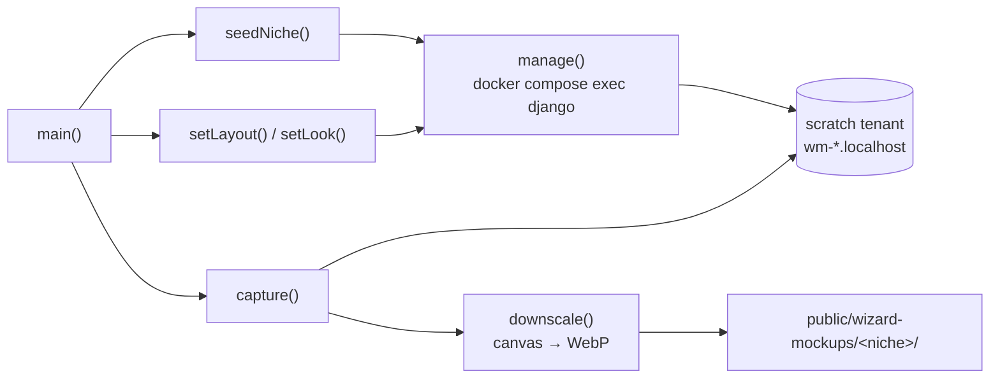

# Onboarding Wizard & Site AI — tools-wizard-mockups

# Wizard Mockup Capture (`tools/wizard-mockups/`)

`capture.mjs` is a manual dev tool that produces the thumbnail images shown in the coach onboarding wizard's catalog cards. For every catalog option a coach can pick — page layout, hero style, theme — and for every demo niche, it drives a real browser against a real tenant site and writes one downscaled WebP into `frontend-main/public/wizard-mockups/<niche>/`.

The key property: **these are real screenshots of the real rendering stack**, not hand-authored art. A layout option's card shows exactly what that layout produces. Re-run the tool whenever demo content, page templates, or the wizard catalog change — otherwise the wizard sells a page the product no longer builds.

## Prerequisites

| Requirement | Why |
|---|---|
| Dev stack up (`make dev`) | The script shells into the `django` container and browses `nextjs-customer` through Caddy |
| `make seed-demo-assets` | Mirrors demo photos/videos into dev MinIO. Without it, presigned URLs 404 and the capture aborts |
| `npm install` in `tools/wizard-mockups/` | Playwright + Chromium |

No manual tenant seeding — the script reseeds the scratch tenant itself, per niche.

## Usage

```bash
cd tools/wizard-mockups
npm run capture                        # all 7 niches, ~30-45 min
npm run capture -- --niche belly_dance # one niche while iterating
```

`--niche` is repeatable; any other argument, or an unknown niche name, throws with the list of valid niches (`nichesFromArgv`).

Output per niche: 18 layout shots + 3 hero shots + 6 theme shots = 27 WebPs, named after the catalog option id (`home-spotlight.webp`, `hero-split.webp`, `theme-ocean.webp`).

## How it works

The script never touches the wizard itself. It manipulates a hidden **scratch tenant** through Django management commands, then screenshots that tenant's public site.



Per niche, the loop in `main()` is:

1. `seedNiche(niche)` → `seed_wizard_mockup_tenant --niche <n>` rebuilds the scratch tenant from that niche's demo template.
2. For each entry in `LAYOUTS`: `setLayout(page, id)` → `set_wizard_mockup_layout <page> <id>`, then `capture(...)` browses `wm-<id>.localhost` at the layout's path.
3. For each hero in `HEROES`: `setLook(["--hero", style])` → `set_wizard_mockup_look`, capture `/` on `wm-hero-<style>.localhost` clipped to `HERO_CLIP` (top 640px — hero cards only sell the fold).
4. Reset home to `home-spotlight`, then for each theme in `THEMES`: `setLook(["--theme", theme])`, capture `/` on `wm-theme-<theme>.localhost`.

There's deliberately no look-reset at the end of a niche — the next `seedNiche` wipes it anyway.

### One domain per option

Each option is captured on its **own hostname** (`wm-home-story.localhost`, `wm-theme-ember.localhost`, …). This is not cosmetic. `frontend-customer`'s `fetchTenantConfig()` keeps a 60-second in-memory cache keyed by domain, independent of the browser cache and of Next's own caching. Two options sharing one domain would silently serve the first option's cached config for the second capture. Domain-per-layout is the actual fix; `Network.setCacheDisabled` via CDP is belt-and-suspenders on top.

### Capture geometry

Captured at `1280×960` with `deviceScaleFactor: 2`, then supersampled down to `OUTPUT_WIDTH = 800` in `downscale()` — thumbnail text and photos come out visibly crisper than a 1× capture at the same output size.

Layout shots use `fullPage: true`. A viewport-only crop had made layouts that share their opening blocks render byte-identical thumbnails (`home-story` and `home-complete` both open hero → imageText → courseGrid; the distinguishing block sat below the fold). Full-page capture makes every option provably distinct regardless of which blocks a future option shares.

`downscale()` does the resize and WebP encode inside the page via a `<canvas>` — no native image dependency, same approach as `tools/flowmap/crawler/thumbnail.js`. It sets `imageSmoothingQuality = "high"` because the 2× → 800px ratio is large enough that default bilinear aliases visibly.

## Failure guards

`capture()` refuses to write a file rather than shipping a bad thumbnail. Both guards exist because bad batches actually shipped:

**Non-OK main document.** A 502 (typically `nextjs-customer` OOM-killed mid-run) renders as a blank white page with zero image requests, so the media guard never fires. Without the status check, the tool would write blank thumbnails and exit 0 — one batch shipped 162 blank WebPs that way. The error points at the recovery step: `docker compose up -d nextjs-customer`, wait for it, retry.

**Broken media.** Tracked at three levels:
- a `response` listener catching `image`/`media` responses with status ≥ 400 — at the network layer, so CSS `background-image` fetches count, not just ``
- a `requestfailed` listener for the same resource types
- a post-load DOM sweep for `` elements that are `complete` with `naturalWidth === 0`, catching failures the response listener can't attribute, without tripping on below-fold lazy images

An earlier batch shipped broken-image icons because dev MinIO had been wiped and every presigned demo photo 404'd. The error message names the fix: `make seed-demo-assets`.

Both guards throw, and `main().catch` exits 1 — a failed run stops at the first bad page rather than producing a partially-corrupt set.

Next.js's dev overlay (`nextjs-portal`) is hidden via an injected style tag before every screenshot.

## Lists that must stay in sync

Four constants in this file mirror definitions elsewhere. Adding a catalog option means editing both sides.

| Constant | Mirrors |
|---|---|
| `LAYOUTS` | `PAGE_LAYOUTS` in `backend/apps/core/onboarding/wizard_catalog.py` |
| `THEMES`, `HEROES` | `THEMES` / `HERO_STYLES` in the same catalog module |
| `NICHES` | `backend/apps/demo_seed/data/`, minus `general`, and `MOCKUP_NICHES` in `packages/shared/src/wizard/mockups.ts` |

`general` is excluded on purpose: it's deliberately sparse (no plans, FAQ disabled) and would produce empty-state screenshots. The wizard maps it to the `yoga` set instead.

## Contributing

Adding a new layout option:

1. Add it to `PAGE_LAYOUTS` in `wizard_catalog.py`.
2. Add a matching `{ page, id, path }` entry to `LAYOUTS` here — `path` is the tenant-site route that renders that page (`/`, `/about`, `/courses`, `/plans`, `/faq`, `/contact`).
3. Run `npm run capture -- --niche yoga` to sanity-check one niche, eyeball the WebP, then run the full sweep.

Adding a niche: add its demo data under `backend/apps/demo_seed/data/`, then add the slug to `NICHES` here **and** to `MOCKUP_NICHES` in `packages/shared/src/wizard/mockups.ts` — the frontend won't look for images the shared list doesn't name.

Note that full-matrix runs are memory-hungry on `nextjs-customer`; capturing per-niche with a container restart between niches is the reliable path on a constrained Docker VM.