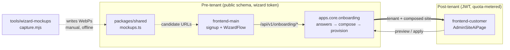

# Onboarding Wizard & Site AI

# Onboarding Wizard & Site AI

The path from "a coach typed a brand name on the marketing site" to "a provisioned tenant serving an AI-composed, AI-written site" — plus the AI editing surfaces that keep that site changeable afterwards. This is the only area of the product where a *paying customer's entire site is authored by the system*, which is why it spans two frontends, a dedicated Django package, a shared pure resolver, and an offline capture tool.

## Sub-modules

| Sub-module | Role |
|---|---|
| [Backend — `apps/core/onboarding/`](onboarding-wizard-site-ai-backend-apps.md) | The orchestrator: wizard-token auth, answer persistence, AI content/photo/logo generation, tenant provisioning, page composition, site-AI edit endpoints |
| [frontend-main](onboarding-wizard-site-ai-frontend-main-src.md) | The signup funnel and wizard UI: `WizardFlow`, the step components, the logo design chat (`AiLogoDoor`), the provisioning screen |
| [frontend-customer](onboarding-wizard-site-ai-frontend-customer-src.md) | Post-onboarding: `AdminSiteAiPage` — natural-language site edits with a preview/apply gate |
| [packages/shared](onboarding-wizard-site-ai-packages-shared.md) | `wizard/mockups.ts` — niche + mockup name → ordered candidate screenshot URLs, with fallback policy |
| [tools/wizard-mockups](onboarding-wizard-site-ai-tools-wizard-mockups.md) | `capture.mjs` — regenerates those screenshots by driving a real browser against a real tenant site |

## How they fit together

The **backend package** is the state machine of record. The wizard has no JWT for most of its life, so `frontend-main` authenticates every call with a signed wizard token in the request body; `lib/wizard/api.ts` is the sole client for that contract and `lib/wizard/machine.ts` (`buildSteps`, `nextStep`, `firstUnansweredStep`) is the local mirror of step ordering — resumability comes from `readWizardState`, not from browser state.

The visual choice steps (theme, hero style, per-page layout) are where **packages/shared** and **tools/wizard-mockups** enter. `steps.tsx`/`pages-steps.tsx` render `OptionCard`s whose images come from the shared resolver, and the resolver's candidate URLs point at files that only exist because `capture.mjs` was run. That makes the tool a **content dependency of the wizard, not a nice-to-have**: change a page template or the catalog and the wizard keeps selling the old rendering until the capture is re-run. The resolver's fallback chain is what stops that mismatch from becoming a broken image.

`finalizeWizard` hands off to the backend's provisioning + composition path — `compose_pages` / `_build_pages` assemble the page tree from the answers, with content generated by `wizard_course_outlines` → `generate_course_outlines`, `seed_starter_posts`, and photo slots resolved through `build_slots` / `apply_photo_picks`. Logo work is a side-quest inside the funnel with its own client (`lib/wizard/logo-api.ts`) and renderer (`src/logo/logo-renderer.tsx`) rather than part of the composition pipeline.

Once the tenant exists, ownership of site editing moves to **frontend-customer**. `AdminSiteAiPage` talks to `/api/v1/admin/site-ai/*` as a normal authenticated coach, and the backend's `availability` / `tenant_usage` meter the feature — the same composition machinery, now behind a quota and a preview-before-apply gate. Nothing is written until Apply.

## Key cross-module workflows

- **Signup → live site.** `signup-form` → email verification → `verify/page.tsx` state machine → `WizardFlow` steps (each `commit`ing answers server-side) → `finalizeWizard` → provisioning screen polls until the tenant's composed site is ready. Read the [frontend-main](onboarding-wizard-site-ai-frontend-main-src.md) page for the state machine and the [backend](onboarding-wizard-site-ai-backend-apps.md) page for what provisioning actually does.
- **Visual option catalog.** Catalog entry → shared resolver → captured WebP. Adding an option means touching all three of [packages/shared](onboarding-wizard-site-ai-packages-shared.md), the backend catalog, and re-running [capture.mjs](onboarding-wizard-site-ai-tools-wizard-mockups.md).
- **Logo design chat.** `AiLogoDoor` → `runTurn` / `wizardCheckoutSync` → `useThisLogo` → `renderFinalPngs` via `LogoRenderer`. A self-contained loop inside the funnel with its own paid checkout path.
- **Post-launch refinement.** `AdminSiteAiPage` → `previewSiteEdit` (streaming) → coach reviews → `applySiteEdit`. Same page-tree representation the wizard composed, edited in place.

## Gotchas worth knowing before you edit here

- Public-schema-only endpoints must set `@authentication_classes([])`; `AllowAny` alone leaves `TenantJWTAuthentication` in the chain and breaks the tokenless flow.
- Wizard tokens travel in the **body**, never the query string.
- Step ordering exists in two places (`machine.ts` and the backend); changing one without the other produces silent resume bugs.
- Mockup screenshots go stale invisibly — see the capture tool's page for the per-niche capture procedure and its memory footprint.