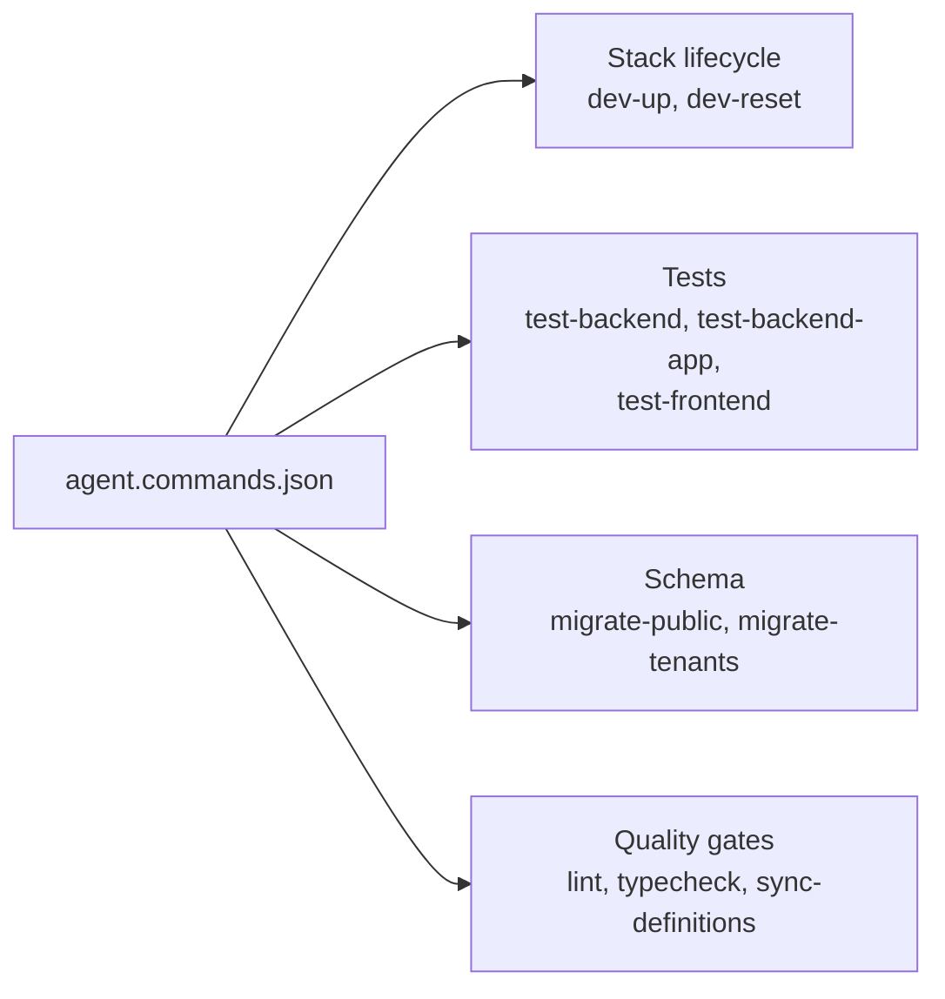

# Other — agent.commands.json

# `agent.commands.json`

A flat, machine-readable registry of the canonical commands an AI coding agent should use when operating on the Contentor repository. It exists so an agent doesn't have to reverse-engineer the `Makefile` (or guess at `docker compose exec` invocations) to answer "how do I run the tests here?"

## Purpose

Contentor's day-to-day operations are all funneled through `make` targets that wrap Docker Compose (see `Makefile` and `CLAUDE.md` → *Commands*). That indirection is deliberate — almost nothing runs on the host; tests, migrations, and shells all execute inside the `django` container. `agent.commands.json` is the agent-facing projection of that surface: the subset of targets an agent actually needs, each with a stable `name` an agent can reference and a one-line `description` of intent.

It is **descriptive, not executable**. Nothing in the repo reads this file at build or run time; there is no loader, no schema validator, and no code path that imports it. Its consumer is whatever tooling or agent harness chooses to read it.

## Format

The document is a single object with one key, `commands`, holding an array of entries:

```json
{
  "name": "test-backend-app",
  "command": "make test-app APP={APP}",
  "description": "Run Django tests targeting a specific package, e.g. adminkit"
}
```

| Field | Meaning |
|---|---|
| `name` | Stable kebab-case identifier. The lookup key — treat it as an API surface; renaming one breaks any harness referencing it. |
| `command` | Literal shell string to execute from the repository root. |
| `description` | Human/agent-readable statement of what the command does and where it runs. |

### Placeholders

One entry uses a `{BRACED}` placeholder: `make test-app APP={APP}`. There is no declared parameter list, type, or default — the convention is implicit. A consumer must substitute the token before execution (`make test-app APP=billing`). No other entry is parameterized, so a consumer can treat `{...}`-free commands as directly runnable.

### Working directory

`command` values assume the repository root, with one exception: `sync-definitions` is `npm run gen:api`, which is defined in `frontend-customer/package.json` and must run from that directory. The description carries that constraint ("inside frontend-customer") but the `command` field does not encode it. Any consumer executing these blindly from the root will fail on that entry.

## The registered commands

The ten entries cluster into four concerns:



**Stack lifecycle.** `dev-up` → `make dev` brings up the full Compose stack (Caddy, Postgres, Redis, Django, both Next.js apps, Celery, MinIO) with hot reload. `dev-reset` → `make dev-reset` is the destructive variant: it wipes volumes and `.next` caches and rebuilds. Because it drops the database volume, a `dev-reset` invalidates any seeded tenant data — a follow-up seed is required, but no `seed` entry is registered here (see *Gaps*).

**Tests.** `test-backend` runs the full pytest suite inside the `django` container. `test-backend-app` narrows it to one Django app via the `APP` placeholder. `test-frontend` runs the Vitest suite for `frontend-customer` — note that `frontend-main` has no registered test command, matching the repo's actual state where `make test-frontend` targets only the customer app.

**Schema migrations.** Contentor is schema-per-tenant (`django-tenants`), which is why there are two distinct entries rather than one. `migrate-public` → `make migrate-shared` touches only the `public` schema (shared apps: `core`, `accounts`, `billing` plans, `platform_email`, `domains`). `migrate-tenants` → `make migrate` runs `migrate_schemas` across every tenant schema. The ordering matters in practice — shared-schema changes that tenant apps depend on go first — but the JSON encodes no ordering or dependency information.

**Quality gates.** `lint` runs pre-commit across the repo (ruff, prettier, plus the repo's custom checks such as `scripts/check-loading-patterns.mjs` and the e2e impact-map self-test). `typecheck` runs `tsc --noEmit` on both frontends; per `CLAUDE.md` this is advisory and not yet wired into `make lint`. `sync-definitions` regenerates `src/types/api-generated.ts` from the drf-spectacular schema at `/api/schema/` — it belongs in this cluster because a serializer change that isn't followed by a regen silently desyncs the TypeScript contract.

## How it relates to the rest of the repo

Two other artifacts describe the same territory, and the relationship is worth understanding before editing any of them:

- **`Makefile`** — the source of truth. Every `command` here is a call into it (except `npm run gen:api`). If a target is renamed or removed, this file goes stale with no signal.
- **`CLAUDE.md`** — the prose version, richer than this file: it documents `make seed`, `make shell`, `make e2e`, `make test-changed`, `make deploy`, and the tenancy/auth constraints an agent needs in order to use the commands correctly.

So `agent.commands.json` is the narrowest of the three. It is best read as a quick-reference index rather than the authoritative description of the dev workflow.

## Contributing

Adding an entry:

1. Confirm the target exists in the `Makefile` (`make help` lists them).
2. Pick a `name` that describes intent, not the underlying target — `migrate-public` over `migrate-shared`. The existing entries follow this, which is why several names don't match their `command`.
3. Keep `description` to one line, and state where the command executes if it isn't the repo root or the host.
4. Use `{UPPERCASE}` for any substitutable argument, matching the `{APP}` precedent.

Editing an entry: changing `command` is safe; changing `name` is a breaking change for any consumer keyed on it.

### Known gaps

If you're extending this file, these are the notable omissions relative to `make help`:

- `make seed` — required after `dev-reset`, and its absence makes the `dev-reset` entry incomplete as a workflow.
- `make e2e` / `make e2e-spec` / `make e2e-changed` — the entire Playwright surface.
- `make test-changed` and `make e2e-changed` — the diff-scoped selectors, which are usually the right choice over the full suites.
- `make shell`, `make logs`, `make health-check` — inspection commands.
- `make deploy` — deliberate omission is defensible here; it's a production action.

There is no test or lint check that keeps this file in sync with the `Makefile`, so drift is the main maintenance risk. A `make lint` hook that asserts every `make <target>` referenced here resolves to a real target would close that gap.
