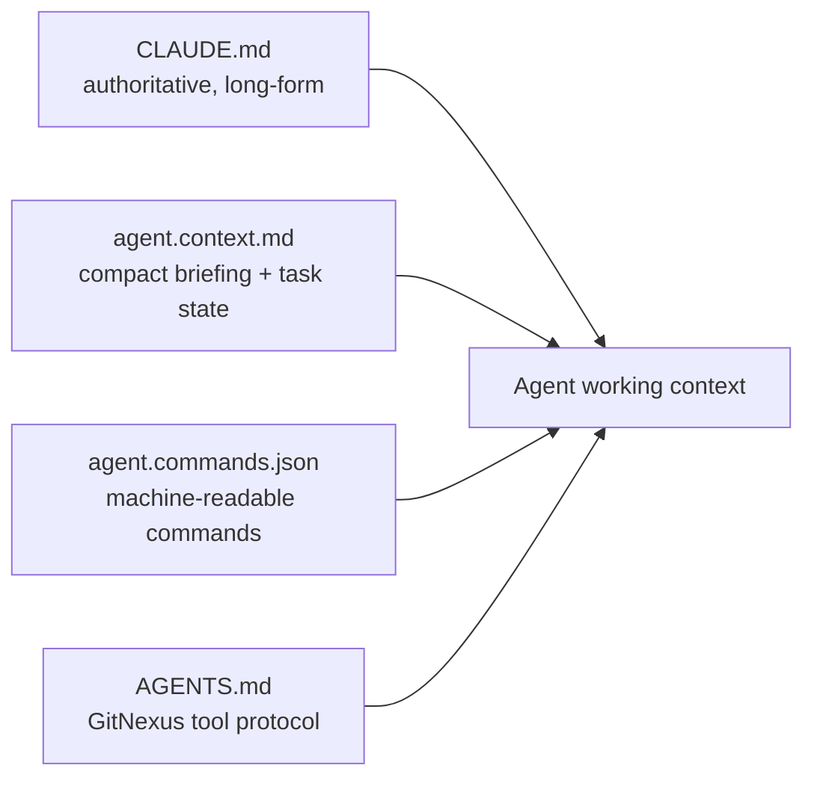

# Other — agent.context.md

# `agent.context.md` — repo-root agent briefing file

## What this is

`agent.context.md` is a **prompt-context artifact**, not source code. It sits at the repository root next to `CLAUDE.md`, `AGENTS.md`, and `agent.commands.json`, and exists so that an AI coding agent — or a human dropping into the repo cold — can absorb the minimum viable mental model of Contentor in under a minute: who the actors are, how tenancy works, which invariants must not be violated, and which command to run for a given intent.

It has no importers, no callers, and no execution flows. Nothing in the build, test, lint, or deploy pipeline reads it. Its only consumer is whatever agent or person has it in context. That makes it cheap to change and easy to let rot — the two facts that dominate how you should treat it.

## Relationship to the other agent-facing files

Contentor carries four overlapping agent-context surfaces. They are not redundant; each answers a different question, and knowing which one owns a fact tells you where to make an edit.



| File | Owns | Shape | Tracked |
|---|---|---|---|
| `CLAUDE.md` | Full architecture, app-by-app breakdown, loading/UX conventions, deploy, rules | Long-form prose, ~200 lines | yes |
| `agent.context.md` | Compressed architecture summary + **current task state** + the handful of invariants that break silently | Bullet list, ~30 lines | yes |
| `agent.commands.json` | Named → shell-command mapping with descriptions | JSON array under `commands[]` | yes |
| `AGENTS.md` | GitNexus MCP usage protocol (`impact`, `detect_changes`, `query`, `context`) | Generated block, `<!-- gitnexus:start -->` delimited | **no** (untracked) |

`agent.context.md` is the *lossy summary* layer. When a fact appears in both it and `CLAUDE.md` and they disagree, `CLAUDE.md` wins — it is the maintained document, and it is the one the project's own rules point contributors at.

## Section-by-section

### `## System Architecture`

Three-line compression of Contentor's domain: the actor triad (**Coach** = tenant owner and paying customer, **Student** = end user inside a tenant, **Superadmin** = platform owner), the isolation mechanism (`django-tenants`, schema-per-tenant, host-routed by Caddy), and the stack (Django 5.1 + DRF + Postgres 17 + Redis 7 + Celery + Next.js 14).

The actor vocabulary matters more than it looks. Backend role strings and frontend route trees both key off it — a tenant signup writes `role=coach` in the public schema and `role=owner` in the tenant schema for the same human. Getting "coach" and "owner" confused produces auth bugs that only show up under one schema.

### `## Adminkit UI & List View Updates (Current Task Context)`

This is the part of the file that is **state, not documentation**. It records what was in flight at the time of writing: button-select filters, item-count metadata, infinite scroll, gallery navigation boundaries, and a `ReferenceError: hasMore is not defined` fix in `JsonRecordModal`.

The referenced code is real and still present in `packages/shared/src/admin-kit/`:

- `json-record-modal.tsx` — takes `hasMore?: boolean` alongside `onLoadMore`, and gates next-record navigation on `hasMore && onLoadMore && !waitingForNext`. The listed bug was a missing prop in the destructure/dependency chain; the current file threads `hasMore` through both the keyboard handler and the footer render.
- `model-page.tsx` — owns the `IntersectionObserver` that drives infinite scroll, and is the component that passes `hasMore={!!page.next}` down into the modal. The DRF paginator's `next` link is the single source of truth for "more exists."
- `gallery-view.tsx`, `model-list.tsx`, `model-index.tsx`, `model-form.tsx`, `widgets.tsx`, `primitives.tsx`, `client.ts`, `types.ts` — the rest of the shared admin-kit surface, consumed by both SPAs' admin panels (backend side: `apps.adminkit`, which registers panels via `admin_panels.py` autodiscovery and defines no models of its own).

Two consequences for contributors:

1. **Treat this section as historical.** A "Completed Implementations" list has no expiry date and no CI check behind it. Read the components before trusting the summary.
2. **If you extend the section, extend it as state.** Task context belongs here precisely because it does *not* belong in `CLAUDE.md`. Durable architecture facts should migrate up to `CLAUDE.md`; finished task lists should eventually be deleted rather than accumulated.

### `## Invariants & Routing Rules`

The three technical entries here are the highest-value lines in the file, because each describes a failure that is silent rather than loud:

- **Browser `/api/v1/*` calls go directly to Django**, via Caddy — they are not proxied through Next.js. A Next.js API route that "helpfully" forwards them adds a hop that loses tenant identity.
- **Next.js server-side `fetch()` to Django must send `X-Tenant-Domain`.** This is the classic one. Node's undici silently drops a custom `Host` header, so `Host: django` resolves to the *public* schema and the request returns plausible-looking wrong data instead of an error. `HeaderAwareTenantMiddleware` in `apps.core` is what reads the header.
- **Build the tenant domain as `${slug}.${BASE_DOMAIN}`.** Don't reach for a runtime helper in `generateMetadata` or `manifest.ts` — those execute in a context where the request-derived tenant lookup returns empty.

The fourth entry — *"Work exclusively on the `main` branch as requested"* — is a captured user instruction from the session that produced this file, not a standing repository policy. Do not read it as a branching convention. Confirm the intended branch with the user; the project's own rules elsewhere are stricter about commits (never commit unless explicitly asked) than about branch choice.

### `## CLI / Development Commands`

A three-entry shortlist: `make dev`, `make migrate-shared` + `make migrate`, and `npm run gen:api` in `frontend-customer/`.

The migration pair is deliberate: `migrate-shared` touches only the public schema, `migrate` runs `migrate_schemas` across every tenant. Shared-app model changes need both, in that order. `npm run gen:api` regenerates `src/types/api-generated.ts` from the drf-spectacular schema at `/api/schema/` — an unexpected diff there means a serializer change moved the frontend contract.

For anything beyond these three, prefer `agent.commands.json`, which is the machine-readable superset (dev-up, dev-reset, test-backend, test-backend-app with an `{APP}` placeholder, test-frontend, migrate-public, migrate-tenants, lint, typecheck, sync-definitions), or `make help` for the authoritative list.

## Maintaining this file

Since nothing validates it, the discipline has to be manual:

- **Adding a durable fact?** Put it in `CLAUDE.md` and only summarize here if an agent would be materially worse off without it in the first 30 lines of context.
- **Adding a command?** Add it to `agent.commands.json` (name/command/description) so it's consumable programmatically; mirror it here only if it's one of the daily-driver few.
- **Adding an invariant?** It belongs here if and only if violating it fails *quietly*. Loud failures don't need a briefing entry — the stack trace is the documentation.
- **Task-state section drifted?** Delete the stale entries. An out-of-date "Completed Implementations" list is worse than no list, because an agent will skip verification on the strength of it.
- **Don't regenerate `AGENTS.md` by hand** — it carries a `<!-- gitnexus:start -->` marker and is currently untracked, meaning it's tool-generated output rather than a maintained doc.

## Verifying a claim from this file

The file makes assertions but carries no evidence. When one of them is load-bearing for what you're about to change:

```bash
# admin-kit surface and the infinite-scroll / hasMore wiring
grep -rn "IntersectionObserver\|hasMore" packages/shared/src/admin-kit/

# tenant-header handling on the Django side
grep -rn "X-Tenant-Domain" backend/apps/core/ frontend-customer/src frontend-main/src

# the real command list, not the shortlist
make help
```