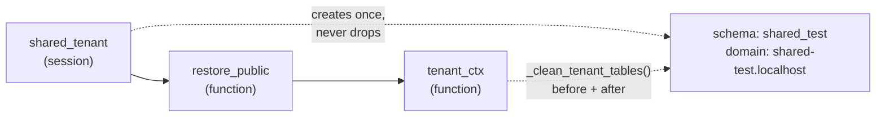

# Other — backend-apps

# Other — backend-apps

The connective tissue of `backend/apps/`: the package scaffolding that makes the Django app namespace work, the migration history that defines the shared-schema data model, and the pytest harness that every app's test suite is built on. There is almost no runtime logic here — but nearly every change you make elsewhere in the backend passes through one of these three layers.

---

## 1. Package scaffolding

`backend/apps/__init__.py` is an empty namespace package. Every Django app under it (`accounts`, `billing`, `adminkit`, `core`, `courses`, …) is referenced in settings as `apps.<name>`, and the split between `SHARED_APPS` and `TENANT_APPS` lives in `config/settings/base.py`, not here.

Two conventions are worth knowing before you add a file:

**Empty `__init__.py` files are load-bearing.** `management/`, `management/commands/`, `migrations/`, and `tests/` each need one. A missing `tests/__init__.py` is the usual cause of "pytest collects nothing from this app"; a missing `management/commands/__init__.py` makes `call_command("issue_login_token")` raise `CommandError: Unknown command`.

**Some apps use a package facade instead of a flat module.** `apps.billing` splits models and serializers across files and re-exports them so the import path stays stable:

```python
# backend/apps/billing/models/__init__.py
from .core import (  # noqa: F401
    Bundle, BundleItem, Payment, PaymentItem,
    Subscription, SubscriptionPlan, SubscriptionPlanAccess,
)
```

```python
# backend/apps/billing/serializers/__init__.py
from .bundles import BundleCreateSerializer, BundleDetailSerializer, BundleListSerializer  # noqa: F401
from .payments import PaymentInitializeSerializer, PaymentItemInputSerializer  # noqa: F401
from .plans import PlanAccessItemSerializer, PlanAccessWriteSerializer  # noqa: F401
from .store import StoreItemSerializer  # noqa: F401
```

Consequence: `from apps.billing.models import Payment` works regardless of which submodule `Payment` actually lives in. If you split a new model out of `models/core.py`, add it to the facade — Django resolves `app_label` from the app config, not the import path, so migrations won't notice, but every caller will. The `# noqa: F401` is required; ruff otherwise flags the re-exports as unused.

---

## 2. Migration history

Migrations are the only place the shared-schema data model is recorded end to end. Two histories matter most because they encode multi-tenancy and marketplace-billing decisions that are not obvious from the current model code.

### `apps.accounts` — the custom `User`

| Migration | What it establishes |
|---|---|
| `0001_initial` | `User` with `email`, `name`, `avatar_url`, `role` (`owner`/`coach`/`student`), `payment_customer_id`, `is_staff`, `is_active` |
| `0002_user_accessible_regions_user_preferred_locale_and_more` | Adds `region` (`global`/`tr`, indexed), `preferred_locale`, `accessible_regions` (Postgres `ArrayField`) |
| `0003_alter_user_accessible_regions_alter_user_region` | Makes `accessible_regions` nullable; rewrites the `region` help text to say it's informational — **auth-time isolation is enforced by `Tenant.region` via JWT claims** |
| `0004_alter_user_email_and_more` | Drops `unique=True` on `email`; adds `UniqueConstraint(("email", "region"), name="accounts_user_email_region_unique")` |
| `0005_user_first_pwa_at_user_last_display_mode_and_more` | PWA telemetry: `first_pwa_at`, `last_display_mode`, `last_platform` |

`0004` is the one to internalise: **email alone is not a unique key.** The same person can own tenants in both the `global` and `tr` regions with the same address. Any code doing `User.objects.get(email=...)` in the public schema is a latent `MultipleObjectsReturned`. Inside a tenant schema the table is per-tenant, so the constraint is effectively per-tenant-per-region.

Note also that `User` lives in `SHARED_APPS` **and** is materialised into every tenant schema — the same migration set runs in both. A coach exists twice: once in public with `role="coach"`, once in their tenant with `role="owner", is_staff=True`.

### `apps.billing` — marketplace payments

| Migration | What it establishes |
|---|---|
| `0001_initial` | `SubscriptionPlan`, `Subscription`, `Payment` (with `platform_fee` / `submerchant_payout` split), `SubscriptionPlanAccess` (generic FK access grants) |
| `0002_add_access_models` | `Bundle`, `BundleItem`, `PaymentItem` — all generic-FK, all `unique_together` on `(parent, content_type, object_id)` |
| `0003_alter_payment_provider` | Adds the `bypass` provider alongside `iyzico` / `stripe` |
| `0004_payment_platform_subscription` | `Payment.platform_subscription` → `core.PlatformSubscription`, **`db_constraint=False`** |
| `0005_subscription_cancel_at_period_end_and_more` | Stripe Connect fields on `Subscription` (`provider`, `provider_customer_id`, `provider_subscription_id`, `cancel_at_period_end`) and on `SubscriptionPlan` (`stripe_price_id`, `stripe_price_amount_cents`) |
| `0006_subscriptionplan_billing_interval_months_and_more` | `billing_interval_months` validated to 1–36, plus `stripe_price_interval_months` for drift detection against the mirrored Stripe price |

`db_constraint=False` on `Payment.platform_subscription` is deliberate and must not be "fixed": `Payment` is a tenant-schema table, `PlatformSubscription` is public-schema. Postgres cannot enforce a foreign key across schemas the way django-tenants lays them out, so the FK is ORM-level only. Adding the constraint back will break `migrate_schemas`.

`stripe_price_interval_months` defaulting to `0` (versus `billing_interval_months` defaulting to `1`) is the sentinel for "no Stripe price mirrored yet" — a zero means the plan has never been synced, not that it bills every zero months.

### Working with migrations

```bash
make makemigrations       # generate
make migrate-shared       # public schema only
make migrate              # migrate_schemas — all tenants
```

A new migration invalidates the reused test database. See §3.

---

## 3. Test harness (`backend/conftest.py`)

This is the highest-leverage file in the module. It exists to solve one problem: `tenant.create_schema(sync_schema=True)` is by far the most expensive operation in the suite, so the suite creates **exactly one** tenant schema per session and reuses it across runs.

### Configuration

```toml
# backend/pyproject.toml
[tool.pytest.ini_options]
DJANGO_SETTINGS_MODULE = "config.settings.test"
python_files = ["tests.py", "test_*.py"]
addopts = "-v --tb=short --reuse-db --ds=config.settings.test"
```

`--ds` is passed explicitly because the dev container exports `DJANGO_SETTINGS_MODULE` pointing at dev settings, which would silently win over the ini value.

### The tenant fixtures



- **`shared_tenant`** (session, `django_db_setup`-dependent) — `get_or_create`s the `Tenant` row for schema `shared_test` plus its `Domain` `shared-test.localhost`, forces `provisioning_status="ready"` (tasks that fan out over tenants filter on it), calls `create_schema(check_if_exists=True, sync_schema=True)`, then runs `_truncate_stale_tenant_data()`. **No teardown** — the schema survives so the next `--reuse-db` run skips migrations entirely.

- **`restore_public`** — re-inserts the tenant + domain rows into the public schema and returns the `Tenant`. Needed because `django_db(transaction=True)` tests run as `TransactionTestCase`, whose teardown flushes the whole public schema. It temporarily sets `Tenant.auto_create_schema = False` around the `get_or_create` so the re-insert doesn't try to build the schema again.

- **`tenant_ctx`** — wraps the test in `tenant_context(tenant)` and calls `_clean_tenant_tables()` both before and after. Cleaning *before* matters under `pytest-xdist`: transaction tests commit for real and load-balancing makes ordering nondeterministic, so a test can inherit committed rows from whatever ran previously on that worker.

Use `tenant_ctx` when your test creates tenant-schema rows (users, courses, payments). Use `restore_public` when you need the public-schema `Tenant` row but will manage schema switching yourself.

### Cleanup mechanics

`TENANT_CLEANUP_MODELS` is an explicitly ordered list (children before parents) of ~37 tenant models. Rather than paying two queries per model, `_NONEMPTY_TABLES_SQL` is a precomputed `UNION ALL` of `SELECT i WHERE EXISTS (SELECT 1 FROM "<table>")` that reports in a single round trip which tables actually hold rows; only those get an ORM `.delete()` (preserving cascade semantics).

**When you add a tenant model, add it to `TENANT_CLEANUP_MODELS`** in the right dependency position. Miss it and its rows survive `transaction=True` teardown into the next `--reuse-db` session — a class of failure that shows up as an unrelated test breaking, days later.

`_truncate_stale_tenant_data()` is the session-start backstop for exactly that: it `TRUNCATE ... CASCADE`s every table in `shared_test` except `MIGRATION_SEEDED_TABLES` (`django_migrations`, `django_content_type`, `auth_permission`, `auth_group`, `auth_group_permissions`). This is safe because all `RunPython` migrations in the tree are backfills that no-op on empty tables.

### Autouse fixtures

| Fixture | Purpose |
|---|---|
| `_clear_rate_limits` | Runs `_purge_rate_limit_keys()` before and after every test — deletes Redis keys matching `ratelimit:*`, `*throttle*`, `*logo-ai*`, `*ai-answer*`, `*ai-sess*` |
| `_curated_mirror_off` | Forces `settings.CURATED_LOGO_SYNC_DIR = ""` so no test writes into the repo bind mount or MinIO |
| `_ensure_free_plan` | `get_or_create`s the canonical `Free` `PlatformPlan` before each `django_db` test |

Each exists because of a real, hard-to-diagnose failure:

- DRF's `AnonRateThrottle` keys on client IP, which is always `127.0.0.1` for `APIClient`. Without purging, the sixth request in 60s across *any* tests returns 429. The `*logo-ai*`, `*ai-answer*` and `*ai-sess*` patterns are written via `django.core.cache`, so Django's key function prefixes them with `:<version>:` — hence the leading wildcard, same as `*throttle*`.
- The `Free` plan is seeded by `core/migrations/0005_backfill_free_plan.py`. A `transaction=True` flush deletes it, `--reuse-db` never reruns migrations, so the first such test in a session permanently removes it from that worker's database — surfacing later as a `PlatformPlan.DoesNotExist` in something unrelated (typically `apps/core/tests/test_seed_dev_tenants.py`). Re-creating it defensively sidesteps the flush entirely; `serialized_rollback` was tried and reverted (it collides with existing `ContentType` rows).

### The `--reuse-db` contract

The whole design trades isolation for speed, and the trade has one rule: **after adding a migration, rebuild with `make test-fresh` (`pytest --create-db`).** A stale reused schema also explains most mysterious failures in `apps/core/tests/test_seed_dev_tenants.py` — if that file fails, whether one test or all of them, rerun it with `--create-db` before debugging the code.

---

## 4. Test-writing conventions

Every app's suite follows the same shape. Copy an existing file rather than inventing a variant.

### Routing to the tenant

Every test module defines `SHARED_DOMAIN = "shared-test.localhost"` and a local client factory — named `make_client` in most files, `_client` in the newer billing/impersonation ones:

```python
def make_client(user=None):
    client = APIClient(HTTP_HOST=SHARED_DOMAIN)
    if user is not None:
        client.force_authenticate(user=user)
    return client
```

The `HTTP_HOST` is what `HeaderAwareTenantMiddleware` resolves into the `shared_test` schema. Omit it and you land on public.

### `force_authenticate` vs. a real cookie

`force_authenticate` bypasses `TenantJWTAuthentication` entirely — fine when you're testing view logic and permissions. When the *token* is the thing under test, set the cookie for real:

```python
client.cookies["contentor_access_token"] = create_jwt(owner, owner_tenant())
```

`apps/accounts/tests/test_impersonation.py` does this throughout, because the impersonation flow's whole point is cookie mechanics: `/api/v1/auth/impersonate/verify/` stashes the caller's session in `contentor_impersonator_return` for studio scope and stashes *nothing* for platform scope, and `/stop/` reports `restored: true`/`false` accordingly.

### Patch at the import site

Auth tests fake the tenant connection rather than switching schemas:

```python
with patch("apps.accounts.authentication.connection") as mock_conn:
    mock_conn.tenant.schema_name = "shared_test"
```

Same pattern with `apps.accounts.backends.connection` for `AdminJWTBackend`. Billing mocks the boundary function where it is *used*, not where it is defined — `patch("apps.billing.views.payments.can_monetize", ...)` — while Stripe calls are patched at their definition site (`apps.billing.providers.connect.create_marketplace_checkout`) because the view calls them via the module. Get this backwards and the patch silently does nothing while the test still passes for the wrong reason.

Throttled endpoints are unblocked with a class-level decorator:

```python
@patch("apps.accounts.views.MagicLinkThrottle.allow_request", return_value=True)
```

### Settings toggles

`override_settings(BILLING_BYPASS_ENABLED=True)` selects the offline bypass payment provider; `False` exercises the real Stripe Connect code path with the network calls mocked. `EMAIL_SINK_ENABLED=True` captures outbound mail into `DevOutboundEmail`, which tests read back directly — that's how `test_magic_link_email_contains_code` asserts the 6-digit PIN is present without mocking the sender, exercising the genuine send path.

### Webhooks and schema state

`test_webhook_completes_payment_and_grants_access` deliberately avoids `tenant_ctx`:

> the webhook view leaves the connection on the public schema, which would break `tenant_ctx`'s teardown

It uses `restore_public` plus explicit `with tenant_context(tenant):` blocks to seed and assert, and lets plain `django_db` rollback clean both schemas. Any test that drives a view which manipulates `connection.set_schema_*` itself should follow the same pattern.

### Schema guards

`test_studio_site_404_on_public_schema_host` authenticates with an *unsaved* `User(...)` instance on purpose — the point is that the studio-admin schema guard must fire before any tenant-schema query is attempted, so the user never needs to exist.

---

## 5. What the suites cover

**`apps/accounts/tests/`** — the auth surface, and the densest security-regression coverage in the repo.

- `test_tokens_extended.py` / `test_auth.py` / `test_wizard_token.py` — round-trips and negative cases for `create_jwt`, `create_magic_link_token`, `create_signup_token`, `create_wizard_token` and their verifiers. Cross-purpose rejection is asserted in both directions: a magic-link token must fail `verify_signup_token`, and `verify_wizard_token` deliberately *accepts* a signup token (continuity during its 15-minute window). `decode_wizard_token_allow_expired` skips expiry but still verifies signature and purpose.
- `test_authentication.py` — `TenantJWTAuthentication` returns `None` (anonymous), never raises, for every failure mode: no token, expired, garbled, wrong tenant, missing user. Cookie and `Bearer` header are both accepted.
- `test_admin_backend.py` — hardening for `AdminJWTBackend` (audit item P1-B). It must validate the same tenant/region claims as the DRF authenticator, reject any token carrying a `purpose` (magic-link, impersonation), reject non-staff users, and return `None` rather than `KeyError` on a signature-valid token with no `user_id`.
- `test_login_code.py` / `test_verify_code.py` — the 6-digit code flow in `apps.accounts.login_code`: single-use, tenant-scoped, five-attempt lockout that kills the key, and a failed check that must **not** extend the code's TTL (asserted via `cache.ttl()` against real Redis). All failure responses share one generic `detail` string so the endpoint isn't an account-existence oracle. Login uses `email__iexact` so a lowercase attempt against a mixed-case legacy account doesn't create a duplicate.
- `test_impersonation.py` — both scopes end to end, single-use token enforcement, wrong-tenant rejection (403), and role gates (`login_as` targets students only; students can't issue).
- `test_issue_login_token.py` — the dev-only management command refuses to run unless `settings.DEBUG`.

**`apps/adminkit/tests/test_adminkit.py`** — the admin framework tested purely through its HTTP contract, across both sites. `GET .../meta/` returns the exact model set visible to each role; per-model `meta/` returns form-field schema including `min_value`/`max_value`, `read_only`, model-level `default`s, `list_mode` (`table` vs `gallery`), image fields with `upload_url`/`upload_prefix`, and filter choices with counts. Behaviour under test includes read-only enforcement on update, `409` when deleting a plan with live subscriptions, `405` for disallowed verbs on read-only admins, bulk actions, labeled FK rendering, autocomplete, and presigned URLs for image fields.

**`apps/billing/tests/`** — `test_bundles.py` (CRUD, soft delete via `is_active`), `test_connect.py` (Connect onboarding with `create_express_account` / `create_account_link` mocked; the D4 monetization gate returning `402 UPGRADE_REQUIRED` for Free tenants; account reuse; dashboard-link `400 NOT_CONNECTED`), `test_marketplace_checkout.py` (fee split arithmetic asserted on the mocked call kwargs — 4% of $100 → `application_fee_cents == 400`; charge currency follows `tenant_charge_currency()`, not the content's; access is granted only by the webhook, never at initialize time; bundle purchases expand to per-course `Enrollment` rows).

---

## 6. Commands

```bash
make test                    # pytest -v inside the django container
make test-app APP=billing    # one app
make test-changed            # only tests affected by the diff (scripts/select_tests.py)
make test-fresh              # pytest --create-db — required after new migrations
```

Adding a new app to this module means: create `apps/<name>/` with `migrations/__init__.py` and `tests/__init__.py`, register it in `SHARED_APPS` or `TENANT_APPS`, and — if it's tenant-scoped and its models are created by tests — append them to `TENANT_CLEANUP_MODELS` in `backend/conftest.py`.