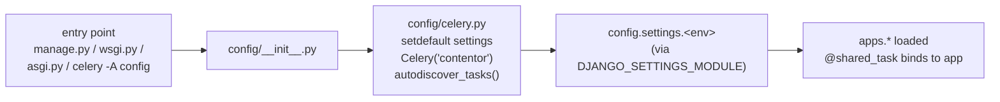

# Other — backend-config

# `backend/config` — project package bootstrap

The `config` package is the Django *project* (as opposed to the `apps.*` packages, which are the Django *applications*). This document covers the two `__init__.py` files that make the package work: `backend/config/__init__.py` and `backend/config/settings/__init__.py`. They contain three lines of code between them, but both are load-order-critical — the placement of that code is the design, and changing it breaks Celery task discovery or settings resolution in ways that surface far from these files.

## `config/__init__.py` — Celery app registration

```python
from .celery import app as celery_app

__all__ = ("celery_app",)
```

This is the canonical Django + Celery integration hook. Its entire purpose is *side effects at package import time*: because Django imports the project package before anything else (via `DJANGO_SETTINGS_MODULE=config.settings.*`, which is a submodule of `config`), this import guarantees that `config/celery.py` runs — and therefore that the `Celery("contentor")` instance exists and has called `autodiscover_tasks()` — before any app module is loaded.

That matters because every task in the codebase is declared with the app-less `@shared_task` decorator (`apps.notifications.tasks`, `apps.blog.tasks`, `apps.email_campaigns.tasks`, `apps.core.tasks`, `apps.logbook.tasks`). `shared_task` registers against whatever Celery app instances currently exist; if no app has been created by the time those modules are imported, the tasks silently attach to nothing and the worker reports `Received unregistered task`. Because the failure is silent at import time and only appears when a task is dispatched, deleting this import would look harmless in tests and break scheduled work in production.

`__all__` pins the single public name. `celery_app` is what tooling and `celery -A config` resolve; the compose services use the more explicit module path:

```yaml
command: celery -A config.celery worker -l info --concurrency=2   # celery-worker
command: celery -A config.celery beat -l info                     # celery-beat
```

Both forms work — `-A config` goes through this re-export, `-A config.celery` imports the module directly.

### Secondary effect: the settings-module default

`config/celery.py` opens with `os.environ.setdefault("DJANGO_SETTINGS_MODULE", "config.settings.dev")`. The same `setdefault` appears in `backend/manage.py`, `config/wsgi.py`, and `config/asgi.py` — four independent entry points that all fall back to dev settings. Because `config/__init__.py` pulls in `celery.py`, that default is applied as soon as the `config` package is touched by *any* path, not just the Celery entry points.

`setdefault` (never `=`) is what keeps this safe: an explicit `DJANGO_SETTINGS_MODULE` in the environment always wins. Production relies on that — `docker-compose.prod.yml` sets `DJANGO_SETTINGS_MODULE=config.settings.prod` on the django, celery-worker, and celery-beat services.



## `config/settings/__init__.py` — deliberately empty

The file is zero bytes, and that is the contract: **there is no importable `config.settings` configuration.** Turning the settings module into a package with an empty `__init__.py` means the environment must name a concrete variant, and no variant is implicitly "the" settings.

The four variants and their inheritance:

| Module | Inherits | Role |
|---|---|---|
| `base.py` | — | Everything shared: `SHARED_APPS`/`TENANT_APPS`, `DATABASES`, DRF, `CELERY_*`, `LOGGING`, the `_env_bool` helper |
| `dev.py` | `base` | `DEBUG = True`, `SITE_SCHEME = "http"`, offline fakes (`LIVE_FAKE_ENABLED`, `EMAIL_SINK_ENABLED`), raised `TENANT_RATE_LIMIT_DEFAULT` for e2e |
| `prod.py` | `base` | `DEBUG = False`, secure cookies + HSTS, `SECURE_PROXY_SSL_HEADER`, CORS/CSRF for `*.contentor.app`, WhiteNoise static, Sentry, and `ImproperlyConfigured` guards |
| `test.py` | **`dev`** | MD5 hashing, `DEBUG = False`, `AI_PROVIDER = "anthropic"`, prod rate-limit thresholds restored, per-xdist-worker Redis DB |

Two things about that table are easy to get wrong when adding a setting:

- **`test.py` layers on `dev.py`, not on `base.py`.** Anything you add to `dev.py` lands in the test suite too. `test.py` exists partly to *undo* dev conveniences (it restores `TENANT_RATE_LIMIT_DEFAULT = 100` and `TENANT_RATE_LIMIT_UPLOAD = 10` because the middleware tests assert the prod thresholds, and pins `AI_PROVIDER` so a developer's `AI_PROVIDER=cli` in `.env` can't fire real `claude` subprocesses from tests).
- **Variants use `from .base import *`**, so every override needs a `# noqa: F401, F403` / `F405` where it references a star-imported name. Follow the existing pattern rather than fighting the linter.

Settings selection per context:

- Runtime, dev: falls through to the `setdefault` → `config.settings.dev`.
- Runtime, prod: explicit env var in `docker-compose.prod.yml` → `config.settings.prod`.
- Tests: `backend/pyproject.toml` sets `DJANGO_SETTINGS_MODULE = "config.settings.test"` under the pytest config, and passes `--ds` so it beats the container's env var (which points at dev).

### Why `prod.py` re-reads `os.environ`

Several prod guards deliberately bypass the star-imported values from `base`:

```python
BILLING_BYPASS_ENABLED = _env_bool("BILLING_BYPASS_ENABLED", False)
if BILLING_BYPASS_ENABLED:
    raise ImproperlyConfigured(...)
```

`base.py` defaults `BILLING_BYPASS_ENABLED` to `True`, and `base` may already have been imported under different env state (notably when a test imports `prod` after `dev`). Re-reading the environment makes the guard reflect reality rather than a cached attribute. The same reasoning applies to the `DJANGO_SECRET_KEY`, `DJANGO_ALLOWED_HOSTS`, `LIVE_FAKE_ENABLED`, `EMAIL_SINK_ENABLED`, and `AI_PROVIDER=cli` checks — each raises `ImproperlyConfigured` at import so a misconfigured prod boot fails loudly instead of running with a dev-grade secret, a wildcard host, or Stripe bypassed.

## Rest of the package

`config/` also holds `urls.py` (mounts `/api/v1/`, `/api/health/`, `/api/schema/`, `/django-admin/`), `wsgi.py` and `asgi.py` (the two four-line application factories), and `celery.py`. `celery.py` carries the whole `beat_schedule` — ten periodic tasks spanning live-class reminders, announcement/recurrence dispatch, blog autopilot, email-campaign dispatch, AI-transcript purge, wizard recovery mail, abandoned-signup cleanup, and logbook archive/purge — plus a `@setup_logging.connect` handler that installs Django's `LOGGING` dict in the worker and beat processes. That handler pairs with `CELERY_WORKER_HIJACK_ROOT_LOGGER = False` in `base.py` so task-side logs land in the same stdout stream and format as the web process, which is what the `vector` container ships into the in-app logbook.

## Adding to this package

- **New periodic task** — add the entry to `app.conf.beat_schedule` in `celery.py`; the task itself is a `@shared_task` in the owning app's `tasks.py`. `autodiscover_tasks()` finds it with no registration step. Note that a running dev stack does *not* pick up newly registered tasks — restart `celery-worker`/`celery-beat` (see the dev-stack staleness notes in the project docs).
- **New setting** — put the shared default in `base.py`, override per environment. If the setting can weaken prod safety (a fake, a bypass, a dev-only provider), add an `ImproperlyConfigured` guard in `prod.py` following the re-read-`os.environ` pattern.
- **New settings variant** — leave `settings/__init__.py` empty; add a module and point `DJANGO_SETTINGS_MODULE` at it. Never move config into `settings/__init__.py`; an implicit default would make it possible to boot prod on dev settings by omitting an env var.
- **Do not** remove or reorder the import in `config/__init__.py`, and do not replace the `setdefault` calls in `celery.py`/`manage.py`/`wsgi.py`/`asgi.py` with plain assignment — the first breaks task registration silently, the second breaks the prod settings override.
