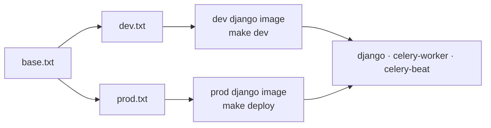

# Other — backend-requirements

# Backend Requirements

`backend/requirements/` declares the Python dependency set for the Django backend. It is three plain pip requirement files layered by environment — nothing more clever than that, and deliberately so: the Docker image build, CI, and local shell installs all resolve dependencies with `pip install -r`, no lockfile resolver in the loop.

```
backend/requirements/
├── base.txt   # everything the app needs to run
├── dev.txt    # -r base.txt + test/lint/type/debug tooling
└── prod.txt   # -r base.txt + Sentry
```

## Layering contract

`dev.txt` and `prod.txt` both start with `-r base.txt` and are mutually exclusive — exactly one of them is installed per image. `base.txt` never references the others. This means:

- **A runtime dependency goes in `base.txt`.** If any module under `backend/apps/` or `backend/config/` imports it at request/task time, it belongs here — including in code paths only reachable in prod.
- **A dev-only dependency goes in `dev.txt`.** Anything imported solely from `tests/`, `conftest.py`, or invoked as a CLI during `make test` / `make lint`.
- **`prod.txt` holds only what must not exist in dev.** Currently just `sentry-sdk[django]` — the dev settings intentionally have no error reporter, so tracebacks surface in `make logs` instead of being swallowed and shipped off-box.

The asymmetry is worth internalizing: putting a runtime import in `dev.txt` produces a green test suite and an `ImportError` at prod boot, because prod never installs `dev.txt`.

## Pinning policy

Every entry is a compatible-range pin — a `>=` floor plus a `<` ceiling on the next major (or, for the pre-1.0 packages, the next minor where the ecosystem treats that as breaking):

```
Django>=5.1,<5.2
psycopg[binary]>=3.2,<4.0
anthropic>=0.116,<1.0
```

Ranges rather than exact `==` pins keeps patch-level security fixes flowing in on rebuild without a dependency-bump commit, while the ceiling prevents a major release from silently landing in an image build. Rebuilding the Docker image resolves fresh within the range, so **two builds of the same commit can differ at patch level** — if you are chasing a "worked yesterday, fails today, same code" bug, a transitive patch bump inside a range is a real suspect. `pip freeze` inside the container is the ground truth for what is actually installed.

A few ceilings are tighter than semver would suggest and that is intentional:

- `Django>=5.1,<5.2` — django-tenants is sensitive to Django's schema/connection internals, so the minor is pinned. A Django minor bump is a coordinated change with `django-tenants`, not a free upgrade.
- `djangorestframework>=3.15,<3.16` and `drf-spectacular>=0.27.2,<0.29` move together; spectacular introspects DRF internals to emit `/api/schema/`.
- `django-stubs` / `djangorestframework-stubs` in `dev.txt` track their runtime counterparts' major versions. If you bump Django or DRF in `base.txt`, bump the matching stubs or `mypy` starts reporting phantom errors.

## What `base.txt` actually buys

Grouping the runtime set by the subsystem that depends on it — this is the fastest way to judge whether a proposed removal is safe:

| Area | Packages | Notes |
|---|---|---|
| Web framework | `Django`, `djangorestframework`, `django-cors-headers`, `drf-spectacular` | `drf-spectacular` powers `/api/schema/`, which `npm run gen:api` in `frontend-customer` consumes to regenerate `src/types/api-generated.ts`. Bumping it can move the generated TS contract. |
| Multi-tenancy | `django-tenants` | Schema-per-tenant. The single most upgrade-sensitive dependency in the file; `apps.core.routers.TenantRouter` and `HeaderAwareTenantMiddleware` build on its internals. |
| Database | `psycopg[binary]` | psycopg **3**, not `psycopg2`. The `[binary]` extra ships prebuilt wheels so the image needs no `libpq`/build toolchain. Swapping to plain `psycopg` breaks the Dockerfile's assumptions. |
| Cache / queue | `django-redis`, `celery[redis]` | The `[redis]` extra pulls the broker client; there is no separate `redis` line. Used by `celery-worker` and `celery-beat`. |
| Serving | `gunicorn`, `whitenoise[brotli]` | Gunicorn is the container entrypoint (gthread in both dev and prod). WhiteNoise serves Django admin static in prod, where there is no separate static server — Caddy proxies `/static/*` to Django. `[brotli]` adds precompression. |
| Auth | `PyJWT` | Backs `AdminJWTBackend` and `TenantJWTAuthentication` in `apps.accounts`. |
| Config | `python-dotenv` | Loads `.env` / `.env.prod`. |
| Billing | `stripe` | Stripe **Connect** marketplace flows in `apps.billing.providers`. Major bumps rename API surfaces; the `bypass` provider exists so dev/CI can run without hitting Stripe at all. |
| Email | `resend`, `requests` | `resend` sends; `requests` calls MailCraft's `/api/v1/export/html` from `apps.email_campaigns` and other outbound HTTP. |
| Storage | `boto3` | S3-compatible uploads in `apps.media` — Hetzner object storage in prod, MinIO in dev. |
| Live video | `getstream` | Stream.io server SDK behind `apps/live/stream_service.py`. `LIVE_FAKE_ENABLED=true` stubs the calls, but the package is still imported, so it stays in `base.txt`. |
| Notifications | `pywebpush` | Web push for `apps.notifications`. |
| AI | `anthropic` | Claude SDK for `apps.core.ai` / `apps.core.assistant` and the site/logo assistants. Pre-1.0 — the `<1.0` ceiling is doing real work, since minor releases have changed client surfaces. |
| Content processing | `nh3`, `markdown`, `Pillow`, `vtracer` | `nh3` is the HTML sanitizer (Rust `ammonia` bindings) — it is a **security-relevant** dependency, not a formatting nicety; user-authored content passes through it. `markdown` renders authored text, `Pillow` handles image processing, `vtracer` raster→SVG for the logo studio. |

## `dev.txt` — what the make targets need

```
pytest, pytest-django, pytest-xdist   # make test, make test-app, make test-changed
factory-boy                            # test fixtures
mypy, django-stubs, drf-stubs          # type checking
ruff                                   # make format / make lint
bandit                                 # security lint in pre-commit
ipdb                                   # interactive debugging in the container
```

`pytest-xdist` is what makes `-n auto` parallel runs possible; note that parallel test workers share the `--reuse-db` database, which is why a dirty test DB shows up as seed-dependent failures rather than as an obvious error. `ruff` is floored at `>=0.8` with **no ceiling** — the only unbounded pin in the tree. That is a deliberate tradeoff (fast access to new lint rules) with a real cost: a new ruff release can fail `make lint` on untouched code. If `make lint` breaks with no local diff to explain it, check the installed ruff version first.

`bandit` is wired through pre-commit, and the project rule is zero security findings — adding a dependency that trips bandit means fixing the usage, not adding a `# nosec`.

## How these files are consumed



The same installed set backs all three Python containers — `django`, `celery-worker`, and `celery-beat` share one image and differ only in command. There is no worker-specific requirements file, so a dependency needed only by a Celery task still goes in `base.txt`.

## Changing dependencies

1. Add the line to the correct file with both a floor and a ceiling, keeping the file's loose grouping (framework, then infra, then integrations, then content processing).
2. Rebuild — `make dev` (or `make dev-reset` if the image is being stubborn). Editing a requirements file does **not** affect a running container; the package appears only after a rebuild. A stale container that still lacks the new package looks exactly like a bad import path, so rule this out first.
3. Run `make test` and `make lint`. If you touched Django, DRF, or their stubs, expect `mypy` noise until the stubs match.
4. If the change touches serializers or DRF/spectacular versions, run `npm run gen:api` in `frontend-customer` and review the `src/types/api-generated.ts` diff — an unexpected diff there means the frontend contract moved.
5. Removing a package: search the whole backend for the import name, not the distribution name. Several differ (`nh3`, `getstream`, `psycopg`, `vtracer`), and some are imported only from a settings module or a Celery task rather than from view code.

## Notable absences

Understanding what is *not* here prevents accidental re-adds:

- **No metrics/observability client** (`prometheus-client`, Loki/Grafana exporters). Log shipping is handled outside Python by the `vector` container, which feeds the in-app logbook (superadmin → Logs). Observability lives there, not in a metrics stack.
- **No `psycopg2`.** The project is on psycopg 3; a library that hard-requires `psycopg2` needs to be evaluated, not papered over with a second driver.
- **No Sentry in dev.** By design — see the layering contract above.
- **No lockfile.** `pip-tools` / `uv.lock` / Poetry are all absent; ranges plus the Docker build are the reproducibility story. If you want byte-identical rebuilds you are proposing an architecture change, not a file edit.