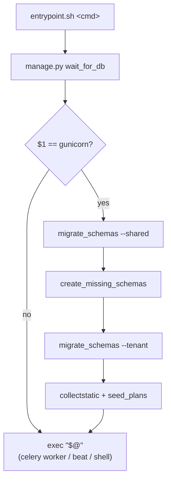

# Other — backend-scripts

# `backend/scripts` — container entrypoint

The only file in this module is `backend/scripts/entrypoint.sh`, the shell entrypoint baked into the Django image. It is the single place where schema migrations, static-file collection and baseline data seeding happen, and it is deliberately the *only* place — no other container in the stack runs those steps.

## Role in the image

`backend/Dockerfile` makes it the image's `ENTRYPOINT`, with gunicorn as the default `CMD`:

```dockerfile
RUN chmod +x scripts/entrypoint.sh
ENTRYPOINT ["scripts/entrypoint.sh"]
CMD ["gunicorn", "config.wsgi:application", "--bind", "0.0.0.0:8000"]
```

Because it is an `ENTRYPOINT`, every container built from `./backend` passes through it: `django`, `celery-worker`, and `celery-beat` in both `docker-compose.yml` and `docker-compose.prod.yml`, plus any ad-hoc `docker compose run django …`. The script receives the container's `command` as `"$@"` and `exec`s it at the end, so the real process (gunicorn, celery) becomes PID 1's replacement and receives signals directly.

## Control flow



`set -e` is on: any failing step aborts the container start rather than booting a half-migrated app. In prod this is what turns a bad migration into a failed deploy instead of a running-but-broken service.

## Step by step

### 1. `wait_for_db` (always)

`apps/core/management/commands/wait_for_db.py` polls `connection.ensure_connection()` once per second for 30 attempts, swallowing `OperationalError`, then re-raises if Postgres never came up. Compose already gates on `postgres: condition: service_healthy`, so this is belt-and-braces for the window where Postgres accepts TCP but isn't ready to serve, and for non-compose invocations.

### 2. The `gunicorn` guard

```bash
if [[ "$1" == "gunicorn" ]]; then
```

Everything mutating is inside this branch. Both compose files set the `django` service's `command:` to `gunicorn config.wsgi:application …`, while celery services use `celery -A config.celery worker|beat …`. The effect: the web container owns migrations and seeding; celery containers boot straight into `exec`. Without the guard, `django`, `celery-worker` and `celery-beat` would race on the same migration tables at every `make dev` / deploy.

Consequences worth knowing when changing compose:

- If you ever front Django with something other than gunicorn (uvicorn, a `manage.py runserver` override), the guard silently stops matching and **nothing migrates**.
- `docker compose run django python manage.py …` also skips the branch — fine, but it means a one-off command won't quietly migrate behind your back.

### 3. Three-phase schema migration

```bash
python manage.py migrate_schemas --shared --verbosity 0
python manage.py create_missing_schemas --verbosity 0
python manage.py migrate_schemas --tenant --verbosity 0
```

`migrate_schemas` is django-tenants'. The public/shared pass runs first because `SHARED_APPS` (`apps.core`, `apps.accounts`, `apps.billing` plans, …) holds the `Tenant` table that the tenant pass iterates over.

The middle `create_missing_schemas` call is the non-obvious one, and the in-file comment explains why: Contentor sets `Tenant.auto_create_schema = False`, so a `Tenant` row can exist with no corresponding Postgres schema — a half-provisioned or failed signup. `migrate_schemas --tenant` walks tenant rows and sets `search_path` to each schema; for an orphan row Postgres raises `3F000 no schema has been selected to create in`, which under `set -e` aborts the whole deploy. Materializing missing schemas first makes the tenant pass unable to trip on orphan rows.

If you touch this ordering, keep that invariant: **never let `migrate_schemas --tenant` be the thing that discovers an orphan tenant row.**

`--verbosity 0` keeps deploy logs readable; the `echo` lines above each command are the progress markers you actually see in `make logs` / `docker logs contentor-django`.

### 4. `collectstatic`

`--noinput` so it never blocks on a prompt. WhiteNoise serves the collected Django-admin assets in prod (Caddy routes apex `/django-admin/*` and `/static/*` to Django).

### 5. `seed_plans`

`apps/core/management/commands/seed_plans.py`, run unconditionally on every boot and written to be idempotent:

- `get_or_create` the `public` tenant with `provisioning_status="ready"` (django-tenants requires it to exist).
- Upsert the marketing-apex `Domain` rows that map onto the public tenant — `settings.CONTENTOR_DOMAIN`, `localhost`, `tr.*`, and the internal Docker hostname `django` used by Next.js SSR fetches. Done outside the `created` guard on purpose, so adding a new apex host gets picked up by an existing install on the next boot.
- `update_or_create` each `PlatformPlan` (Stripe price IDs resolved per plan key and currency).
- Reconcile superusers against `settings.CONTENTOR_SUPERUSERS`: create or promote listed emails, and revoke `is_superuser` from anyone not listed.

That last behaviour makes the env var authoritative — removing an email from `CONTENTOR_SUPERUSERS` demotes that account on the next container start.

## Operational notes

- **Startup cost is real.** The prod healthcheck for `django` uses `start_period: 180s` specifically because entrypoint work can push readiness past a 60s window; when it did, `celery-worker` (which waits on `django: condition: service_healthy`) never started and needed a manual kick. Adding work to the entrypoint means re-checking that budget.
- **Tenant count scales step 3 linearly.** `migrate_schemas --tenant` runs every pending migration once per tenant schema; a slow deploy is usually this, not the build.
- **Failures are loud and fatal.** A broken migration leaves the container in a restart loop (`restart: unless-stopped`) rather than serving traffic. Read `docker logs contentor-django` — the `echo` markers tell you which phase died.
- **Adding a new backend container**: if it must not migrate, give it any `command` whose first token isn't `gunicorn` and you get the skip for free. If it must migrate, don't add a second migrating container — extend the existing web-container branch instead.

Related: `Makefile` targets `migrate` / `migrate-shared` / `seed` expose the same commands for local use, and `docs/REFERENCE.md` covers the deploy path (`make deploy` → `~/ws/home-server/deploy.sh contentor`) that this script runs inside.
