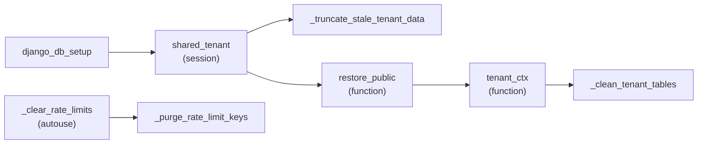

# Other — backend

# Backend — Root Infrastructure & Test Harness

The three files at `backend/`'s top level are not application code: they define how the backend is **built** (`Dockerfile`), how it is **linted, typed, and tested** (`pyproject.toml`), and the **shared pytest fixtures** every test module in `apps/*/tests/` depends on (`conftest.py`). Nothing imports from here and nothing here imports application logic at runtime — `conftest.py` only pulls in models so it can truncate them.

If you are adding a test, changing a migration, or touching container dependencies, this is the layer you need to understand first.

---

## `backend/Dockerfile` — one image, three build variants

A single `python:3.12-slim` image serves dev, prod, and CI. The variation is entirely in build args, so the runtime layout (`WORKDIR /app/backend`, entrypoint, port) is identical everywhere.

| Build arg | Default | Purpose |
|---|---|---|
| `PIP_REQUIREMENTS` | `dev.txt` | Which file under `requirements/` to install. Prod compose passes `prod.txt` so the production image ships Sentry/Prometheus and **not** pytest/ruff/mypy/ipdb. |
| `INSTALL_CLAUDE_CLI` | `0` | Dev-only. When dev compose passes `1`, the Claude Code CLI is installed and symlinked to `/usr/local/bin/claude`, which is what the "Ask Contentor" help bot's local provider (`HELP_BOT_PROVIDER=cli`) shells out to. Auth comes from `CLAUDE_CODE_OAUTH_TOKEN` in `.env` (generate once via `claude setup-token`). Prod never sets this. |

Build-time notes worth preserving when editing:

- `gcc` + `libpq-dev` are needed to build `psycopg`; `curl` is used both by the CLI installer and by health checks.
- `requirements/` is copied **before** the rest of the source so a code change doesn't invalidate the pip layer.
- `ENTRYPOINT` is `scripts/entrypoint.sh`, `CMD` is gunicorn on `0.0.0.0:8000`. The entrypoint is where migrations + collectstatic run — **only** the gunicorn container executes them; celery-worker and celery-beat override `CMD` and skip that work to avoid migration races (see `docker-compose.yml`).

Because `PYTHONDONTWRITEBYTECODE=1` and `PYTHONUNBUFFERED=1` are set at the image level, no service needs to repeat them, and container logs stream unbuffered into `vector` → the in-app logbook.

---

## `backend/pyproject.toml` — lint, type, and test config

One file configures four tools. Nothing is defined per-app.

### Ruff (`[tool.ruff]`, `[tool.ruff.lint]`)

Target `py312`, line length 120, `src = ["backend"]` so first-party resolution works from the repo root. Enabled rule families: `E`, `F`, `I` (isort), `S` (bandit-equivalent security), `B` (bugbear), `UP` (pyupgrade), `N` (naming), `C4`, `SIM`, `TCH`. `S101` (assert) is globally ignored because the test suite is assert-driven.

Per-file escapes exist for three real situations — extend these rather than sprinkling inline `noqa`:

- `**/demo_seed/seeding_helpers.py` → `S311`: uses `random` for decorative demo variety, not crypto.
- `**/tests/*.py` → `S105`, `S106`: hard-coded fixture passwords/tokens.
- `**/migrations/*.py` → `E501`, `N806`: auto-generated, with long `help_text` strings.

`known-first-party = ["apps", "config"]` drives import grouping; the formatter uses double quotes and space indentation. Ruff runs via pre-commit (`make lint`), which must pass with zero findings.

### mypy (`[tool.mypy]`, `[tool.django-stubs]`)

Runs with `mypy_django_plugin` + `mypy_drf_plugin`, resolving models against `config.settings.dev`. `ignore_missing_imports = true` keeps third-party SDKs (getstream, boto3, stripe) from producing noise.

### pytest (`[tool.pytest.ini_options]`)

```
DJANGO_SETTINGS_MODULE = "config.settings.test"
addopts = "-v --tb=short --reuse-db --ds=config.settings.test"
```

Two details that cause real confusion if you don't know them:

1. **`--ds` is duplicated on purpose.** The dev container exports `DJANGO_SETTINGS_MODULE=config.settings.dev` as an env var, which would silently win over the ini key. The explicit `--ds` flag on the command line beats the env var, so tests always run under `config.settings.test`.
2. **`--reuse-db` is the default.** Combined with `conftest.py`'s persistent tenant schema (below), a warm run starts in seconds. The cost: **after adding migrations you must run `make test-fresh` (`pytest --create-db`)** or your new schema changes are simply absent from the reused database.

### bandit (`[tool.bandit]`)

Kept for the pre-commit bandit hook: excludes `tests`/`venv`, skips `B101`.

---

## `backend/conftest.py` — the shared-tenant test harness

This is the substantive code in the module. Its central design decision:

> **One PostgreSQL tenant schema, created once per session and never dropped.**

`create_schema(sync_schema=True)` — which runs the full tenant migration set — is by far the most expensive operation in the suite. Creating a schema per test module roughly doubled total runtime. Instead a single tenant (`schema_name="shared_test"`, domain `shared-test.localhost`) is built once and shared, and test isolation is achieved by *deleting rows* rather than by rebuilding schemas.

### Fixture map



Three autouse fixtures (`_clear_rate_limits`, `_curated_mirror_off`, `_ensure_free_plan`) apply to every test without being requested. The other three are opt-in — a test module imports/requests only what it needs.

#### `shared_tenant` (session scope)

`get_or_create`s the `Tenant` + `Domain` rows in the public schema, then `create_schema(check_if_exists=True, sync_schema=True)`. Two defensive touches:

- `provisioning_status` is forced to `"ready"`. Rows reused from an older `--reuse-db` session may predate that field being stamped, or be stuck at `"pending"` — and any Celery task that fans out over tenants filters on `provisioning_status="ready"`, so a stale value makes those tests silently see zero tenants.
- No teardown. The schema deliberately survives so the next `--reuse-db` run skips migrations.

#### `_truncate_stale_tenant_data()`

The counterweight to never dropping the schema. `django_db(transaction=True)` tests commit for real, and any model **not** listed in `TENANT_CLEANUP_MODELS` leaks rows into the next session's reused database. This runs once at session start: it lists `pg_tables` for `shared_test`, subtracts `MIGRATION_SEEDED_TABLES` (`django_migrations`, `django_content_type`, `auth_permission`, `auth_group`, `auth_group_permissions`), and `TRUNCATE ... CASCADE`s the rest. The result is equivalent to the fresh schema `--create-db` would give — all `RunPython` migrations in the tenant set are backfills that no-op on empty tables — without paying for migrations.

#### `restore_public`

`django_db(transaction=True)` tests are `TransactionTestCase`s, whose teardown flushes the **public** schema — taking the tenant and domain rows with it. This fixture re-inserts them, temporarily setting `Tenant.auto_create_schema = False` (restored in a `finally`) so the `get_or_create` doesn't try to build a schema that already exists. It returns the tenant.

#### `tenant_ctx`

The fixture most tests actually want. Wraps the body in `tenant_context(tenant)` and calls `_clean_tenant_tables()` **both before and after** the test. Cleaning *before* matters under pytest-xdist: load balancing makes ordering nondeterministic, so a test may inherit committed rows from a `transaction=True` test that ran just ahead of it on the same worker.

#### `_clean_tenant_tables()` and `TENANT_CLEANUP_MODELS`

`TENANT_CLEANUP_MODELS` is an ordered list of ~35 tenant models, **children before parents** (e.g. `Progress` → `Enrollment` → `Lesson` → `Module`, `PaymentItem` → `Payment`, ending at `User`). Order is load-bearing — appending a new model at the end will raise FK errors if anything references it.

Naively issuing `.objects.all().delete()` for every model costs ~2 queries each, and a typical test touches only a handful of tables. So `_NONEMPTY_TABLES_SQL` — a `UNION ALL` of `SELECT <i> WHERE EXISTS (SELECT 1 FROM "<table>")`, built once at import time — probes all tables in a single round trip, and only the non-empty ones get an ORM delete (preserving full cascade semantics). Table names are intentionally unqualified so they resolve through the tenant `search_path`, matching what the ORM would target inside `tenant_context`.

**When adding a tenant model with test fixtures, add it here** in dependency order, or its rows will leak across tests and eventually into the reused database.

#### `_clear_rate_limits` / `_purge_rate_limit_keys` (autouse)

Deletes five Redis key patterns around every test. Each addresses a distinct cross-test bleed:

| Pattern | What it clears | Failure it prevents |
|---|---|---|
| `ratelimit:*` | `TenantRateLimitMiddleware` counters | Middleware-level 429s |
| `*throttle*` | DRF `AnonRateThrottle` (e.g. contact form 5/min) | `APIClient` always looks like `127.0.0.1`, so >5 requests in 60s across tests → 429 |
| `*logo-ai*` | Logo Studio AI Brand Pack 30-day result cache (`logo-ai:pack:*`) | A cached pack from a prior run makes a later run skip the real AI path |
| `*ai-answer*` | Assistant first-turn answer cache (`apps.core.assistant`) | One test's cached answer bleeds into another asking the same question |
| `*ai-sess*` | Per-session daily cap | A reused session id arrives already capped |

The leading wildcards are required for the last three: those are written through `django.core.cache.cache`, so Django's key function prefixes them with `:<version>:`, whereas `ratelimit:*` is written with a raw redis client. The whole body is wrapped in a bare `except Exception` (`# noqa: S110`) — Redis being unavailable must not fail the suite.

#### `_curated_mirror_off` (autouse)

The dev container exports `CURATED_LOGO_SYNC_DIR` pointing at a repo bind mount. This forces it to `""` for every test so no suite writes into the working tree or touches MinIO. Mirror-specific tests re-enable it against `tmp_path`.

#### `_ensure_free_plan` (autouse)

Guarantees the canonical `"Free"` `PlatformPlan` row (name from `settings.BILLING_FREE_PLAN_NAME`, defaults in `_FREE_PLAN_DEFAULTS`) exists before every db test. The problem it solves is subtle and worth reading before you "simplify" it:

A `transaction=True` test flushes the public schema, deleting rows seeded by *data migrations* — including the Free plan backfilled by `0005_backfill_free_plan.py`. Nothing recreates it, and `--reuse-db` never reruns migrations, so **the first such test in a session permanently removes it from that worker's database**. The symptom surfaces much later as an unrelated `PlatformPlan.DoesNotExist` in whatever test happens to need it next (`apps/core/tests/test_seed_dev_tenants.py` resolves it by name via `seed_dev_tenants._resolve_plan`). Re-`get_or_create`ing it before every db test sidesteps the flush entirely. Django's `serialized_rollback` was tried and reverted — it collides with already-present `ContentType` rows on a fresh or reused DB. The fixture short-circuits (`yield; return`) when the test has no `django_db` marker.

---

## Writing a test against this harness

```python
import pytest

pytestmark = pytest.mark.django_db

def test_something(tenant_ctx, api_client):
    # inside tenant_context(shared_test); tenant tables are empty
    ...
```

- Request `tenant_ctx` for anything touching tenant-schema models. Request `restore_public` alone if you only need the public-schema tenant/domain rows intact.
- Prefer plain `django_db` over `django_db(transaction=True)`. Transactional tests flush the public schema and commit real rows — the source of nearly every cross-test surprise the fixtures above compensate for.
- The suite runs under pytest-xdist, so never assume ordering or that you are the only writer of a Redis key or a shared row.

### Failure patterns and their real causes

| Symptom | Almost always means |
|---|---|
| `ProgrammingError` on a column that exists in a model | New migration + `--reuse-db`. Run `make test-fresh`. |
| `PlatformPlan.DoesNotExist` in an unrelated test | A `transaction=True` test flushed public — check `_ensure_free_plan` is still autouse. |
| Any `test_seed_dev_tenants.py` failure (one test or all of them) | Reused-DB dirt. Rerun that file with `--create-db`. |
| Unexplained `429` | A rate-limit or throttle key pattern not covered by `_purge_rate_limit_keys`. |
| Rows appearing that no test created | A tenant model missing from `TENANT_CLEANUP_MODELS`, leaked from a previous session. |

---

## Relationship to the rest of the repo

- **`docker-compose.yml` / `docker-compose.prod.yml`** supply the `PIP_REQUIREMENTS` and `INSTALL_CLAUDE_CLI` build args and override `CMD` for the celery services.
- **`scripts/entrypoint.sh`** is the image's entrypoint; migrations and collectstatic live there, not in the Dockerfile.
- **`requirements/dev.txt` / `prod.txt`** define which of the tools configured in `pyproject.toml` are even present in a given image — prod has no pytest or ruff, by design.
- **`config/settings/test.py`** is the settings module every test run resolves to, via both the ini key and `--ds`.
- **`Makefile`** wraps all of it: `make test`, `make test-fresh`, `make test-app APP=<name>`, `make test-changed`, `make lint`.
- **`apps/*/tests/`** consume `shared_tenant`, `restore_public`, and `tenant_ctx`; the three autouse fixtures apply whether or not a module knows they exist.
