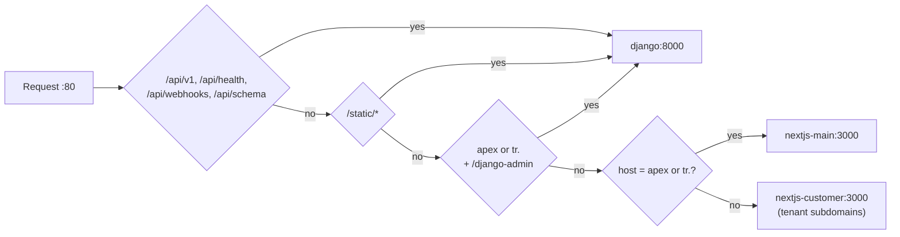

# Other — Caddyfile

# Caddyfile — Contentor edge proxy

The single routing surface for every browser request that reaches Contentor. One parametrized file serves **both dev and prod**; environment variables are the only difference between the two deployments.

Caddy is the only edge-facing container in the prod stack (`contentor-caddy`, joined to the shared external `edge` network so the Cloudflare tunnel can reach it). Everything behind it — Django, both Next.js apps, Postgres, Redis, Celery — sits on the internal network with no published host ports. In dev, the same file runs in the `caddy` service on `:80`.

## Why it looks like this

Three constraints shape the whole file:

1. **TLS terminates at Cloudflare.** `cloudflared → Caddy → Django` is plain HTTP, so `auto_https off` and a bare `:80` site block. Caddy must never attempt ACME here — it has no public `:443` binding and the challenge would fail.
2. **Tenancy is dynamic.** The proxy has no per-tenant configuration and never learns tenant names. Any host that isn't the marketing apex or locale falls through to the customer app; Django's `HeaderAwareTenantMiddleware` resolves the tenant from the `Host` header. **Onboarding a new tenant requires zero changes to this file** — only a wildcard DNS record.
3. **The frontends don't proxy the API.** Browsers hit `/api/v1/*` directly through Caddy to Django. Next.js is not in that path, which is why the API matchers are host-agnostic and sit at the top.

## Request routing



### The matchers, in order

| Matcher | Scope | Upstream | Notes |
|---|---|---|---|
| `@api` | **every host** — `/api/v1/*`, `/api/health*`, `/api/webhooks/*`, `/api/schema*` | `django:8000` | Sets `X-Forwarded-Proto` |
| `@static` | **every host** — `/static/*` | `django:8000` | Django admin assets, served by WhiteNoise |
| `@admin` | apex + `tr.` only — `/django-admin`, `/django-admin/*` | `django:8000` | Sets `X-Forwarded-Proto` |
| `@main` | apex + `tr.` (host match) | `nextjs-main:3000` | Marketing, signup, login, coach onboarding |
| *(bare `handle`)* | everything else | `nextjs-customer:3000` | Catch-all: all tenant subdomains |

`handle` blocks are **mutually exclusive** — exactly one runs per request, and the bare `handle` is the least specific so it always sorts last. The file is written most-specific-first on purpose; preserve that top-to-bottom order when editing so the intent stays readable even though Caddy sorts by matcher specificity rather than file position.

The practical consequence of the path matchers coming first: a request to `coach-slug.contentor.app/api/v1/courses/` goes to **Django**, not to the customer app. Host and path are decided independently.

## Environment variables

Both have Caddyfile-level defaults, so the file boots standalone with no env at all (dev-friendly).

| Variable | Default | Dev | Prod |
|---|---|---|---|
| `CONTENTOR_DOMAIN` | `localhost` | `localhost` → apex `localhost`, locale `tr.localhost` | `contentor.app` → apex `contentor.app`, locale `tr.contentor.app` |
| `FORWARDED_PROTO` | `http` | `http` | `https` |

`FORWARDED_PROTO` is the one that bites. Django's prod settings enable `SECURE_PROXY_SSL_HEADER` plus secure cookies and `SECURE_SSL_REDIRECT`; since the hop from cloudflared to Caddy is HTTP, Django would see `http`, issue a redirect to HTTPS, and loop forever. `header_up X-Forwarded-Proto {$FORWARDED_PROTO:http}` on every Django-bound proxy is what breaks that cycle. If you add a new `reverse_proxy django:8000` block, **it needs this header too** — the three existing blocks each carry their own copy because `header_up` is per-`reverse_proxy`, not inherited.

## Global options

```
admin 0.0.0.0:2019
auto_https off
```

The admin API binds `0.0.0.0` so it's reachable from other containers on the compose network (config reload, `/metrics`, `/config/`). This is safe **only** because prod publishes no host port for it and Caddy's admin endpoint isn't exposed on the `edge` network path — if you ever add a port mapping for `2019`, you're handing out full remote config-rewrite capability. Don't.

## Two admin surfaces — don't confuse them

- `contentor.app/admin/*` → **`nextjs-main`**. The superadmin SPA (platform API is `apps.core.platform`, panels registered via `apps.adminkit`).
- `contentor.app/django-admin/*` → **Django**. The stock Django admin, apex/locale only, deliberately namespaced away from `/admin` so the SPA can own that path.

Tenant subdomains have their own coach admin inside `nextjs-customer` at `/admin/*`, which the catch-all serves — that path never reaches Django directly either.

## Ports

Both Next.js apps listen on `3000`. That's intentional and not a conflict: they're separate containers, so `nextjs-main:3000` and `nextjs-customer:3000` are distinct addresses. Prod sets `ENV PORT=3000` in each Dockerfile; dev runs `npm run dev -- -p 3000`. Django is Gunicorn on `8000`.

## What this file does *not* handle

Worth knowing before you debug a request that never shows up in Caddy's logs:

- **Next.js server-side `fetch()` to Django.** Server components talk to `django:8000` directly over the internal network, bypassing Caddy entirely. Caddy's host-based tenancy gives you nothing there — those calls must send `X-Tenant-Domain` explicitly, or Django resolves them to the public schema. (Node's undici silently drops a custom `Host` header, which is why the tenant header exists.)
- **Object storage.** MinIO in dev and Hetzner/S3 in prod are reached via presigned URLs pointed at `AWS_ENDPOINT_EXTERNAL`; media traffic does not transit Caddy.
- **Stream.io chat and video.** The customer app talks to GetStream directly from the browser.
- **API prefixes not listed in `@api`.** A new top-level route like `/api/internal/*` will fall through to the catch-all and get a Next.js 404 — with no Django log line to explain it. Adding a new prefix outside `/api/v1/` means editing `@api`.

## Editing and verifying

Caddyfiles are whitespace-sensitive (tabs, and `{` must stay on the directive line). Validate before deploying:

```bash
# inside the running container
caddy validate --config /etc/caddy/Caddyfile
caddy fmt --overwrite /etc/caddy/Caddyfile
```

Then check the path actually resolves end-to-end rather than trusting the config:

```bash
make dev            # dev stack on :80
make health-check   # curl /api/health/ — proves the @api → django hop
```

For prod, `make deploy` (runs the backend suite, then `~/ws/home-server/deploy.sh contentor`) rebuilds and health-checks the stack. Tunnel ingress changes are a separate `./deploy.sh edge`.

A useful triage split when something 404s or 502s: check *which* upstream answered. A Next.js-styled 404 on an API path means the request missed `@api`. A blank page or hang on a tenant subdomain is usually a transient `nextjs-customer` 502 (often OOM), not a routing bug — the catch-all is working, the upstream isn't.

## Related files

- `docker-compose.yml` — dev `caddy` service, `:80` published
- `docker-compose.prod.yml` — `contentor-caddy` on the external `edge` network; self-contained, not an override of the dev compose
- `.env.prod` / `.env.prod.example` — where `CONTENTOR_DOMAIN` and `FORWARDED_PROTO` are set for prod
- `backend/config/settings/prod.py` — `SECURE_PROXY_SSL_HEADER`, secure cookies, WhiteNoise; the consumer of `X-Forwarded-Proto`
- `backend/apps/core/middleware.py` — `HeaderAwareTenantMiddleware`, which turns the `Host` the catch-all forwarded into a Postgres schema