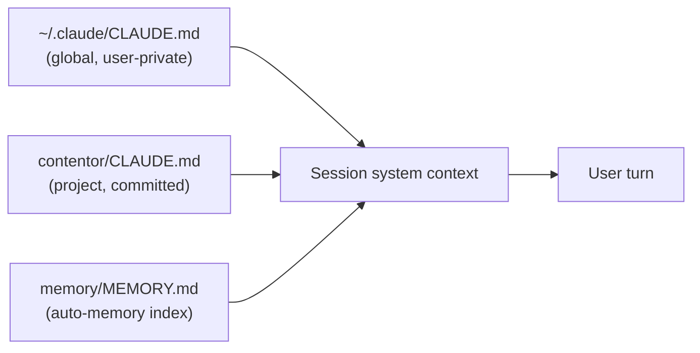

# Other — CLAUDE.md

# CLAUDE.md — Repository Operating Manual for Claude Code

`CLAUDE.md` sits at the repository root and is the highest-precedence, always-loaded instruction file for Claude Code sessions in Contentor. It is not application code: nothing imports it, nothing calls into it, and it has no call graph. Its effect is entirely through the agent runtime, which injects its contents into every session's system context before the first user turn.

Treat it as configuration for agent behavior. Editing it changes how every future Claude Code session in this repo reasons, which commands it reaches for, and which invariants it treats as non-negotiable.

## Why this file exists

Contentor is a schema-per-tenant Django + dual-Next.js monorepo where a plausible-looking change (a `fetch()` without `X-Tenant-Domain`, a public endpoint without `@authentication_classes([])`, a raw `<Loader2>` in a button) is silently wrong rather than loudly broken. `CLAUDE.md` front-loads exactly those traps so an agent does not have to rediscover them by breaking the dev stack.

Its content is therefore biased toward:

- **Non-derivable facts** — things you cannot infer by reading the code (why celery skips migrations, why `getTenantDomain()` returns empty in `generateMetadata`).
- **Entry points** — the `make` target for each task, so the agent never hand-rolls a `docker compose exec` invocation.
- **Hard invariants** — the `## Rules` section, phrased as absolutes.

## Load order and precedence

Three CLAUDE.md-family files can be in play at once, and they compose rather than override wholesale:



Precedence, most to least authoritative: a direct user instruction in the conversation → these instruction files → skill workflows → default model behavior. Within the files, the project `CLAUDE.md` is what this document covers; the global file carries cross-project triggers (e.g. `/graphify`), and `MEMORY.md` carries one-line pointers into per-fact memory files.

The practical consequence: `CLAUDE.md` states repo-wide law, `MEMORY.md` states *situational* history ("prod curated-logo re-seed still pending"). Don't move history into `CLAUDE.md` — it goes stale and it is loaded into every session forever. Conversely, don't put invariants in memory, where they are only recalled by relevance match.

## Section anatomy

Each top-level `##` section answers a distinct question an agent asks early in a task.

| Section | Answers | Kept accurate by |
|---|---|---|
| Project Overview | What is this, and who are the three actors? | Rarely changes; the coach/student/superadmin glossary is load-bearing for every other doc |
| Commands | How do I do X without inventing a command? | Must mirror `make help` — see below |
| Architecture → Backend | Which app owns this concern, and is it SHARED or TENANT? | `backend/config/settings/base.py` app lists |
| Architecture → Multi-Tenancy | The four tenancy traps | The most consequential section; also mirrored in a memory file |
| Docker Services | What runs, on what port, and which container migrates | `docker-compose.yml` |
| Local fakes + e2e | Which integrations are stubbed, and how many specs exist | `e2e/specs/` count and `e2e/impact-map.json` |
| MailCraft Integration | The sibling-repo contract | `../django-contentor-email-builder/` |
| Active Documentation | Where the deeper docs live and which are historical | `docs/` layout |
| Flowmap | The three modes of the user-flow tool | `tools/flowmap/` |
| Rules | Absolute prohibitions | Human decision only |
| Loading & feedback conventions | The frontend UX contract, and what lint enforces | `scripts/check-loading-patterns.mjs` |
| Home-server deploy | Prod topology and the deploy entry point | `docker-compose.prod.yml`, `Caddyfile` |
| GitNexus (managed block) | Code-intelligence tool policy | Generated — see below |

### The managed GitNexus block

The final section is delimited:

```
<!-- gitnexus:start -->
...
<!-- gitnexus:end -->
```

Everything between those markers is tool-owned and regenerated by GitNexus tooling. Hand-edits inside the fence are liable to be overwritten — including the symbol/relationship/flow counts, which are a snapshot (currently 18514 / 37243 / 300) and drift as the index ages. If you need to change GitNexus policy durably, change it outside the fence or in the generator, not inside the markers.

## Invariants encoded here that break code if violated

These are the claims in `CLAUDE.md` that map directly onto failure modes. When contributing to the repo, they are the shortlist worth internalizing:

**Tenancy.** Browser traffic hits `/api/v1/*` through Caddy straight to Django — it is *not* proxied through Next.js. Server-side `fetch()` from either Next app must send `X-Tenant-Domain`, because Node's undici drops a custom `Host` header and the request resolves against the public schema instead. Build the domain from the slug (`${slug}.${BASE_DOMAIN}`); `getTenantDomain()` returns empty inside `generateMetadata` and `manifest.ts`.

**Auth.** `TenantJWTAuthentication` is the default DRF auth class, so `AllowAny` alone does not open an endpoint. Public views (magic link, OAuth, signup) must also carry `@authentication_classes([])`.

**Schema drift.** Changing a serializer moves the frontend contract. Run `npm run gen:api` in `frontend-customer` and read the diff of `src/types/api-generated.ts` — an unexpected diff there is the signal, not noise.

**Migrations.** Only the gunicorn entrypoint runs `migrate` + `collectstatic`. Celery containers deliberately skip both to avoid a startup race. Don't "fix" that asymmetry.

**Frontend loading contract.** No raw `<Loader2>`/`animate-spin` in app code; `<Button loading>` / `<Spinner>` / `<PageState>` / `<StaleContainer>` instead. Navigation goes through `<NavLink>` and `useNavigate()`, never `next/link` or `router.push`. Every route segment needs a `loading.tsx` at or above it. `scripts/check-loading-patterns.mjs` runs in `make lint` and fails the build on violations — so these are enforced, not aspirational.

**Prod safety.** `BILLING_BYPASS_ENABLED` must be false in prod; `config.settings.prod` runs live Stripe. Dev `.env` also runs real Stripe test-mode by default, with bypass available for fully-offline work.

## Contributing to CLAUDE.md

There is a strict rule in this very file — *"Never create new `.md` files unless explicitly asked"* — which makes `CLAUDE.md` itself one of the few docs you are expected to edit in place rather than supplement.

**When to add something.** Add a line when an agent (or a new human) would otherwise have to learn it by breaking something, *and* the fact is stable. The multi-tenancy `X-Tenant-Domain` note is the archetype: cheap to state, expensive to rediscover.

**When not to.** Don't restate what the code already says. An app list that duplicates `INSTALLED_APPS` verbatim is churn; a one-line "what this app owns" gloss per app — which is what the Architecture section actually does — is not. Don't record in-flight status ("prod re-seed pending") here; that's what auto-memory is for. Don't add a command that isn't in the `Makefile`.

**Keeping the mirrors honest.** Several passages assert counts and flags that decay:

- The `## Commands` block should track `make help`. If you add a target, add the line.
- The e2e paragraph states concrete numbers (24 non-Stripe specs of 26 files, 2 Stripe specs auto-skipping without `STRIPE_E2E`). Adding a spec means updating that sentence *and* adding an `e2e/impact-map.json` entry — the selector self-test in `make lint` fails on an unmapped spec, which is the enforcement mechanism for the map, not for the prose.
- Forward references to unfinished work carry pointers (e.g. `make typecheck` is noted as advisory, "not yet gated in `make lint`", citing Task 3 of `docs/superpowers/plans/2026-07-17-vibe-coding-restructure.md`). When such a task lands, delete the caveat rather than leaving a stale "not yet".

**Tone.** The file is dense and imperative on purpose. Prefer one sentence with the reason embedded ("celery skips to avoid races") over a paragraph of background. Every added line costs context in every future session.

## Relationship to the rest of the documentation

`CLAUDE.md` is deliberately a router, not the reference:

- `docs/REFERENCE.md` — the comprehensive project reference (architecture, domain model, auth/tenancy, billing, integrations, deploy). Start there for full context; `CLAUDE.md` only summarizes.
- `docs/GLOSSARY.md` — canonical terminology.
- `docs/PRODUCT.md` — living product plan, maintained via the `/po` skill; the answer to any "what's next" question.
- `docs/superpowers/specs/` and `.../plans/` — per-feature specs. The `specs/archive/` subtree is shipped-and-deployed history; the top level is in-progress work, plus `screenshot-map`/`flowmap-service` as living tooling reference.
- `AGENTS.md` — sibling agent-instruction file at the repo root (currently untracked), for harnesses that read that convention rather than `CLAUDE.md`. If you change an invariant in one, check whether the other repeats it.
- `.claude/skills/` — project skills (`po`, `collect-curated-logos`, `collect-curated-photos`, the `gitnexus/*` set). `CLAUDE.md` points at them; the skills hold their own procedures.

The split to preserve: `CLAUDE.md` answers "what must I not get wrong, and what command do I run"; `docs/REFERENCE.md` answers "how does this actually work". When a passage in `CLAUDE.md` grows past a short paragraph, that is usually a signal it belongs in `REFERENCE.md` with a pointer left behind.
