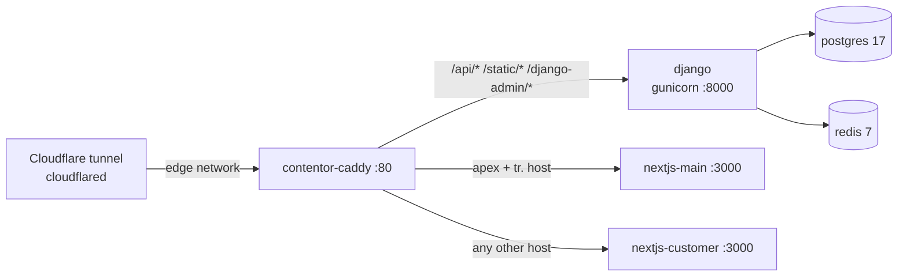

# Other — docker-compose.prod.yml

# `docker-compose.prod.yml` — home-server production stack

The production deployment descriptor for Contentor on the home server (old MacBook running Ubuntu), behind the shared Cloudflare tunnel. It is **self-contained**, not an override of `docker-compose.yml` — `docker compose -f docker-compose.prod.yml` is the whole prod stack. The project name is pinned (`name: contentor`) so container names and volumes are stable regardless of the invoking directory.

There is no Python/JS code here and no call graph: this file's "API" is the set of environment variables it reads, the container/network/volume names it creates, and the runtime contracts it must keep in sync with `Caddyfile`, `backend/Dockerfile`, `backend/scripts/entrypoint.sh`, `monitoring/vector/vector.yaml`, and `config.settings.prod`.

## Design rules it follows

These are fleet-wide conventions shared with the other services in `~/ws/home-server/`, not Contentor inventions:

- **One edge container.** Only `caddy` joins the external `edge` network, which the `cloudflared` tunnel also sits on. Everything else lives on `internal` (a plain bridge) with **no published host ports** — nothing on the box is reachable except through the tunnel.
- **RAM + log caps on every service.** `mem_limit` on all nine containers (~2.3 GB total ceiling) and a shared `x-logging` anchor capping json-file logs at 3×10 MB per container. On a memory-constrained old laptop, an uncapped container is an outage.
- **`restart: unless-stopped`** everywhere, so a host reboot brings the stack back.
- **Internal service names match the dev compose** (`django`, `postgres`, `redis`, `nextjs-main`, `nextjs-customer`). This is load-bearing: `REDIS_URL=redis://redis:6379/0`, `POSTGRES_HOST=postgres`, `NEXT_PUBLIC_API_URL=http://django:8000`, and the Caddyfile's `reverse_proxy django:8000` all resolve identically in dev and prod, so app config carries over unchanged.
- **Secrets live only in `.env.prod`** (gitignored; template at `.env.prod.example`, ~40 keys). `deploy.sh` passes it via `--env-file`; app containers additionally take `env_file: .env.prod` so the whole file lands in the process environment.

## Request path and topology



`celery-worker`, `celery-beat` and `vector` hang off the same Postgres/Redis/Django core and never touch the edge. Tenant routing is entirely dynamic — Caddy's catch-all sends every non-apex host to `nextjs-customer`, and Django resolves the tenant from the `Host` header, so a new tenant needs no proxy change, only the wildcard DNS record.

## Services

| Service | Container | Image / build | Mem | Notes |
|---|---|---|---|---|
| `caddy` | `contentor-caddy` | `caddy:2-alpine` | 64m | Only container on `edge`; mounts `./Caddyfile` read-only |
| `postgres` | `contentor-postgres` | `postgres:17-alpine` | 384m | `postgres_data` volume; `pg_isready` healthcheck |
| `redis` | `contentor-redis` | `redis:7-alpine` | 160m | Cache + Celery broker, no persistence |
| `django` | `contentor-django` | build `./backend` | 512m | Gunicorn gthread; runs migrations via entrypoint |
| `celery-worker` | `contentor-celery-worker` | build `./backend` | 384m | `--concurrency=2`, `-l warning` |
| `celery-beat` | `contentor-celery-beat` | build `./backend` | 160m | Periodic task scheduler |
| `vector` | `contentor-vector` | `timberio/vector:0.46.1-alpine` | 128m | Ships container logs into the in-app logbook |
| `nextjs-main` | `contentor-nextjs-main` | `frontend-main/Dockerfile`, target `runner` | 256m | Marketing / signup / login |
| `nextjs-customer` | `contentor-nextjs-customer` | `frontend-customer/Dockerfile`, target `runner` | 320m | Tenant portal + Stream chat/video |

### `caddy`

Parametrized by `CONTENTOR_DOMAIN` (default `contentor.app`) and `FORWARDED_PROTO=https`. The same `Caddyfile` serves dev and prod; only these two env vars differ. TLS terminates at Cloudflare, so Caddy serves plain HTTP with `auto_https off` and forces `X-Forwarded-Proto: https` upstream so Django's `SECURE_PROXY_SSL_HEADER` / `SECURE_SSL_REDIRECT` don't redirect-loop.

The healthcheck hits the Caddy admin API at **`http://127.0.0.1:2019/config/`** — literal IPv4, not `localhost`. busybox `wget` resolves `localhost` to `::1`, but the admin endpoint only listens on IPv4, so `localhost` would fail the check forever.

### `postgres`

`POSTGRES_PASSWORD` uses the fail-fast form `${POSTGRES_PASSWORD:?...}`: `docker compose config`/`up` aborts with a readable message if it's missing from `.env.prod` rather than silently starting a password-less database. `make prod-config` exists precisely to exercise that interpolation before a deploy.

### `redis`

`redis-server --maxmemory 96mb --maxmemory-policy allkeys-lru --save ""` — bounded well under the 160m container cap, LRU-evicting, and persistence off. Both roles it plays (Django cache, Celery broker) tolerate a cold start; nothing here is a system of record.

### `django`

Two deliberate, hard-won choices in the gunicorn command:

```
gunicorn config.wsgi:application --bind 0.0.0.0:8000 --workers 2 --worker-class gthread
  --threads 8 --graceful-timeout 30 --timeout 300 --error-logfile -
```

- **`gthread`, not sync workers.** Several endpoint families block on slow external HTTP for tens of seconds (Anthropic Brand Pack, MailCraft render, GetStream, Route53). With 2 sync workers, two such concurrent requests occupy *both* workers and take the entire platform down. 2 workers × 8 threads gives 16 concurrent slots, so a blocked request holds one thread while the rest keep serving. The dev compose was brought to gthread parity for the same reason (commit `43cbf5ee`).
- **`--timeout 300`.** The Design-with-AI icon turn stacks an Anthropic call (100 s client timeout, `max_retries=1` → ~200 s worst case) on top of ~60 s of Gemini image generation; a shorter timeout kills it mid-generation. Cloudflare still caps the *browser's* request at ~100 s regardless — the real fix is moving that work to Celery with polling, which this timeout is a stopgap for.

Access logging is intentionally off (the 15 s healthcheck would flood it); `--error-logfile -` keeps worker lifecycle events, crashes and timeouts on stdout where Vector can pick them up. Request errors still surface via Django's `django.request` logger.

Build arg **`PIP_REQUIREMENTS: prod.txt`** (the Dockerfile defaults to `dev.txt`) means prod ships Sentry/Prometheus and *not* pytest/ruff/mypy/ipdb. `INSTALL_CLAUDE_CLI` is left at its `0` default — the CLI help-bot provider is dev-only.

**Healthcheck and `start_period: 180s`.** The probe is `curl -H "X-Forwarded-Proto: https" http://localhost:8000/api/health/` — the header is required or `SECURE_SSL_REDIRECT` answers the internal probe with a 301. The long start period exists because `scripts/entrypoint.sh` does real work before gunicorn binds, and only for the gunicorn process: `wait_for_db` → `migrate_schemas --shared` → `create_missing_schemas` → `migrate_schemas --tenant` → `collectstatic` → `seed_plans`. Tenant migrations scale with tenant count, and on both 2026-07-03 deploys the default 60 s window elapsed while Django was still `starting`, so `celery-worker` (gated on `condition: service_healthy`) never started and needed a manual kick. If startup work grows again, raise this number rather than loosening the dependency conditions.

### `celery-worker` / `celery-beat`

Same image and `.env.prod` as Django, `DJANGO_SETTINGS_MODULE=config.settings.prod`. The worker waits for `django: service_healthy`, and beat waits for the worker — so **only** the gunicorn entrypoint branch runs migrations and `collectstatic`, avoiding concurrent-migration races. The Celery containers reach `exec "$@"` with `$1 == "celery"` and skip that whole block.

### `vector`

Mounts the host Docker socket read-only and tails every container's stdout/stderr (`docker_logs` source), shaping each line to `{timestamp, container_name, stream, message}` and POSTing batches to `http://django:8000/api/v1/platform/logs/ingest/` with `X-Logs-Token: ${LOGS_INGEST_TOKEN}`. That endpoint backs the superadmin **Logs** page — **observability for Contentor lives in the app, not in a metrics stack** (the Prometheus/Loki/Grafana stack was removed in `43cbf5ee`). `LOGS_INGEST_TOKEN` is the second fail-fast variable. Django/Celery logs use a multiline start pattern so tracebacks arrive as single events; the Vector container excludes itself to avoid a feedback loop. Its disk buffer (256 MiB, `when_full: drop_newest`) rides on the `vector_data` volume, so a Django outage doesn't lose the backlog.

### `nextjs-main` / `nextjs-customer`

Both build from the **repo root** context with an app-specific Dockerfile and `target: runner`, because the two apps share workspace packages above their own directories. `NEXT_PUBLIC_*` values are passed **twice** — as build args and as runtime env — which is not redundant: `NEXT_PUBLIC_*` is inlined into the client bundle at build time, while the runtime copy serves server-side rendering and route handlers. Changing `CONTENTOR_DOMAIN` therefore requires a **rebuild**, not just a restart. `NEXT_PUBLIC_GETSTREAM_API_KEY` is sourced from `GETSTREAM_API_KEY` (the same key the backend uses; only the secret stays server-side) and defaults to empty so a build doesn't fail when Stream isn't configured.

## Configuration surface

Read directly by this file:

| Variable | Default | Effect |
|---|---|---|
| `CONTENTOR_DOMAIN` | `contentor.app` | Caddy host matchers + `NEXT_PUBLIC_BASE_DOMAIN` in both frontends |
| `POSTGRES_DB` / `POSTGRES_USER` | `contentor` | Database bootstrap + `pg_isready` probe |
| `POSTGRES_PASSWORD` | — **required** | Fails the compose run if unset |
| `LOGS_INGEST_TOKEN` | — **required** | Vector → logbook auth |
| `NEXT_PUBLIC_API_URL` | `http://django:8000` | Frontend build + runtime API base |
| `GETSTREAM_API_KEY` | empty | Public Stream key for the customer app |

`FORWARDED_PROTO` is hardcoded to `https` here (the Caddyfile defaults it to `http` for dev). Everything else Django needs — Stripe live keys, Resend, Hetzner S3, Anthropic/Gemini, VAPID, Sentry, `DJANGO_SECRET_KEY`, `DJANGO_ALLOWED_HOSTS` — flows in through `env_file: .env.prod` and is documented in `.env.prod.example`. **`BILLING_BYPASS_ENABLED` must be `false` in prod**; the bypass payment provider is a dev/CI affordance only.

## Deploying and operating

```bash
make deploy                 # full backend suite first, then ~/ws/home-server/deploy.sh contentor
make deploy SKIP_TESTS=1    # skip the test preflight
make prod-build             # build the prod images locally — catches prod-only build breaks
make prod-config            # validate compose + .env.prod interpolation without starting anything
```

`deploy.sh contentor` rsyncs the repo to the box, builds, brings the stack up with `--env-file .env.prod`, and health-checks. Tunnel ingress changes are a separate `./deploy.sh edge`. The `edge` network is **external** and created once by hand on the host:

```bash
docker network create edge
```

If it's missing, the stack refuses to start.

## Things to know before editing this file

- **Never publish host ports.** Any `ports:` entry here bypasses the tunnel and exposes the service on the LAN.
- **Renaming a service breaks app config.** `django`, `postgres`, `redis`, `nextjs-main`, `nextjs-customer` are referenced by the Caddyfile, `.env.prod` (`POSTGRES_HOST`, `REDIS_URL`, `CELERY_BROKER_URL`), and the frontend API fallback. Renaming a **container** (`contentor-*`) breaks Vector's `include_containers` filters instead — logs go quiet without erroring.
- **Adding a service?** Give it `mem_limit`, `logging: *logging`, `restart: unless-stopped`, `internal`-only networking, and a `contentor-*` container name that Vector's prefix filters will match.
- **Raising a `mem_limit`** means re-checking the total against the box's RAM; the caps are a budget, not per-service guesses. Docker OOM-kills silently look like application flakiness (see the e2e 502 pattern).
- **Frontend env changes need a rebuild**, per the build-arg/runtime duplication above.
- `monitoring/vector/vector.yaml` lists `contentor-minio` in its infra sources — harmless leftover from the dev stack, where MinIO is the object store; prod uses Hetzner object storage via `AWS_ENDPOINT`.
- The `django` healthcheck comment refers to a demo-reseed step in the entrypoint; the current `entrypoint.sh` ends at `seed_plans`, but tenant-schema migrations plus `collectstatic` still make the 180 s start period the right order of magnitude.
