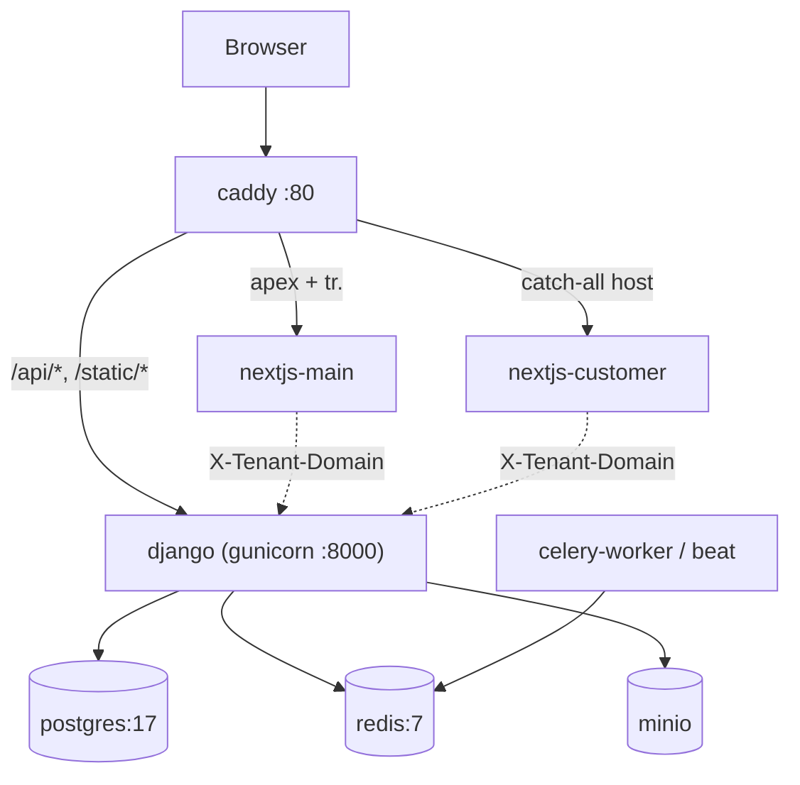

# Other — docker-compose.yml

# `docker-compose.yml` — Development Stack

The dev-time orchestration for the whole Contentor platform: one Caddy edge, Django + Celery, both Next.js apps, and local stand-ins for Postgres, Redis, and object storage. Everything hot-reloads, so `make dev` is the only command needed to bring up a full multi-tenant environment on `localhost`.

This file is **not** an override layer. `docker-compose.prod.yml` at the repo root is a separate, self-contained stack for the home-server deploy. Changes here do not propagate to prod — if a setting needs to hold in both places (worker class, timeouts, log shipping), it has to be edited twice, and the comments in this file call out where prod parity matters.

## Topology



Routing is driven entirely by `./Caddyfile`, mounted read-only and parametrized by `CONTENTOR_DOMAIN` (default `localhost`) and `FORWARDED_PROTO=http`. The same Caddyfile serves prod with those two vars set differently. Tenancy is resolved dynamically by Django from the `Host` header, so no per-tenant proxy config exists — a new tenant subdomain works the moment its row exists.

Note that the browser talks to Django **directly through Caddy** at `/api/v1/*`; requests are not proxied through Next.js. Server-side `fetch()` from either Next app goes to `http://django:8000` on the internal network and must carry an `X-Tenant-Domain` header — Node's undici drops custom `Host` headers, so without it the request lands in the public schema.

## Services

### `caddy`
`caddy:2-alpine`, the only container publishing port 80. Health is probed against the admin API (`:2019/config/`) rather than a route, so the check passes even if an upstream is down. `depends_on` here is start-order only (no `condition`), which is deliberate — Caddy tolerates upstreams appearing late.

### `postgres` / `redis`
Both publish their native ports to the host so `psql`, `redis-cli`, and IDE tooling work without exec'ing into a container. Postgres data persists in the `postgres_data` volume; `make down` removes volumes, `make dev-reset` wipes and rebuilds from scratch. Redis is capped at `256mb` with `allkeys-lru` — it is a cache and Celery broker, not durable storage, so eviction under dev load is expected and harmless.

Both have real healthchecks, and `django` gates on `service_healthy` for both. That gate is what makes the migration-on-boot entrypoint safe.

### `minio` + `minio-init`
MinIO stands in for Hetzner/S3 object storage. API on `:9000`, console on `:9001`, credentials taken from `AWS_ACCESS_KEY_ID` / `AWS_SECRET_ACCESS_KEY` (defaulting to `minioadmin`) so the same env vars drive both the fake and the real backend.

`minio-init` is a one-shot `mc` container that waits for MinIO to be healthy, registers the `local` alias, and creates the bucket named by `AWS_BUCKET_NAME` (default `contentor-dev-private`). The `|| true` on `mc mb -p` makes it idempotent across restarts. It exits immediately after; a `minio-init` container in `Exited (0)` state is the success case.

One gotcha inherited from presigned URLs: `AWS_ENDPOINT_EXTERNAL` in `.env` must point at a host the **browser** can reach (`localhost:9000`), not the in-network `minio:9000`, or uploads and downloads fail in the browser while working fine from Django.

### `django`
Built from `./backend` with `INSTALL_CLAUDE_CLI=1`, because AI features (Design-with-AI, logo conversation, site assistant) shell out to the `claude` CLI from inside the container.

The gunicorn command carries two non-obvious, comment-documented settings:

- **`--timeout 600`** — an AI icon turn is a blocking HTTP request whose worst case is a 240s CLI call retried once on schema mismatch plus ~60s of Gemini image generation. At `300` this killed workers mid-retry (`CRITICAL WORKER TIMEOUT` on logo-converse). Safe locally only because Caddy doesn't cap proxy response time in dev.
- **`--worker-class gthread --workers 2 --threads 8`** — mirrors prod. With plain sync workers, two concurrent blocking requests (one open SSE stream plus one AI turn) occupy both workers and freeze the entire stack. This is the same self-DoS the prod compose documents; don't "simplify" it back to sync workers.

`--reload` gives hot reload against the `./backend:/app/backend` bind mount.

Two extra bind mounts exist for the curated-asset pipelines: `frontend-customer/public/logos` → `/app/logo_sync` (`CURATED_LOGO_SYNC_DIR`) and `frontend-customer/public/curated-photos` → `/app/photo_sync` (`CURATED_PHOTO_SYNC_DIR`). The seeders (`seed_curated_logos`, `seed_curated_photos`) read generated PNGs and their `*_meta.json` from these directories, which is why generated assets land in the frontend's `public/` tree rather than under `backend/`.

`.env` is loaded twice on purpose — via `env_file` for process env, and mounted read-only at `/app/.env` for code paths that read the file directly.

**This container is the only one that runs migrations and `collectstatic`**, in its entrypoint. Celery containers deliberately skip that step to avoid concurrent `migrate_schemas` races.

### `nextjs-main` / `nextjs-customer`
Both build from the repo root context (so `./packages` is in scope) against their own Dockerfile's `dev` target, and run `npm run dev -- -p 3000`. Neither publishes a host port — all traffic arrives via Caddy.

Mounts are **per-path, not whole-directory**: `src`, `public`, `messages`, `next.config.mjs`, `package.json`, plus `/packages` for the shared workspace code; `nextjs-main` additionally mounts `middleware.ts`. This keeps the container's `node_modules` and `.next` intact instead of being shadowed by the host's. The tradeoff: a **new** top-level file or a dependency change is invisible until you rebuild, and single-file mounts (`next.config.mjs`, `middleware.ts`) don't track host-side file replacement in all editors — a config edit that appears to have no effect usually means a rebuild is needed, not a code bug.

`NODE_OPTIONS=--max-old-space-size=3072` on both: the default heap (roughly half of container-visible RAM) OOM-crashed Node once enough routes had been compiled, which also wipes the compile cache and makes the next page load pathologically slow.

`NEXT_PUBLIC_BASE_DOMAIN` derives from `CONTENTOR_DOMAIN`; tenant hostnames are built as `${slug}.${BASE_DOMAIN}`.

### `celery-worker` / `celery-beat`
Same `./backend` image, no reload flag — **a code change to a task is not picked up until the worker restarts**, which is a frequent source of "my fix didn't take effect" confusion. The worker gates on `django: service_healthy`, guaranteeing migrations have completed before any task runs; beat gates on the worker (start-order only).

### `vector`
`timberio/vector` reads the Docker socket read-only and ships every container's logs into the in-app logbook (superadmin → Logs), authenticated with `LOGS_INGEST_TOKEN` — shared with the `django` service, defaulting to `dev-logs-token`. Config lives at `./monitoring/vector/vector.yaml`; `vector_data` persists its disk buffer/checkpoints.

This is the whole observability story: there is no Prometheus/Loki/Grafana stack (it was removed — see commit `43cbf5e`). Logs go in the app.

## Environment contract

Every value comes from `.env` at the repo root, with `${VAR:-default}` fallbacks in this file so a bare checkout still boots. The flags that most change dev behaviour:

| Variable | Effect |
|---|---|
| `CONTENTOR_DOMAIN` | Base host for Caddy routing and both frontends (default `localhost`) |
| `LIVE_FAKE_ENABLED` | Stubs GetStream so live-class specs run offline |
| `EMAIL_SINK_ENABLED` | Captures outbound mail; read back via `GET /api/v1/dev/emails/latest/?to=` |
| `BILLING_BYPASS_ENABLED` | `false` in dev (real Stripe test mode); `true` for fully offline payments |
| `AWS_ENDPOINT_EXTERNAL` | Host used in presigned URLs — must be browser-reachable |
| `LOGS_INGEST_TOKEN` | Shared secret between `vector` and Django's log ingest endpoint |

`config.settings.prod` refuses to start with `LIVE_FAKE_ENABLED` or `EMAIL_SINK_ENABLED` set, so these are structurally dev-only.

## Working with the stack

Everything is wrapped in the Makefile; prefer those targets over raw `docker compose`:

```bash
make dev          # up --build
make dev-reset    # wipe volumes + .next, rebuild
make down         # stop + remove volumes
make logs         # tail everything
make migrate      # migrate_schemas across all tenants
make seed         # plans + public tenant + superusers + 3 dev tenants + logo catalog
make test         # pytest inside the django container
make health-check # curl /api/health/
```

First boot ordering: Postgres/Redis/MinIO reach healthy → `minio-init` creates the bucket and exits → Django runs migrations, collectstatic, then gunicorn → healthcheck passes → Celery and Vector start → Caddy begins serving successfully. Expect ~30s+ before `/api/health/` answers (`start_period: 30s`).

Two verification traps worth knowing:

- The running stack serves the **main checkout**, not a git worktree. To exercise a worktree, pin `COMPOSE_PROJECT_NAME` and run compose from inside it.
- Health-looking failures — blank pages, hangs in e2e — are frequently transient `nextjs-customer` 502s (often OOM) rather than application bugs. Check `make logs` for the container restarting before debugging the code.

## When to touch this file

Adding a service, port, volume, or env var to dev almost always implies a matching decision in `docker-compose.prod.yml` (where nothing but `contentor-caddy` is edge-facing and no host ports are published) and possibly in `Caddyfile`, since one Caddyfile serves both. The performance-related comments in the `django` and `nextjs-*` blocks record real incidents; if you change a timeout, worker class, or heap size, update the comment with the reasoning rather than deleting it.
