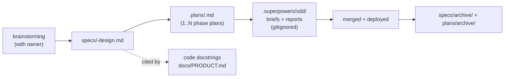

# Other — docs-superpowers

# Other — docs-superpowers

`docs/superpowers/` is not runtime code. It is Contentor's **feature-work archive**: the design specs and step-by-step implementation plans produced by the Superpowers workflow (brainstorming → writing-plans → subagent-driven-development). Every non-trivial feature that has landed in this repo since 2026-03 has a document here, and roughly 29 source files link back to one by path.

Treat it as two things at once:

1. **A build queue.** A plan at the top level of `plans/` is executable work — an agent or a human can open it and implement task-by-task with no other context.
2. **A decision record.** The paired spec explains *why* the design is what it is, including what was explicitly rejected. That rationale exists nowhere else in the repo.

---

## Layout

```
docs/superpowers/
├── specs/                    # 37 design docs — the "why" and "what"
│   └── archive/              # 37 specs for features shipped + deployed
└── plans/                    # 53 implementation plans — the "how", task-by-task
    └── archive/              # 52 plans for features shipped + deployed
```

Files are named `YYYY-MM-DD-<slug>.md` for plans and `YYYY-MM-DD-<slug>-design.md` for specs. The date is the day the document was written, not the day the work shipped.

**Top level vs. `archive/` is the only status signal that matters.** Top level = in progress, unmerged, undeployed, or living tooling reference. `archive/` = fully implemented and deployed to prod; historical only. Two documents sit at the top level permanently despite being shipped, because they document tooling that is still operated by hand: `2026-06-28-flowmap-service-design.md` and `2026-06-27-screenshot-map-design.md`.

---

## The two document types

### Spec (`specs/*-design.md`)

A spec is the output of a brainstorming session with the product owner. It captures a decision, not a task list. The shape is consistent:

```markdown
# Error Logging, Log Viewer & User Activity Tracking — Design

**Date:** 2026-07-19
**Status:** Approved (brainstorm w/ Taha), pending implementation plan
**Scope:** dev + prod

## Problem        — what is broken today, in concrete terms
## Goals          — numbered, each independently checkable
## Non-goals      — with the reason for exclusion, not just the exclusion
## Current state  — facts the design leans on (optional but common)
## Architecture   — usually an ASCII data-flow block
```

Two conventions carry most of the value:

- **`Status:` is prose, not an enum.** Real values range from `Approved design, pending implementation plan` (7 specs) through `Draft — pending owner review (see §2 for the veto list)` to a verbatim quote of the owner's direction: `Approved direction from product owner ("logos are repetitive, amateur, ugly — coaches should say Wow, and it shouldn't cost us much")`. When you write a spec, say what kind of approval you actually have.
- **Non-goals record rejections with their cost.** The error-logging spec doesn't just say "no Loki/Grafana" — it says Loki was rejected because it would cost ~300–400MB RAM on a box where every service is `mem_limit`-rationed, and adds "revisit only if volume grows ~100×". That is the reusable part. Follow it.

Specs describing an architecture that already shipped are the fastest way to understand a subsystem's constraints — but for *current* callers and behavior, trust `docs/wiki/` and the GitNexus MCP tools instead. A spec is a snapshot of intent at one date.

### Plan (`plans/*.md`)

A plan is an executable script for an agent that has zero prior context. 51 of the 53 top-level plans open with the same preamble:

```markdown
> **For agentic workers:** REQUIRED SUB-SKILL: Use superpowers:subagent-driven-development
> (recommended) or superpowers:executing-plans to implement this plan task-by-task.
> Steps use checkbox (`- [ ]`) syntax for tracking.

**Goal:** one paragraph — the user-visible outcome.
**Architecture:** one paragraph — where the code goes and why.
**Tech Stack:** the exact frameworks/versions in play.

## Global Constraints
## File structure
## Task 1: … / Task 2: … / … / Task N: Integration verification
## Self-review notes (addressed)
```

**`Global Constraints`** is the section that prevents the most rework. It records the things an agent would otherwise get wrong by assuming symmetry between the two frontends or between apps. Real examples from `2026-06-24-custom-domain-wizard-frontend.md`:

- `frontend-main` has no `Select`, `AlertDialog`, or `sonner` — use a native styled `<select>`, an inline two-button confirm, and inline status messaging, *not* toasts.
- The dashboard area is hardcoded English, not next-intl — do not add i18n keys.
- No frontend test runner exists in `frontend-main`, so task verification is `npx tsc --noEmit` clean plus a final browser smoke.
- Staging discipline: stage explicit paths only; never `git add -A`.

**Each task is self-contained and TDD-shaped.** The canonical task body:

```markdown
### Task 3: resolve_audience + counts

**Files:**
- Create: backend/apps/notifications/audience.py
- Test:   backend/apps/notifications/tests/test_audience.py

**Interfaces:**
- Consumes: apps.accounts.models.User, apps.core.access.ContentAccessService
- Produces: resolve_audience(filters: dict) -> QuerySet[User]
           audience_counts(filters: dict) -> dict

- [ ] Step 1: Write the failing test        (full test body, inline)
- [ ] Step 2: Run to verify it fails        (exact command + expected failure)
- [ ] Step 3: Implement                     (full implementation, inline)
- [ ] Step 4: Run tests to verify they pass (exact command + expected result)
- [ ] Step 5: Commit                        (exact git add + commit message)
```

The **`Interfaces: Consumes / Produces`** block is load-bearing, not decoration. It is the contract that lets tasks be handed to independent subagents: task 7 can be written against `audience_counts`'s signature before task 3 exists. Keep it exact — including whether a helper takes `schema_name`, and whether an API field is `filters` (serializer) or `filters_json` (model).

Steps 2 and 4 always name the **exact command and the expected output**, run inside the container (`docker compose exec django pytest apps/notifications/tests/test_audience.py -v`), never on the host. A step that says "run the tests" without the invocation is an incomplete step.

**Known-uncertain points are flagged inline rather than guessed.** Plans routinely include a parenthetical escape hatch: "(If `Bundle` import path differs, fix `_load_content` to match `apps/billing/models.py`; verify with `grep -n "class Bundle" backend/apps/billing/models.py`.)" or "(If `Button` lacks a `brand` variant in frontend-main, use `variant="default"`.)" These exist because the plan author was writing from memory of the codebase. Verify them; don't trust them.

**The last task is always verification, and it touches no files.** `2026-06-21-announcements-lab.md` Task 14 runs the full backend suite, `make lint`, `make migrate`, a frontend build, and then a four-point manual smoke through the real dev stack ("watch `make logs` celery-beat/worker and confirm status flips to sent"). This matches the repo rule in `CLAUDE.md`: after each implementation stage, run `make dev` and verify before claiming done.

**`Self-review notes (addressed)`** closes the loop between spec and plan: it asserts every spec section maps to a task, that enum values are identical across model / serializer / API / TypeScript types, and it lists the inline verification points by task number. Write this section last, as an audit of your own plan.

### The larger-plan variant

Not every plan is a task list. `2026-06-07-marketplace-and-feature-completeness.md` is a **phase plan** for a body of work too large to script: a numbered decision table (D1–D9, each with a confirmed/open status), five independently shippable phases A–E each as a checkbox list, an explicit "Out / deferred (named, not silently dropped)" section, and a risk-to-mitigation table. Its per-phase gate is the same one: `make migrate && make test && make dev`, verify, continue. Use this shape when the work spans weeks and the task-level detail would be stale before it's read.

---

## Lifecycle



One spec can fan out into several plans. `2026-07-13-onboarding-wizard-design.md` produced four phase plans (`onboarding-wizard-phase1` … `phase4`); the two 2026-07-26 onboarding specs (`ai-first-onboarding-design`, `onboarding-phase2-design`) produced the twelve `2026-07-26-*` plans. Conversely a few plans have no spec at all — `2026-07-12-loc-reduction-and-reuse.md`, `2026-07-17-vibe-coding-restructure.md`, `2026-06-07-marketplace-and-feature-completeness.md` — because they're refactors or audits rather than product decisions.

Slug pairing is a convention, not an invariant. `plans/2026-07-23-loading-states-and-micro-interactions.md` pairs with `specs/2026-07-23-loading-states-design.md`; `plans/2026-06-24-custom-domain-wizard-frontend.md` pairs with `specs/2026-06-23-custom-domain-onboarder-design.md`. Match by feature and adjacent date, not by string equality.

### Supersession

When a plan turns out to be wrong mid-execution, the fix is a new self-contained document that says so at the top, rather than a silent edit. `plans/archive/2026-07-05-onboarding-smoothing-handoff.md`:

> **THIS IS THE SINGLE SOURCE OF TRUTH for executing this feature.** It supersedes `2026-07-05-onboarding-smoothing.md` (draft plan; contains two known errors fixed here) and assumes the executor has ZERO prior context. Follow it top to bottom. Design rationale lives in `docs/superpowers/specs/2026-07-05-onboarding-smoothing-design.md`.

Both files stay in the archive. If you find two plans for one feature, look for this banner before reading either.

---

## Connections to the rest of the repo

| Where | Relationship |
|---|---|
| `.superpowers/` (gitignored, `.gitignore:54`) | Ephemeral SDD execution state — `sdd/briefs/`, `sdd/phase1-task-N-brief.md` + matching `-report.md`, `progress.md`, and per-review `*.diff` snapshots. A brief is one task lifted verbatim out of a plan for a single subagent. Never commit these; never treat them as documentation. |
| `docs/PRODUCT.md` | The living product plan, maintained via the `/po` skill. It cites specs by path for backlog items (e.g. line 72 links the AI-assistants-governance spec with an effort estimate) and cites `.superpowers/sdd/progress.md` for in-flight carry-overs. `/po` is the right entry point for "what's next"; this directory is the entry point for "how was that decided". |
| Source docstrings | ~29 files back-link to a spec or plan on the first lines of a module — `backend/apps/blog/curated.py:8` → the curated-photos spec, `backend/apps/core/ai.py:2` → the shared-AI-provider spec, `backend/apps/core/onboarding/content.py:10` → the wizard-content-apis plan. When you add a module that implements a design here, add the same one-line pointer. |
| `docs/wiki/` | GitNexus-generated per-area architecture pages, regenerated with `make wiki`. Complementary, not overlapping: the wiki describes current structure, superpowers docs describe intent and history. For exact callers and blast radius, use the GitNexus MCP tools over either. |
| `docs/REFERENCE.md`, `docs/GLOSSARY.md` | The stable comprehensive reference and canonical terminology. Specs frequently link to them ("Companion docs: `../../REFERENCE.md`, `../../GLOSSARY.md`") instead of restating domain definitions. |
| `../docs/plans/`, `../docs/specs/` | Platform-level planning that predates this directory. Historical, not maintained. |

---

## Contributing

**Adding a spec.** Come out of a brainstorming session, not out of your own head. Lead with `Date` / `Status` / `Scope`, state the problem with numbers where you have them, and write Non-goals with reasons. If the design leans on facts about the current codebase (test counts, import-graph shape, which UI primitives exist), put them in a `Current state` section so a future reader can tell which premises have expired.

**Adding a plan.** Every task must be independently executable by an agent with no conversation history: full file paths, full test bodies, full implementation bodies, exact commands, exact expected output, exact commit command. Fill in `Interfaces: Consumes / Produces` precisely — that block is what makes tasks parallelizable. Put anything you inferred rather than verified into an inline parenthetical with the `grep` that settles it. End with an integration-verification task and a self-review section.

**Do not create files here speculatively.** `CLAUDE.md` is explicit: never create new `.md` files unless asked. A plan exists because someone is about to execute it.

**Move to `archive/` only after prod deploy** — not after merge. Move the spec and its plans together.

**Reading an old plan.** The inline code blocks were accurate on the date in the filename and nowhere else. Import paths, component prop signatures, and settings names have moved since. Read the plan for the design and the sequencing; resolve every symbol against the current tree (GitNexus `context`/`impact`, or `grep`) before you copy a line of it.