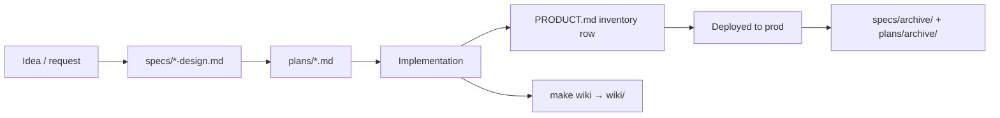

# Other — docs

# `docs/` — Project Documentation

The `docs/` tree is Contentor's written memory. It holds no executable code, but several files are actively *maintained by tooling* (`make wiki`, the `/po` skill) and one directory is fully generated. Treating everything in here as "just markdown you can edit" is the main way to break it.

This page describes what lives in `docs/`, which files are authoritative for what, which are generated, and the conventions for adding to or archiving from it.

---

## Layout

```
docs/
├── REFERENCE.md          # architecture + domain model — the single source of truth
├── GLOSSARY.md           # canonical terminology (coach/student/tenant/region/…)
├── PRODUCT.md            # living product plan — owned by the /po skill
├── LAUNCH.md             # go-to-market plan (positioning, channels, sequence)
├── AUDIT-FINDINGS.md     # security/correctness audit + 5-phase remediation tracker
├── AUDIT-LOC-REUSE.md    # duplication/LOC-reduction audit (companion to the above)
├── wiki/                 # GENERATED — 57 per-area architecture pages (GitNexus)
├── superpowers/
│   ├── specs/            # 37 active designs + specs/archive/ (37 shipped)
│   └── plans/            # 53 active plans  + plans/archive/ (52 shipped)
└── screenshot-map/
    └── index.html        # generated artifact (~3.8 MB, tracked — see §Known debt)
```

`CLAUDE.md` at the repo root is the operational counterpart: commands, rules, and pointers into this tree. It deliberately overlaps `REFERENCE.md` on architecture; see [Known debt](#known-debt).

---

## The four document classes

Every file in `docs/` falls into one of four classes, and the class determines who may edit it and how it stays true.

| Class | Files | Edited by | Truth mechanism |
|---|---|---|---|
| **Reference** | `REFERENCE.md`, `GLOSSARY.md` | humans, by hand | verified against code at each major revision; future-facing claims marked **(inferred)** |
| **Living plan** | `PRODUCT.md` | the `/po` skill (humans may edit freely) | `/po review` re-verifies every claim against git/prod and re-ranks; each pass appends an audit stamp |
| **Generated** | `wiki/*.md`, `screenshot-map/index.html` | tooling only | regenerated from source; hand edits are destroyed on the next run |
| **Historical** | `superpowers/specs/`, `superpowers/plans/` | append-only; archived when shipped | never updated after the feature lands — the archive *is* the record |

Mixing these up is the failure mode. Editing a `wiki/` page by hand loses the edit at the next `make wiki-sync`. Editing an archived plan rewrites history that other docs cite by slug.



---

## `REFERENCE.md` — the architecture source of truth

The longest and most load-bearing document (~42 KB). Read it before any substantial change. Its sections map to the system in the order you need them:

1. **What Contentor is** — the three roles (superadmin / coach / student) and the *two distinct subscription concepts*: `PlatformSubscription` (coach → platform, public schema, live) vs `Subscription`/`Payment` (student → coach, tenant schema, marketplace). This distinction is the single most common source of confusion in the codebase; the doc says so explicitly.
2. **Tech stack & topology** — the Caddy → {Django, nextjs-main, nextjs-customer} routing diagram and the service list from `docker-compose.yml`.
3. **Multi-tenancy & regions** — schema-per-tenant, the `global`/`tr` region split (`tr_` schema prefix, `(email, region)` user uniqueness), and the middleware chain that resolves a tenant: `RegionResolverMiddleware` → `HeaderAwareTenantMiddleware` → `DemoReadOnlyMiddleware` → … → `TenantRateLimitMiddleware`. The `X-Tenant-Domain` header rule and the `/api/webhooks/*` → forced-`public` exception are documented here.
4. **Domain model** — §4.1–4.16, one subsection per app, with every model tagged **[P]** (public schema) or **[T]** (tenant schema). This is the fastest way to answer "which schema does this table live in?"
5. Auth (JWT claims, cookie name `contentor_access_token`), billing, integrations, deploy, and a roadmap (§15).

**Convention:** anything about the future is marked **(inferred)** where it was read out of code/specs rather than decided. §16 collects the open questions. Preserve that marking when you edit — an unmarked claim reads as a confirmed decision.

## `GLOSSARY.md` — canonical vocabulary

Short, grouped by theme, **bold** marks the preferred term when two words compete. It exists because the codebase drifted: the code sometimes says "content creator" where the product now says **coach**. Use it to name things in code, commits, and copy.

The distinctions worth memorizing before writing anything user-facing:

- **Main app** (`frontend-main`) vs **coach app** (`frontend-customer`) — *both have an `/admin`*. The **superadmin panel** is inside the main app; the **coach admin** is inside the coach app. Never conflate them.
- **Platform plan** (`PlatformPlan`, coach-facing Free/Starter/Pro) vs **(coach) subscription plan** (`SubscriptionPlan`, a membership a coach sells to students).
- **Dual-access pricing** — `pricing_type` is only `free` or `paid`; subscription access is additive via `SubscriptionPlanAccess`, not a third pricing type.

## `PRODUCT.md` — the living product plan

Owned by the `/po` advisor skill (`.claude/skills/po/`). Structure:

1. **North star & launch-ready checklist** — currently "shortest path to the FIRST PAYING COACH"; checkboxes that `/po review` re-opens when evidence contradicts them.
2. **Feature inventory** — one row per feature with a status of `live-in-prod` / `built-unverified` / `built-not-deployed` / `partial` / `missing`, plus evidence. The `built-not-deployed` vs `live-in-prod` split matters because prod is deployed by rsync of the working tree, so "merged" and "live" routinely diverge.
3. **Backlog** — `Now` (ranked), `Next`, `Later`.
4. **Decision log** — append-only, dated. Never rewrite an entry; supersede it with a new one (see the 2026-07-08 "no AI in Logo Studio" entry and its 2026-07-09 partial reversal).
5. **Audit stamp** — newest first, each recording what was verified, what was corrected, and what was re-ranked.

Answer any "what's next / what is left" question from this file, and prefer running `/po next` over reading it cold — the stamps age.

## `LAUNCH.md` — go-to-market

The marketing-side companion to `PRODUCT.md`'s product gates: positioning (the "your school, your brand, your money — we're invisible" wedge), the landing-page truth-fix table, content to record, the founding-creator motion, channels, and instrumentation targets. Its §0 restates `PRODUCT.md`'s hard gates — deploy, live-money verify, rotate secrets — because driving traffic before those pass wastes first impressions.

Note the open discrepancy it flags: marketing copy follows the *seeded* transaction fees (8% / 6% from `seed_plans.py`) while the decision log says 5% / 4%. Reconcile in the plan records before touching copy.

## The audit pair

`AUDIT-FINDINGS.md` and `AUDIT-LOC-REUSE.md` were both generated 2026-07-12 and are cross-linked.

**`AUDIT-FINDINGS.md`** is security/correctness. Every finding carries a severity (🔴/🟠/🟡/⚪) and a confidence:

- `CONFIRMED` — an adversarial verifier re-read the code and found no mitigating guard.
- `PLAUSIBLE` — evidence holds, impact depends on unverified conditions.
- `UNVERIFIED` — finder-reported with file evidence; the verification pass was cut off by a rate limit. **Confirm before fixing.** ~55 findings sit here.
- `SWEEP` — architectural observation from the structural read, not an exploit claim.

Findings are grouped A–N (tenant isolation, access control, injection, billing, ops, DB perf, architecture, tooling, deps, dead code, API contract, frontend, testing, git hygiene), then re-grouped into a **remediation plan**: 14 branch-sized work units across phases P0–P4, each with a status marker `[ ]` / `[~]` / `[x]` / `[merged]`.

**This is a live tracker, not a snapshot.** When you finish remediation work, update the corresponding unit in place — say what landed, what is still open, and why. The existing entries model the expected level of detail (see P0-B, P1-A). Findings themselves are historical; don't delete them when fixed, mark the unit.

**`AUDIT-LOC-REUSE.md`** is the duplication/LOC map: where lines live per area, measured cross-frontend duplication (content-hashed for byte-identical files, `diff` line counts for near-duplicates), and a ranked execution order. Its explicit non-target is `components/ui/*` and the two `tailwind.config.ts` files — those diverged legitimately per brand, and unifying them would change behavior.

## `wiki/` — generated architecture pages

57 markdown pages mirrored from `.gitnexus/wiki/`, one per functional area (× location where an area spans backend and both frontends). Naming is `<area>[-<location>].md`:

```
billing-payments-backend-apps.md          core-platform-multi-tenancy-backend.md
billing-payments-frontend-customer-src.md admin-kit-framework.md
billing-payments-frontend-main-src.md     onboarding-wizard-site-ai-packages-shared.md
```

**Read the page(s) for a functional area before working in it.** They describe design intent, which is exactly what the code doesn't tell you.

Regeneration:

```bash
make wiki       # analyze → wiki → sync (incremental, spends LLM tokens)
make wiki-sync  # rsync -a --delete .gitnexus/wiki/ → docs/wiki/  (no regeneration)
```

`wiki-sync` uses `--delete`, so **any hand edit under `docs/wiki/` is destroyed**. Fix the source or the generator instead. Run `make wiki` after a major feature merges, not per commit.

Wiki pages describe intent and can lag the code. For exact current callers and blast radius, trust the GitNexus MCP tools (`impact`, `context`, `query`) over the prose.

## `superpowers/` — specs and plans

The feature-work record, split by document type:

- **`specs/*-design.md`** — the design for a piece of work: problem, chosen approach, phases.
- **`plans/*.md`** — the executable implementation plan derived from a spec, usually sharing its date-slug (`2026-07-09-shared-ai-provider-design.md` ↔ `2026-07-09-shared-ai-provider.md`).

Both use a `YYYY-MM-DD-<slug>` filename convention, which is what makes spec↔plan pairing and archive-matching mechanical.

**Archiving rule (from `CLAUDE.md`):** the top level holds work that is *in progress, unmerged, or undeployed*, plus a few living tooling references (`screenshot-map`, `flowmap-service`). Once a feature is fully implemented **and deployed to prod**, its spec and plan move to `specs/archive/` and `plans/archive/`. Current split: 37 active / 37 archived specs, 53 active / 52 archived plans.

Note that "deployed" is the bar, not "merged" — `PRODUCT.md` regularly shows tens of merged-but-undeployed commits, and those specs stay at the top level. Archiving early makes the active surface lie about what's live.

`AUDIT-LOC-REUSE.md` §1 identifies the remaining backlog here: ~19.5k lines of plans whose specs are already archived (i.e. confirmed shipped) that have never been archived themselves.

---

## How `docs/` connects to the rest of the repo

| From | To | Mechanism |
|---|---|---|
| `Makefile` | `docs/wiki/` | `make wiki` / `make wiki-sync` write it via rsync from `.gitnexus/` |
| `/po` skill | `docs/PRODUCT.md` | reads, re-verifies against git + prod health endpoints, rewrites and stamps |
| `CLAUDE.md` | all of `docs/` | the index — points at wiki pages, PRODUCT, REFERENCE, GLOSSARY, superpowers |
| `docs/superpowers/plans/` | `.superpowers/sdd/progress.md` | the session ledger tracks plan execution state |
| `docs/AUDIT-FINDINGS.md` | branch work | the P0–P4 units are the intended branch boundaries |

Nothing in `docs/` is imported by application code, and no build step reads it. Its only automated consumers are the tooling above.

---

## Conventions when contributing

1. **Never create new `.md` files unless explicitly asked** (repo rule in `CLAUDE.md`). Extend an existing document instead — most new content belongs in `PRODUCT.md`'s inventory/backlog or as a spec+plan pair under `superpowers/`.
2. **Don't hand-edit `docs/wiki/`.** It is rsync-with-`--delete` output.
3. **Cite `path:line` for code claims.** Both audits do this throughout; it is what makes them re-verifiable a month later.
4. **Append to the decision log; never rewrite it.** Supersede with a new dated entry.
5. **Convert relative dates to absolute.** "Last week" is unreadable in a doc that gets re-read in three months.
6. **Mark unverified claims.** Use the audit confidence vocabulary (`CONFIRMED`/`PLAUSIBLE`/`UNVERIFIED`/`SWEEP`) or `REFERENCE.md`'s **(inferred)** tag rather than stating an inference as fact.
7. **Update status in place, don't delete findings.** A fixed finding with a `[x]` remediation note is more useful than a missing one.

---

## Known debt

Carried by the audits and worth knowing before you add to this tree:

- **Roadmap is duplicated** between `REFERENCE.md` §15 and `PRODUCT.md`, and `CLAUDE.md`'s architecture section overlaps `REFERENCE.md`. Both pairs have already drifted (`REFERENCE.md` §15 is stale on admin-managed plan pricing, which shipped). Pick one home when you touch either.
- **`docs/screenshot-map/index.html` is a 3.8 MB tracked generated artifact** — the largest tracked file in the repo by ~10×. Un-track and regenerate is the standing recommendation (`AUDIT-LOC-REUSE.md` §5, `AUDIT-FINDINGS.md` P4-A).
- **`docs/` is 83,872 markdown lines**, 87% of it in `superpowers/plans/`. Archiving shipped plans is the single largest documentation cleanup available and carries zero functional risk.
- **Doc drift is real and recurring** — e.g. `CLAUDE.md` claimed "17 e2e specs" against 23 at audit time (26 today). Prefer regenerating a count over restating one.
