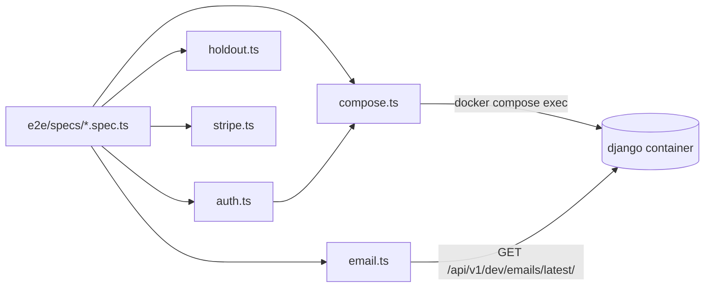
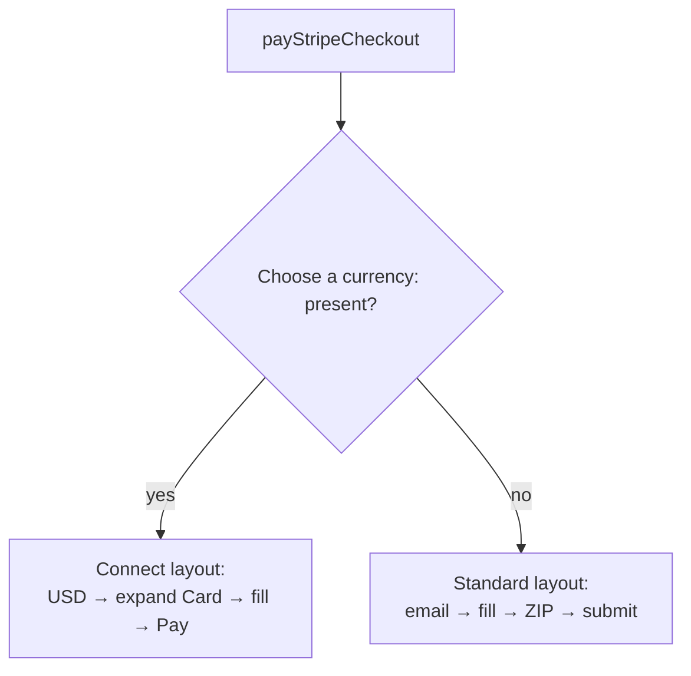

# Other — e2e-helpers

# e2e/helpers — Shared Playwright Test Utilities

Five small, dependency-light modules that every Playwright spec in `e2e/specs/` leans on. They exist because the same four problems recur in every spec: *get an authenticated browser*, *reach into Django*, *read an email the app just sent*, *pin a nondeterministic A/B bucket*, and *pay a Stripe Checkout page*. Each helper solves exactly one of those and nothing else.

None of them import each other except `auth.ts → compose.ts`. There is no shared fixture file, no global setup, no page-object layer — specs import the functions they need directly.

## Module map

| File | Exports | Job |
|---|---|---|
| `compose.ts` | `manage`, `REPO_ROOT` | Run `manage.py` inside the running `django` container |
| `auth.ts` | `coachContext`, `studentContext`, `superadminContext`, `MAIN`, `TENANT`, `TENANT_HOST` | Pre-authenticated `BrowserContext` per role |
| `email.ts` | `latestEmail`, `firstLink` | Read the dev email sink; extract the first link |
| `holdout.ts` | `wizardBucket`, `bucketedEmail` | Deterministic wizard A/B bucket selection |
| `stripe.ts` | `payStripeCheckout` | Drive a Stripe-hosted Checkout page to payment |



---

## `compose.ts` — the escape hatch into Django

```ts
export function manage(args: string[]): string
```

Synchronously runs `docker compose exec -T django python manage.py <args>` from `REPO_ROOT` (resolved two levels up from `__dirname`, so it works regardless of Playwright's cwd) and returns trimmed stdout. On failure it rethrows with `stderr`/`stdout`/`message` folded into the message — without that, `execFileSync` gives you an exit code and nothing usable.

It is deliberately synchronous: it's called from `beforeAll`/`beforeEach` bodies and from `auth.ts`'s token cache, where blocking is fine and `await` plumbing isn't worth it.

`manage` is the widest-used helper in the suite. Specs use it to seed and tear down state that has no UI path — `setupPaidTenant` / `cleanupPaidTenant` in `16-site-assistant` and `22-assistant-takeover`, `seedTakeoverConversation` and `seedHelpBotConversation` in `22-assistant-takeover`, `studentEmail` in `15-community`, plus one-off calls in `19-wizard-recovery` and `26-content-first-wizard`.

Two consequences worth knowing before you add a call:

- **The dev stack must be up.** No stack, no `manage` — the error surfaces as a Docker failure, not a test assertion.
- **It targets the container's checkout, not yours.** If you're running specs from a git worktree, the container is serving the main checkout unless you've pinned `COMPOSE_PROJECT_NAME` and run compose from the worktree. A management command you just wrote won't exist there.

When you need new seed behaviour, add or extend a management command in `backend/` rather than piling `shell -c` one-liners into specs — the commands are reusable and lintable, string-embedded Python is neither.

---

## `auth.ts` — pre-authenticated browser contexts

The suite never logs in through the UI (except in specs that are *about* login). Instead it mints a JWT out-of-band and injects it as the `contentor_access_token` cookie.

```ts
coachContext(browser)       // role=coach,      demo-yoga.localhost, tenant demo-yoga
studentContext(browser)     // role=student,    demo-yoga.localhost, tenant demo-yoga
superadminContext(browser)  // role=superadmin, localhost (no tenant)
```

All three are thin wrappers over `roleContext(browser, role, host, tenant?)`, which:

1. calls `issueToken(role, tenant)` → `manage(["issue_login_token", "--role", role, "--tenant", tenant])`,
2. opens a `newContext` at a fixed 1440×900 viewport,
3. adds the cookie built by `cookie(jwt, domain)`.

The cookie mirrors what the app sets in dev: `httpOnly: true`, `secure: false`, `sameSite: "Lax"`, `path: "/"`. `secure: false` is what makes it work over plain `http://` — don't "fix" it.

### The token cache

`issueToken` memoizes in a module-level `Map` keyed `${role}:${tenant ?? ""}`. Each `manage` call boots a full Django process (~2s), and the issued JWTs are valid for days, so a spec file that opens ten coach contexts pays the 2s once. The cache lives for the lifetime of the Node process — Playwright workers are separate processes, so expect one mint per (role, tenant) *per worker*.

If you add a fourth role, add a wrapper next to the existing three rather than exporting `roleContext`; the wrappers are where the host/tenant pairing is documented.

### Host constants

`MAIN` (`http://localhost`) is the marketing app; `TENANT` / `TENANT_HOST` (`demo-yoga.localhost`) is the seeded dev tenant that Caddy's catch-all routes to `nextjs-customer`. `demo-yoga` comes from `make seed` — specs assume it exists.

Consumers: `15-logo-studio`, `16-site-assistant`, `17-logo-curated-library`, `20-stripe-platform`, `21-stripe-marketplace`, `22-assistant-takeover`, `28-admin-site-ai`, `90-logo-eval` (coach); `18-curated-library-admin`, `22-assistant-takeover`, `24-admin-logs` (superadmin).

---

## `email.ts` — reading what the app sent

```ts
await latestEmail(to)  // → { subject, html }
firstLink(html)        // → first href, HTML-unescaped
```

`latestEmail` polls `GET http://localhost/api/v1/dev/emails/latest/?to=<to>` every 500ms for up to 15s. The status handling encodes the two distinct failure modes:

- **5xx → throw immediately** with a hint that `EMAIL_SINK_ENABLED` may be off. Retrying a misconfigured stack for 15s just delays a confusing failure.
- **4xx (no mail yet) → keep polling.** The sink 404s until Celery has delivered; that's the normal race.
- **Timeout → throw** `no sink email for <to> within 15s`.

`firstLink` regex-matches the first `href="..."` and un-escapes `&amp;` → `&`, which matters because verification links carry query params (`?token=...&next=...`) that arrive HTML-escaped and would otherwise be a broken URL.

The pair is how signup specs cross the email boundary: `signupThroughVerify` in `01-signup-onboarding`, `19-wizard-recovery`, and `26-content-first-wizard` all do "submit signup → `latestEmail` → `firstLink` → `page.goto`". `23-wizard-ai-logo` uses `firstLink` on mail it fetched itself.

This depends on `EMAIL_SINK_ENABLED=true` in the dev `.env`. Prod settings refuse the flag, so the endpoint only ever exists locally.

---

## `holdout.ts` — making the A/B wizard deterministic

The onboarding wizard assigns each new signup to `control` or `treatment`. The assignment is a pure function of the signup email and region — there is no override header, no query param, no cookie. A spec that signs up with a random email lands in a coin-flip flow and is flaky by construction.

`wizardBucket` is a line-for-line mirror of `backend/apps/core/onboarding/experiments.py::assign_wizard_bucket`:

```ts
sha256(`${email}:${region}`).at(-1) & 1 ? "treatment" : "control"
```

`bucketedEmail(prefix, want, region?)` walks `${prefix}0@example.com`, `${prefix}1@example.com`, … until one hashes into `want`. Roughly half of candidates match, so it returns in a couple of iterations; it gives up at 100 and throws.

Used by `23-wizard-ai-logo` and `26-content-first-wizard`.

**This file is a mirror, and mirrors rot.** If you change the bucketing function, region default, or hash input format on the backend, change it here in the same commit — otherwise the specs silently start exercising the wrong flow and only *look* like they pass.

---

## `stripe.ts` — paying a hosted Checkout page

```ts
await payStripeCheckout(page)
```

One function, entered when the page has already navigated to Stripe. It asserts the URL matches `checkout.stripe.com|accessible.stripe.com`, then branches on which of Stripe's two Checkout layouts it landed on and fills the universal test card `4242 4242 4242 4242` with expiry `12/34`, CVC `123`.

Every field is typed with `pressSequentially({ delay: 50 })` rather than `fill()`. Stripe's inputs are formatter-driven and drop programmatically-set values; sequential keypresses land.

### Layout detection

Detection is by the presence of a **"Choose a currency:"** text node, waited on for up to 10s, absence meaning the standard layout. This signal is load-bearing and non-obvious: `hosted-payment-submit-button` exists on *both* layouts and can't discriminate, and the previously-used `data-testid="card-accordion-item"` isn't in the real DOM at all.



### Standard — `checkout.stripe.com`

Platform subscriptions, single payment method. Waits for `getByTestId("hosted-payment-submit-button")` to confirm render, then fills card/expiry/CVC and *conditionally* fills email, cardholder name, and postal code — each guarded by an `isVisible()` check, because Stripe omits fields it already knows (a known customer has no email field). Submits via the testid button.

### Connect / Adaptive Pricing — `accessible.stripe.com`

Marketplace checkouts, multi-PM. Three extra obstacles:

1. **Currency selector.** EU is preselected and the EU button is disabled; the enabled one shows a price like `$9.99`. The locator matches enabled `button[type="button"]` containing `/\$\d/` — the `EU`/`US` labels are `` text and invisible to text matching. It also asserts the `role=group` named `/choose a currency/i` is attached first, to avoid strict-mode collisions with billing-address fieldsets. Clicking is best-effort: if no enabled USD button is found, the flow continues.

2. **Card accordion overlay.** `data-testid="card-accordion-item-button"` sits over the header row and swallows pointer events, so Playwright's `.click()` on the radio beneath retries forever; the button itself can be 0×0 while collapsed. The workaround is `page.evaluate` dispatching a real `mousedown`/`mouseup`/`click` sequence on the button — React's synthetic event system picks up bubbled native events and expands the accordion. Coordinates come from the enclosing `.AccordionItemCover`, falling back to viewport-center when the rect is 0×0. Missing testid throws with an explicit "Stripe may have changed their checkout DOM" message.

3. **Where the inputs live.** The header comment says the card form is inside an iframe; the implemented Step 3 comment and code say otherwise — after the Card radio is selected, Stripe renders plain `<input>`s inline in `AccordionItemContent`, and the code fills them directly via `getByPlaceholder`. Trust the code. Submit is the page-level `getByRole("button", { name: /^Pay$/ })` — this layout has no submit testid.

Both branches use fixed `waitForTimeout(2_000)` pauses after the currency click and accordion expansion. They're crude but load-bearing: there's no stable settled-state signal in Stripe's re-rendering PM list.

Consumers: `20-stripe-platform`. `21-stripe-marketplace` imports `coachContext` and drives its own Connect flow. Both specs auto-skip without `STRIPE_E2E`, and need `sk_test_*` keys plus `make stripe-listen` running in another shell.

The `console.log("[stripe helper] …")` lines are intentional — when a Stripe DOM change breaks this, the trace tells you which branch ran and which locator came up empty.

---

## Contributing notes

- **Prerequisites for anything here:** dev stack up (`make dev`) and seeded (`make seed`). `manage` and `auth` need the `django` container; `email` needs `EMAIL_SINK_ENABLED=true`; `stripe` needs test-mode keys and the webhook forwarder.
- **Keep helpers stack-shaped, not spec-shaped.** Per-spec seeding (`setupPaidTenant`, `seedTakeoverConversation`, `signupThroughVerify`) lives in the spec files that use it, built on `manage`/`email`. A helper earns promotion here when three or more specs need it.
- **`holdout.ts` and the standard-vs-Connect branch in `stripe.ts` are mirrors of external behaviour.** Backend bucketing changes and Stripe DOM changes both break silently-ish; the assertions and error messages in these files are the early warning.
- **Register new specs in `e2e/impact-map.json`.** `make lint` fails on a spec file with no map entry, and `make e2e-changed` uses the map to select specs from the diff.