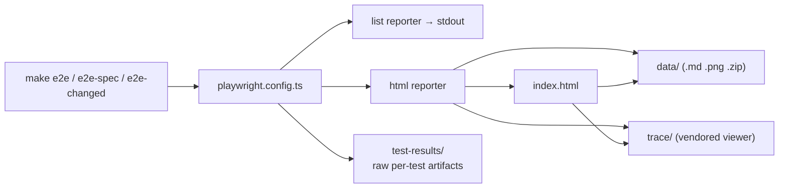

# Other — e2e-playwright-report

# `e2e/playwright-report/` — Playwright HTML report

## What this is

Generated output, not source. `e2e/playwright.config.ts` declares two reporters:

```ts
reporter: [["list"], ["html", { open: "never" }]],
```

The `html` reporter writes this directory on every `make e2e` run, overwriting it wholesale. It is gitignored (`e2e/.gitignore:3`, alongside `test-results/`) and the current snapshot on disk is ~27 MB from a run on 2026-07-27.

**Do not edit anything here, and do not treat it as documentation of current behaviour.** It is a frozen artifact of one local run. To refresh it, re-run the suite; to delete it, `rm -rf e2e/playwright-report`.

The reason it is worth documenting at all is that one part of it — the `.md` failure-context attachments in `data/` — is the cheapest, highest-signal way to read a Playwright failure, and it is readable directly with `Read` without a browser or a running dev stack.

## Layout

```
e2e/playwright-report/
├── index.html      532 KB — self-contained report SPA (HTML + inlined JS + base64 test data)
├── data/            25 MB — content-addressed attachments (SHA1-named)
└── trace/          1.4 MB — vendored Trace Viewer app (loaded by index.html to open .zip traces)
```

### `index.html`

The whole report in one file: the React app plus the serialized test tree (suites, tests, steps, timings, attachment references). Attachments are *not* inlined — they are fetched from `data/` by hash, which is why the report only works when served from this directory. Open it with:

```bash
cd e2e && npx playwright show-report
```

### `data/` — content-addressed attachments

Filenames are the SHA1 of the file contents, so identical attachments across tests dedupe to one file. Three kinds are present in the current snapshot:

| Ext | Count | What it is | Produced by |
|---|---|---|---|
| `.md` | 3 | `_error-context` — AI-oriented failure summary | Playwright, automatically on failure |
| `.png` | 3 | Failure screenshot | `use.screenshot: "only-on-failure"` |
| `.zip` | 3 | Full trace (DOM snapshots, network, console, actions) | `use.trace: "retain-on-failure"` |

The zips dominate the size (13 MB / 8.4 MB / 4.5 MB). Open one without going through the HTML report:

```bash
cd e2e && npx playwright show-trace playwright-report/data/<hash>.zip
```

Because names are content hashes, there is no way to map a file to a test from the filename alone. Either open `index.html` and click through, or — for the `.md` files — just read them: each one names its own test in a `# Test info` block.

### `trace/`

Playwright's own Trace Viewer, vendored as a built static app (`index.DMMX1gXU.js`, `uiMode.Ut8wwJNp.js`, `snapshot.v8KI4P3m.js`, `sw.bundle.js`, plus CodeMirror and xterm chunks under `assets/`). Third-party minified bundles shipped by `@playwright/test`. Nothing in here is ours and nothing in here is patchable — a Playwright upgrade replaces the whole tree with new content-hashed filenames.

> **Warning about call-graph tooling on this directory.** Static analysis over `trace/` produces garbage. The symbols it reports (`mt`, `Le`, `dispatch`, `_onTestEnd`, `_onProject`) are one- and two-letter minified identifiers from Playwright's bundles, and edges it draws between them and `frontend-customer/public/sw.js` are name collisions on those short identifiers, not real calls — the report app and the customer app's service worker never interact. Exclude `e2e/playwright-report/` when running GitNexus/tokensave analysis or generating wiki pages, and ignore any flow it claims to have found in here.

## The `_error-context` markdown format

This is the part worth knowing. On each failure Playwright writes a markdown attachment with four sections:

1. **`# Instructions`** — a fixed prompt aimed at an LLM ("Following Playwright test failed. Explain why, be concise…"). Playwright emits this verbatim; it is not repo-authored.
2. **`# Test info`** — test title and `file:line` of the test declaration.
3. **`# Error details`** — the timeout/assertion text, the failing locator, and the expect call log.
4. **A YAML accessibility snapshot** — the page's accessible tree at the moment of failure. This is the single most useful block: it shows what *was* on screen instead of what the locator wanted, including `[disabled]` states.
5. **`# Test source`** — the spec file with the failing line marked `>`.

Reading one of these usually replaces opening the trace.

## Reading the failures currently captured

All three `.md` files come from `specs/01-signup-onboarding.spec.ts` and record two distinct failures. Worth walking through, because they illustrate what each section buys you.

**Failure A — provisioning never finished** (`26220b4d…md` and `ae5db27e…md`)

Both are the `"finish-the-rest-for-me fast path provisions"` test; two files rather than one because `retries: 1` in the config ran it twice, and the attachments hash differently since each run stamps a different tenant slug (`e2e-studio-1785155281277b` vs `e2e-studio-1785154334714b`). The retry's raw artifacts also show up as a separate `test-results/…-retry1` directory.

Both fail at `waitForReady()`, `specs/01-signup-onboarding.spec.ts:46`:

```
Locator: getByText('Your platform is ready')
Timeout: 120000ms — element(s) not found
```

The accessibility snapshot shows the page still at `heading "Crafting your platform"` with `status: Loading` and `text: Creating`. So the wizard submitted, the provisioning screen rendered (line 45 passed), and the tenant simply never came up inside 120 s. That points at the backend provisioning task, not the frontend — Celery worker state, task registration, or a stuck migration for the new schema.

**Failure B — the wizard stalled mid-chapter** (`dee790aa…md`)

The `"coach walks the full wizard and the tenant provisions"` test, failing inside `pickCard()` at line 40 waiting for `heading "About page"`. The snapshot is the payoff:

```yaml
- heading "Home page" [level=2]
- button "Spotlight Recommended" [disabled]
- button "Storyteller" [disabled]
- button "Full tour" [disabled]
```

Still on the *Home page* step, with all three cards disabled — i.e. the step's `PATCH /api/v1/onboarding/wizard/state/` was in flight (or never resolved) and the wizard never advanced. That is exactly the save-then-advance window the spec's own long comment above `pickCard` describes, and which the sibling test `"auto-advance cards disable while a pick is saving"` deliberately exercises by stalling the PATCH by 1.5 s via `page.route`.

These artifacts predate `62196335 fix(onboarding): close wizard provision double-enqueue race` (2026-08-03) by about a week. Do not read them as current status — re-run `make e2e-spec SPEC=01-signup-onboarding` to find out where things actually stand.

## How it fits the e2e setup



- **`e2e/playwright.config.ts`** is the only thing that controls what lands here. `screenshot: "only-on-failure"` and `trace: "retain-on-failure"` mean a fully green run produces a report with no `data/` attachments at all. `retries: 1` means every failure can produce two sets.
- **`e2e/test-results/`** holds the same artifacts in human-readable per-test directories (`01-signup-onboarding-coach-6e69d-d-and-the-tenant-provisions/`). When you need to find *this test's* trace, look there rather than hash-hunting in `data/`.
- **`workers: 1` / `fullyParallel: false`** — specs share tenant state, so the report is always a strictly serial timeline. A failure early in a spec commonly cascades into later ones; check ordering before assuming independent bugs.
- Suite composition (31 files in `e2e/specs/`, Stripe specs gated on `STRIPE_E2E`, selective runs via `e2e/impact-map.json`) is documented in `CLAUDE.md`; this directory just reflects whichever subset ran.

## Practical guidance

- **Triaging a failure:** read the `.md` attachments first (`Read` on `e2e/playwright-report/data/*.md`). Go to the trace zip only when you need network timing or step-by-step DOM snapshots.
- **Before believing a failure is a code bug:** check `reference-e2e-502-flakiness` and `reference-dev-stack-staleness-traps` in memory — blank-page and hang failures here are frequently transient `nextjs-customer` 502s or stale Celery task registration, both of which look identical to a real regression in this report.
- **Never commit this directory.** It is gitignored, but 27 MB of binary trace zips is worth not un-ignoring by accident.
- **Exclude it from code intelligence and wiki generation.** See the warning above — indexing it pollutes the graph with thousands of minified vendor symbols and fabricated cross-app edges.
