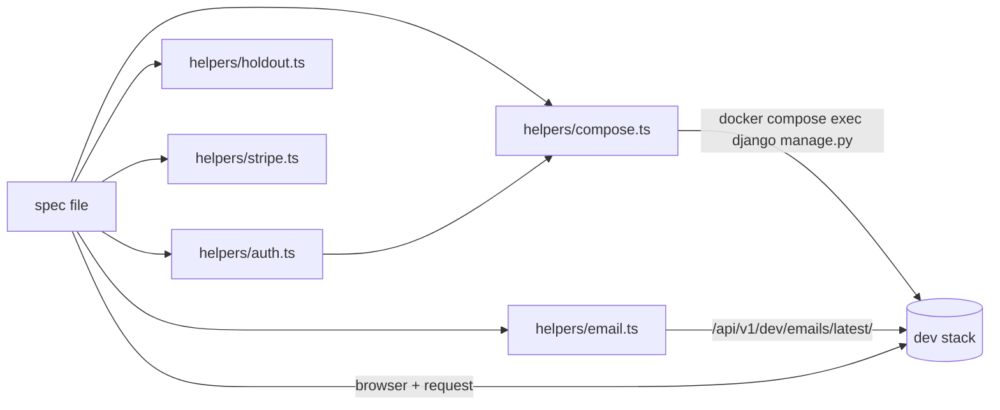

# Other — e2e-specs

# `e2e/specs` — Playwright end‑to‑end suite

The `e2e/` package is a standalone Playwright project (its own `package.json`, `tsconfig.json`, `node_modules`) that drives the **running dev stack** — Caddy, Django, both Next.js apps, Celery, Postgres, Redis, MinIO — through a real Chromium browser. It is the only test layer in the repo that exercises multi-tenancy, tenant routing, Celery fan-out, presigned object storage, Stripe redirects and SSE streaming together.

These are not hermetic tests. They talk to `http://localhost` (marketing/apex) and `http://demo-yoga.localhost` (a seeded tenant), mutate shared tenant state, and shell into the `django` container to seed and clean fixtures. Everything about the suite's design follows from that: serial execution, self-healing setup, unique-stamped data, and restore-in-`finally`.

## Running

```bash
make e2e                        # full suite; Stripe/bypass/eval specs auto-skip
make e2e-stripe                 # + the two real Stripe test-mode specs (STRIPE_E2E=1)
make e2e-spec SPEC=04-live-class  # one spec by filename substring
make e2e-changed                # only specs the current diff can affect
```

Each target runs `npm install --silent && npx playwright install chromium` first, so a clean checkout works without a separate bootstrap step.

Preconditions the suite assumes (and mostly enforces itself):

| Requirement | Enforced by |
|---|---|
| Dev stack up (`make dev`) | `global-setup.ts` — health probe, fails with "start it with `make dev` first" |
| `demo-yoga` tenant seeded | `global-setup.ts` — probes `/api/v1/admin/config/` with `X-Tenant-Domain`, seeds only if missing (`E2E_SEED=1` forces a re-seed) |
| `EMAIL_SINK_ENABLED=true` | `helpers/email.ts` — throws a pointed error if `/api/v1/dev/emails/latest/` 5xx's |
| `LIVE_FAKE_ENABLED=true` | `04-live-class` probes the token response and `test.skip()`s if the real GetStream key comes back |
| Real Stripe test keys + `stripe listen` | `20`/`21` gate on `STRIPE_E2E` |

### Env gates

| Variable | Effect |
|---|---|
| `STRIPE_E2E=1` | Enables `20-stripe-platform`, `21-stripe-marketplace` |
| `E2E_BILLING_BYPASS=1` | Enables `23-wizard-ai-logo` (needs `BILLING_BYPASS_ENABLED=true` in `.env`) |
| `LOGO_EVAL=1` | Enables `90-logo-eval`, the manual AI contact-sheet eval |
| `E2E_SEED=1` | Forces `seed_plans` + `seed_dev_tenants` even when demo-yoga is already reachable |

## Runner configuration

`playwright.config.ts` is deliberately conservative:

```ts
timeout: 60_000, expect: { timeout: 10_000 },
fullyParallel: false, workers: 1, retries: 1,
use: { baseURL: "http://localhost", screenshot: "only-on-failure", trace: "retain-on-failure" }
```

`workers: 1` is load-bearing, not caution: specs create courses, flip `demo-yoga`'s platform plan, ban community members and delete mailbox rows. Nothing here is safe to run concurrently against the same tenant. Long flows override the file default with `test.setTimeout()` (the wizard specs go to 300 s; assistant specs to 150–180 s).

`retries: 1` combines with the self-healing `beforeAll` hooks described below — a retry must be able to start from whatever state the failed attempt left behind.

## Helpers



### `helpers/auth.ts` — identity

Exports the three origins (`MAIN`, `TENANT_HOST`, `TENANT`) and three context factories: `coachContext(browser)`, `studentContext(browser)`, `superadminContext(browser)`.

There is no login UI in the happy path. `issueToken()` shells `manage.py issue_login_token --role <role> [--tenant <slug>]` and plants the resulting JWT as the httpOnly `contentor_access_token` cookie on the right host, in a 1440×900 context. Because each `manage.py` boot costs ~2 s and the JWTs live for days, tokens are memoised in a module-level `tokenCache` keyed by `role:tenant` — one boot per role per run.

Consequence worth knowing: `ctx.request` on a role context carries the same cookie, so specs freely mix API calls and UI assertions in one identity (`02-courses` creates via `POST /api/v1/courses/` then asserts the admin list renders it).

### `helpers/compose.ts` — the Django escape hatch

```ts
manage(args: string[]): string   // docker compose exec -T django python manage.py <args>
export const REPO_ROOT
```

`manage()` is the suite's fixture primitive. Most non-trivial specs pass `["shell", "-c", <python source>]` to set up or tear down rows the HTTP API can't reach: `01`/`19`/`26` sweep leftover `e2e-*` tenants, `16`/`22` promote `demo-yoga` to a paid `PlatformSubscription` and seed `AiConversation` fixtures, `15-community` resolves the seeded student's email, `18` deletes a stranded `CuratedLogo`. Errors are re-thrown with stderr attached, so a broken shell snippet surfaces as a readable message rather than an opaque non-zero exit.

**The raw-SQL rule.** `PlatformSubscription` rows must be deleted with `connection.cursor().execute("DELETE FROM core_platformsubscription …")`, never `.delete()`. `Payment.platform_subscription` is a cross-schema FK (`db_constraint=False`), so Django's cascade collector reaches for the tenant-only `billing_payment` table from a public-schema shell and dies with *relation does not exist* — regardless of delete order. Specs `01`, `16`, `19`, `20`, `21`, `22`, `26` all encode this workaround; copy it rather than rediscovering it.

### `helpers/email.ts` — the dev sink

`latestEmail(to)` polls `GET /api/v1/dev/emails/latest/?to=` for up to 15 s; `firstLink(html)` pulls the first `href` and un-escapes `&amp;`. This is how signup verification links (`01`, `19`, `23`, `26`), the 6-digit login code (`11`), mailbox outbound mail (`07`) and the "asked to talk to a human" notification (`22`) are read back.

### `helpers/holdout.ts` — pinning the A/B bucket

`wizardBucket(email, region)` is a line-for-line mirror of `backend/apps/core/onboarding/experiments.py::assign_wizard_bucket` — SHA-256 of `${email}:${region}`, low bit of the last byte. `bucketedEmail(prefix, want)` walks `<prefix><n>@example.com` until it lands in the wanted bucket.

There is no wire-level bucket override by design (that would be a production surface), so **any wizard spec must mint its signup email through `bucketedEmail`** or it coin-flips between the classic and content-first flows and is flaky by construction. `01`, `19`, `23` pin `"control"`; `26` pins `"treatment"`.

### `helpers/stripe.ts` — hosted checkout

`payStripeCheckout(page)` fills the 4242 test card. It handles two DOM layouts and detects them by the presence of a "Choose a currency:" group: standard `checkout.stripe.com` (plain inputs, `data-testid="hosted-payment-submit-button"`) versus `accessible.stripe.com` used by Connect/Adaptive Pricing (currency selector, payment-method accordion, `Pay` button). The Connect path dispatches a synthetic `mousedown/mouseup/click` sequence at `[data-testid="card-accordion-item-button"]` because an overlay intercepts Playwright's pointer events, and types card digits with `pressSequentially` — Stripe's inputs ignore `fill()`.

### `fixtures/pixel.png`

The single upload fixture, used by `02` (course thumbnail), `05` (MinIO round-trip) and `12` (download file). `18` instead uses a real PNG from `frontend-customer/public/logos/`.

## Spec inventory

Numbered roughly in feature order; the number is also the key used in `impact-map.json`. Note there are two `15-*` files.

| Spec | Covers | Notable gate / mechanism |
|---|---|---|
| `00-smoke` | health endpoint; coach and student JWTs reach `/admin` and `/dashboard` | always runs first in a selected set |
| `01-signup-onboarding` | full wizard walk → tenant provisions; auto-advance cards disable while saving; "finish the rest for me" fast path | sweeps `e2e-studio-*` tenants in `beforeAll` |
| `02-courses` | course create (API + one-submit UI with thumbnail/module/lesson); nested atomic create; student detail + learn page | creates via API where a Radix switch is unclickable headless |
| `03-calendar` | calendar API non-empty; `/calendar` renders; view toggle writes `?view=`; event detail `<h1>` | prefers a `live_stream` event (unique pk namespace) |
| `04-live-class` | create → start → student fake token → `/live/[id]` renders | skips unless `api_key === "fake-local"` |
| `05-media` | presign → PUT to MinIO → complete → photo detail → presigned GET byte-length match | asserts `upload_url` points at `localhost:9000` |
| `06-announcements` | coach composes → Celery fan-out → student feed API poll → bell dropdown | 20 s poll loop on `/notifications/feed/` |
| `07-mailbox` | inbox renders; settings section; compose → conversation → email sink | inbound webhook test is `test.skip`ped (needs `MAILBOX_INBOUND_SECRET` + a real `CustomDomain`) |
| `08-pwa` | manifest validity; SW registration, with a dev-mode fallback asserting `sw.js` / `offline.html` are served | tolerates `@serwist/next` disabling SW in dev |
| `09-builder` | brand-name edit in the Edit-site sidebar → autosave PATCH → public header | restores the original brand in `finally` |
| `10-impersonation` | coach "Log in as" → `/impersonate` token redemption → banner → Exit back to `/admin` | same-tab throughout; accepts a `window.confirm` |
| `11-login-code` | emailed 6-digit code login (the PWA path), wrong code then right code | boots its own `e2e-code` tenant; clears magic-link throttle keys in Redis |
| `12-downloads` | paid download with price + in-place tag created in a single submit | UI drives, API confirms persisted values |
| `13-events-page` | `/events` against the +90 d calendar window; cross-links to and from `/calendar` | branches on whether upcoming events exist |
| `14-navbar-layouts` | navbar layout preset → `header[data-nav-layout]`; brand-name toggle and logo-size XL next to a saved logo | whole-object PATCH restore of `navbar_config` in `finally` |
| `15-community` | enable → join → post → pin → report → remove → ban → unban | unbans all banned members in `beforeAll`; house Tabs/Switch are plain buttons with `aria-checked`, not Radix |
| `15-logo-studio` | brief → curated ideas → editor → save; asserts persisted schema-v3 recipe (`layout`, `tagline`, `name`) | reads the "Design with AI" door's copy before clicking (free tier navigates away) |
| `16-site-assistant` | free tenant has no bubble; paid+enabled coach configures a greeting; visitor chats and rates; transcript → "Add to knowledge" prefill | forces free state, promotes to paid, restores free in `finally`; AI-content assertions gated on live `/assistant/status/` reason |
| `17-logo-curated-library` | pick a curated ready-made logo and save it | accepts `custom` (traced vector) or `image` (untraced PNG) marks |
| `18-curated-library-admin` | superadmin adds a curated logo via adminkit GALLERY mode → coach sees it in Ideas → superadmin deletes it | sweeps a stranded `E2E Curated Logo` row in `beforeAll` |
| `19-wizard-recovery` | recovery email resumes the wizard at the saved step; a dead link with empty localStorage shows the resume screen | wipes `contentor_wizard_token` to simulate another device |
| `20-stripe-platform` | platform subscription through real hosted Checkout → webhook flips status active | `STRIPE_E2E`; resolves the starter plan id at runtime; cancels + raw-SQL deletes at the end |
| `21-stripe-marketplace` | student buys a fresh paid course through Connect Checkout → completed order | `STRIPE_E2E`; `seed_connect_test`, synthetic active subscription, cleanup in `finally` |
| `22-assistant-takeover` | coach takeover round-trip, hand-back, "talk to a human" email + badge; superadmin cross-tenant console | provider-dependent scenario isolated in its own `test()` so `test.skip()` can't abort the others |
| `23-wizard-ai-logo` | AI logo door unlocks via bypass checkout | `E2E_BILLING_BYPASS=1` |
| `24-admin-logs` | log ingest → panel rows → dynamic facet narrowing; pageview beacon through the real Vector pipeline | activity query uses schema name `demo_yoga`, time-scoped, asserts a strict increase over a pre-visit baseline |
| `25-navigation-feedback` | optimistic nav highlight + progress bar before commit and cleared after; stalled refinement dims rows via `aria-busy` | stalls the `_rsc` request (pre-commit) and the API request (post-commit) separately |
| `26-content-first-wizard` | treatment-bucket coach authors a real published course during signup; verified in the tenant schema | asserts the theme step is *absent* to prove the branch |
| `27-nav-stage-gating` | Marketing locked-but-reachable behind a forged `source:"manual"` publish; Content's "+ N more" disclosure; unlocked state on the real published tenant | stubs `/admin/setup-status/` to forge the exact forgeable signal |
| `28-admin-site-ai` | Site AI preview → apply → allowance decrement; free-tier upgrade surface with a working manual-edit escape hatch | stubs status/preview/apply so the spec never spends the tenant's real metered allowance |
| `90-logo-eval` | manual AI contact sheets into `eval-shots/` for four fixed briefs | `LOGO_EVAL=1`; not a pass/fail spec |

## Recurring patterns

These conventions recur across the suite; follow them in new specs.

**Set up over the API, assert over the UI.** When a control is unreliable headless (`02`'s publish switch) or the setup isn't what's under test (`14`'s logo seed, `21`'s course), create state with `ctx.request` and reserve the browser for the behaviour being tested. Conversely, when persistence is the claim, drive the UI and confirm via the API (`12`).

**Self-healing `beforeAll`.** With `retries: 1` and no DB reset, a failed run leaves debris that turns the *next* run's `getByText` into a strict-mode violation or dead-ends it entirely. `01`, `19`, `26` drop `e2e-*` tenants; `15-community` unbans everyone; `18` deletes its own leftover row; `16`/`22` wipe AI conversations before seeding. Cleanup at the end of a test is not sufficient on its own.

**Restore in `finally`.** Anything mutated on the shared `demo-yoga` tenant is put back even when the assertion fails: brand name (`09`), whole `navbar_config` / logo fields (`14`), platform plan and assistant config (`16`, `22`), synthetic subscriptions (`20`, `21`).

**Unique stamps.** Titles and bodies carry `Date.now()` so reruns can't collide or trip strict mode.

**Deterministic waits, never sleeps.** `page.waitForResponse` on the specific autosave PATCH (`09`, `14`, `15-logo-studio`, `16`), `expect.poll` / `expect(...).toPass()` for asynchronous pipelines (`06` Celery, `20`/`21` webhooks, `24` Vector), and route interception to *widen* a window rather than race it (`01` holds the wizard PATCH 1.5 s; `25` stalls `_rsc` and the students API).

**Network stubbing where the real thing is slow, costly or non-deterministic.** `27` forges a `setup-status` field that a real tenant can't produce; `28` stubs the metered Site AI endpoints entirely. Both files document *why* stubbing is the more precise regression guard, not a shortcut — keep that discipline.

**Provider-availability skips.** `AI_PROVIDER=cli` in dev shells a real Claude subscription; no stub CLI ships in the image. `16` and `22` assert every gating/UI/navigation claim unconditionally, then read the live `/api/v1/assistant/status/` reason and `test.skip()` only the assertions that need a completed model answer. Because a mid-test `test.skip()` aborts the rest of that test body, `22` deliberately splits provider-dependent and provider-independent scenarios into separate `test()` blocks.

**Selectors come from the locale catalogs.** Wizard and auth specs import `frontend-main/messages/en/wizard.json` and `auth.json` (`const W = wizardMessages.wizard`) rather than hardcoding copy, so a string change breaks the spec loudly at the right place. Note the accessible-name traps documented in `01`: a niche button's name is `"<label> <tagline>"`, and adjacent wizard steps reuse card labels — hence `pickCard()`, which waits for the step's unique heading before clicking.

**Strict-mode disambiguation is the most common source of breakage.** Recurring fixes: scope to a landmark (`getByRole("banner"|"navigation"|"contentinfo")` in `09`, `27`, `26`), scope to the containing form or drawer (`22`), use `.last()` when a preview and an expanded pane both render the same text (`22`), use `{ exact: true }` when a substring also matches a placeholder or a second control (`14`'s brand-name switch, `15-logo-studio`'s loading placeholder).

**The DOM-click workaround.** Where an animating accordion or grid-rows transition confuses Playwright's hit-testing, `14` (and `helpers/stripe.ts`) call `el.evaluate(e => e.click())` after `scrollIntoViewIfNeeded()`. This still fires the React handler; it only skips the coordinate-based actionability check. Reach for it only after the positional click has been shown to fail.

## Test selection: `impact-map.json`

`make e2e-changed` runs `scripts/select_tests.py --mode e2e`, which maps the git diff to a spec set:

- **backend** — keyed by Django app name (`apps/<app>/…`). An app with no map entry widens to *all* specs (fail-closed); an entry of `"none"` contributes only the smoke spec.
- **frontend-customer** — keyed by longest path prefix (`src/components/assistant`, `src/lib/navbar.ts`, …). An unmapped path widens to all specs.
- **frontend-main** — a single flat list; the app has no unit suite, so e2e plus typecheck is its coverage.
- **manual** — specs excluded from automatic selection (`90-logo-eval`).
- Touching `e2e/` infrastructure (anything outside `e2e/specs/*.spec.ts`) selects everything; touching a spec file selects that spec.
- `00-smoke` is always included when anything is selected.

`make lint` runs `python3 scripts/select_tests.py --self-test`, which **fails if a spec file has no entry in the map**. Adding a spec without mapping it breaks lint — that's the intended forcing function.

## Adding a spec

1. Name it `NN-slug.spec.ts` in `e2e/specs/`; the number is the impact-map key.
2. Open with a header comment stating what is covered, what is deliberately *not*, and any non-obvious selector or environment contract. Every spec here does this, and it is the suite's primary documentation.
3. Get identity from `helpers/auth.ts`; never hand-roll a login.
4. Add an entry to `e2e/impact-map.json` for the backend app / frontend path the spec guards, then run `make lint`.
5. Make it rerunnable: unique-stamped data, a self-healing `beforeAll` for anything it might strand, and restore-in-`finally` for shared `demo-yoga` state.
6. If it needs a service or key that isn't universally available, gate it with `test.skip()` on an env var or a live probe — the default `make e2e` run must stay green.
7. Verify with `make e2e-spec SPEC=NN-slug` against a running stack.

## Known constraints

- **The dev DB is never reset between runs.** Absolute assertions like "> 0 rows" can pass on stale data; `24` shows the correct shape — capture a baseline, assert a strict increase.
- **`X-Tenant-Domain`, not `Host`.** Node's undici drops custom `Host` headers, so server-side tenant routing goes through `X-Tenant-Domain` (see `global-setup.ts`'s seed probe).
- **Blank pages and hangs are frequently transient `nextjs-customer` 502s**, not code bugs — check container logs before chasing an assertion.
- **`docs/wiki/` counts of spec files can lag.** The authoritative list is `ls e2e/specs` plus `impact-map.json`, both of which lint keeps in sync.