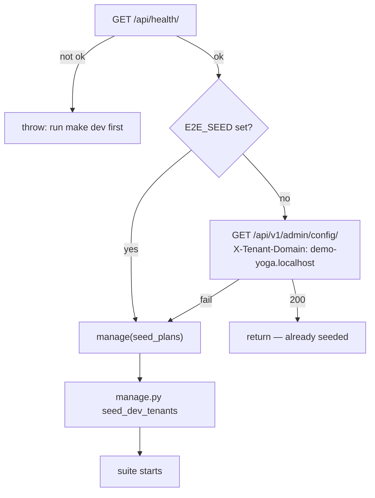

# Other — e2e

# `e2e/` — Playwright end-to-end harness (config & scaffolding)

This module is the *harness* for Contentor's end-to-end suite: the Playwright configuration, the global setup that guarantees a usable stack before any spec runs, the TypeScript/npm project that makes `e2e/` self-contained, and the impact map that lets CI run only the specs a diff can plausibly break. The specs themselves live in `e2e/specs/` and the reusable page-driving code in `e2e/helpers/`; everything documented here is the plumbing around them.

Unlike the backend (`pytest`) and frontend (`vitest`) suites, these tests do **not** run inside a container and do not spin up their own environment. They drive the real dev stack over `http://localhost` — the same Caddy edge, Django, and both Next.js apps that `make dev` serves. That single design decision explains most of the choices below.

## Files

| File | Role |
|---|---|
| `playwright.config.ts` | Single Playwright project: test dir, timeouts, serial execution, artifacts |
| `global-setup.ts` | Pre-flight health check + idempotent, cache-aware tenant seeding |
| `impact-map.json` | Data for `scripts/select_tests.py --mode e2e`: source path → affected specs |
| `package.json` | Standalone npm project (`contentor-e2e`) — only `@playwright/test`, `typescript`, `@types/node` |
| `tsconfig.json` | ES2022 / CommonJS, `strict`, `resolveJsonModule`, Node types |

`package.json` is deliberately separate from both frontends: the suite must not inherit Next.js/React types or bundler config, and `make e2e` installs it on demand (`npm install --silent && npx playwright install chromium`).

`tsconfig.json` targets CommonJS, which is what lets helpers use `__dirname` directly — see `REPO_ROOT` in `e2e/helpers/compose.ts`. `resolveJsonModule` is on so specs and tooling can import `impact-map.json` and files under `e2e/fixtures/` without a loader.

## `playwright.config.ts`

```ts
testDir: "./specs",
globalSetup: "./global-setup.ts",
timeout: 60_000,
expect: { timeout: 10_000 },
fullyParallel: false,
workers: 1,
retries: 1,
use: { baseURL: "http://localhost", screenshot: "only-on-failure", trace: "retain-on-failure" },
```

The two settings worth understanding before you change anything:

**`workers: 1` + `fullyParallel: false` are load-bearing.** Every spec drives the *same* seeded tenants (`demo-yoga` and friends) in a shared Postgres schema. Specs create courses, publish content, take payments, and mutate tenant config. Running two workers means two specs racing on one tenant's rows — the failure mode is a spec that passes alone and fails in the suite. If you need speed, shrink specs or narrow selection via `make e2e-changed`; don't raise the worker count.

**`baseURL: "http://localhost"` means Caddy does the routing.** Specs navigate to a tenant by host (`http://demo-yoga.localhost/...`) and to the marketing app via the apex; Caddy's catch-all sends anything that isn't the apex or `tr.` locale to `nextjs-customer`. There is no per-tenant test config because there is no per-tenant proxy config.

The generous timeouts (60s per test, 10s per assertion) absorb dev-mode Next.js compilation on first hit of a route. Artifacts land in `playwright-report/` (HTML, never auto-opened) and `test-results/` (screenshots + traces on failure only). When a spec fails with a blank page or a hang, open the trace before suspecting the code — transient `nextjs-customer` 502s are a known cause.

## `global-setup.ts` — fail fast, seed rarely

`globalSetup` runs once before the suite and does three things in order. Its only outgoing dependency is `manage()` from `e2e/helpers/compose.ts`, which shells out to `docker compose exec -T django python manage.py …` from the repo root.



**1. Health gate.** A failed or non-OK `http://localhost/api/health/` throws `"Stack is not running — start it with \`make dev\` first."` This turns the most common mistake into a one-line error instead of 30 spec failures with cryptic connection resets.

**2. Seed cache probe.** Booting `manage.py` twice costs roughly six seconds, which is pure waste on a stack that's already seeded. So setup probes `/api/v1/admin/config/` with an `X-Tenant-Domain: demo-yoga.localhost` header; a 200 means the demo tenant's schema exists and setup returns immediately.

The header choice is not cosmetic. Node's `undici` silently drops a custom `Host` header, so `Host: demo-yoga.localhost` would resolve to the public schema and the probe would report the wrong thing. `HeaderAwareTenantMiddleware` accepts `X-Tenant-Domain` precisely for this server-side case — the same rule that governs Next.js server-side fetches to Django.

Set `E2E_SEED=1` to skip the probe and force a re-seed (useful after `make down`, a schema change, or when a spec has left a tenant in a state you want reset).

**3. Idempotent seeding.** `seed_plans` (plans + public tenant + superusers) then `seed_dev_tenants` (the demo tenants, including `demo-yoga`). Both are safe to re-run. Note the asymmetry: `seed_plans` goes through `manage()` — which captures stdout/stderr so the error message carries the Django traceback — while `seed_dev_tenants` is invoked with `execFileSync(..., { stdio: "inherit" })` so its progress streams live, since it's the slow one. Both are wrapped to re-throw with a `check the stack logs (make logs)` hint, because a seed failure is nearly always an environment problem rather than a test problem.

## `impact-map.json` — spec selection by diff

The map is consumed by `scripts/select_tests.py` (`make e2e-changed`, optionally `BASE=<ref>` and `PLAN=1` to preview). It has four top-level sections:

- **`backend`** — keyed by Django app name (`billing`, `courses`, `tenant_config`, …). Value is a list of spec stems, or the string `"none"` for apps with no e2e coverage (`blog`, `domains`, `email_campaigns`, `platform_email`, `usage`).
- **`frontend-customer`** — keyed by path prefix under the app. Matching uses **longest-prefix wins**, so `src/lib/site-ai-api.ts` beats a hypothetical `src/lib/` entry.
- **`frontend-main`** — a flat list, not a map. Any change under `frontend-main/` selects all of them; the marketing app has no unit suite, so typecheck plus e2e is its whole safety net.
- **`manual`** — specs that selection must never auto-run. Currently `90-logo-eval`, which is an AI-scored eval, not a pass/fail test.

Three behaviors follow from the selector rather than the file, and they're the ones that bite:

**Fail-closed.** A backend app with *no* key in `backend` selects **every** spec, and the selector logs `no e2e impact-map entry -> all specs (fail-closed)`. Adding a new Django app without a map entry silently makes `make e2e-changed` as expensive as `make e2e`. Give every new app either a spec list or an explicit `"none"`.

**`00-smoke` always runs.** Whenever any spec is selected, the smoke spec is unioned in.

**The map is lint-gated.** `scripts/select_tests.py --self-test` runs inside `make lint` and fails in both directions: a spec file in `e2e/specs/` that no section references (`specs never referenced`), and a reference to a spec that doesn't exist (`references to nonexistent specs`). So the practical rule when adding a spec is: create `specs/NN-name.spec.ts`, then add its stem to whichever section(s) can break it — or to `manual` if it shouldn't be auto-selected. Renaming a spec file requires updating the map in the same commit or lint goes red.

## Environment flags the harness assumes

The harness itself reads only `E2E_SEED`, but the suite depends on dev-only backend switches (set in the dev `.env`; `config.settings.prod` refuses the first two):

- `LIVE_FAKE_ENABLED=true` — stubs GetStream so the live-class and calendar specs run offline.
- `EMAIL_SINK_ENABLED=true` — captures outbound mail, read back through `GET /api/v1/dev/emails/latest/?to=` (used by `helpers/email.ts` for magic-link and login-code specs).
- `BILLING_BYPASS_ENABLED` — `false` in dev, so billing runs against real Stripe test mode. `STRIPE_E2E=1` (set by `make e2e-stripe`) un-skips `20-stripe-platform` and `21-stripe-marketplace`, which also need `make stripe-listen` running in another shell to forward Connect webhooks.

## Running

```bash
make e2e                          # full suite; the 2 Stripe specs auto-skip
make e2e-stripe                   # + Stripe specs (needs sk_test keys + stripe-listen)
make e2e-spec SPEC=04-live-class  # one spec by filename substring
make e2e-changed PLAN=1           # preview which specs the current diff selects
E2E_SEED=1 npx playwright test    # from e2e/, forcing a re-seed
```

## Contributing to the harness

- **Adding a spec:** put it in `specs/` with the `NN-name.spec.ts` convention, reuse `helpers/` for auth (`auth.ts`), email readback (`email.ts`), Stripe (`stripe.ts`), and wizard A/B bucketing (`holdout.ts`) rather than re-implementing them, and register the stem in `impact-map.json`.
- **Adding a helper that shells into a container:** go through `manage()` in `helpers/compose.ts` so failures surface the Django stderr instead of a bare non-zero exit.
- **Don't add per-spec setup that seeds tenants.** `globalSetup` owns seeding; duplicating it reintroduces the six seconds the probe exists to avoid and can race with the serial spec order.
- **Don't relax serialization** to make a slow run faster — the shared-tenant state makes parallelism a correctness problem, not a tuning knob.