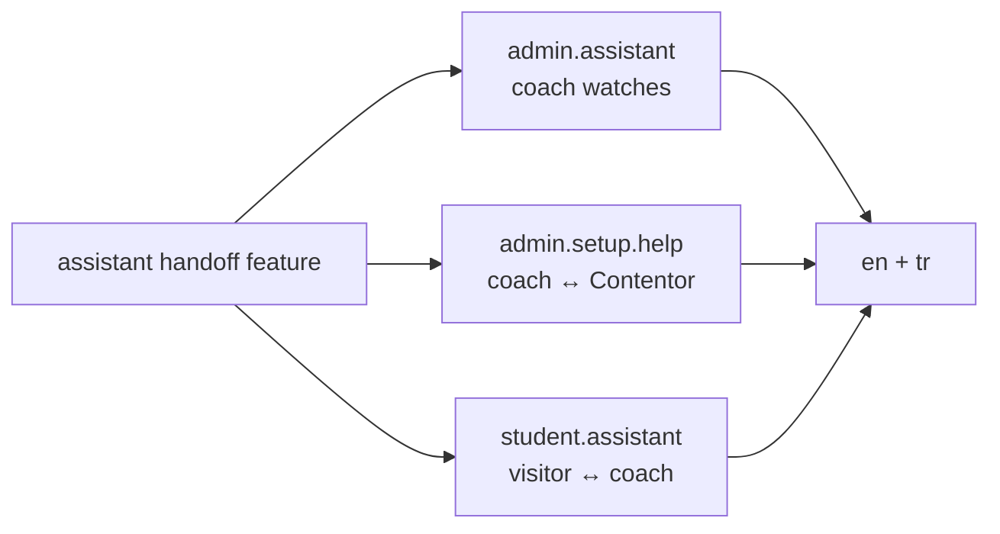

# Other — frontend-customer-messages

# frontend-customer i18n Message Catalogs

`frontend-customer/messages/` holds the translation catalogs for the tenant-facing Next.js app — the portal students browse and the admin surface coaches use to run their studio. Everything user-visible in that app resolves through these JSON files.

There is no executable code in this module. It is pure data consumed by `next-intl`'s message loader, which is why the call graph is empty: nothing here imports anything, and nothing here is imported by name. The coupling is by *key path*, enforced at runtime (and by TypeScript, if augmented types are wired up) rather than by an import edge.

## Layout

```
frontend-customer/messages/
├── en/
│   ├── admin.json      # coach-facing admin app (largest catalog)
│   ├── common.json     # shared actions, nav, language switcher
│   ├── pwa.json        # install prompts, push opt-in, install guide
│   └── student.json    # student portal: home, auth, site assistant
└── tr/
    └── … same four files
```

Two locales — `en` and `tr` — matching the platform's marketing split (`contentor.app` apex and `tr.contentor.app`). Each locale directory must contain the same four files with the same key structure. The file name is the **namespace**: `admin.json` is reached as `useTranslations('admin')`, and nested objects extend the namespace path (`useTranslations('admin.blog')`, `t('nav.items.courses')`).

## Namespace boundaries

The split is by *audience and surface*, not by feature:

| Namespace | Audience | Contains |
|---|---|---|
| `admin` | Coach (tenant owner) | Nav, Site AI, site assistant config, blog editor, inbox, setup checklist, settings, subscription |
| `student` | Student (end user in a tenant) | Home dashboard, magic-link/Google auth, the student-facing assistant bubble |
| `common` | Both | `actions.*` (save/cancel/delete…), `nav.*`, `language.*` |
| `pwa` | Both | Install prompt, iOS/Android install guide, push-notification opt-in |

This mirrors the two roles that share the same Next.js app: `frontend-customer` serves the public tenant site *and* the coach's admin panel under `/admin/*`. When adding a string, pick the namespace by *who reads it*. A label a coach sees while configuring the assistant belongs in `admin.assistant`; the greeting a visitor sees in the chat bubble belongs in `student.assistant`. Both exist, and they are deliberately not shared — `admin.assistant.previewPlaceholder` ("Ask a question…") duplicates `student.assistant.placeholder` because the coach-facing preview and the live widget can diverge in tone without one edit silently changing the other.

`common.actions` is the exception: generic verbs are shared. Note that `admin.json` still defines its own `blog.editorSave`, `inbox.send`, `assistant.save` etc. — these are context-specific ("Save entry" vs "Save") and shouldn't be collapsed into `common.actions.save`.

## Interpolation and placeholders

Placeholders use ICU-style single braces and are matched positionally by name, not order:

- `admin.welcome`: `"Welcome, {name}"`
- `admin.siteAi.remaining`: `"{count} of {limit} AI edits left this month"`
- `student.auth.magicLinkSentBody`: `"We sent a login link to {email}"`
- `student.assistant.title`: `"Ask {brand}"`

Every placeholder present in `en` **must** appear in `tr` with the same name — `next-intl` throws on a missing argument at render time, and Turkish word order routinely moves the token. Compare `admin.siteAi.remaining`:

```
en: "{count} of {limit} AI edits left this month"
tr: "Bu ay kalan yapay zekâ düzenlemesi: {count}/{limit}"
```

Same two names, completely different position. That is expected and correct. What is *not* acceptable is dropping one, or inventing a `{plan}` that the caller doesn't pass.

A few keys carry placeholders that the Turkish translation attaches a suffix to — `admin.subscription.changePlan.upgradeTo` is `"{plan}'a yükselt"`. Turkish vowel harmony means the correct suffix depends on the plan name's last vowel, so these are approximations rather than grammatically perfect for every value. Worth knowing before "fixing" one.

## Brand names inside translations

Some strings hardcode product names and addresses that must survive translation verbatim:

- `Contentor` — `admin.setup.help.title` is `"Ask Contentor"` / `"Contentor'a Sor"`. The Turkish form takes a possessive apostrophe; the brand itself is never translated.
- `support@contentor.app` — appears in `admin.setup.help.unavailable` and `.quota` in both locales. If support routing changes, grep both files.
- `Starter` / `Pro` — plan names in `admin.blog.upgradeBody`, untranslated by design (they match what billing returns).
- `{brand}` in `student.*` is the *tenant's* brand, injected at runtime, with `student.auth.fallbackBrand` ("your account" / "hesabınız") as the fallback when a tenant has no brand name set.

## Notable structures

**`admin.setup.items.*`** — the onboarding setup checklist. Each key (`page_home`, `look`, `first_course`, `demo_cleanup`, `payouts`, `publish`, `studio_email`, …) is an object with `title` and `description`, and the key itself is a **checklist item ID that the backend emits**. Adding a checklist step means adding a matching entry in both locales; a missing key renders as the raw path. The `groups` map (`site`, `content`, `business`, `live`, `extras`) labels the sections these items sort into.

**`admin.nav.items.*`** — nav labels keyed by route slug, with `nav.sections.*` for the five section headers (Content, My Site, Audience, Marketing, Money). `nav.locked.marketing` and `nav.unlocked.marketing` are the two states of the publish gate: Marketing stays locked until the coach publishes their site.

**`admin.blog.kind*`** — `kindHero`, `kindStock`, `kindSpot`, `kindTexture`, `kindDivider`, `kindIcon` label the six `CuratedPhoto` kinds from the backend library. These are display names for backend enum values; the enum values themselves live in `apps.tenant_config` / the curated-photo seeder, so the set of keys here is fixed by that enum.

**`admin.subscription.status.*`** — keyed by the literal subscription status strings the billing API returns (`free`, `incomplete`, `active`, `past_due`, `canceled`). Note `incomplete` renders as "Provisioning" / "Hazırlanıyor" rather than a literal translation, because that state is what a coach sees while Stripe finishes setup.

**Human-handoff triple** — `agentJoined` / `assistantResumed` / `humanRequestedLine` appear three times: in `admin.assistant` (coach watching their own site's conversations), `admin.setup.help` (coach chatting with Contentor support), and `student.assistant` (visitor talking to the coach's assistant). Same feature, three vantage points, three phrasings. Changing the handoff flow means touching all three in both locales — six edits.



## Typography conventions

The catalogs are consistent about non-ASCII punctuation, and diverging from it shows up in review:

- Ellipsis is the single character `…`, never `...` — `"Loading…"`, `"Thinking…"`, `"Düşünüyor…"`. The one exception is `admin.subscription.changePlan.processing` (`"Processing..."` / `"İşleniyor..."`), which is inconsistent with the rest.
- Em/en dashes are used as clause separators: `"Generation cancelled — the credit was used."`
- `pwa.guide.*` uses curly quotes around OS-level UI labels: `"Add to Home Screen"` with `“ ”`, since those strings quote what the user sees in Safari/Chrome. Elsewhere, quotes needing escaping in JSON use straight quotes with `\"` — `admin.assistant.handoffHint`: `"Shows a \"Talk to a human\" button; …"`.
- Turkish strings use proper Turkish characters throughout, including `zekâ` (circumflex) in "yapay zekâ" — not `zeka`.

Emoji appear in exactly two places and are shared across locales: `🎉` in `admin.nav.unlocked.marketing` and `admin.setup.celebrateTitle`.

## Voice

The `en` catalog is deliberately plain and second-person: "Get your studio live", "Make the first thing visitors see yours." Error strings pair a plain statement with a retry instruction — "Could not save. Please try again." — and never surface technical detail. Follow that when adding strings; a new error message reading "Request failed with status 500" would be out of place.

One inconsistency to be aware of: `tr/admin.json` mixes formality. Most of it uses the formal *siz* form ("Kaydedildi.", "Lütfen tekrar deneyin."), but `setup.*` switched to informal *sen* ("Stüdyonu yayına hazırla", "Öğrencilerine selam ver"). New `setup.*` strings should match the informal register already there; everything else stays formal.

## Adding or changing a string

1. Add the key to `en/<namespace>.json` at the right nesting depth.
2. Add the **same key path** to `tr/<namespace>.json`. Never leave it out — `next-intl` falls back to rendering the key path, so a Turkish user sees `admin.blog.newThing` on screen.
3. Verify placeholder names match exactly between locales.
4. Reference it as `t('path.to.key')` under the namespace matching the file name.
5. Run `make format` — Prettier formats these JSON files, and `make lint` fails on unformatted output.

When *removing* a key, remove it from both locales, and grep the app for the key path first — these files have no import edges, so a dead key looks identical to a live one from inside this directory. That asymmetry is the main hazard of the module: nothing in `messages/` tells you whether a string is still used. `grep -rn "keyName" frontend-customer/src` is the only check.
