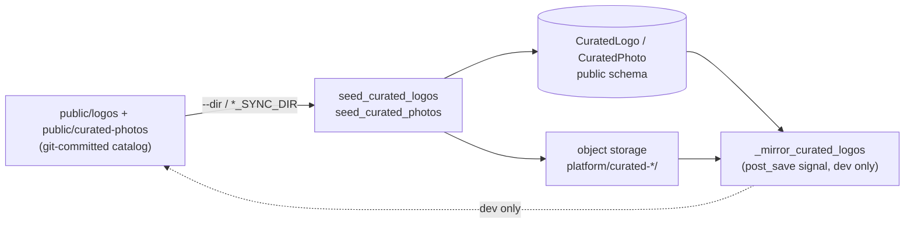

# Other — frontend-customer-public

# `frontend-customer/public/` — static asset root

This is the Next.js `public/` directory for the tenant-facing portal (`frontend-customer`). It holds two unrelated groups of files that happen to share a directory, and telling them apart is the main thing to understand before touching anything here:

| Path | Size | Tracked? | Role |
|---|---|---|---|
| `sw.js` | 52 KB | no (generated) | Compiled Serwist service worker |
| `swe-worker-<hash>.js` | 433 B | no (generated) | Serwist companion Web Worker |
| `offline.html` | 1.7 KB | yes | Offline document fallback |
| `icons/.gitkeep` | — | yes | Placeholder; PWA icons are generated at runtime |
| `logos/` | 220 MB, 784 PNG + `logo_meta.json` | yes | Curated **logo** catalog (build-time data, not served) |
| `curated-photos/` | 288 MB, 355 JPG + 115 PNG + `photo_meta.json` | yes | Curated **photo** catalog (build-time data, not served) |

Group 1 (`sw.js`, `swe-worker-*.js`, `offline.html`, `icons/`) is the PWA runtime surface — small, mostly generated, served to browsers.

Group 2 (`logos/`, `curated-photos/`) is ~500 MB of committed image assets that are *never fetched from this path at runtime*. They are the git-committed source of truth for the platform's curated asset catalogs, read by Django management commands and uploaded to object storage. They live under `public/` only because the dev compose file bind-mounts them into the Django container from here.

---

## 1. PWA runtime assets

### `sw.js` is generated — never edit it

`next.config.mjs` wires `@serwist/next`:

```js
const withSerwist = withSerwistInit({
  swSrc: "src/app/sw.ts",
  swDest: "public/sw.js",
  cacheOnNavigation: true,
  disable: process.env.NODE_ENV === "development" && process.env.SERWIST_DEV !== "1",
  additionalPrecacheEntries: [{ url: "/offline.html", revision }],
});
```

The real source is **`frontend-customer/src/app/sw.ts`**. `public/sw.js` is its bundled output — Serwist/Workbox runtime plus the precache manifest — and is gitignored (`frontend-customer/.gitignore`: `public/sw.js`, `public/sw.js*.map`, `public/swe-worker-*.js`). Editing it does nothing durable; the next build overwrites it.

> **Reading the code graph for this file.** `sw.js` is minified vendor output, so the indexed symbols in it (`getDb`, `addEntry`, `popRequest`, `cachePut`, `fetchAndCachePut`, `createHandlerBoundToUrl`, `registerRoute`, plus single-letter names like `E`, `x`, `j`, `eU`) are Serwist/Workbox internals, not project code. Reported edges between `sw.js` and `playwright-report/trace/*`, `tools/flowmap/web/app.js`, or `mailbox-worker/src/index.js` are name collisions on generic identifiers (`fetch`, `x`, `j`) across unrelated bundles — there is no such call relationship. Trace behaviour through `src/app/sw.ts` instead.

### What the worker actually does

From `sw.ts`, the significant piece is `guardedCache`, prepended to Serwist's `defaultCache` so it matches first and forces `NetworkOnly` for:

- same-origin paths `^/admin(/|$)`, `^/checkout(/|$)`, `^/api/v1/(auth|billing)(/|$)`
- cross-origin hosts `stripe.com`, `stream-io-api.com`, `getstream.io` (host or any subdomain)

Everything else falls through to `defaultCache`. Document requests that fail get `/offline.html` via `fallbacks.entries`. The worker also handles `push` (renders a notification using `/pwa-icon?size=192` for icon and badge) and `notificationclick` (focus an existing window and navigate it, else `openWindow`).

Client-side counterparts live in the app, not here: `src/components/shared/sw-update-toast.tsx` (waits for an `installed` worker while a controller exists, then offers a reload toast) and `src/lib/push.ts` (`navigator.serviceWorker.ready` → subscription).

### `swe-worker-<hash>.js`

A tiny message-driven Web Worker emitted alongside `sw.js`. It handles two message types:

- `__START_URL_CACHE__` — fetch the URL; if the response wasn't redirected, `put` it into the `start-url` cache.
- `__FRONTEND_NAV_CACHE__` — check the `pages` cache with `{ ignoreSearch: true }`; if absent, fetch and store the response (skipping non-`ok` ones). This is what backs `cacheOnNavigation: true`.

The filename is content-hashed, so it changes across builds — hence the `public/swe-worker-*.js` glob in `.gitignore`. Don't reference the hashed name from app code.

### `offline.html`

Fully self-contained (inline `<style>`, no external requests, no framework), because it must render with zero network. Supports light and dark via `color-scheme: light dark` plus a `prefers-color-scheme: dark` block, and offers a single `location.reload()` button. It is precached through `additionalPrecacheEntries` with a `revision` set to a fresh `randomUUID()` per build, so every build invalidates the cached copy.

Because it's hand-written and committed, this is the one file in group 1 you *do* edit directly. Keep it dependency-free.

### `icons/`

Empty except `.gitkeep`. PWA icons are not static files: `src/app/manifest.ts` points at the dynamic `/pwa-icon?size=…` route so each tenant gets its own branded icon. The directory is a reserved slot, not a live asset path.

### Test coverage

`e2e/specs/08-pwa.spec.ts` covers this surface and is written to pass in both modes. It reads `navigator.serviceWorker.getRegistrations()`; if a worker is registered (production build, or dev with `SERWIST_DEV=1`) it asserts `/offline.html` loads through it, otherwise it falls back to asserting `/sw.js` is served with a `javascript` content type and `/offline.html` is reachable. If you change file names or the offline fallback, that spec is where it breaks.

---

## 2. Curated asset catalogs (`logos/`, `curated-photos/`)

These are **seed data**, not web assets. Nothing in `frontend-customer/src` or `frontend-main/src` fetches `/logos/*` or `/curated-photos/*`; the app reads the catalogs over the API (`/api/v1/logos/curated/` via `src/lib/logo/library-catalog.ts` and `frontend-main/src/lib/wizard/api.ts`; `/api/v1/curated-photos/` via `src/lib/curated-photos-api.ts`), which serves rows out of Postgres with images in object storage.

### Manifest schema

Each directory has one JSON manifest listing its images. `logos/logo_meta.json` entries are `{title, filename, prompt, tags}`. `curated-photos/photo_meta.json` adds `{kind, alt_text}`, where `kind` is one of `CuratedPhoto.KINDS` = `hero`, `stock`, `spot`, `texture`, `divider`, `icon` (and `AI_KINDS` — the subset offered to the blog AI writer — is `hero`, `stock`, `spot`). Filenames are conventionally `<kind>_<niche>_<subject>.<ext>`, which is how the directory listing sorts into readable groups: currently 288 `hero_*`, 75 `stock_*`, 40 `spot_*`, 32 `texture_*`, 20 `icon_*`, 15 `divider_*`.

The `prompt` field is the generation prompt, kept so a slot can be regenerated reproducibly.

### Round trip: repo → DB → repo



**Forward (seed).** `backend/apps/core/management/commands/seed_curated_photos.py` (and its sibling `seed_curated_logos.py`) read the manifest from `--dir` or `settings.CURATED_PHOTO_SYNC_DIR`, skip entries whose file is missing or whose `kind` is unknown, run `clean_curated_png` on `spot` images (strips the white canvas so they blend with tenant blog themes), measure dimensions with PIL, and store each under `platform/curated-photos/<filename>`. Seeding is idempotent. `make seed` includes the curated logo catalog.

**Backward (mirror, dev only).** `apps/core/signals.py::_mirror_curated_logos` runs on `CuratedLogo` save and, when `CURATED_LOGO_SYNC_DIR` is set, rewrites `logo_meta.json` from enabled rows and pulls the saved row's PNG down from S3 — so curating in the admin updates the committed snapshot. It never deletes files and swallows exceptions rather than failing the caller's `save()`. One important guard: if the table is entirely empty and a manifest already exists on disk, the sync is skipped, because writing `[]` would destroy the only local copy of the catalog.

The dev wiring is in `docker-compose.yml`:

```yaml
CURATED_LOGO_SYNC_DIR: /app/logo_sync
CURATED_PHOTO_SYNC_DIR: /app/photo_sync
# volumes
- ./frontend-customer/public/logos:/app/logo_sync
- ./frontend-customer/public/curated-photos:/app/photo_sync
```

Both are unset in production, which disables the mirror. Production seeding uses an explicit one-off bind mount plus `--dir /seed`; the command's docstring carries the exact invocation.

### Gotchas when adding assets

- **Commit the manifest, not just the images.** Both `logo_meta.json` and `photo_meta.json` are git-tracked and are the seeder's input. A PNG without a manifest entry is invisible; a manifest entry without a file is skipped with a `skip <filename>: file missing` warning.
- **`logo_meta.json` is prettier-excluded.** The backend writes it as 4-space JSON (`json.dumps(..., indent=4)`); `frontend-customer/.prettierignore` lists `public/logos/logo_meta.json` so `make lint` doesn't reformat it into a spurious diff. If you add another machine-written manifest here, add it there too.
- **Only `logos/` is excluded from the Docker build context.** The root `.dockerignore` lists `frontend-customer/public/logos` but not `curated-photos`, and `frontend-customer/Dockerfile` does `COPY --from=builder /app/public ./public` — so the 288 MB photo catalog is baked into the customer image while the 220 MB logo catalog is not. If image size matters, that asymmetry is the lever.
- **A stray `.DS_Store` is tracked inside `logos/`.** The root `.gitignore` has `.DS_Store`, but that rule doesn't untrack an already-committed file. `public/.DS_Store` and `curated-photos/.DS_Store` are correctly ignored.
- **Catalog growth breaks count-based tests.** `e2e/specs/17-logo-curated-library.spec.ts` and `18-curated-library-admin.spec.ts` exercise the curated library, and spec 18 uses `../../frontend-customer/public/logos/colorful_lotus_meditation_logo.png` as an upload fixture — so renaming or removing files here breaks e2e, and specs that assert on catalog counts need updating when the catalog grows.
- **Generation workflow.** New assets aren't hand-authored: the `collect-curated-logos` and `collect-curated-photos` skills cover the Gemini generation → cleanup → manifest → seed pipeline, including the white-canvas cleanup that `icon` and `divider` kinds still need manually.

---

## Related code

| Concern | Where |
|---|---|
| Service worker source | `frontend-customer/src/app/sw.ts` |
| Serwist build config | `frontend-customer/next.config.mjs` |
| PWA manifest + icons | `frontend-customer/src/app/manifest.ts`, `src/app/pwa-icon/` |
| Update toast / push subscription | `src/components/shared/sw-update-toast.tsx`, `src/lib/push.ts` |
| Curated catalog models | `backend/apps/core/models.py` (`CuratedLogo`, `CuratedPhoto`) |
| Seeders | `backend/apps/core/management/commands/seed_curated_{logos,photos}.py` |
| DB→repo mirror | `backend/apps/core/signals.py::_mirror_curated_logos` |
| Sync-dir settings | `backend/config/settings/base.py` (`CURATED_LOGO_SYNC_DIR`, `CURATED_PHOTO_SYNC_DIR`) |
| Blog-side consumption | `backend/apps/blog/curated.py`, `src/components/admin/blog/image-library-dialog.tsx` |
| Tests | `e2e/specs/08-pwa.spec.ts`, `e2e/specs/1{7,8}-*.spec.ts`, `backend/apps/core/tests/test_curated_{logos,photos}.py` |