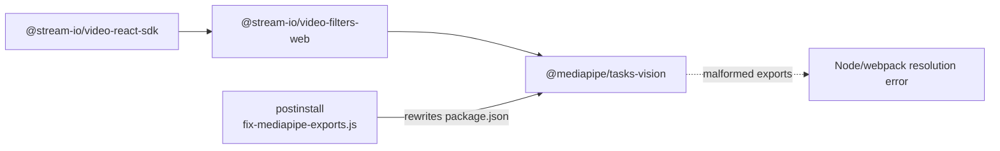

# Other — frontend-customer-scripts

# Other — `frontend-customer/scripts`

A single-file build-support module: a `postinstall` patch that repairs a malformed `exports` field in the third-party `@mediapipe/tasks-vision` package. It contains no application code, no exported API, and no callers inside the app — it is invoked exclusively by npm's lifecycle hook.

| | |
|---|---|
| File | `frontend-customer/scripts/fix-mediapipe-exports.js` |
| Invoked by | `"postinstall": "node scripts/fix-mediapipe-exports.js"` (`frontend-customer/package.json:6`) |
| Module system | CommonJS (`require("fs")`, `require("path")`) — the app's `package.json` declares no `"type": "module"`, so a plain `.js` file is CJS here |
| Side effect | Rewrites `node_modules/@mediapipe/tasks-vision/package.json` in place |
| Runtime deps | Node built-ins only |

## Why this exists

`@mediapipe/tasks-vision` is not a direct dependency of `frontend-customer`. It arrives transitively through the video stack:



`@stream-io/video-filters-web` (background blur / virtual background for live classes, see `apps.live` + the Stream.io video SDK in `frontend-customer`) pulls in MediaPipe's vision tasks bundle. Upstream ships an `exports` map that mixes **conditional keys** and **subpath keys at the same level**:

```jsonc
// upstream (broken)
"exports": {
  "import":  "./vision_bundle.mjs",     // conditional key
  "require": "./vision_bundle.cjs",     // conditional key
  "default": "./vision_bundle.mjs",
  "types":   "./vision.d.ts",
  "./vision_wasm_internal.js": "./vision_wasm_internal.js",   // subpath key
  "./vision_wasm_internal.wasm": "./vision_wasm_internal.wasm",
  // ...more ./vision_wasm_* subpaths
}
```

Per [Node's conditional-exports rules](https://nodejs.org/api/packages.html#conditional-exports) — cited in the script's own header comment — a map that contains any `"./…"` subpath key is treated as a **subpath map**. The bare `"import"` / `"require"` / `"default"` / `"types"` entries are then not condition names at all; they're invalid subpaths that Node and webpack ignore. Result: the package advertises `./vision_wasm_internal.js` and friends but exposes **no root entry point**, so `import … from "@mediapipe/tasks-vision"` fails to resolve (`ERR_PACKAGE_PATH_NOT_EXPORTED`-class failure), typically surfacing as a `next dev` / `next build` module-resolution error inside the Stream video filters chunk rather than anywhere in Contentor's own code.

The fix is to nest the conditional keys under a `"."` subpath, which is what the map meant all along.

## How it works

The script is ~40 lines of straight-line logic with two early exits and one transformation.

**1. Locate the target.** `path.resolve(__dirname, "../node_modules/@mediapipe/tasks-vision/package.json")` — resolved relative to the script file, so it works regardless of the process CWD (relevant because npm may run lifecycle scripts from the package root while Docker builds run from `/app`).

**2. Bail if absent.** `if (!fs.existsSync(pkgPath)) process.exit(0)` — exit code 0, deliberately. `postinstall` runs on every `npm install`, including installs that prune or never fetch the transitive dependency; a missing package is a normal state, not a failure. Exiting non-zero here would break the whole install.

**3. Bail if already correct.** The guard is `if (pkg.exports && !pkg.exports["."])`. This is the idempotency check and the upstream-fix check in one: once `"."` is present — whether because this script already ran or because MediaPipe eventually ships a valid map — the script is a no-op and prints nothing.

**4. Partition and re-nest.** Keys are split against a fixed allow-list of condition names:

```js
const conditionalKeys = ["import", "require", "default", "types", "node", "browser"];
```

Everything in that list goes into `rootExport`; everything else (the `./vision_wasm_*` subpaths) goes into `subpathExports`. The map is then rebuilt as `{ ".": rootExport, ...subpathExports }`, which puts `"."` first and preserves the original relative order of the subpaths.

Note that `conditionalKeys` is a superset of what the current package actually uses (`node` and `browser` are listed defensively) — it is a *classification* list, not an assertion about upstream contents. Any key not in the list is treated as a subpath and left at the top level.

**5. Write back.** `JSON.stringify(pkg, null, 2) + "\n"` — 2-space indent plus trailing newline, matching npm's own formatting so the file stays diff-clean, then a single `console.log("Fixed @mediapipe/tasks-vision exports field")` so the patch is visible in install output.

The post-patch state on disk:

```jsonc
"exports": {
  ".": {
    "import":  "./vision_bundle.mjs",
    "require": "./vision_bundle.cjs",
    "default": "./vision_bundle.mjs",
    "types":   "./vision.d.ts"
  },
  "./vision_wasm_internal.js": "./vision_wasm_internal.js",
  // ...subpaths unchanged
}
```

## Where it runs

**Locally:** any `npm install` / `npm ci` in `frontend-customer/`.

**In Docker:** `frontend-customer/Dockerfile` copies the scripts directory *before* installing, in all three install-bearing stages:

```dockerfile
COPY frontend-customer/package.json frontend-customer/package-lock.json* ./
COPY frontend-customer/scripts/ ./scripts/
RUN npm ci || npm install
```

That `COPY … scripts/` line is load-bearing, not incidental — without it `npm ci` would invoke `postinstall` against a nonexistent script and fail the build. Both the `dev` target (used by `docker-compose.yml`) and the production `deps` stage do this. The `builder` stage inherits the already-patched `node_modules` from `deps` via `COPY --from=deps`, so the patch is applied exactly once per image build.

## Contributor notes

- **The patch lives in `node_modules`, which means it is not durable.** Anything that replaces the tree — a fresh `npm ci`, `make dev-reset`, `rm -rf node_modules` — re-runs `postinstall` and re-applies it. But anything that *mutates* the tree without triggering `postinstall` (hand-editing, a partial extract) will not. If you see MediaPipe resolution errors after fiddling with dependencies, run `npm install` in `frontend-customer/` (or rebuild the container) before debugging further.
- **Host vs. container `node_modules` are separate trees.** The dev container installs its own; patching on the host does nothing for `nextjs-customer` and vice versa. This is the same class of trap as the other container-`node_modules` staleness issues in this repo.
- **On dependency bumps:** after upgrading `@stream-io/video-react-sdk` (and therefore possibly `@stream-io/video-filters-web` → a new `@mediapipe/tasks-vision`), check whether the patch is still needed *and* still sufficient. Read `frontend-customer/node_modules/@mediapipe/tasks-vision/package.json`: if `exports["."]` is present straight from the registry, upstream fixed it and this script can be deleted along with the `postinstall` hook and the two Dockerfile `COPY … scripts/` lines. If a new condition key appears at the top level that isn't in `conditionalKeys`, it will be misfiled as a subpath — add it to the list.
- **`npm ci` fails hard on `postinstall` failure.** Keep this script defensive: no throwing on missing files, no network access, no assumptions about CWD. The `|| npm install` fallback in the Dockerfile covers lockfile drift, not script errors.
- **Keep it CommonJS** unless you also rename it to `.cjs`. `frontend-customer/package.json` has no `"type"` field, so `.js` is CJS; switching to `import` syntax silently breaks the hook.
- The script is outside the Next.js app source, so it is not covered by `next lint`, `tsc --noEmit`, or the `check-loading-patterns.mjs` frontend conventions — none of which apply to build tooling. It is still formatted by `make format` / pre-commit prettier.

## Verifying

```bash
# from frontend-customer/ — confirm the patched shape
node -e 'console.log(require("@mediapipe/tasks-vision/package.json").exports["."])'
```

Expect an object with `import` / `require` / `default` / `types`. `undefined` means the patch has not been applied to that tree. Re-running the script by hand is safe and idempotent:

```bash
node scripts/fix-mediapipe-exports.js   # prints the "Fixed…" line only when it changed something
```

The end-to-end check is that `nextjs-customer` builds and a live-class page loads the Stream video filters without a module-resolution error — `make dev` plus a live-session route, or `make e2e-spec SPEC=04-live-class`.