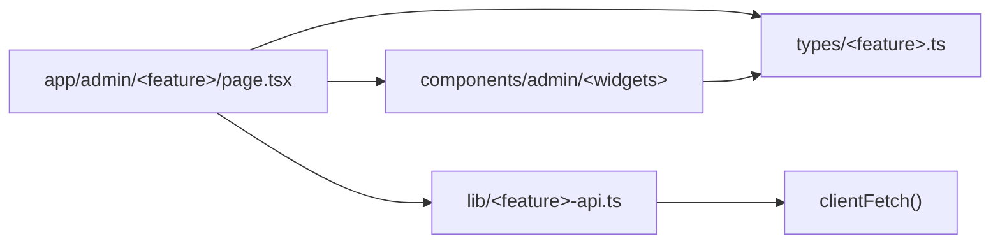
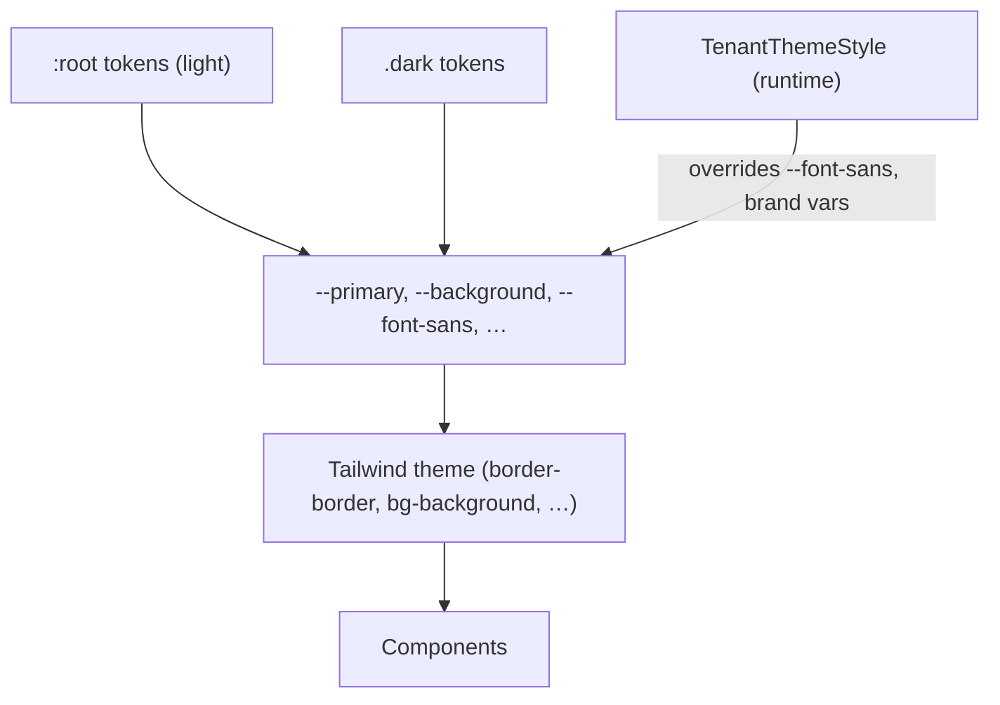

# Other — frontend-customer-src

# Other — `frontend-customer/src`

This module is the root of the tenant-portal Next.js app's source tree. It contains no application logic of its own — it holds the two artifacts that every other file in `frontend-customer` inherits from:

| File | Role |
|------|------|
| `frontend-customer/src/CLAUDE.md` | The local authoring contract: which conventions a new file must copy, and which files must not be edited casually. |
| `frontend-customer/src/styles/globals.css` | The single global stylesheet: Tailwind entry point, design-token definitions for light/dark, and the handful of third-party and PWA overrides that can't live in a component. |

Everything else under `src/` (`app/`, `components/`, `lib/`, `types/`) is documented by its own area. Treat this page as the entry point you read *before* adding a file anywhere in the app.

---

## 1. The authoring contract (`src/CLAUDE.md`)

`src/CLAUDE.md` is a scoped instruction file — it applies to work inside `frontend-customer/src` and layers on top of the repo-root `CLAUDE.md`. It encodes four decisions.

### Data fetching has exactly one door

All HTTP goes through `clientFetch<T>()` in `lib/api-client.ts`. There is no second fetch wrapper, and adding one is a regression — the four historical `clientFetch` clones in `frontend-main` were consolidated for this reason.

The split between server and client fetching is by audience, not by preference:

- **Public routes** (anything a logged-out visitor sees) are server components.
- **Student and admin routes** are `"use client"` with `useState`/`useEffect` + `clientFetch`. The canonical template is `app/(student)/dashboard/page.tsx` — copy its shape rather than inventing a new one.

Because client-side `clientFetch` runs in the browser, it hits `/api/v1/*` directly through Caddy and the tenant is resolved from the Host header. Server-side fetches are the ones that need the `X-Tenant-Domain` header (see the root `CLAUDE.md` multi-tenancy notes) — a large part of why student/admin surfaces stay client-side.

### A feature is a four-corner slice

Adding an admin resource means creating the same four things, every time:



`app/admin/downloads/page.tsx` is the reference implementation — copy it. `lib/<feature>-api.ts` is optional for thin features; calling `clientFetch` directly from the page is acceptable, but the types file is not optional.

### Three shared spines, edited with care

These files are depended on by many callers at once, so changes to them are wide-blast-radius by construction:

- `components/admin/media-browser.tsx` — the generic admin list view.
- `components/admin/inline-edit-panel.tsx` — the generic edit surface, driven by a `FieldConfig` description of the fields rather than bespoke form markup.
- `components/admin/tag-filter-bar.tsx` — shared filtering chrome for list views.
- `lib/api-client.ts` — the fetch door above.
- `lib/blocks/registry.tsx` — the page-builder block registry; every renderable block type resolves through it.

Together, `media-browser` + `inline-edit-panel` + `tag-filter-bar` *are* the admin CRUD framework. A new admin resource should be a configuration of these, not a reimplementation. Per the root `CLAUDE.md`, run `impact` on any symbol in these files before editing it.

### Shared code lives in `packages/shared`

Code common to `frontend-customer` and `frontend-main` lives in `packages/shared`, imported as `@shared/*`. Files inside `src/` that only re-export shared code are **shims** — fixing a bug there is almost always wrong. Follow the import to the shared source and fix it once, so both apps get the change.

Navigation and loading behaviour is not redefined here; it defers to the root `CLAUDE.md` "Loading & feedback conventions" — `<NavLink>` instead of `next/link`, `useNavigate()` instead of `router.push`, a `loading.tsx` at or above every route segment, and `<StaleContainer pending>` for refinement loads. `scripts/check-loading-patterns.mjs` enforces the mechanical parts in `make lint`.

### Verification

```bash
make test-frontend          # vitest, frontend-customer
make typecheck              # tsc --noEmit, both apps
make e2e-spec SPEC=<nn>     # one Playwright spec against the dev stack
```

---

## 2. The global stylesheet (`src/styles/globals.css`)

The file is a Tailwind entry (`@tailwind base/components/utilities`) plus four distinct concerns, in order.

### 2.1 Design tokens and the tenant override point

The `:root` block in `@layer base` defines the full token set as **OKLCH** values: surface pairs (`--background`/`--foreground`, `--card`, `--popover`), semantic roles (`--primary`, `--secondary`, `--muted`, `--accent`, `--destructive`), form/edge tokens (`--border`, `--input`, `--ring`), `--radius`, a `--brand-*` group, and `--chart-1` … `--chart-5` for data viz.

Two tokens are worth calling out because they behave differently from the rest:

- **`--font-sans`** defaults to `var(--font-instrument), system-ui, sans-serif`. The comment marks it as the tenant override seam: **tenants override `--font-sans` at `:root` via `TenantThemeStyle`.** Per-tenant theming is a runtime CSS-variable override on top of these defaults, not a rebuild — which is what lets one deployment serve every tenant's branding.
- **`--marketing-accent`** / `--marketing-accent-foreground` exist so marketing-styled surfaces inside the portal can reach for a distinct accent without hijacking `--primary`.

`.dark` redefines the same set. Because both blocks declare the *same variable names*, dark mode costs nothing at the component level — components reference tokens, never raw colors.



**When adding a token:** add it to *both* `:root` and `.dark`. A token defined only in `:root` silently inherits the light value in dark mode, which reads as a theming bug in one mode only.

### 2.2 Base resets and the cinematic background

A short second `@layer base` block applies `border-border` to `*` and `bg-background text-foreground` to `body` — the shadcn-style baseline that makes unstyled elements land on theme.

`--cinematic-bg` is a stacked set of four `radial-gradient()`s (three ellipses plus a circle, each with its own position and alpha) defined per theme, and surfaced as the `.bg-cinematic` utility in `@layer utilities`. The utility pins `background-position: center top`, `background-repeat: no-repeat`, and `background-attachment: fixed`, so the gradient field stays put while content scrolls. The light and dark variants use different lightness *and* different alphas — the dark version is deliberately more opaque to stay visible against a near-black background.

### 2.3 GetStream Video SDK overrides

`frontend-customer` embeds `@stream-io/video-react-sdk` for live sessions, and its participant tiles size themselves in ways that overflow a flex parent. Three unlayered rules fix that:

- `.str-video__participant-view` — `width/height: 100%`, `min-height: 0`, `overflow: hidden`. The `min-height: 0` is the load-bearing part: without it a flex child refuses to shrink below its content and the video pushes the layout open.
- `.str-video__participant-view video` — same sizing, `object-fit: cover` (fill the tile, crop the edges).
- `.video-contain .str-video__participant-view video` — opt out to `object-fit: contain` by adding `video-contain` to an ancestor, for cases where cropping loses content (screen shares, slides).

These live in `globals.css` rather than a component because they target SDK-owned class names that no local component renders. They are intentionally outside `@layer`, so they win against Tailwind utilities without needing `!important`.

### 2.4 Motion and PWA safe areas

- `@keyframes float-up` + `.animate-float-up` drive the floating live-session reactions: 2s `ease-out forwards`, fading out while translating `-120px` and scaling to `1.3`. Note this is a raw class, not `motion-safe:`-gated at the definition — per the root convention, gate it at the usage site (`motion-safe:animate-float-up`).
- `.pt-safe` / `.pb-safe` map to `env(safe-area-inset-top)` / `env(safe-area-inset-bottom)`. Any `fixed` or `sticky` chrome — top bars, bottom nav, action bars — needs one of these, or it will sit under the notch or the home indicator when the portal runs as an installed PWA.

---

## 3. How this module connects outward

- **Downward into `src/`** — every route and component in the app inherits the tokens from `globals.css` and is expected to follow the conventions in `src/CLAUDE.md`. Neither file is imported by name in most code; they are ambient.
- **Sideways to `frontend-main`** — via `packages/shared` / `@shared/*`. `frontend-main` maintains its own `globals.css`; the token *names* overlap by convention, so shared components can rely on `--primary` and friends existing in both apps.
- **Upward to the backend** — through `clientFetch` to `/api/v1/*`, and through `TenantThemeStyle`, which materializes per-tenant `tenant_config` theme values (theme, branding, fonts) as CSS variables layered over the `:root` defaults here.
- **To the e2e suite** — the SDK overrides and safe-area utilities are what make the live-class specs and mobile-viewport specs render sanely; `LIVE_FAKE_ENABLED=true` stubs GetStream but the DOM class names (and therefore these rules) still apply.

## 4. Contributing checklist

1. Reaching for `fetch`? Use `clientFetch<T>()` from `lib/api-client.ts`.
2. Adding an admin resource? Copy `app/admin/downloads/page.tsx` and build the four-corner slice.
3. Editing `media-browser.tsx`, `inline-edit-panel.tsx`, `tag-filter-bar.tsx`, `api-client.ts`, or `blocks/registry.tsx`? Run `impact` first and report the blast radius.
4. Adding a color? Add a token to **both** `:root` and `.dark`; never hardcode a color in a component.
5. Adding fixed/sticky chrome? Add `.pt-safe` or `.pb-safe`.
6. Fixing something in a file that only re-exports `@shared/*`? Fix the shared source instead.
7. Before claiming done: `make test-frontend`, `make typecheck`, and the relevant `make e2e-spec SPEC=<nn>`.
