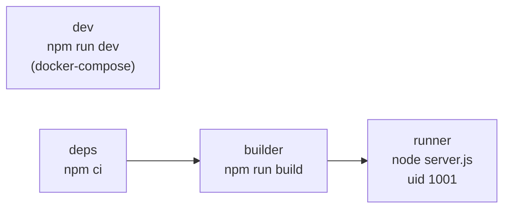

# Other — frontend-customer

# Other — frontend-customer

The build, bundling, styling, and type-checking configuration for **`frontend-customer/`** — the tenant-facing Next.js 14 app that students (and coaches, via `/admin/*`) hit on every tenant subdomain. These files contain no application logic, but they encode most of the non-obvious constraints the app runs under: cross-package module resolution, the shared Tailwind design system, service-worker precaching, and the dev-performance tuning that keeps admin navigation fast.

Files covered: `Dockerfile`, `next.config.mjs`, `package.json`, `postcss.config.mjs`, `tailwind.config.ts`, `tsconfig.json`, `vitest.config.ts`.

---

## Container build (`Dockerfile`)

Four stages, two entry points. Note that **the build context is the repo root, not `frontend-customer/`** — every `COPY` is repo-relative because the image needs `packages/` (the shared component/hook library) alongside the app.



`docker-compose.yml` targets `dev`; the prod stack builds through `deps → builder → runner`.

### The `/node_modules` symlink

Both `dev` and `builder` run:

```dockerfile
COPY packages /packages
RUN ln -s /app/node_modules /node_modules
```

`packages/shared` lives outside `/app`, so Node's upward module resolution from `/packages/shared/src/**` would walk to `/` and find nothing — shared files importing `react` or `lucide-react` would fail to resolve for both webpack and `tsc`. A root-level symlink makes `/node_modules` resolve to the app's real dependency tree.

The deliberate alternative — `tsconfig` `paths` entries for bare specifiers — is **not** used: it breaks `@types` resolution project-wide. If you add another out-of-tree package, extend the symlink approach rather than reaching for `paths`.

### Build-time environment

`NEXT_PUBLIC_*` values are inlined into the client bundle at build time, so they arrive as `ARG`s in the `builder` stage:

| Arg | Used by |
| --- | --- |
| `NEXT_PUBLIC_API_URL` | Django origin (also feeds the `rewrites()` fallback) |
| `NEXT_PUBLIC_BASE_DOMAIN` | tenant-subdomain construction; `allowedDevOrigins` |
| `NEXT_PUBLIC_GETSTREAM_API_KEY` | in-browser `stream-chat` / `@stream-io/video-react-sdk` |

Adding a new `NEXT_PUBLIC_*` means touching three places: the `ARG`/`ENV` pair here, the compose build args, and `.env.prod.example`. Anything not listed here is server-only and read at runtime.

### Runner stage

`output: "standalone"` (set in `next.config.mjs`) makes Next emit `.next/standalone/server.js` with a pruned `node_modules`. The runner copies `public/`, the standalone tree, and `.next/static`, then drops to the non-root `nextjs` user (uid 1001) and listens on `0.0.0.0:3000`. It has no host port published in prod — Caddy reaches it over the internal network.

---

## `next.config.mjs`

The exported config is `withSerwist(withNextIntl(nextConfig))` — plugin order matters: `next-intl` wraps the base config, Serwist wraps the result.

### Performance knobs (read the comments before changing)

**`experimental.staleTimes: { dynamic: 30, static: 180 }`** — Next 14.2 defaults `dynamic` to `0`, which makes every revisit refetch the RSC payload. 30 seconds makes panel-to-panel navigation in the admin feel instant. This is safe for freshness because the router cache stores the *payload*, not component state: client pages still remount and re-run their `clientFetch` on arrival.

**`onDemandEntries: { maxInactiveAge: 3600_000, pagesBufferLength: 100 }`** — dev-only. The default ~1 minute age meant returning to an admin panel re-triggered a webpack compile (638+ modules, 1.5–2s each) once the entry expired. Keeping an hour of compiled routes alive was one half of the 2026-07-23 admin-slowness fix.

**`experimental.externalDir: true`** — required for the `@shared/*` imports that resolve outside the app root.

### Module resolution and the MediaPipe workaround

`@mediapipe/tasks-vision` (a transitive dependency of the Stream video SDK's background-blur feature) ships a malformed `exports` field — conditional keys mixed with subpath exports at the same level. Two mitigations run in tandem:

1. `webpack.resolve.alias` points the specifier straight at `node_modules/@mediapipe/tasks-vision/vision_bundle.mjs`.
2. `package.json`'s `postinstall` runs `node scripts/fix-mediapipe-exports.js`, which patches the installed manifest — so a fresh `npm install` is required for it to take effect, not just a rebuild.

`resolve.modules` also appends the app's absolute `node_modules` path, complementing the Dockerfile symlink for webpack's own resolver.

### Routing

```js
rewrites: [{ source: "/api/v1/:path*", destination: `${NEXT_PUBLIC_API_URL || "http://django:8000"}/api/v1/:path*` }]
```

This is a **fallback**, not the primary API path. In both dev and prod, Caddy routes `/api/*` to Django directly, so browser requests never traverse Next. Server-side `fetch()` from RSCs also calls Django directly and must set `X-Tenant-Domain` (undici drops custom `Host` headers — see the multi-tenancy notes in `CLAUDE.md`).

`allowedDevOrigins: ["*.${BASE_DOMAIN}"]` permits dev requests from arbitrary tenant subdomains (`acme.localhost`, etc.), which the catch-all Caddy route produces.

`images.remotePatterns` allows `**.amazonaws.com` only — the S3/Hetzner/MinIO object store. Uploads served from another host will 400 in `next/image` until a pattern is added.

### Service worker (Serwist)

```js
withSerwistInit({
  swSrc: "src/app/sw.ts",
  swDest: "public/sw.js",
  cacheOnNavigation: true,
  disable: NODE_ENV === "development" && SERWIST_DEV !== "1",
  additionalPrecacheEntries: [{ url: "/offline.html", revision }],
})
```

The SW is **off in dev** unless you set `SERWIST_DEV=1` — otherwise stale precached assets make hot reload behave erratically. `revision` is a fresh `randomUUID()` per build, which busts the `/offline.html` precache entry on every build (and means two builds of identical source produce different `sw.js` output — expected, not a bug).

`public/sw.js` is generated; don't hand-edit it. Author changes in `src/app/sw.ts`.

---

## Styling

`postcss.config.mjs` is minimal — `tailwindcss` + `autoprefixer`. All the interesting configuration is in `tailwind.config.ts`.

### Shared preset

The config extends `../packages/shared/tailwind-preset`. Design-token changes that should apply to **both** frontends belong in that preset; this file holds only customer-app specifics.

### Dark mode covers three classes

```ts
darkMode: ["variant", ["&:is(.dark, .dark *)", "&:is(.dim, .dim *)"]]
```

The app ships a soft-dark **`dim`** theme in addition to `dark` (themes are driven by `next-themes`). Without the second selector, every `dark:` utility would render light under Dim. Any new dark-family theme class must be appended here.

### Content globs include the shared package

```ts
content: [
  "./src/**/*.{js,ts,jsx,tsx,mdx}",
  "../packages/shared/src/**/*.{js,ts,jsx,tsx,mdx}",
]
```

Classes used *only* inside `@shared/*` components were silently dropped before the second glob existed — the JIT compiler never saw those files. The failure mode is subtle: a real regression from this was `max-h-32` vanishing from the gallery JSON modal's image preview, letting the image push the Save/Delete buttons off-screen. If a shared component renders unstyled, suspect a missing content glob before suspecting the component.

### Color tokens are CSS variables

Every color in `theme.extend.colors` maps to a `var(--*)`: `background`, `foreground`, `primary`, `secondary`, `destructive`, `muted`, `accent`, `marketing-accent`, `popover`, `card`, plus the `brand.{primary,accent,warm,surface}` family. That indirection is what makes per-tenant theming work — `apps.tenant_config` serves a coach's palette, which is injected as CSS custom properties at runtime; no Tailwind rebuild is involved. Hard-coding a hex value in a component opts that element out of tenant branding.

`borderRadius` derives `md`/`sm` from `calc(var(--radius) ± Npx)`, and `fontFamily` reads `--font-sans` / `--font-display` — same mechanism.

`@tailwindcss/typography` is the only plugin (used for rendered blog and course prose).

---

## TypeScript (`tsconfig.json`)

Standard Next 14 strict setup, with three project-specific details:

- **`paths`** — `@/*` → `./src/*`, `@shared/*` → `../packages/shared/src/*`. These are the only two aliases; bare package specifiers deliberately resolve normally (see the symlink note above).
- **`lib` includes `"webworker"`** and **`types: ["@serwist/next/typings"]`** — needed so `src/app/sw.ts` type-checks against the service-worker global scope.
- **`moduleResolution: "bundler"`** with `isolatedModules` — required by the Next 14 App Router.

`npm run typecheck` (`tsc --noEmit`) is wired into `make typecheck`, which runs both apps. It is advisory today, not gated in `make lint`.

---

## Testing

```ts
// vitest.config.ts — pure-logic tests only (src/lib/logo)
test: { include: ["src/**/__tests__/**/*.test.ts"] }
```

Note the `.test.ts` (not `.tsx`) include pattern — this is intentional, and it encodes the repo convention: **React components are not unit-tested here.** Component correctness is covered by `npm run build` (type + build errors) and the Playwright suite in `e2e/`. Vitest is reserved for pure logic — currently the logo-generation math under `src/lib/logo`.

The `@` and `@shared` aliases are duplicated from `tsconfig.json` into `resolve.alias`; if you add a third path alias, it must be added in both places.

Run with `npm test` in the app, or `make test-frontend` from the repo root.

---

## npm scripts worth knowing

| Script | Notes |
| --- | --- |
| `postinstall` | `scripts/fix-mediapipe-exports.js` — patches the broken `exports` map; runs automatically on install |
| `dev` / `build` / `start` | standard Next; `build` produces the standalone output |
| `test` | `vitest run` (see above) |
| `typecheck` | `tsc --noEmit` |
| `gen:api` | `openapi-typescript http://localhost/api/schema/ -o src/types/api-generated.ts` |

`gen:api` requires the dev stack to be up (it fetches drf-spectacular's live schema through Caddy). Per repo convention, run it after **any** backend serializer change and read the diff of `src/types/api-generated.ts` — an unexpected diff there means the API contract moved under you.

---

## Notable dependency clusters

The dependency list explains most of what the app can do:

- **Streaming** — `stream-chat`, `@stream-io/video-react-sdk` (live sessions; drags in the MediaPipe problem)
- **Editing** — the `@tiptap/*` set (rich-text for blog/course content)
- **Drag & drop** — `@dnd-kit/*` (curriculum and list reordering)
- **Logo studio** — `opentype.js` (glyph/path work), `jszip` (bundle export)
- **i18n & theming** — `next-intl`, `next-themes`
- **UI** — Radix primitives, `lucide-react`, `class-variance-authority`, `clsx`, `tailwind-merge`, `sonner` for toasts

`sonner` is the sanctioned toast layer in both apps; `lucide-react`'s `Loader2` is explicitly *banned* in app code by `scripts/check-loading-patterns.mjs` in favour of `<Button loading>` / `<Spinner>`.

---

## Change checklist

- Adding a client-visible env var → `Dockerfile` `ARG`+`ENV`, compose build args, `.env.prod.example`.
- Adding a path alias → `tsconfig.json` **and** `vitest.config.ts`.
- Adding a dark-ish theme class → the `darkMode` variant array.
- Adding a new out-of-tree package under `packages/` → a `COPY` in both `dev` and `builder`, plus a Tailwind `content` glob if it renders JSX.
- Touching `next.config.mjs` performance settings → the inline comments record measured regressions; re-measure before reverting one.
- Changing serializers → `npm run gen:api`, review the diff.