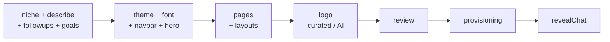

# Other — frontend-main-messages

# frontend-main-messages — i18n Message Catalogs

Static translation catalogs for the marketing/signup app (`frontend-main`). These are pure JSON data files with no code, no imports, and no call graph — they are loaded at request time by `next-intl` and consumed via the `useTranslations` / `getTranslations` hooks throughout `frontend-main`.

## Purpose

`frontend-main` is the public face of Contentor: the marketing site, pricing page, coach signup, login, and the AI-first onboarding wizard. Every user-visible string in those surfaces lives here rather than in JSX, so that the app can serve two locales from the same components:

| Locale | Routed via | Directory |
|---|---|---|
| English (default) | `Host(localhost)` / `Host(contentor.app)` | `messages/en/` |
| Turkish | `Host(tr.localhost)` / `Host(tr.contentor.app)` | `messages/tr/` |

The locale is not a URL path segment — it is derived from the host (apex vs. `tr.` subdomain) and Caddy routes both to the same `nextjs-main` container. That means **the catalog pair is the only thing that differs between the two sites**; a key present in `en/` but missing in `tr/` is a visible defect on the Turkish site, not a build error.

## Namespace layout

Four namespaces per locale, mirrored 1:1 between `en/` and `tr/`:

```
messages/
├── en/
│   ├── auth.json        signup, login, magic-link callback
│   ├── common.json      nav, footer, region banner
│   ├── marketing.json   landing page sections + help bot
│   ├── pricing.json     plan cards, pricing FAQ
│   └── wizard.json      the onboarding wizard (largest file)
└── tr/                  same five files, same key tree
```

### `auth.json`

Three top-level groups tracking the three auth surfaces:

- **`signup`** — the two-step signup form (`brandStepHeading` → `contactStepHeading`), the "check your email" confirmation, and a nested **`signup.verify`** group for the post-click verification screen. `verify` models a small state machine in copy: `verifying*` → `provisioning*` → `ready*` / `error*`, with each state carrying its own `Eyebrow` / `Title` / `Subtitle` triple. There is also an `authTitle` / `authSubtitle` / `authSubmit` variant used when an already-signed-in coach creates a *second* platform (no email verification needed).
- **`login`** — magic-link form plus `googleCta` and a `googleErrors` map. The `googleErrors` keys (`googleDenied`, `invalidState`, `tenantMismatch`, `tokenExchangeFailed`, `userinfoFailed`, `noEmail`) correspond to the failure modes the Django OAuth callback returns as an error code in the redirect query string — the frontend looks the code up in this map and falls back to `generic`. **Adding a new OAuth failure code on the backend requires a new key in both locales**, otherwise the user sees a raw `next-intl` missing-key fallback.
- **`callback`** — the interstitial shown while a magic-link token is exchanged.

### `common.json`

Chrome shared by every page: `nav` (including the authenticated-only `signOut` / `dashboard` / `myPlatforms` entries), `footer`, and `regionBanner`.

Two details worth knowing:

- `footer.switchLanguage` is **the name of the other language, from this locale's perspective** — `en/` says `"Türkçe"`, `tr/` says `"English"`. The sibling `switchLanguageEnglish` is inverted (`en/`: `"English"`, `tr/`: `"Türkçe"`). Getting these backwards is a silent bug that only shows up by eye, so treat the asymmetry as intentional.
- `regionBanner` is the cross-locale nudge shown when a visitor's inferred region doesn't match the host they landed on — the `en/` copy offers Turkish and the `tr/` copy offers English.

### `marketing.json`

The landing page, section by section, in roughly the order they render: `hero` → `socialProof` → `stats` → `features` → `foundingCreators` → `howItWorks` → `faq` → `finalCta`, plus `helpBot`.

Notable structural conventions:

- **`features.items.*`** each carry `title`, `description`, and a `points` map of four short bullets. The `points` keys are semantic (`webrtc`, `whitelabel`, `drip`) rather than positional, so reordering bullets in the component doesn't require a catalog change — but it also means a key name can drift from its copy (`autopilot.points.automation` currently reads "Student progress tracking", and `courses.points.drip` reads "One-time prices or subscriptions"). Don't rename these keys to chase the copy; the component references them.
- **`features.illustrations`** holds strings baked into the decorative feature mockups (`progress`, `live`, `lessonsCount`, `watchingCount`) — these are inside SVG/DOM illustrations, not prose, which is why they live in their own group.
- **`stats.*.value`** contains hard-coded, locale-specific numerals: `en/` shows `"$19"` and `"100%"`, `tr/` shows `"$19"` and `"%100"` (Turkish puts the percent sign first). Percentages, currency, and durations here are **copy, not formatted numbers** — there's no ICU number formatting involved.
- **`helpBot`** covers the marketing-site AI assistant, including its human-handoff states (`talkToHuman`, `humanRequestedLine`, `agentJoined`, `assistantResumed`, `humanModeNotice`). The last three take a `{name}` argument — the superadmin agent who joined the conversation.

### `pricing.json`

Flat at the top (`title`, `cta`, `popular`, `periods`, `errors`) with a `plans` map for the three tiers.

Each plan follows a two-part pattern that is easy to get wrong:

```jsonc
"starter": {
  "features": { "students": "...", "live": "...", "domain": "..." },  // ALL feature labels
  "included": ["students", "live"]                                     // which are checked
}
```

`features` is the full label set for **every** row rendered on that plan's card, including features the plan does *not* have; `included` is the subset rendered as satisfied. That's why `free.features` lists `live`, `branding`, and `domain` but `free.included` omits them — the card shows those rows struck through / greyed rather than hiding them, giving all three columns the same row count. **Any key added to `features` must be considered for `included`; any key in `included` must exist in `features`.**

Prices are also literal strings, and the two locales diverge in currency: `en/` uses `$0` / `$19` / `$49`, `tr/` uses `₺0` / `₺999` / `₺2.499` (with Turkish thousands separator). These are display-only — the actual amounts charged come from the backend `Plan` model and Stripe, so a change here does **not** change billing. Keeping them in sync with `apps.billing` plan data is a manual chore. `comingSoon` / `comingSoonNote` and `errors.priceNotAvailable` cover the case where a region has no configured Stripe price yet.

### `wizard.json`

The largest catalog, and the only one with an extra nesting level: everything is under a single `wizard` root key (so consumers use `useTranslations('wizard.wizard')`-style paths or a namespace helper — check the existing wizard components rather than assuming). It tracks the onboarding wizard step-for-step:



Key groups and how they map to wizard state:

- **`chapters`** — the six progress-rail labels (`business`, `look`, `pages`, `logo`, `launch`, `content`).
- **`common`** — shared step chrome: `back`, `continue`, `skip`, `finishRest` ("Finish the rest for me" — the AI auto-complete escape hatch), `recommended`, `showAll`.
- **Enum-mirroring maps.** Several groups are keyed by backend/config identifiers and must stay aligned with them:
  - `niches.*` — `yoga`, `pilates`, `fitness`, `pole_dance`, `belly_dance`, `face_yoga`, `makeup`, `general`; each has `label` + `tagline`. These slugs match the niche registry in `apps.demo_seed`.
  - `goals.items.*` — `sell_courses`, `run_live_classes`, `in_person_events`, `sell_downloads`, `email_marketing`, `build_community`, `write_blog`, `send_announcements`. The selected set drives which pages and nav entries the provisioned tenant gets.
  - `themes.*`, `fonts.*` (label + `vibe`), `navbarLayouts.*`, `heroStyles.*` (label + `desc`).
  - `layouts.*` — flat, dash-namespaced keys (`home-spotlight`, `about-portrait`, `pricing-trust`, …), three variants per page type. The key **is** the layout id sent to the backend.
  - `provisioning.*` — keyed by the provisioning stage the backend reports (`schema`, `config`, `seed`, `ai_copy`, `finalizing`), so the progress copy is looked up directly by stage name. A new backend stage without a matching key renders nothing useful.
- **`logo` / `upgrade` / `aiChat`** — the logo chapter's three paths (wordmark, curated gallery, AI chat) plus the paywall. `logo.ai.locked`, `upgrade.*`, and `aiChat.quota` are the plan-gating strings: AI logo design is paid-only, and `upgrade.syncing` / `syncSlow` / `retry` cover the window where Stripe has taken payment but the webhook hasn't landed yet.
- **`resume`** — the expired-signup-link recovery screen, with three terminal states: resend-succeeded (`sentTitle`), signup-already-completed (`closedTitle` → `closedCta`), and unrecoverable (`failed` → `startOver`).
- **`revealChat`** — the post-launch refinement chat, including the free-refinement quota (`remaining` takes `{count}`, `exhausted` is the after-the-fact message).
- **`content`** — the optional first-course / first-event / first-post step, shown while the tenant schema is still being created (`provisioning`, `provisioningHint`).

## Interpolation

Only ICU simple arguments are used — no plurals, no select, no date/number skeletons:

| Argument | Where |
|---|---|
| `{email}` | `auth.signup.verifyDescription`, `auth.login.checkInbox` |
| `{name}` | `auth.signup.authSubtitle`, `marketing.helpBot.agentJoined` / `humanModeNotice` |
| `{domain}` | `auth.signup.verify.openCta` |
| `{year}` | `common.footer.copyright` |
| `{count}` | `marketing.features.illustrations.lessonsCount` / `watchingCount`, `wizard.revealChat.remaining` |

`{count}` here is a plain substitution, not an ICU `plural` — the surrounding copy is written to work for any number ("Free refinements left: 1"). If you need real pluralization, you'll be adding the first ICU plural in this catalog; do it in both locales at once, since Turkish has different plural rules than English.

## Conventions to follow when editing

1. **Both locales, same commit.** `next-intl` will render a fallback (usually the key path) for a missing message. There is no lint rule catching en/tr drift, so parity is on you.
2. **Keys are stable identifiers, copy is not.** Key names are referenced from components and, for the enum-mirroring maps above, from backend slugs. Rewriting copy is safe; renaming a key is a code change.
3. **Semantic grouping over page position.** New landing-page section → new top-level group in `marketing.json`. New wizard step → new group under `wizard`. Don't add strings to `common.json` unless they genuinely appear on multiple surfaces.
4. **Ellipsis character, not three dots.** In-flight states use `…` (`"Sending…"`, `"Saving…"`, `"Designing…"`). The one exception in the tree is `pricing.ctaProcessing` (`"Processing..."` / `"İşleniyor..."`) — match the local file when in doubt.
5. **Voice differs between files, deliberately.** The Turkish wizard copy uses informal second person (`sen` — "Ne öğretiyorsun?"), while `tr/auth.json` and `tr/wizard.json`'s `resume` group use formal `siz` ("Hesabınızı oluşturun"). This mirrors the English tone shift (conversational wizard, businesslike auth). Preserve the register of the file you're editing rather than normalizing.
6. **Prettier formats these.** `make format` runs Prettier over both frontends, which includes these JSON files — expect it to normalize the `included` arrays' line breaking (short arrays inline, long arrays one-per-line).

## Where these connect

- **Consumed by** `frontend-main` components via `next-intl`; the namespace name equals the filename (`auth`, `common`, `marketing`, `pricing`, `wizard`).
- **Backend coupling** (all by convention, unenforced): OAuth error codes from `apps.accounts` auth backends → `auth.login.googleErrors`; niche slugs from `apps.demo_seed` → `wizard.niches`; wizard layout ids and provisioning stage names from `apps.core.onboarding` → `wizard.layouts` / `wizard.provisioning`; plan names and prices from `apps.billing` → `pricing.plans`.
- **Not shared with `frontend-customer`.** The tenant-facing portal has its own strings; tenant-facing copy is generated per-tenant by the wizard's AI copy step, not translated here.
- **E2E tests** in `e2e/specs/` select on some of this copy. Changing a heading or button label can break a spec — `make e2e-changed` maps frontend changes to the affected specs.