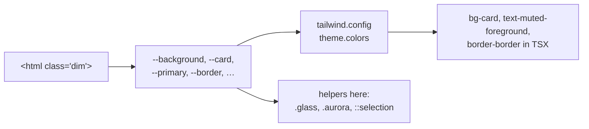

# Other — frontend-main-src

# Other — `frontend-main/src`

This module is a single file: `frontend-main/src/styles/globals.css`. It is the global stylesheet for the **marketing site** Next.js app (`frontend-main/`) — the apex/locale host that serves the landing page, pricing, signup, login, and coach onboarding.

There is no JavaScript here, so there is no call graph. But the file is not inert: it is the only place where the app's design tokens exist, and roughly a hundred class names and `data-*` attributes defined here are consumed by name from TSX across the app. Changing a selector here is a cross-file rename with no compiler to catch it.

## What it contains

Four concerns, in this order:

1. **Tailwind entrypoint** — `@tailwind base/components/utilities`.
2. **Design tokens** (`@layer base`) — one CSS custom-property block per theme.
3. **Base resets** (`@layer base`) — universal border color, font smoothing, body background, `::selection`.
4. **Plain (unlayered) utilities** — typography helpers, surfaces, ambient backdrops, keyframes, animation classes, nav/FAQ interaction bits, and reduced-motion overrides.

Sections 1–3 live inside `@layer base`, so Tailwind utilities win over them. Section 4 is *outside* any layer, which puts it after Tailwind's `utilities` layer in the cascade — so `.glass`, `.text-display`, `.animate-float` etc. will beat an equal-specificity Tailwind class. That is deliberate for the surface/typography helpers; it is also the most common source of "why isn't my `bg-*` applying" confusion when a `.glass*` class is on the same element.

## The token system

The token vocabulary is ported from the user's **house design system** (`s3Administrator` lineage — see the `house-design-system` skill for the canonical spec). Two rules make it work:

- **Color is OKLCH and token-only.** Every color is `oklch(L C H)`. No hex, no `rgb()`, no raw Tailwind palette colors (`text-slate-500`, `bg-zinc-900`) in app code.
- **Every theme defines the same token names.** Because the names never change, a component styled purely with tokens renders correctly in all seven themes with zero per-theme code.

### Themes

Theme selection is a class on `<html>`. Seven themes across six blocks:

| Selector | Family | Character |
|---|---|---|
| `:root` | light | shadcn neutral light — the default, no class needed |
| `.matte` | light | warm off-white paper, blue primary |
| `.dark` | dark | shadcn neutral dark |
| `.dim` | dark | soft neutral dark with a faint warm tint — the comfortable middle |
| `.graphite` | dark | warm-gray, cyan-blue primary |
| `.graphite-plus`, `.graphite-bright` | dark | shared block: amber primary, higher contrast, heavier borders (38–44% white) |

`graphite-plus` and `graphite-bright` are two names for one token block. If you fork them, split the selector list rather than adding overrides.

### Token groups

Per theme: surface pairs (`--background`/`--foreground`, `--card`/`--card-foreground`, `--popover`/…), semantic roles (`--primary`, `--secondary`, `--muted`, `--accent`, `--destructive`, each with a `-foreground`), chrome (`--border`, `--input`, `--ring`), five `--chart-1..5`, a nine-token `--sidebar-*` set, and `--radius` (defined once on `:root` at `0.625rem`).

**Marketing-specific tokens** — `--marketing-accent` and `--marketing-accent-foreground` — are the one addition beyond the house set. They exist only in this app and drive the teal-ish brand accent: `::selection`, `.brand-gradient` / `.text-luminous`, `.aurora*`, and `.warm-gradient`. Light themes use `oklch(0.55 0.15 195)`; all dark themes lift it to `oklch(0.65 0.15 195)`. Add any new marketing flourish on top of these rather than hardcoding the hue.

Dark themes express `--border`/`--input` as translucent white (`oklch(1 0 0 / 10%)` → `44%` for graphite-plus) so borders pick up whatever sits behind them.

The mapping from token → Tailwind utility name lives in `frontend-main/tailwind.config.*`, not here. Adding a token is therefore a **two-file** change: define it in every theme block in this file, then expose it in the Tailwind theme. `tailwind.config` also wires the `dark:` variant to fire under **all five dark families**, not just `.dark` — so `dark:` in TSX is a "is this a dark theme" check, which is why per-theme conditionals are almost never needed in components.

## Helper classes

### Typography
`.text-display` (Geist via `--font-geist-sans`, `-0.03em` tracking, 600), `.text-headline`, `.text-eyebrow` (uppercase, wide tracking, small). No serif face anywhere — the system is Geist-only.

`.brand-gradient` and `.text-luminous` are aliases: a 135° `--marketing-accent` → `--primary` gradient clipped to text. `.text-gradient` is a **deliberate no-op** — it just sets `color: var(--foreground)`. It's a legacy name kept so older markup renders in the current flat style instead of a stale gradient. Same story for `.animate-aurora`, which is `animation: none`, and `.glow`, which is now a hairline ring rather than a glow. Don't "fix" these by restoring the effect; either leave them or remove the call site.

### Surfaces
`.glass`, `.glass-card`, `.glass-strong`, `.glass-pane`, `.ring-hairline`. The names are historical — there is no backdrop blur or translucency left. They are clean `--card` + `--border` + a 1–3px shadow. `.glass-pane` additionally rounds to `calc(var(--radius) + 4px)`.

### Ambient backdrops
`.aurora` / `.aurora-soft` are absolutely positioned, `pointer-events: none`, `z-index: 0` radial washes at 8%/5% opacity, blurred 90–110px — they need a positioned ancestor and content at a higher stacking context. `.grid-fade` and `.bg-dot-pattern` derive their line/dot color from `--foreground` via relative color syntax (`oklch(from var(--foreground) l c h / 0.04)`), so they invert with the theme for free; `.grid-fade` additionally masks itself to an ellipse. `.warm-gradient` is a 6%-opacity `--marketing-accent` wash.

Note the relative-color dependency: `oklch(from …)` is a modern-browser feature. It degrades to no visible pattern rather than to a wrong color, which is acceptable for decorative backdrops but is not safe to reuse for anything load-bearing.

### Animation and reveal

Keyframes: `reveal`, `float`, `pulse-soft`, `scale-in`, `marquee`, plus three reveal variants (`reveal-scale`, `reveal-zoom`, `reveal-blur`) and `hero-fade`.

The scroll-reveal contract is the part most likely to bite a contributor, because it spans CSS and JS:

- An element starts as `.animate-on-scroll` (opacity 0, translated by `--reveal-y`, default `24px`).
- A scroll observer in the app adds `.visible`, which fires the animation.
- Direction/timing are tunable per element through inline custom properties: `--reveal-x`, `--reveal-y`, `--reveal-duration`, `--reveal-delay`, `--reveal-blur`, `--reveal-from-scale`.
- The variant is chosen with `data-variant="scale" | "zoom" | "blur"`; omit it for the default fade-up.
- `[data-reveal-h]` is a lighter transition-based (not animation-based) alternative with the same `.visible` trigger.

If a section renders permanently invisible, the observer never added `.visible` — that's a JS/observer bug, not a CSS one.

`.stagger-children` hardcodes delays for `:nth-child(1..6)` at 80ms steps. A seventh child animates with **zero delay**, breaking the cascade — extend the list if you need more.

`.hero-scroll-out` uses native scroll-driven animation, feature-gated behind `@supports (animation-timeline: view())`. Where unsupported, the hero simply doesn't fade — no fallback JS.

### Interaction bits
`.nav-link` draws a 4px dot under the label via `::after`, scaled in on `:hover` *or* `[data-active="true"]` — so the active-route state is driven by that attribute, which the nav component must set. `.btn-press` is a 0.98 active-scale. `.faq-content` animates a `
` disclosure by transitioning `grid-template-rows` from `0fr` to `1fr` on `details[open]`, with the inner `> div` clipping overflow — the markup must be `details > … > .faq-content > div > content` for this to work.

Anchor scrolling: `scroll-behavior: smooth` on `html` is gated behind `prefers-reduced-motion: no-preference`, and `section[id]` gets `scroll-margin-top: 6rem` to clear the fixed header.

### Reduced motion
A final `@media (prefers-reduced-motion: reduce)` block hard-disables animation, transition, opacity, transform, and filter (`!important`) for `.animate-on-scroll`, `.hero-scroll-out`, `.animate-float`, `.animate-pulse-soft`, and `[data-reveal-h]`. **Any new always-on or scroll-triggered animation must be added to this list.** This is the CSS half of the project's "motion is CSS-only and reduced-motion-safe" rule; `scripts/check-loading-patterns.mjs` (run by `make lint`) enforces the JS-side half — no raw `animate-spin`/`Loader2` in app code, spinners come from `<Spinner>` / `<Button loading>`.

## How it connects to the rest of the codebase

- **Imported once**, by `frontend-main`'s root layout, which also supplies `--font-geist-sans` through `next/font`. `.text-display` silently falls back to `system-ui` if that variable is missing.
- **`tailwind.config`** consumes the tokens as named colors and defines the multi-family `dark:` variant. Neither file is complete without the other.
- **`frontend-customer/`** is a separate app with its own stylesheet. This file does *not* affect the tenant portal, and tenant theming (per-tenant colors from `apps.tenant_config`) is a different mechanism entirely. Don't assume a fix here propagates.
- **The `house-design-system` skill** is the source of truth for token semantics, the radius/spacing/icon scales, and the interaction rules (3px focus rings, destructive-action confirm, etc.). Consult it before inventing a token.

## Contributing rules of thumb

1. **Never hardcode a color.** Use a token; if none fits, add one to *all six* theme blocks plus `tailwind.config`.
2. **Adding a theme** means adding every token name — a missing token silently inherits from `:root`/an ancestor and produces a subtly broken theme rather than an obvious failure.
3. **Renaming a helper class is a codebase-wide grep.** These names are referenced as string literals in TSX; nothing type-checks them. `make typecheck` will not catch a stale `.glass-pane`.
4. **New animation → add it to the reduced-motion block.**
5. Prefer Tailwind utilities in components; add to this file only for things utilities can't express (keyframes, `::after` decorations, relative-color patterns, `@supports` gates).
6. Verify against every theme, not just the one you're viewing — switch the `<html>` class in devtools. The dark families differ meaningfully in border opacity and primary hue, and `graphite-plus`'s amber primary is where low-contrast mistakes surface first.