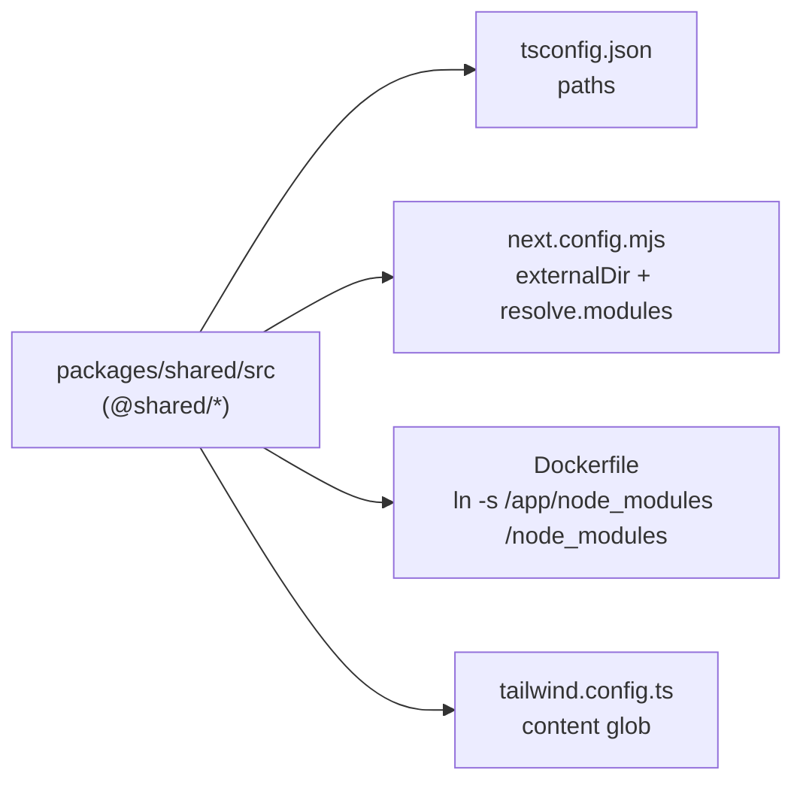

# Other — frontend-main

# Other — frontend-main

This module is the **build, tooling, and configuration layer** of `frontend-main/` — the marketing/signup/onboarding Next.js app. It contains no application logic and no exported runtime symbols; it is the set of files that decide *how* the app is compiled, containerized, styled, typed, and tested. There are no call-graph edges here by design: these files are consumed by `next`, `tsc`, `docker build`, `tailwindcss`, and `vitest`, not by application code.

Files covered:

| File | Owns |
|---|---|
| `Dockerfile` | dev + production images, monorepo `packages/` resolution |
| `next.config.mjs` | standalone output, `externalDir`, router `staleTimes`, `/api/v1` rewrite, next-intl plugin wiring |
| `package.json` | dependency set + the `dev`/`build`/`lint`/`typecheck`/`test` scripts |
| `tailwind.config.ts` | multi-theme `dark:` variant, house colour tokens, content globs including `packages/shared` |
| `postcss.config.mjs` | tailwind + autoprefixer |
| `tsconfig.json` | strict TS, `@/*` and `@shared/*` path aliases |
| `vitest.config.ts` | pure-logic unit test scope |

## The cross-cutting problem: `packages/shared` lives outside the app

`frontend-main` and `frontend-customer` share code from the sibling `packages/shared/` directory (imported as `@shared/*`). That directory has **no `node_modules` ancestor of its own**, so anything it imports (`react`, `lucide-react`, …) is unresolvable by normal upward lookup. Three config files each solve one half of this, and all three must stay in sync — changing one without the others produces a build that passes in one tool and fails in another.



- **`tsconfig.json`** maps `@shared/*` → `../packages/shared/src/*` so the type checker resolves the alias.
- **`next.config.mjs`** sets `experimental.externalDir: true` (Next refuses to compile files outside the app root otherwise) and appends this app's `node_modules` to `config.resolve.modules` so webpack can resolve bare specifiers *from* shared files.
- **`Dockerfile`** creates a root-level symlink `/node_modules → /app/node_modules` in both the `dev` and `builder` stages. This is deliberately a symlink rather than `tsconfig` `paths` entries for react/etc.: adding paths mappings for bare specifiers breaks `@types` resolution project-wide (noted inline in the Dockerfile, from Task 3 of the vibe-coding-restructure plan).
- **`tailwind.config.ts`** adds `../packages/shared/src/**/*` to `content`. Without it, classes used *only* in shared components are never generated — the comment records a real regression (`max-h-32` dropped, unconstrained image pushing the gallery modal's Save/Delete buttons offscreen).
- **`vitest.config.ts`** re-declares both aliases (`@`, `@shared`) independently, since Vitest does not read `tsconfig` paths.

**If you add a new shared package or move `packages/shared`, all five of these need updating.**

## Docker: two targets from one file

The `Dockerfile` is multi-stage with two entry points, both built with the **repo root as build context** (so `packages/` is copyable):

- **`dev`** — `node:20-alpine`, `npm ci`, then `CMD npm run dev`. `docker-compose.yml` builds `target: dev` for the `nextjs-main` service and bind-mounts `src/`, `public/`, `messages/`, `next.config.mjs`, `middleware.ts`, `package.json`, and `../packages` over the image so everything hot-reloads. Note the single-file mounts: adding a new top-level file (a new config, a new root-level module) requires a compose mount entry or the container keeps the baked-in copy.
- **`deps` → `builder` → `runner`** — production. `builder` runs `npm run build` with `output: "standalone"`; `runner` copies only `public/`, `.next/standalone`, and `.next/static`, drops to a non-root `nextjs` user (uid 1001), and starts `node server.js` on `0.0.0.0:3000`. `docker-compose.prod.yml` builds `target: runner`.

### Build-time vs run-time env

`NEXT_PUBLIC_*` values are **inlined into the client bundle at build time**, so they arrive as Docker `ARG`s promoted to `ENV` in the `builder` stage:

- `NEXT_PUBLIC_API_URL`
- `NEXT_PUBLIC_BASE_DOMAIN`

`docker-compose.prod.yml` passes them as `build.args` (defaults `http://django:8000` and `${CONTENTOR_DOMAIN:-contentor.app}`); dev passes them as plain `environment` because `next dev` reads them at boot. **Consequence: changing `NEXT_PUBLIC_BASE_DOMAIN` in prod requires a rebuild, not a restart.** This matters for tenancy — tenant domains are constructed as `${slug}.${BASE_DOMAIN}`.

## Next.js configuration

```js
output: "standalone"
experimental: { externalDir: true, staleTimes: { dynamic: 30, static: 180 } }
```

- **`staleTimes.dynamic: 30`** overrides Next 14.2's default of `0`, which refetched the RSC payload on every revisit and made panel-to-panel navigation feel slow. The inline rationale for why this is safe is worth preserving: the router cache holds the *payload*, not component state, so client pages still remount and re-`clientFetch` on arrival — freshness comes from the client fetch, not the router cache.
- **`rewrites()`** proxies `/api/v1/:path*` → `${NEXT_PUBLIC_API_URL || "http://django:8000"}/api/v1/:path*`. This is a convenience path for same-origin client calls; the primary browser→Django route in both dev and prod is **direct via Caddy**, not through Next. Server-side `fetch()` to Django must still set `X-Tenant-Domain` — the rewrite does nothing for tenancy resolution.
- **`withNextIntl('./src/i18n/request.ts')`** wraps the whole config. The plugin is what makes `getRequestConfig` in `src/i18n/request.ts` the message loader; that config resolves the locale from the request host via `resolveHost()` in `src/i18n/config.ts` (apex `contentor.app` → `en`, `tr.contentor.app` → `tr`) and loads the `marketing`, `pricing`, `auth`, `common`, and `wizard` namespaces from `messages/<locale>/`. If you add a namespace JSON, add it to that `Promise.all` — the config layer only points the plugin at the file.

## Tailwind and theming

`tailwind.config.ts` extends `packages/shared/tailwind-preset` (shared loading/feedback keyframes and animations — `shimmer`, `fade-in`, `fade-in-up`, `progress-indeterminate` — used by the skeleton/spinner components in both apps).

The distinctive piece is the **`darkMode` variant list**. Rather than the default `.dark` class, `dark:` is configured to fire under every dark-family theme:

```ts
darkMode: ["variant", [
  "&:is(.dark, .dark *)", "&:is(.dim, .dim *)", "&:is(.midnight, .midnight *)",
  "&:is(.graphite, .graphite *)", "&:is(.graphite-plus, .graphite-plus *)",
  "&:is(.graphite-bright, .graphite-bright *)",
]]
```

`matte` is intentionally absent — it is a light theme. **When adding a new dark-family theme, add its class here or every `dark:` utility silently no-ops under it.**

All colours are CSS-variable indirections (`--background`, `--primary`, `--sidebar-*`, `--chart-1..5`) rather than literal values, so themes swap by changing variables, not classes. Two compatibility shims exist:

- **`brand.*`** (`brand.primary`, `brand.accent`, `brand.warm`, `brand.surface`, `brand.deep`) — legacy marketing aliases re-pointed to house tokens so pre-existing pages adopt the palette without edits.
- **`fontFamily.display`** aliases the Geist sans stack: there is no serif in the house system, so legacy `font-display` / `.text-display` usages stay on-brand.

Landing-page motion lives here too — `reveal`, `marquee`, `scale-in`, `aurora` keyframes/animations. Per repo convention all motion is CSS-only and must be `motion-safe:`-gated at the call site; `scripts/check-loading-patterns.mjs` (run in `make lint`) enforces the related spinner/skeleton rules.

`borderRadius` derives every step from `var(--radius)` via `calc()`, so a single variable rescales the whole radius ramp. The only plugin is `@tailwindcss/typography`.

## TypeScript

Strict, `noEmit`, `moduleResolution: "bundler"`, `jsx: "preserve"`, with the Next TS plugin and the two path aliases. `include` covers `next-env.d.ts`, all `.ts`/`.tsx`, and `.next/types` (so generated route types are checked).

`npm run typecheck` (`tsc --noEmit`) is wired into the repo-level `make typecheck`, which runs both apps. It is currently **advisory — not gated in `make lint`** (Task 3 of `docs/superpowers/plans/2026-07-17-vibe-coding-restructure.md`). Treat a clean `typecheck` as part of "done" even though CI won't catch it for you.

## Testing scope

`vitest.config.ts` restricts collection to `src/**/__tests__/**/*.test.ts` — **pure-logic tests only** (currently the wizard logic, e.g. `src/lib/wizard/__tests__/machine-content.test.ts`). React components are deliberately not unit-tested here; they are covered by `npm run build` (type + compile errors) plus the Playwright suite in `e2e/`. `frontend-customer/vitest.config.ts` uses the identical split.

Note the `.test.ts` (not `.test.tsx`) pattern: a component test would not be picked up even if written. If you need component-level coverage, add an e2e spec and its entry in `e2e/impact-map.json` (the selector self-test in `make lint` fails on unmapped specs).

## Practical notes when changing this module

- **Adding a dependency** to `package.json` requires rebuilding the image, not just a `make dev` restart — `node_modules` lives inside the container, not in the bind mount.
- **Adding a root-level file** to `frontend-main/` needs a matching bind mount in `docker-compose.yml` for it to hot-reload in dev.
- **Memory:** dev sets `NODE_OPTIONS=--max-old-space-size=3072`; prod caps the container at `mem_limit: 256m` for the standalone server. `nextjs-customer` OOMs are a known cause of spurious 502s in e2e; the same class of failure applies here under heavy build load.
- **Verification:** after touching anything in this module, run `npm run build` (catches webpack/alias/externalDir breakage that `next dev` tolerates) and `make dev` — per repo convention, config changes aren't done until the dev stack comes up clean.
