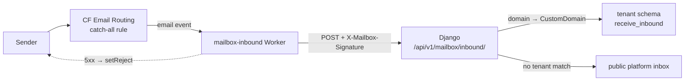

# Other — infra-cloudflare

# Other — `infra/cloudflare`

The only thing under `infra/cloudflare/` is **`mailbox-worker/`**: a standalone Cloudflare Email Worker, deployed as `mailbox-inbound`, that is the entry point for *all* inbound email for coach domains. It is the one piece of Contentor that runs outside the Docker stack and outside the Django/Next.js codebase — it lives on Cloudflare's edge, has its own `package.json`, and is deployed with `wrangler`, not `make deploy`.

Everything else about receiving mail (tenant resolution, persistence, attachments) is Django's job. The Worker's entire contract is: *parse the message, sign it, POST it, decide whether to bounce.*

## Layout

```
infra/cloudflare/mailbox-worker/
├── src/index.js      # the Worker — one `email()` handler, ~80 lines
├── wrangler.toml     # name = "mailbox-inbound", main, WEBHOOK_URL var
├── package.json      # postal-mime (runtime), wrangler (dev)
└── README.md         # deploy + secret setup runbook
```

No build step, no bundler config — `wrangler` bundles `src/index.js` directly. `type: "module"` + the `export default { email }` shape is the modern Workers email-handler format; `compatibility_date = "2024-11-01"`.

## Request path



One account-level Worker serves every tenant zone. There is no per-tenant Worker, no per-tenant secret, and no per-zone script config — the recipient domain in the payload is what selects the tenant, on the Django side.

## The Worker (`src/index.js`)

### `email(message, env)`

The single exported handler. Steps, in order:

1. **Parse** — `PostalMime.parse(message.raw)` turns the raw RFC 822 stream into `{subject, text, html, messageId, inReplyTo, references, attachments}`.
2. **Build the payload** — a flat JSON object. Note the field naming: the Worker emits snake_case (`message_id`, `in_reply_to`, `content_b64`) because Django consumes it directly as `receive_inbound()` kwargs. `from`/`to` come from `message`, not the parsed body — envelope addresses, not header addresses. `references` is normalised from `postal-mime`'s array form to a single space-joined string.
3. **Sign** — `sign(env.MAILBOX_INBOUND_SECRET, payload)` computes HMAC-SHA-256 over the exact JSON string via WebCrypto (`crypto.subtle.importKey` + `sign`) and hex-encodes it with `toHex`.
4. **POST** — to `env.WEBHOOK_URL` with `Content-Type: application/json` and `X-Mailbox-Signature: <hex>`.
5. **Decide the SMTP outcome** — see below.

### Attachment packing

`packAttachments()` inlines attachment bytes as base64 in the JSON body (there is no separate upload step from the edge). Two caps:

| Constant | Value | Meaning |
|---|---|---|
| `MAX_FILE_BYTES` | 10 MB | single attachment ceiling |
| `MAX_TOTAL_BYTES` | 20 MB | cumulative ceiling across one message |

An attachment that breaches either cap — or whose `content` isn't an `ArrayBuffer` — is still emitted, but as `{filename, content_type, size, omitted: true}` with no bytes. Django honours `omitted` and creates a `MessageAttachment` row with an empty `storage_key`, so the coach sees *that* a file was sent and why it isn't downloadable. Never silently drop an entry from the array; the metadata is the point.

`toBase64()` chunks at `0x8000` bytes before `String.fromCharCode(...)` — spreading a multi-MB `Uint8Array` in one call blows the argument limit. Keep the chunking if you touch this.

`MAX_FILE_BYTES` here is deliberately the same 10 MB as `MAX_FILE_BYTES` in `backend/apps/mailbox/attachments.py`. They're independent constants in two languages; changing one without the other means the edge sends bytes Django will reject as `omitted`.

### Bounce semantics

```js
if (!resp.ok) {
  console.error(`mailbox inbound webhook returned ${resp.status}`);
  if (resp.status >= 500) message.setReject("Temporary failure delivering to mailbox");
}
```

- **2xx** — consumed, done.
- **5xx** — `message.setReject(...)`, so Cloudflare bounces to the sender with a temporary failure. The sender's MTA retries; mail isn't lost during a Django outage.
- **4xx** — logged and consumed. No bounce, no retry.

The 4xx-is-a-drop rule has a sharp edge worth knowing: **a wrong or missing `MAILBOX_INBOUND_SECRET` makes Django return 401, which the Worker treats as a silent drop.** Mail vanishes with no bounce to the sender and no visible error anywhere except `wrangler tail`. If a coach reports "I get no mail at all," check the secret pair before anything else.

Django deliberately answers **200** for foreign/unclaimed domains too (`views.inbound`, final return), so unroutable mail is consumed rather than bounced — no probing of which domains exist.

## Django side of the contract

| Concern | Code |
|---|---|
| Signature verification | `apps/mailbox/signing.py` — `verify_inbound_signature()` recomputes `sign_payload(request.body, settings.MAILBOX_INBOUND_SECRET)` and compares with `hmac.compare_digest` |
| Endpoint | `apps/mailbox/views.py::inbound` — `@csrf_exempt`, `@authentication_classes([])`, `AllowAny`; 401 on bad signature, 400 on unparseable JSON |
| Tenant resolution | recipient domain → `CustomDomain.objects.filter(domain=..., mailbox_enabled=True, provisioning_status="live")`; fallback `resolve_platform_recipient()` for `<x>@PLATFORM_MAIL_DOMAIN`; fallback public-schema platform inbox |
| Persistence | `apps/mailbox/inbound.py::receive_inbound` — dedupes on `message_id`, creates `Message` + `MessageAttachment`, bumps `Conversation.unread_count` |

Two invariants the Worker must not break:

1. **`WEBHOOK_URL` must be the apex host** (`https://contentor.app/api/v1/mailbox/inbound/`), never a tenant subdomain. `views.inbound` reads `CustomDomain` from the **public** schema to resolve the tenant; if the request arrived on a tenant host, that table would be unreachable and every lookup would return `None`. The comment in `views.inbound` says this explicitly — respect it.
2. **The signed bytes must be the bytes Django reads.** Django HMACs `request.body` verbatim. Anything that re-serialises the JSON in between (a proxy, a rewrite, a "helpful" charset change) invalidates the signature and, per the rule above, silently drops the mail.

## How a domain gets bound to this Worker

The Worker only ever runs for zones whose Email Routing **catch-all rule** points at it. Django does that binding via `get_cloudflare().enable_email_routing(zone_id=..., worker_name=settings.CLOUDFLARE_EMAIL_WORKER_NAME)`, which (`apps/domains/cloudflare/client.py`) POSTs `/zones/{zone}/email/routing/dns` to install Cloudflare's MX records, then PUTs the catch-all rule with `{"type": "worker", "value": [worker_name]}`.

Two call sites:

- **`apps/domains/provisioning.py::_step_email_auth`** — during first provisioning of a custom domain. If `mailbox_enabled` and `CLOUDFLARE_EMAIL_WORKER_NAME` is set → bind to the Worker; else if `forward_to_email` is set → a plain forward rule instead.
- **`apps/mailbox/views.py::mailbox_settings`** — when a coach flips the mailbox on later. This intentionally **replaces** any existing forward rule: the in-app mailbox becomes the destination for that domain's mail.

Both are no-ops when `CLOUDFLARE_EMAIL_WORKER_NAME` is empty — `mailbox_enabled` still persists, but no routing is bound and the coach receives nothing. That's the second thing to check after the secret.

## Configuration

| Where | Key | Value |
|---|---|---|
| `wrangler.toml` `[vars]` | `WEBHOOK_URL` | `https://contentor.app/api/v1/mailbox/inbound/` (committed, not secret) |
| Wrangler secret | `MAILBOX_INBOUND_SECRET` | `openssl rand -hex 32`, set via `npx wrangler secret put` |
| `.env.prod` | `MAILBOX_INBOUND_SECRET` | **the same value** — read into `settings.MAILBOX_INBOUND_SECRET` (`config/settings/base.py:519`) |
| `.env.prod` | `CLOUDFLARE_EMAIL_WORKER_NAME` | `mailbox-inbound` — read into `settings.CLOUDFLARE_EMAIL_WORKER_NAME` (`base.py:520`) |

Deploy is independent of the app deploy:

```bash
cd infra/cloudflare/mailbox-worker
npm install
npx wrangler deploy                          # or: npm run deploy
npx wrangler secret put MAILBOX_INBOUND_SECRET   # or: npm run secret
```

The secret is a shared symmetric key with a copy on both sides — rotating it is a two-place, non-atomic change. Update the Wrangler secret and `.env.prod` together and expect a window where in-flight mail 401s (and, per the bounce rules, is dropped). Do it during quiet hours.

Domains provisioned *before* the Worker existed have a forward-style catch-all rule and won't reach it. Re-run `_step_email_auth` (or re-save mailbox settings) with `mailbox_enabled=True` to rebind.

## Working on it locally

There is no dev-stack counterpart — the dev environment uses `EMAIL_SINK_ENABLED` for *outbound* mail and has no inbound path. To exercise the Django half without Cloudflare, POST a hand-signed body:

```bash
BODY='{"from":"s@example.com","to":"hi@coach.example","subject":"t","attachments":[]}'
SIG=$(printf '%s' "$BODY" | openssl dgst -sha256 -hmac "$MAILBOX_INBOUND_SECRET" -hex | awk '{print $2}')
curl -sS -X POST http://localhost/api/v1/mailbox/inbound/ \
  -H "Content-Type: application/json" -H "X-Mailbox-Signature: $SIG" -d "$BODY"
```

`backend/apps/mailbox/tests/test_inbound_api.py` covers the endpoint (signature rejection, tenant routing, attachments) using `@override_settings(MAILBOX_INBOUND_SECRET=...)`; `backend/apps/domains/tests/test_provisioning.py` covers Worker-vs-forward binding against the fake Cloudflare client. The Worker's JS itself has no test suite — verify changes with `npx wrangler tail` against a real message and confirm the row lands in the coach's mailbox.

## When you touch this

- The payload shape is a cross-language contract with `receive_inbound()`'s kwargs. Add a field to the Worker and Django ignores it; rename one and inbound mail silently loses that field. Change both together.
- Keep the handler's failure modes explicit. Anything that throws before `fetch` means Cloudflare sees an unhandled Worker error, not a `setReject` — different, less predictable sender-visible behaviour than the 5xx path.
- Don't add per-tenant configuration here. The account-level, one-secret design is deliberate; tenant knowledge belongs in `views.inbound`.
