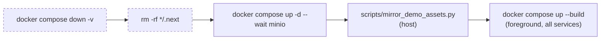

# Other — Makefile

# Makefile — Developer Task Runner

The root `Makefile` is Contentor's single entry point for every local and deploy workflow. It is a thin, dependency-free orchestration layer: almost every target is a one-to-three-line shell recipe that shells out to `docker compose`, an `npm`/`npx` command, or a script under `scripts/` or `tools/`. There is no compilation, no file-target dependency graph, and (with one exception) no inter-target prerequisites — targets are named commands, not build rules.

Because of that, the Makefile is the de-facto contract between contributors and the stack. If a workflow isn't reachable from `make help`, most people won't find it.

## Design principles

**Everything runs where it belongs.** Backend work executes *inside* the `django` container via `docker compose exec django …`; frontend unit tests and formatters run *on the host* via `cd <app> && npx …`; typechecks run *inside* the Next.js containers. This split is deliberate and not cosmetic — see [Container vs. host](#container-vs-host).

**Two compose files, one variable.** Dev uses the implicit `docker-compose.yml`. Prod is reached only through the single variable at the top of the file:

```make
PROD_COMPOSE = docker compose -f docker-compose.prod.yml --env-file .env.prod
```

`docker-compose.prod.yml` is self-contained, *not* an override layer, which is why `PROD_COMPOSE` passes `-f` alone rather than stacking files. Only `prod-build` and `prod-config` use it — actual production deployment happens on the remote host (see [Deploy](#deploy)).

**Self-documenting targets.** Every target intended for humans carries a `## description` comment, which `make help` extracts.

## `make help` and how it works

`help` is the default discovery surface. It prints six hand-curated sections (Docker, Database, Quality, Utilities, Deploy, E2E), each produced by the same idiom:

```make
@grep -E '^(dev|dev-reset|down|build|restart|reset|logs):.*?## .*$$' $(MAKEFILE_LIST) \
  | awk 'BEGIN {FS = ":.*?## "}; {printf "  \033[36m%-20s\033[0m %s\n", $$1, $$2}'
```

Two things to note when editing:

- The `$$` escaping is mandatory. `$$` reaches the shell as a literal `$` — for the regex end anchor and for awk's `$1`/`$2`. A single `$` would be interpreted by `make` as an (empty) variable and silently break the output.
- **The target list in each `grep -E` alternation is an explicit allowlist**, not a category tag. Adding a target with a `##` comment does *not* make it appear in `make help` — you must also add its name to the relevant alternation. Several existing targets are currently invisible for exactly this reason: `ai-check`, `check-i18n`, `seed-demo-assets`, `capture-wizard-mockups`, `stripe-listen`, and all three `flowmap*` targets. Adding a new target means editing two places.

## Target groups

### Docker lifecycle

Five targets sit on a spectrum from gentle to destructive:

| Target | Volumes | `.next` | Runs in foreground |
|---|---|---|---|
| `restart` | kept | kept | no (`-d`) |
| `reset` | **wiped** (`-v`) | kept | no (`-d`) |
| `down` | **wiped** (`-v`) | kept | — |
| `dev` | kept | kept | **yes** |
| `dev-reset` | **wiped** (`-v`) | **removed** | **yes** |

Note that `down` passes `-v`: stopping the stack destroys the Postgres and Redis volumes. There is no "stop but keep my data" target — use `docker compose stop` directly for that.

`dev` is not a plain `docker compose up`. It runs a three-step sequence:

```make
dev:
	docker compose up -d --wait minio
	python3 scripts/mirror_demo_assets.py
	docker compose up --build
```

MinIO is started first *and waited on* (`--wait`) so that `scripts/mirror_demo_assets.py` — a host-side Python script — has a live S3 endpoint to mirror the `demo/*` media into before the rest of the stack comes up. `dev-reset` repeats the same sequence after wiping volumes and both `.next` build caches. This ordering is the reason neither target can be collapsed into a single `docker compose up`.


<sub>Dashed steps run only for `dev-reset`.</sub>

### Database

`migrate`, `migrate-shared`, and `makemigrations` are direct passthroughs to `manage.py` inside the `django` container. `migrate` uses django-tenants' `migrate_schemas` (all schemas); `migrate-shared` adds `--shared` for the public schema only.

`seed` composes three management commands in dependency order — plans and the public tenant must exist before dev tenants can be created:

```make
seed:
	docker compose exec django python manage.py seed_plans
	docker compose exec django python manage.py seed_dev_tenants --force
	docker compose exec django python manage.py seed_curated_logos
```

`--force` makes `seed_dev_tenants` idempotent-by-recreation, so `make seed` is safe to re-run.

`seed-demo-assets` is host-run (not `docker compose exec`) because it needs `.env.prod` credentials to read the production bucket and MinIO's *external* endpoint to write. `capture-wizard-mockups` is the only target in the file with a **prerequisite** — it declares `seed-demo-assets` so the mockup screenshots capture real media rather than placeholders. It also accepts `ARGS`:

```bash
make capture-wizard-mockups ARGS="--niche belly_dance"
```

### Quality

The testing targets form a small ladder:

- `test` / `test-backend` — `pytest -n auto`, parallel, **reusing** the test database.
- `test-fresh` — adds `--create-db`. Required after adding migrations; also the fix for a test DB that has drifted into a dirty state.
- `test-app APP=<name>` — scoped to `apps/$(APP)`. Guarded with `@test -n "$(APP)" || { echo usage…; exit 1; }`, the same guard idiom used by `e2e-spec`.
- `test-changed` — delegates entirely to `scripts/select_tests.py --mode backend`, which diffs against `BASE` (default in the script) and runs only affected tests. `PLAN=1` prints the selection without executing.

The `$(if $(BASE),--base $(BASE),)` construction is how optional flags are threaded through; it appears in both `test-changed` and `e2e-changed`.

`typecheck` runs inside the containers, with the reason preserved as an inline comment in the recipe: `packages/shared` has no `node_modules` ancestor on the host — only under the `/node_modules` symlink each Dockerfile creates. Running `tsc` on the host would fail to resolve shared imports.

`typecheck-backend` is prefixed with `-`, so make ignores a non-zero mypy exit. It is advisory and deliberately not a gate.

`lint` is the composite gate and the thing CI and pre-push should run:

```make
lint:
	pre-commit run --all-files
	@$(MAKE) check-i18n
	node scripts/check-loading-patterns.mjs
	python3 scripts/select_tests.py --self-test
	@$(MAKE) typecheck
```

Four independent checks stacked on top of pre-commit: EN/TR catalog key parity (`scripts/check-i18n-parity.mjs`), the loading/skeleton/spinner conventions (`scripts/check-loading-patterns.mjs`), a self-test that fails if any e2e spec is missing from `e2e/impact-map.json`, and the TypeScript typecheck. Recursive `$(MAKE)` is used for the two sub-targets so they stay independently invokable.

`format` writes `packages/shared` through `frontend-customer`'s prettier install (`npx prettier --write ../packages/shared`) — the shared package has no prettier of its own.

### Utilities

`shell` opens the Django shell. `health-check` curls the Caddy-fronted health endpoint and normalizes the result to `OK`/`FAIL`:

```make
	@curl -sf http://localhost/api/health/ && echo "OK" || echo "FAIL"
```

Note it hits `localhost` (port 80, Caddy), not the Django container directly — so it validates the whole edge path. `ai-check` runs `manage.py ai_check` to verify the configured AI provider end-to-end.

### Stripe

`stripe-listen` first verifies the Stripe CLI is installed with a `command -v` guard and a `brew install` hint, then hands off to `./scripts/stripe_listen_auto.sh .env`. The script forwards test-mode events to the local webhook endpoint *and* rewrites `STRIPE_WEBHOOK_SECRET` in `.env` in place — which is why it takes the env file as an argument rather than reading a hardcoded path.

### Deploy

Production deployment does not run from this Makefile's compose stack. `deploy` runs a test preflight and then delegates to the shared home-server deploy script:

```make
deploy:
	@if [ -z "$(SKIP_TESTS)" ]; then $(MAKE) test; else echo "skipping test preflight (SKIP_TESTS=1)"; fi
	cd ~/ws/home-server && ./deploy.sh contentor
```

Because the preflight is a recursive `$(MAKE) test` and make stops on a failed recipe line, a red test suite aborts the deploy. `SKIP_TESTS=1` bypasses it.

The two `PROD_COMPOSE` targets are local safety nets, both cheap enough to run before a deploy:

- `prod-build` — builds the prod images locally to catch prod-only Dockerfile breaks without touching the server.
- `prod-config` — `config >/dev/null`, i.e. validates that `docker-compose.prod.yml` interpolates cleanly against `.env.prod`. Catches missing/renamed env vars before they surface as a broken container on the box.

### Flowmap

Three targets wrap `tools/flowmap/`, each running its Node entrypoint with `--experimental-sqlite` (the tool uses `node:sqlite` and `node:http`, no dependencies beyond Playwright for the crawler):

- `flowmap` → `server.js`, serves the visualizer on :7878
- `flowmap-register` → `register.js`, re-crawls and re-identifies flows (accepts `ARGS`, e.g. `--reset`, `--screens-only`)
- `flowmap-show` → `query.js`, text output, no server needed (`ARGS=screens`, `ARGS=<id>`)

Only `flowmap-register` installs Chromium; `flowmap-show` skips even `npm install` since it touches nothing but the SQLite file.

### E2E

All four e2e targets run from `e2e/` and share a preamble: `npm install --silent && npx playwright install chromium`. Both are idempotent no-ops after the first run, which is why they're repeated inline rather than factored into a setup target.

- `e2e` — the full suite; Stripe specs self-skip when `STRIPE_E2E` is unset.
- `e2e-stripe` — identical, with `STRIPE_E2E=1` prefixed as an inline env assignment. Requires `sk_test_*` keys and a running `make stripe-listen`.
- `e2e-spec SPEC=<substring>` — passes the substring straight to `npx playwright test`; guarded like `test-app`.
- `e2e-changed` — the e2e twin of `test-changed`, calling the same `scripts/select_tests.py` with `--mode e2e`. Selection is driven by `e2e/impact-map.json` and is fail-closed: unmapped areas run everything.

## Container vs. host

Knowing where a recipe executes explains most of the Makefile's apparent inconsistencies.

| Runs in a container | Runs on the host |
|---|---|
| `migrate*`, `makemigrations`, `seed`, `shell`, `ai-check` | `dev`/`dev-reset` compose orchestration |
| `test*` (except `test-changed`) — via `django` | `seed-demo-assets`, `mirror_demo_assets.py` |
| `typecheck`, `typecheck-backend` | `test-frontend`, `format`, `lint` scripts |
| — | `e2e*`, `flowmap*`, `capture-wizard-mockups` |

The recurring reasons: Python/Django needs the container's environment and DB network; `packages/shared` only resolves inside the container's symlinked `node_modules`; Playwright and MinIO-mirroring need a browser and host-reachable URLs respectively; `select_tests.py` needs the host's git worktree.

## Conventions for contributors

When adding a target:

1. **Add a `## description`** on the target line — it's the only documentation most people will read.
2. **Add the name to the matching `grep -E` alternation in `help`**, or it will be undiscoverable.
3. **Add it to `.PHONY`.** The declaration is one long line at the top. It's currently missing `capture-wizard-mockups` and `check-i18n` — harmless today, but a file named `check-i18n` in the repo root would break that target.
4. **Escape `$` as `$$`** in any shell/awk/regex fragment.
5. **Guard required variables** with the established idiom rather than letting the underlying command fail confusingly:
   ```make
   @test -n "$(APP)" || { echo "usage: make test-app APP=<app-name>"; exit 1; }
   ```
6. **Thread optional flags** with `$(if $(VAR),--flag $(VAR),)`.
7. **Prefer delegating to a script** under `scripts/` or `tools/` once a recipe exceeds ~3 lines. `stripe-listen`, `test-changed`, and `deploy` all follow this pattern; the Makefile stays a dispatch table.

Note also that `make help` and `CLAUDE.md` can drift from the recipes. The Makefile is the source of truth — e.g. `test` is `pytest -n auto`, and `dev` is the three-step MinIO sequence above, not a bare `docker compose up --build`.