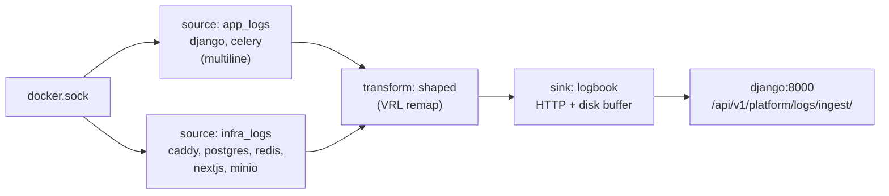

# Other — monitoring-vector

I have what I need.

# monitoring-vector

`monitoring/vector/vector.yaml` is the entire module: a single Vector config that tails every Contentor container's stdout/stderr and POSTs it to Django's logbook ingest endpoint. There is no Python, no build step, and no code that imports it — it is a config file mounted read-only into the `vector` service in both `docker-compose.yml` and `docker-compose.prod.yml`.

The design rule that shapes everything here: **Vector is dumb transport.** It collects, reshapes to a 4-field envelope, batches, and ships. All parsing, level filtering, tenant/user extraction, and activity-vs-log routing happen in Django (`backend/apps/logbook/`). Keep it that way — a parsing rule added to `vector.yaml` would be invisible to the logbook's tests and unreachable from the e2e suite, which posts synthetic events straight at the ingest URL.

## Pipeline



### Sources — why two of them

Both are `type: docker_logs`, reading `/var/run/docker.sock` (mounted `:ro`). The socket is deliberate: the same config works on Docker Desktop in dev and on the Linux host in prod, with no file-path assumptions about where the daemon writes JSON log files.

They are split only because of multiline. `app_logs` (`contentor-django`, `contentor-celery`) sets:

```yaml
multiline:
  start_pattern: '^\d{4}-\d{2}-\d{2}T'
  mode: halt_before
  condition_pattern: '^\d{4}-\d{2}-\d{2}T'
  timeout_ms: 1000
```

That pattern is tied to Django's console formatter in `backend/config/settings/base.py`, whose `datefmt` is `%Y-%m-%dT%H:%M:%S%z`. Every real log line starts with that stamp; a Python traceback's continuation lines do not — so `halt_before` glues the whole traceback into one event, and one `LogEntry` row, instead of 30 orphaned fragments. **If you ever change `datefmt` in `LOGGING`, change `start_pattern` and `condition_pattern` with it**, plus `_DJANGO_RE` in `backend/apps/logbook/parsing.py`. Infra containers have no shared line prefix, so they get their own source with no multiline config.

`include_containers` matches by **prefix**, which is what makes one list cover both environments:

| Config entry | Dev container | Prod container |
|---|---|---|
| `contentor-django` | `contentor-django-1` | `contentor-django` |
| `contentor-celery` | `contentor-celery-worker-1`, `…-beat-1` | `contentor-celery-worker`, `contentor-celery-beat` |
| `contentor-caddy` | `contentor-caddy-dev` | `contentor-caddy` |
| `contentor-nextjs` | `contentor-nextjs-main-1`, `…-customer-1` | `contentor-nextjs-main`, `…-customer` |

Django normalizes those variants back to a stable service name via `service_from_container()` / `_CONTAINER_RE`, which strips the `contentor-` prefix and the `-dev` / `-1` suffixes. So a dev `contentor-caddy-dev` and a prod `contentor-caddy` both store as `caddy`, and `LOGBOOK_LEVEL_FLOORS` keys (`django`, `celery-worker`, `celery-beat`, `*`) apply identically in both.

`contentor-vector` is in `exclude_containers` on both sources. Without it, Vector's own error output about a failing POST would be collected, shipped, fail again, and amplify — a feedback loop that can saturate the sink. Never remove that line.

Note MinIO is dev-only (prod uses Hetzner object storage); the entry is harmless where the container doesn't exist.

### Transform — the wire contract

`shaped` is a `remap` (VRL) that replaces the whole event with exactly four fields:

```vrl
. = {
  "timestamp": format_timestamp!(.timestamp, format: "%+"),
  "container_name": .container_name,
  "stream": .stream,
  "message": .message
}
```

This is the ingest contract, and `parse_event()` in `backend/apps/logbook/parsing.py` reads precisely these keys. `%+` is ISO 8601/RFC 3339; `parse_ts()` handles it (including the nanosecond-precision case, via `_TS_NANO_RE`) and falls back to `timezone.now()` rather than dropping the event. Everything else Docker attaches — labels, image, container ID, host — is dropped here rather than in Django, because those fields multiply payload size across a 400-event batch for data no column stores.

The `!` on `format_timestamp` is fail-fast: an unformattable timestamp aborts the remap for that event rather than shipping a null. Any field you add here must be accepted by `parse_event`, which ignores unknown keys — so the transform can lead the backend, but the backend can never lead the transform.

### Sink — delivery guarantees

```yaml
uri: http://django:8000/api/v1/platform/logs/ingest/
batch: { max_events: 400, timeout_secs: 2 }
request: { headers: { X-Logs-Token: "${LOGS_INGEST_TOKEN}" } }
buffer: { type: disk, max_size: 268435488, when_full: drop_newest }
```

- **Plain HTTP to `django:8000`.** Vector is on the compose-internal network and bypasses Caddy entirely; in prod it has no published ports and isn't on the `edge` network. TLS would buy nothing on that hop.
- **`max_events: 400` is below the backend's `MAX_BATCH = 500`** in `backend/apps/logbook/views/ingest.py`, which returns 413 above it. The 100-event margin exists so that a batch is never rejected wholesale. If you raise it, raise `MAX_BATCH` first.
- **`timeout_secs: 2`** bounds how stale the superadmin → Logs panel can be on a quiet system.
- **`X-Logs-Token`** is compared against `settings.LOGS_INGEST_TOKEN` with `hmac.compare_digest`. An empty token server-side disables ingest entirely (503); a mismatch is 403. Dev defaults to `dev-logs-token`; prod uses `${LOGS_INGEST_TOKEN:?…}` so the stack refuses to start without it.
- **Disk buffer, 256 MiB** — that value is Vector's disk-buffer minimum, not a tuned number. It survives a Django restart or a migration-blocked entrypoint without losing the logs that explain why. `when_full: drop_newest` prefers keeping the *oldest* buffered events, which are the ones nearest the incident that started the backlog.
- **`api: { enabled: false }`** — no GraphQL/playground port exposed.

The sink retries non-2xx responses, which is why the ingest view is written to never 500 on bad data: `_int_or_none` clamps out-of-range integers and `_ip_or_none` validates before the `inet` column, precisely so a single poisoned event can't make Vector retry the same failing batch forever. Preserve that invariant if you touch either side.

## Operating and changing it

Dev and prod mount the same file, so `vector.yaml` must stay environment-agnostic — parametrize through env vars (as `LOGS_INGEST_TOKEN` does), never fork the file. Prod additionally sets `mem_limit: 128m` and `restart: unless-stopped`; both environments gate startup on `depends_on: django: service_healthy`, so the first batch never hits a Django that's still migrating.

Config changes need a container restart (`docker compose restart vector` — the mount is read-only, and Vector doesn't hot-reload here). Verify end to end by generating an ERROR in the Django container and watching it appear under superadmin → Logs. To exercise the *backend* half without Vector at all, POST a shaped batch directly, as `e2e/specs/24-admin-logs.spec.ts` does:

```
POST /api/v1/platform/logs/ingest/
X-Logs-Token: <LOGS_INGEST_TOKEN>
[{"timestamp": "...", "container_name": "contentor-django-1", "stream": "stdout", "message": "..."}]
```

The response — `{"accepted", "logs", "activity"}` — tells you whether events were parsed as ordinary logs, routed to `RequestEvent` (the `apps.logbook.activity` logger), or dropped by the per-container level floor.

Two things routinely look like Vector bugs and aren't. Logs "missing" for infra containers are usually `LOGBOOK_LEVEL_FLOORS` doing its job — `*` floors at `WARNING`, so INFO from postgres/redis/caddy is collected and shipped but never stored. And a container whose logs never appear at all is almost always a name that stopped matching an `include_containers` prefix, e.g. after renaming a compose service.

Related reading: `docs/wiki/observability-usage-analytics.md` for the full logbook pipeline, and `backend/apps/logbook/parsing.py` for the per-container line formats this transport feeds.
