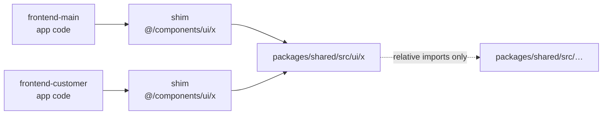

# Other — packages-shared

# `packages/shared` — Cross-App Source Library

## What this module is

`packages/shared` is a **source-only TypeScript library** consumed by both Next.js apps (`frontend-main/` and `frontend-customer/`). It has no `package.json`, no build step, and no published artifact. Each app pulls it in through the `@shared/*` tsconfig path alias and compiles the `.ts`/`.tsx` files as if they were its own.

Two consequences follow directly from that design, and they explain most of the module's rules:

1. **Dependencies resolve from the consuming app**, not from the package. If `packages/shared/src/mailbox/…` imports `sonner`, then *both* apps must have `sonner` installed. There is no dependency manifest here to declare it, so a missing dep surfaces as a type error or a runtime module-not-found in whichever app forgot it.
2. **Every change is a two-app change.** There is no versioning boundary to absorb a breaking edit. A signature change in `src/ui/` lands in `frontend-main` and `frontend-customer` simultaneously.

## Directory map

| Path | Contents | Consumed by |
|---|---|---|
| `src/admin-kit/` | Generic backend-data browser | `/admin/m` routes **only** |
| `src/mailbox/` | Inbox UI | both apps |
| `src/email/` | Email-builder UI | both apps |
| `src/ui/` | Shared primitives | both apps |
| `src/logo/` | Logo studio engine — renderer, catalog, composer, export | both apps |
| `src/auth/` | Session cookie routes | both apps |
| `tailwind-preset.ts` | Shared loading/feedback motion | both apps' Tailwind configs |

### `src/admin-kit/` — read the scope note carefully

`admin-kit` is the generic browser over backend data, and it backs the `/admin/m` routes and nothing else. **The real coach admin is not built on it** — that surface uses `frontend-customer`'s own `MediaBrowser` / `InlineEditPanel` framework.

This distinction matters because "the admin" is ambiguous in this codebase. If you're changing coach-facing admin behavior and you're editing `packages/shared/src/admin-kit/`, you are almost certainly in the wrong place. Conversely, an `admin-kit` change has a much smaller blast radius than its name suggests.

(Note that `admin-kit` here is the *frontend* browser; the Django-side `apps.adminkit` app that registers API admin sites via `admin_panels.py` autodiscovery is a separate thing that happens to share the name.)

### `src/logo/` — the logo studio engine

The logo studio splits into four concerns — renderer, catalog, composer, and export. This is the engine behind the logo studio backend in `apps.tenant_config` and the curated logo catalog seeded by `seed_curated_logos`; changes here affect both the coach-facing studio and the onboarding wizard's logo gallery.

### `src/auth/` — session cookie routes

Shared route handlers for session cookies. Both apps mount them, which is what keeps cookie name/path/flag handling from drifting between the marketing site and the tenant portal. Anything touching JWT-bearing cookies here interacts with the backend's `TenantJWTAuthentication` contract — see `docs/REFERENCE.md` for the auth/tenancy flow.

## The import rules

These are not stylistic preferences; violating them breaks compilation in at least one app.

**Never import `@/...` from inside `packages/shared`.** `@/` is an *app-local* alias — it resolves to `frontend-main/src` in one app and `frontend-customer/src` in the other. A shared file that reaches for `@/components/...` either fails to resolve or, worse, silently resolves to a *different* file depending on which app compiled it. Internal imports within `packages/shared` are **relative**.

**Apps consume via one-line re-export shims.** Rather than importing `@shared/...` at every call site, each app creates a thin shim at its own conventional path — e.g. `frontend-customer/src/components/ui/modal-portal.tsx` re-exports the shared implementation. App code imports `@/components/ui/modal-portal` as it always has. This keeps app-internal import paths stable and gives each app a single place to intercept, wrap, or temporarily fork a shared component.



## `tailwind-preset.ts`

The one non-`src/` file. It exports a `Partial<Config>` Tailwind preset carrying the loading/feedback motion vocabulary both apps share:

| Keyframe | Animation utility | Used for |
|---|---|---|
| `shimmer` (background-position 200% → -200%) | `animate-shimmer` (1.8s linear infinite) | skeleton shimmer |
| `fade-in` (opacity 0 → 1) | `animate-fade-in` (0.2s ease-out both) | content appearing |
| `fade-in-up` (opacity + 4px translateY) | `animate-fade-in-up` (0.2s ease-out both) | content appearing with lift |
| `progress-indeterminate` (translateX -100% → 300%) | `animate-progress-indeterminate` (1.1s ease-in-out infinite) | indeterminate progress bars |

Every animation here is **decorative only**. The preset does not gate itself — the source comment is explicit that *callers* apply `motion-safe:` so reduced-motion users get a static equivalent. Writing `animate-shimmer` without the `motion-safe:` prefix is a bug, and `scripts/check-loading-patterns.mjs` (which runs in `make lint`) enforces the surrounding spinner/skeleton conventions.

Note the durations are deliberately short (0.2s for the fade family) and the two infinite animations are the only long-running ones. If you add a keyframe here, keep it in the same register — this preset is the shared motion budget for both apps, and anything longer or bouncier will read as inconsistent wherever it lands.

## Contributing

Because there is no build boundary, verification is the safety net:

```bash
make typecheck        # tsc --noEmit across BOTH apps — the primary check
make test-frontend    # frontend-customer vitest
make lint             # pre-commit, incl. check-loading-patterns.mjs
```

`make typecheck` is the one that catches the failure modes specific to this module: a stray `@/` import, a dependency present in one app's `node_modules` but not the other's, or a signature change that only one app's call sites were updated for. Run it after *any* edit here, not just ones that feel risky.

A practical checklist before you commit a change to `packages/shared`:

- Internal imports are relative, no `@/`.
- Any new third-party dependency is installed in **both** apps.
- If you added a component, the consuming app(s) have re-export shims at their conventional paths rather than deep `@shared/...` imports scattered through app code.
- New motion utilities are used behind `motion-safe:`.
- `make typecheck` and `make test-frontend` both pass.

Per repo convention, `make typecheck` is currently advisory — it is not yet gated in `make lint` (tracked as Task 3 of `docs/superpowers/plans/2026-07-17-vibe-coding-restructure.md`). Treat it as mandatory for this module anyway; it is the only automated check that sees both apps at once.