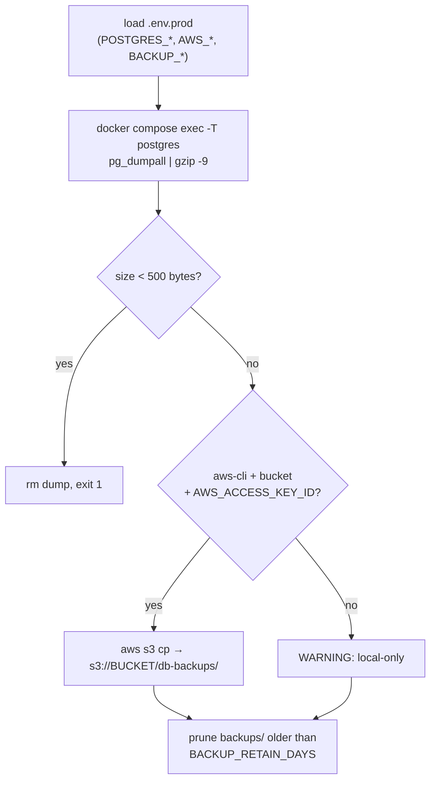
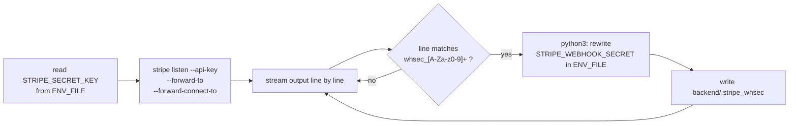

# Other — scripts

# `scripts/` — Operational Shell Scripts

Standalone bash utilities that operate on the Contentor stack from *outside* the application: disaster recovery for the production Postgres cluster, and local Stripe webhook plumbing for development. These scripts have no Python imports, no Django dependency, and no callers inside the codebase — they are invoked by a human operator, by cron, or via `make` targets.

> Not covered here: `scripts/select_tests.py`, `scripts/check-loading-patterns.mjs`, `scripts/install-git-hooks.sh`, and `scripts/refresh-wiki.sh`, which belong to the test-selection, lint, and wiki-tooling areas respectively.

---

## Contents

| Script | Runs on | Trigger | Destructive? |
|---|---|---|---|
| `backup_db.sh` | prod host | nightly cron | no |
| `restore_db.sh` | prod host (or a scratch dev stack) | manual, with typed confirmation | **yes** |
| `stripe_listen_auto.sh` | developer laptop | `make stripe-listen` | no |

---

## Shared conventions

All three scripts share a small set of habits worth preserving when adding new ones:

- **`set -euo pipefail`** (`stripe_listen_auto.sh` uses plain `set -e`, since it deliberately runs an unbounded pipeline).
- **Locate the stack directory from `BASH_SOURCE`, then `cd` into it.** Both DB scripts compute `STACK_DIR="$(cd "$(dirname "${BASH_SOURCE[0]}")/.." && pwd)"` so they work identically whether invoked as `./scripts/backup_db.sh` or by absolute path from cron.
- **Env is loaded, not inherited.** `set -a; . "./$ENV_FILE"; set +a` sources the env file with auto-export so `POSTGRES_*`, `AWS_*`, and `BACKUP_*` become available to child processes, then turns auto-export back off.
- **`ENV_FILE` selects the environment.** Defaults to `.env.prod`; overriding it (`ENV_FILE=.env`) is the supported way to point the DB scripts at a local dev stack.
- **Required secrets fail loudly** via bash's `:?` expansion — `PG_PASS="${POSTGRES_PASSWORD:?POSTGRES_PASSWORD required in $ENV_FILE}"` aborts with a named error rather than silently running with an empty password.
- **Log lines are prefixed** (`[backup]`, `[restore]`, `[Auto-Sync]`) so cron-captured output is greppable.

---

## `backup_db.sh` — full cluster backup

### Why a *cluster* dump

Contentor is schema-per-tenant (`django-tenants`): every coach's data is a schema inside a single database on a single Postgres volume. A per-database or per-schema dump would need to enumerate tenants and would drift as tenants are created. `pg_dumpall` sidesteps that entirely — it emits every database plus roles and other globals, so a single artifact is a complete, self-consistent picture of all tenants.

This script exists to close a CRITICAL audit finding: all tenant schemas lived on one volume with no backup automation.

### Flow



### Key details

**Dump invocation.** The dump runs *inside* the postgres container, not against a published port (prod publishes none):

```bash
COMPOSE=(docker compose -f docker-compose.prod.yml --env-file "$ENV_FILE")
"${COMPOSE[@]}" exec -T -e PGPASSWORD="$PG_PASS" postgres \
	pg_dumpall -U "$PG_USER" | gzip -9 > "$OUT"
```

`-T` disables TTY allocation (mandatory under cron, where there is no terminal). `-e PGPASSWORD` supplies the password to `pg_dumpall` without putting it on the command line inside the container. Compression happens on the host side of the pipe.

**Output naming.** `contentor-<STAMP>.sql.gz` where `STAMP="$(date -u +%Y%m%dT%H%M%SZ)"` — UTC, ISO-8601 basic format, so lexical sort equals chronological sort. Written to `backups/` under the stack dir, created with `mkdir -p`.

**Truncation guard.** The most likely silent failure is a dump that "succeeds" but produces nothing (container missing, auth rejected, disk full mid-pipe). Because the pipeline's exit status can come from `gzip`, the script checks the artifact itself:

```bash
SIZE="$(wc -c < "$OUT")"
if [ "$SIZE" -lt 500 ]; then
	echo "[backup] FATAL: dump is only ${SIZE} bytes — treating as failed"; rm -f "$OUT"; exit 1
fi
```

A real gzip'd `pg_dumpall` is far larger than 500 bytes. The bad artifact is deleted so retention pruning never mistakes it for a valid restore point.

**Offsite upload is best-effort.** It is attempted only when `aws` is on `PATH`, a bucket is resolved, and `AWS_ACCESS_KEY_ID` is set. `BACKUP_S3_BUCKET` takes precedence over `AWS_BUCKET_NAME`, so backups can go to a dedicated bucket rather than the app's media bucket. The `${AWS_ENDPOINT:+--endpoint-url "$AWS_ENDPOINT"}` expansion passes the flag only when the variable is non-empty — this is what makes the script work against Hetzner object storage (and MinIO in a drill) as well as real S3. A failed upload logs a WARNING and the script continues: **the local copy is always kept**, and upload failure never fails the backup.

**Retention.** `find … -mtime "+${RETAIN_DAYS}" -print -delete` (default 14 days), piped through `sed` to prefix each pruned path. The trailing `|| true` keeps a pruning hiccup from failing an otherwise successful backup under `set -e`.

### Environment variables

| Variable | Source | Default | Role |
|---|---|---|---|
| `ENV_FILE` | shell | `.env.prod` | which env file to source |
| `POSTGRES_USER` | env file | `contentor` | `pg_dumpall -U` |
| `POSTGRES_PASSWORD` | env file | **required** | `PGPASSWORD` |
| `BACKUP_S3_BUCKET` | env file | falls back to `AWS_BUCKET_NAME` | offsite destination |
| `AWS_ACCESS_KEY_ID` | env file | — | gates the upload attempt |
| `AWS_ENDPOINT` | env file | — | non-AWS S3-compatible endpoint |
| `BACKUP_RETAIN_DAYS` | env file | `14` | local pruning window |

### Operator setup (one-time, on the prod box)

Not scriptable from the laptop — it needs a shell on the host:

```bash
# 1. optional, in .env.prod
BACKUP_S3_BUCKET=contentor-prod-backups
BACKUP_RETAIN_DAYS=14

# 2. offsite step needs aws-cli
apt-get install -y awscli

# 3. nightly cron, as the deploy user
crontab -e
30 3 * * * cd /opt/stacks/contentor && ./scripts/backup_db.sh >> backups/backup.log 2>&1
```

The `cd` in the cron line is belt-and-braces (the script relocates itself anyway) but keeps the relative log path pointing at the stack's `backups/`.

---

## `restore_db.sh` — cluster restore

Replays a `backup_db.sh` artifact into a running postgres container. **This overwrites the cluster.**

### Usage

```bash
./scripts/restore_db.sh backups/contentor-20260803T033000Z.sql.gz
./scripts/restore_db.sh s3://contentor-prod-backups/db-backups/contentor-….sql.gz
```

### Safety layers

1. **Typed confirmation.** The prompt requires the literal string `RESTORE`; anything else aborts. This is an interactive `read -r -p`, which means the script is deliberately *not* runnable from cron.
2. **`ON_ERROR_STOP=1`.** `psql` aborts at the first failing statement rather than grinding on and leaving a half-restored cluster that looks superficially fine.
3. **Compose file follows `ENV_FILE`.** Prod restores use `docker-compose.prod.yml`; anything else (i.e. a dev drill with `ENV_FILE=.env`) uses the default dev compose:

   ```bash
   if [ "$ENV_FILE" = ".env.prod" ]; then
   	COMPOSE=(docker compose -f docker-compose.prod.yml --env-file "$ENV_FILE")
   else
   	COMPOSE=(docker compose --env-file "$ENV_FILE")
   fi
   ```

### The restore itself

```bash
gunzip -c "$LOCAL" | "${COMPOSE[@]}" exec -T -e PGPASSWORD="$PG_PASS" postgres \
	psql -v ON_ERROR_STOP=1 -U "$PG_USER" -d postgres
```

`pg_dumpall` output is plain SQL containing `CREATE ROLE`, `CREATE DATABASE`, and `\connect` directives, so it must be fed to `psql` connected to the maintenance database (`-d postgres`) — the dump script switches databases on its own as it replays. Decompression happens on the host; only plain SQL crosses into the container.

### S3 source handling

An `s3://` argument is fetched to a temp file before replay:

```bash
if [[ "$SRC" == s3://* ]]; then
	command -v aws >/dev/null 2>&1 || { echo "FATAL: aws-cli required to fetch $SRC"; exit 1; }
	LOCAL="$(mktemp /tmp/contentor-restore.XXXXXX.sql.gz)"
	aws s3 cp "$SRC" "$LOCAL" ${AWS_ENDPOINT:+--endpoint-url "$AWS_ENDPOINT"}
fi
```

Same conditional-`--endpoint-url` idiom as the backup script. Note the temp file is not cleaned up on exit — intentional in practice (you often want to keep a fetched dump around after a failed restore), but worth knowing before filling `/tmp` during repeated drills.

### After a restore

The script does not restart anything; it prints the command instead:

```
docker compose -f docker-compose.prod.yml --env-file .env.prod restart django celery-worker celery-beat
```

Application containers hold pooled connections to the pre-restore cluster and must reconnect. Leaving this as a printed instruction rather than an automatic action keeps the script's blast radius limited to Postgres.

### Verification drill

A backup you have never restored is not a backup. The documented drill never touches prod:

1. Copy a dump to a scratch box or laptop running the dev stack.
2. `make down && make dev` → clean, empty Postgres.
3. `ENV_FILE=.env ./scripts/restore_db.sh <dump.sql.gz>` (this is what the compose-file branch above exists for).
4. Diff row counts against the source — `SELECT count(*)` per key table, per tenant schema.

---

## `stripe_listen_auto.sh` — Stripe CLI listener with webhook-secret sync

Backs `make stripe-listen`. It runs `stripe listen` and, whenever the CLI prints a signing secret, writes that secret into both places Django reads it from. Without this, every restart of the Stripe CLI hands you a new `whsec_*` and every webhook fails signature verification until you paste it by hand.

### Flow



### How it works

**API key extraction.** The Stripe CLI would otherwise use whatever account is in the developer's global `stripe` config — likely the wrong one. The script pins it to the project's key:

```bash
API_KEY=$(grep -E '^STRIPE_SECRET_KEY=' "$ENV_FILE" | cut -d= -f2 | tr -d '"' | tr -d "'")
```

The `^` anchor avoids matching commented or suffixed variants; the `tr` calls strip optional quoting. Missing file or empty key each produce a distinct error and `exit 1`.

**Forwarding targets.** Both are set, and both point at the same Django endpoint through Caddy on port 80:

```bash
stripe listen \
  --api-key "$API_KEY" \
  --forward-to http://localhost/api/webhooks/stripe/ \
  --forward-connect-to http://localhost/api/webhooks/stripe/
```

`--forward-connect-to` is what makes **Stripe Connect** events (the marketplace flow in `apps.billing.providers.connect`) arrive locally — platform-account events alone would miss everything happening on connected coach accounts.

**Secret detection and dual write.** Output is streamed through `while read -r line`, echoed so the developer still sees normal CLI output, and matched against a bash regex:

```bash
if [[ "$line" =~ (whsec_[a-zA-Z0-9]+) ]]; then
  WHSEC="${BASH_REMATCH[1]}"
```

An inline `python3 -c` heredoc then writes the secret to two destinations:

1. **`$ENV_FILE`** — a `re.sub` with `flags=re.MULTILINE` replaces an existing `^STRIPE_WEBHOOK_SECRET=` line, or appends one if absent. This is what a *future* `docker compose up` will pick up.
2. **`backend/.stripe_whsec`** — a single-line file inside the bind-mounted backend directory. Because the mount is live, the running Django container sees the new secret immediately, with no restart. This is the path that makes the sync actually useful mid-session; env-file changes alone would require recreating the container.

Anything on the Django side that reads the webhook secret should therefore prefer `backend/.stripe_whsec` (falling back to the env var) — that ordering is what gives the no-restart behaviour.

### Usage

```bash
make stripe-listen                    # defaults to .env
./scripts/stripe_listen_auto.sh .env.staging
```

Run it in a second terminal alongside `make e2e-stripe`; the Stripe e2e specs need it live to receive `checkout.session.completed` and connect events.

### Known rough edges

- The `python3 -c` block interpolates `$ENV_FILE` and `$WHSEC` directly into the Python source. Fine for the two shapes those values take (a repo-relative path, a `whsec_` token), but it is string interpolation into code — don't extend the pattern with arbitrary user input.
- The regex fires on *any* line containing a `whsec_` token, so it will re-write on every restart banner. That is idempotent and harmless, but it does mean the env file is rewritten more often than strictly necessary.
- `set -e` does not propagate into the `while` loop's subshell — a failed Python write logs nothing beyond Python's own traceback and the listener keeps running.
- `backend/.stripe_whsec` must stay gitignored; it holds a live signing secret.

---

## Relationship to the rest of the stack

- **`backup_db.sh` / `restore_db.sh`** are the only components that treat Postgres as a whole cluster rather than through django-tenants. They are coupled to `docker-compose.prod.yml` (service name `postgres`), to `.env.prod`'s `POSTGRES_*` variables, and to the app service names `django`, `celery-worker`, `celery-beat`. Renaming any of those services breaks these scripts silently — they are not covered by `make test`.
- **`stripe_listen_auto.sh`** sits between the Stripe CLI and `apps.billing` webhook handling. It is only meaningful when the dev stack runs with real Stripe test-mode keys (`BILLING_BYPASS_ENABLED=false`, the dev default); with the `bypass` provider there are no webhooks to forward.
- None of these scripts are exercised by CI. Changes should be validated by running them: a real `backup_db.sh` run on the prod host, and the restore drill described above on a scratch dev stack.
