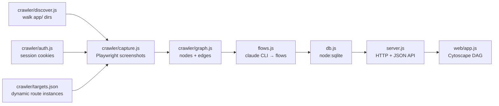

# Other — tools-flowmap

# Flowmap (`tools/flowmap/`)

A local, self-contained dev tool that maps Contentor's real user journeys. It crawls both Next.js frontends, screenshots every route, asks the `claude` CLI to name the distinct user flows it can see, stores everything in SQLite, and renders each flow as a left→right DAG of actual screenshots at `http://localhost:7878`.

Flowmap is a *reference* tool, not part of the shipped product. Nothing in the app imports it (the call graph shows zero incoming calls into this module), and `flowmap.db` plus `walk-shots/` are gitignored — the artifacts are meant to be rebuilt, not committed.

## Why it exists

Contentor spans two frontends, four viewer roles (`anon`, `student`, `coach`, `superadmin`), and hundreds of route segments across tenant subdomains. Reading the App Router tree tells you which files exist; it doesn't tell you which sequences of screens a coach actually walks through to publish a course, or what a student sees between landing page and checkout. Flowmap answers that second question with evidence: real screenshots of real seeded data.

## Runtime shape

Everything runs on plain Node with `--experimental-sqlite` — `node:sqlite` for storage, `node:http` for the server, `node:test` for tests. The only third-party dependencies are Playwright (crawling) and Cytoscape + dagre (graph layout in the browser). See `package.json`:

```json
"scripts": {
  "test": "node --experimental-sqlite --test",
  "start": "node --experimental-sqlite server.js"
}
```

## Architecture



The pipeline is one-directional: discover → capture → graph → identify flows → persist → serve. Each stage is a separate CommonJS module with pure, testable functions at its core, and its I/O (filesystem walking, Playwright, `claude -p` subprocess) kept at the edges. That split is what makes the test suite possible without a running stack — every `*.test.js` in this module exercises pure functions only.

### Screen keys

The one identifier that ties every stage together is the **screen key**: `"<frontend>|<url>"`, where frontend is `main` or `customer`.

```
customer|/admin/courses
main|/plans
customer|/courses/[slug]
```

Dynamic segments stay in bracket form in the key even though the crawl visits a concrete instance — so `/admin/courses/123` collapses back to `customer|/admin/courses/[id]`. Keys are the primary key in the `screens` table, the endpoints of every flow step, and the values in `targets.json`'s `localStorage` map. If you add a stage, key by this.

## Key components

### `crawler/discover.js` — route inventory

`discover(frontend, root)` walks a frontend's `appDir` looking for `page.tsx` files and derives one route record per page. Per `discover.test.js`, each record carries `url`, `frontend`, `host`, `role`, `dynamic`, and `segments`.

The derivation rules that matter:

- **Route groups are stripped from the URL.** `app/(student)/dashboard/page.tsx` → `/dashboard`.
- **Role comes from the `areaRole` map** on the frontend config, keyed by the first path segment (including the group parens). `admin` → `coach`, `(student)` → `student`, `(public)` → `anon`, and `""` (the root marketing page) → `anon`.
- **`api/` is skipped** — route handlers aren't screens.
- **Dynamic routes are flagged, not resolved.** `admin/tenants/[slug]` yields `dynamic: true` and `segments: ["slug"]`; resolution happens later, in capture.

### `crawler/auth.js` — role sessions

`sessionCookie(jwt, host)` builds the Playwright cookie that puts the crawler into a role:

```js
{ name: "contentor_access_token", value: jwt, domain: host,
  path: "/", httpOnly: true, secure: false, sameSite: "Lax" }
```

Note `domain` is the caller-supplied host, not a hardcoded value — a tenant crawl needs the cookie scoped to `demo-yoga.localhost`, the marketing crawl to `localhost`. `secure: false` is deliberate: dev is plain HTTP behind Caddy. This mirrors the same httpOnly-cookie trick documented for driving the dev tenant as a coach from a browser pane.

### `crawler/capture.js` — screenshotting

Two pure functions carry the logic; Playwright is the wrapper around them.

`resolveUrl(route, targets)` turns a discovered route into a URL that can actually be visited:

- Static routes pass straight through with `status: "ok"`.
- A dynamic route with no entry in `targets.json` returns `status: "skipped"`, `note: "no target in targets.json"` — the crawl reports these rather than erroring, which is why the coverage goal is *0 skipped / 0 errored*.
- Lookup prefers a **per-frontend** mapping over the flat one: `targets.dynamic[frontend][url]` wins, then `targets.dynamic[url]`. This exists because the same route pattern means different things in each app — `/admin/m/[model]` resolves to `/admin/m/platform-plans` on main and `/admin/m/users` on customer.

`classify({ httpStatus, finalUrl, role })` decides whether a captured page counts:

- Non-2xx → `status: "error"`, `note: "HTTP <code>"`.
- A 200 that lands on `/login` is an **error for an authenticated role** (the session cookie didn't take) but **ok for `anon`** (that's just the login page).

That role-sensitive redirect check is the single most useful signal in the crawl: it catches expired JWTs and tenancy misconfiguration, both of which would otherwise produce a wall of plausible-looking login screenshots.

### `crawler/targets.json` — the seeded-data contract

This file is where the crawl meets reality, and it's the most common source of a degraded run. It holds:

- `tenantSlug` / `tenantHost` / `mainHost` — must match a locally seeded demo tenant (`make seed-demos`). Wrong values mean *every* dynamic route reports skipped.
- `dynamic` — concrete instances per route, keyed by frontend then route URL, pointing at real seeded entities (`/courses/vinyasa-flow-volume-17`, `/live/157`, `/admin/students/8`). IDs drift when the seed changes; reseed and update.
- `localStorage` — per-screen client state to inject before navigating, keyed by screen key. Values are JSON-stringified. This is how client-state-only pages capture something real: `customer|/checkout` gets a populated `contentor_cart` so the screenshot shows a cart rather than an empty state.

The `_comment` / `_dynamic_comment` / `_localStorage_comment` keys are intentional inline documentation — keep them when editing.

### `crawler/graph.js` — from links to a graph

`resolveLinkToRoute(href, routes)` maps a raw `href` scraped off a page back to a screen key, returning `null` when it can't:

| Input | Result |
|---|---|
| `http://demo-yoga.localhost/admin/courses` | `customer\|/admin/courses` |
| `http://demo-yoga.localhost/admin/courses/123?x=1#h` | `customer\|/admin/courses/[id]` |
| `http://demo-yoga.localhost/admin/courses/` | `customer\|/admin/courses` (trailing slash normalized) |
| `http://localhost/admin/courses` | `null` (foreign host) |
| `mailto:x@y.com` | `null` |
| `http://demo-yoga.localhost/nope` | `null` (no matching route) |

Query strings and fragments are dropped, trailing slashes normalized, and concrete IDs folded back into their dynamic pattern.

`clusterLabel(route)` produces the Cytoscape grouping label — `"customer · Coach"`, `"main · Public"`, `"main · Superadmin"`. Note that `anon` renders as **Public**, not "Anon".

`buildGraph(results, routesByFrontend)` assembles the final graph and applies two important reductions:

1. **Edges are deduped, self-loops dropped, cross-frontend links discarded.** A page linking to `/b` three times yields one edge; a link to itself or to another frontend's host yields none.
2. **Hub suppression.** If ≥70% of pages link to the same target, every edge into that target is removed and counted in `suppressedCount`. Without this, global nav (logo → home, sidebar → dashboard) produces a near-complete bipartite graph and the layout is unreadable. In the test fixture, `/hub` is linked from 3 of 4 pages (75%) so all 3 edges vanish, while `/p1` at 25% is kept.

If a genuinely important edge goes missing from the rendered map, hub suppression is the first thing to check — `suppressedCount` tells you how many were dropped.

### `flows.js` — LLM flow identification

Two pure functions bracket a `claude -p` subprocess call.

`buildPrompt(screens, edges)` renders the graph as text — every screen key with its url/role/title, every edge as `source -> target` — and asks for a **JSON array** of flows back.

`parseFlows(text, validKeys)` is deliberately defensive about the model's output, because the response is prose-wrapped and occasionally malformed. It returns `{ flows, warnings }` and:

- Extracts the JSON array from surrounding chatter (`"sure:\n[...]\ndone"` parses fine).
- Drops entries missing required fields, recording a `malformed` warning — `{"name":"bad"}` with no steps doesn't survive.
- Keeps flows whose steps reference **unknown** screen keys, but warns naming the key. Unknown keys are a signal (usually a stale crawl), not a hard failure — this matches the HTTP API's behavior, where unknown step keys are accepted-but-flagged.
- Never throws on non-JSON input: `parseFlows("no json here", [])` returns zero flows and at least one warning.

When flow identification comes back empty, read the warnings before suspecting the graph.

### `db.js` — SQLite persistence

`open(path)` returns a handle over two tables (screens, flows + steps). The API, as exercised by `db.test.js`:

| Method | Behavior |
|---|---|
| `upsertScreen({ key, url, role, frontend, title, thumb, full })` | Idempotent on `key` — a second call with the same key overwrites title/thumb/full |
| `getScreens()` | List **without** the `full` field (`full === undefined`) |
| `getScreen(key)` | Single screen **with** `full`; `null` when missing |
| `createFlow({ name, description, steps })` | Returns the new flow id; steps are `{ from, to, label? }` |
| `listFlows()` | Flow summaries with a computed `stepCount` |
| `getFlow(id)` | Flow with ordered `steps` **and** `screens` — the deduped set of screens the steps touch (a 2-step chain over 3 distinct screens yields `screens.length === 3`); `null` when missing |
| `deleteFlow(id)` | Cascades to steps; the flow disappears from both `listFlows()` and `getFlow()` |
| `reset()` | Truncates screens and flows |
| `close()` | Release the handle |

Two design points worth preserving: **`full` is excluded from list responses** (full-page screenshots are large base64 blobs; the sidebar and graph only need `thumb`), and **`getFlow` denormalizes the involved screens** so the renderer can draw a flow without a second round of per-screen fetches.

### `server.js` — HTTP + JSON API

`createServer(db)` returns a bare `node:http` server — no framework, and it takes the db as an argument rather than opening one itself, which is exactly what makes `server.test.js` able to bind port 0 against a temp database.

| Route | Purpose |
|---|---|
| `GET /` | Serves `web/index.html` (the test asserts the body matches `/flowmap/i`) |
| `GET /styles.css`, `/app.js`, `/vendor/*` | Static assets |
| `POST /api/screens` | Bulk upsert an array of screen records |
| `GET /api/screens` | List screens (no `full`) — also the source of valid screen keys |
| `GET /api/screens/:key` | One screen with `full` (key must be URL-encoded — it contains `|` and `/`) |
| `POST /api/flows` | Create a flow, returns `{ id }` |
| `GET /api/flows` | Flow summaries with `stepCount` |
| `GET /api/flows/:id` | Flow with `steps` + `screens` |
| `DELETE /api/flows/:id` | Delete a flow |
| `POST /api/reset` | Wipe everything |

Error contract: malformed JSON bodies → **400**, unknown routes → **404**.

### `web/` — the viewer

A dependency-free browser app: `index.html` + `styles.css` + `app.js`, with Cytoscape, dagre, and cytoscape-dagre vendored under `/vendor/` (no bundler, no npm install at view time).

The DOM is small and stable, and `app.js` reaches into it by id — renaming any of these breaks the viewer:

- `#sidebar` / `#flows` — flow list, grouped by role via `.role-group` headers; each `.flow` button carries a `.count` badge and gets `.active` when selected; `.empty` shows the no-data hint.
- `#cy` — the Cytoscape canvas holding the left→right dagre DAG.
- `#lb` — the lightbox: `#lbimg` (full screenshot), `#lbcap` (caption), `#lbprev` (back), and `#lbopts` (`.lbopt` buttons for the forward branches out of the current screen). `#lbopts:empty { display: none }` means a terminal screen shows no forward bar. This is the "walk the flow" mode — click a node, then step through the journey screenshot by screenshot.
- `#flowmenu` / `.menuitem` — per-flow context menu.
- `#toast` — transient status messages.

Styling is a hand-written dark theme (`#0f1115` background, `#e7e9ee` text, `#7aa2f7` accent) — it deliberately does *not* use the app's design system, since this is a dev tool served outside either Next.js app.

## Testing

Colocated `node:test` files, run with the SQLite flag:

```bash
node --experimental-sqlite --test        # from tools/flowmap/
```

The suite covers `sessionCookie`, `classify`, `resolveUrl`, `discover`, `resolveLinkToRoute`, `clusterLabel`, `buildGraph`, `buildPrompt`, `parseFlows`, the full `db` surface, and the HTTP API end-to-end.

Two patterns to follow when extending it:

- **Temp fixtures over mocks.** `discover.test.js` builds a real `app/` tree in `os.tmpdir()` via `fixtureRoot()`/`page()`; `db.test.js` and `server.test.js` use `fs.mkdtempSync` for throwaway databases. No filesystem stubbing.
- **`withServer(fn)` in `server.test.js`** opens a temp db, calls `createServer(db)`, listens on port `0`, hands the caller a base URL, and closes both in a `finally`. Add API tests inside it rather than standing up a server yourself.

Nothing in the suite needs the dev stack, Docker, Playwright, or the `claude` CLI — keep it that way. Logic that requires a browser belongs behind one of the pure functions above.

## Operating it

From the repo root:

```bash
make flowmap                      # serve the viewer at :7878
make flowmap-show                 # print every flow + ordered steps (no server)
make flowmap-show ARGS=screens    # list valid screen keys
make flowmap-show ARGS=<id>       # dump one flow
make flowmap-register             # re-crawl + re-identify flows (needs dev stack up + seeded)
make flowmap-register ARGS=--reset          # wipe first
make flowmap-register ARGS=--screens-only   # refresh screenshots, keep flows

node --experimental-sqlite tools/flowmap/walk.js <flowId>   # live-walk one flow
```

`flowmap-show` reads SQLite directly — that's the mode to use while coding, when you want to understand a journey without a browser in the loop. `walk.js` is the verification mode: it logs in per role, live-walks every step, screenshots into `walk-shots/flow-<id>/`, and reports per-step `ok`/`error`/`skipped`.

Flows can also be authored by hand against the running server (`POST /api/flows`) when the LLM pass misses a journey you care about.

## Common failure modes

| Symptom | Cause |
|---|---|
| Every dynamic route reports `skipped` | `tenantSlug`/`tenantHost` in `targets.json` don't match a seeded tenant — run `make seed-demos` and check |
| One dynamic route reports `skipped` | Missing entry under `dynamic.<frontend>` in `targets.json` |
| Coach/student screenshots all show `/login` | Stale or wrong JWT — `classify` is correctly flagging these as errors |
| Screenshots of blank/empty client-only pages | Needs a `localStorage` entry keyed by screen key |
| An expected edge is missing from the graph | Hub suppression (≥70% inbound) — check `suppressedCount` |
| Flow identification returns nothing | Read `parseFlows` warnings before blaming the graph |
| Blank pages / hangs during a crawl | Usually a transient `nextjs-customer` 502, not a code bug |

## Where to look next

Design and plan documents: `docs/superpowers/specs/2026-06-28-flowmap-service-design.md` and `docs/superpowers/plans/2026-06-28-flowmap-service.md`. Both are kept as living tooling reference rather than archived.

The `// scripts/screenshot-map/...` header comments in several test files record this module's origin — it grew out of an earlier screenshot-map script. Fine to leave; just don't add new references to that path.