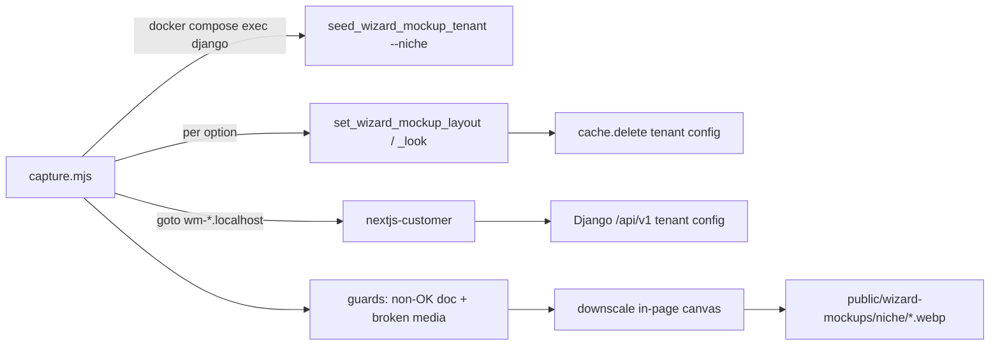

# Other — tools-wizard-mockups

# Other — `tools/wizard-mockups`

A small, host-run Playwright tool that generates the **real screenshots shown in the coach signup wizard**. It drives a hidden scratch tenant through every option in the wizard catalog (page layouts, hero styles, themes) for every supported niche, screenshots each variant, downscales it, and writes the result into `frontend-main/public/wizard-mockups/<niche>/`.

It is a **manual dev tool**, not part of any build, test, or deploy path. Its output is committed static asset data; the tool exists so those assets can be regenerated when demo content or page templates change.

- Entry point: `tools/wizard-mockups/capture.mjs` (~230 lines, single file)
- Package: `tools/wizard-mockups/package.json` — private, ESM, one dependency (`playwright`), one script (`capture`)
- Make target: `make capture-wizard-mockups` (depends on `seed-demo-assets`)
- Output: 189 `.webp` files — 7 niches × 27 shots

There is no importable API here and nothing in the app imports this directory. The coupling to the rest of the codebase is entirely through (a) Django management commands it shells out to, (b) the on-disk asset filenames it writes, and (c) four hand-mirrored constant lists.

---

## Why it exists

The wizard's layout/theme/hero pickers used to show CSS sketches. Showing the coach an actual render of their own niche's demo content converts better, but real renders can't be produced at request time — so they're pre-rendered offline, once per (niche × option), and served as static WebP from `frontend-main/public/`.

The consumer is `packages/shared/src/wizard/mockups.ts`:

```ts
mockupSrcs(niche, name) // → ["/wizard-mockups/<niche>/<name>.webp", "/wizard-mockups/yoga/<name>.webp"]
```

`frontend-main/src/app/signup/verify/wizard/steps.tsx` (themes, heroes) and `pages-steps.tsx` (page layouts) try each candidate in order and fall back to a CSS sketch when all of them 404. That fallback chain is why an uncaptured niche or a newly added catalog option degrades gracefully instead of showing a broken image — but it's also why silently-bad captures are dangerous: a written-but-blank file looks "captured" to every consumer.

---

## Output contract

```
frontend-main/public/wizard-mockups/<niche>/
  home-spotlight.webp   about-story.webp    courses-grid.webp    …   # 18 layout ids
  hero-centered.webp    hero-split.webp     hero-minimal.webp        #  3 hero styles
  theme-ocean.webp      theme-ember.webp    …                        #  6 themes
```

The basename **is** the contract — it must equal the catalog option's id, because `mockupSrcs()` interpolates the id (or `theme-<id>` / `hero-<id>`) directly into the path. Renaming a catalog option without recapturing silently drops every consumer to the CSS sketch.

Image settings (all constants at the top of `capture.mjs`):

| Constant | Value | Note |
|---|---|---|
| `VIEWPORT` | 1280 × 960 | render viewport |
| `DEVICE_SCALE` | 2 | capture at 2×, then supersample down — noticeably crisper text/photos than a 1× capture at the same output size |
| `OUTPUT_WIDTH` | 800 | final width; height follows aspect ratio |
| `WEBP_QUALITY` | 0.85 | |
| `HERO_CLIP` | 1280 × 640 from origin | hero cards only sell the top of the page |

Framing differs per shot type, deliberately:

- **Layouts** are captured `fullPage: true`. A viewport crop made layouts that share their opening blocks (`home-story` / `home-complete` both open hero → imageText → courseGrid) render byte-identical, because the distinguishing block sat below the fold.
- **Heroes** are clipped to `HERO_CLIP`.
- **Themes** are a plain viewport shot of `/` on the canonical `home-spotlight` layout.

---

## How a run works



For each niche: reseed the scratch tenant, then for each of the 27 options mutate the tenant's config, navigate, guard, screenshot, downscale, write.

### 1. Shelling into Django

Everything server-side goes through one helper:

```js
function manage(args) {
  execFileSync("docker", ["compose", "exec", "-T", "django", "python", "manage.py", ...args],
    { cwd: repoRoot, stdio: "inherit" });
}
```

with three thin wrappers — `seedNiche()`, `setLayout(page, layoutId)`, `setLook(args)`. Synchronous by design: the config write must land before the navigation. Because it uses `docker compose exec`, the dev stack must already be up; this tool is always run from the **host**, never inside a container.

### 2. The scratch tenant

`backend/apps/core/management/commands/seed_wizard_mockup_tenant.py` tears down and recreates a tenant on schema `wizard_mockups` (`settings.WIZARD_MOCKUP_TENANT_SCHEMA`), seeds it from a `demo_seed` niche via `seed_template_into_tenant()`, and publishes every seeded course (the seeder creates drafts, which is right for a real signup but wrong for a screenshot). It's never linked from any public page.

Crucially it also creates **one extra domain per capture target** — `wm-<layout-id>`, `wm-theme-<name>`, `wm-hero-<style>`, all under `settings.CONTENTOR_DOMAIN`. That's why `capture.mjs` navigates to `http://wm-home-story.localhost/` rather than the tenant's own domain.

### 3. Three layers of cache that all had to be defeated

This is the least obvious part of the tool, and each layer bit at least once:

| Cache | Where | Defeated by |
|---|---|---|
| Chromium HTTP cache | browser | `Network.setCacheDisabled` over a CDP session |
| Django `TenantConfigView.get_object()`, 5 min | `apps/tenant_config/views.py`; invalidated only on the DRF update path | the management commands write via ORM, so they `cache.delete(f"tenant:{schema}:config")` themselves |
| `fetchTenantConfig()`, 60 s in-memory, keyed by domain | `frontend-customer/src/lib/tenant.ts` | **per-option domains** — nothing else can reach it |

The third one is the reason for the `wm-*` domain fan-out: two options captured back to back on one domain would serve the first option's cached config for the second, producing two identical screenshots labelled differently.

### 4. Guards — fail loudly, never write a bad asset

`capture()` refuses to write in two situations, both learned from shipped-broken batches:

- **Non-OK main document.** A 502 (typically `nextjs-customer` OOM-killed mid-run) renders as a blank white page that issues *zero* image requests, so the media guard can't see it. Without this check the tool wrote 162 blank 1408-byte WebPs and exited 0. The error message names the recovery step.
- **Broken media.** Tracked at the network layer (`response` + `requestfailed` listeners filtered to `image`/`media`) so CSS `background-image` fetches count, not just ``; plus a DOM second net for `img.complete && naturalWidth === 0`. Trips when dev MinIO has been wiped and presigned demo photos 404 — error points at `make seed-demo-assets`.

Next's dev overlay is hidden with a `nextjs-portal{display:none}` style tag before shooting, same as `tools/flowmap/crawler/capture.js`.

### 5. Downscaling without native deps

`downscale()` avoids `sharp`/`canvas` entirely: it base64s the PNG into the page under test, decodes it into an `<Image>`, draws it onto a canvas at the target width with `imageSmoothingQuality = "high"`, and reads back `toDataURL("image/webp", quality)`. Same trick as `tools/flowmap/crawler/thumbnail.js`. The high smoothing setting matters here specifically because the 2× → 800px ratio is large enough that default bilinear aliases visibly.

---

## Constants that must stay in sync

`capture.mjs` hand-mirrors four lists. Nothing enforces this; drift shows up as missing or stale thumbnails, not as an error.

| In `capture.mjs` | Source of truth |
|---|---|
| `NICHES` | `backend/apps/demo_seed/data/` minus `general` — **and** `MOCKUP_NICHES` in `packages/shared/src/wizard/mockups.ts` |
| `LAYOUTS` | `wizard_catalog.PAGE_LAYOUTS` (`backend/apps/core/onboarding/wizard_catalog.py`) |
| `THEMES` | `wizard_catalog.THEMES` |
| `HEROES` | `wizard_catalog.HERO_STYLES` |

`general` is excluded on purpose: it's a deliberately sparse blank-slate module (no plans, FAQ disabled) that would screenshot as empty states. The wizard maps it to the `yoga` set via `FALLBACK_NICHE`.

---

## Running it

Prereqs: dev stack up (`make dev`), demo media mirrored into dev MinIO (`make seed-demo-assets` — the Make target does this for you). The scratch tenant is reseeded by the script itself; no manual seeding step.

```bash
make capture-wizard-mockups                              # all niches
make capture-wizard-mockups ARGS="--niche belly_dance"   # one niche

# or directly, from tools/wizard-mockups/
npm run capture -- --niche yoga
```

`nichesFromArgv()` accepts only repeated `--niche <name>` flags and throws on anything else or on an unknown niche; with no args it does the full `NICHES` list.

### The full-matrix run does not currently complete

All 7 niches × 27 shots in one process is ~189 on-demand SSR compiles over 30–45 minutes, and the `nextjs-customer` dev container (no `mem_limit`, shared Docker VM) gets OOM-killed partway through. The non-OK-document guard now makes that fail loudly instead of writing blanks, but it still won't finish the matrix.

Working recipe — one niche per fresh server lifetime:

```bash
for n in belly_dance face_yoga fitness makeup pilates pole_dance yoga; do
  docker compose restart nextjs-customer
  # wait for a 200 on a wm-*.localhost host, then:
  (cd tools/wizard-mockups && npm run capture -- --niche "$n")
done
```

A single-niche run is ~27 renders / 2–4 minutes and is safe. Verify afterwards that the minimum WebP size per niche is >3 KB — a blank capture is exactly 1408 bytes. Baking the restart into the Make target (or into `capture.mjs`) so the full run works unattended is an open follow-up.

---

## Adding or changing a catalog option

1. Add the option in `wizard_catalog.py` (`PAGE_LAYOUTS` / `THEMES` / `HERO_STYLES`). `seed_wizard_mockup_tenant` derives its `wm-*` domains from the catalog, so the capture domain appears automatically — but the scratch tenant must be **reseeded** for it to exist.
2. Mirror it into the matching list in `capture.mjs` (`LAYOUTS` entries need `{ page, id, path }`, where `path` is the customer-app route that renders that page).
3. Recapture. Until you do, `mockupSrcs()` 404s through both candidates and the wizard shows its CSS sketch — safe, just less compelling.
4. New niche: also add it to `MOCKUP_NICHES` in `packages/shared/src/wizard/mockups.ts` (covered by `frontend-customer/src/lib/__tests__/wizard-mockups.test.ts`) and confirm `demo_seed` has a content-complete module for it.
5. Commit the resulting `.webp` diff — these are the shipped assets.

Backend command behaviour is covered by `backend/apps/core/tests/test_seed_wizard_mockup_tenant.py`, `test_set_wizard_mockup_layout.py`, and `test_set_wizard_mockup_look.py`. `capture.mjs` itself has no tests; its guards are its verification.

---

## Troubleshooting

| Symptom | Cause | Fix |
|---|---|---|
| `main document returned 502 … refusing to capture` | `nextjs-customer` down or OOM-killed | `docker compose up -d nextjs-customer`, wait for a 200, resume per-niche |
| `page has broken media … refusing to capture` | dev MinIO wiped, presigned demo photos 404 | `make seed-demo-assets` |
| `wizard-mockups tenant … not found` | scratch tenant missing | `docker compose exec django python manage.py seed_wizard_mockup_tenant --niche yoga` (or just rerun the capture) |
| Two options produced identical images | a shared domain or a live config cache | confirm the `wm-*` domain exists for that option (reseed), and that the command purged `tenant:wizard_mockups:config` |
| 1408-byte `.webp` files | pre-guard blank captures from an old run | delete and recapture that niche |
| `Unknown niche 'x'` / `Unknown argument` | `NICHES` drift or a typo'd flag | check the list against `demo_seed/data/` |
