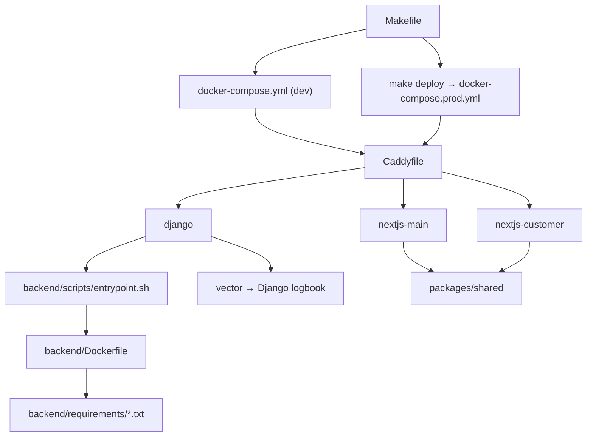

# Other

# Other

The catch-all area for everything in Contentor that isn't application code but determines how the application is built, run, tested, deployed, observed, and understood. Nothing here is imported by `apps/*` or `src/*` — these files are consumed by `docker build`, `make`, `pytest`, `next`, `caddy`, `wrangler`, and by AI agents reading the repo.

Roughly four layers, each documented on its own page.

## 1. Agent & human orientation

The repo carries an explicit contract for how coding agents should behave in it, because a plausible-looking change here (a `fetch()` without `X-Tenant-Domain`, a public endpoint without `@authentication_classes([])`) silently crosses a tenant boundary.

- [CLAUDE.md](claude-md.md) — highest-precedence, always-loaded session instructions; the invariants and the working style.
- [agent.context.md](agent-context-md.md) — the one-minute mental model: actors, tenancy, invariants.
- [agent.commands.json](agent-commands-json.md) — machine-readable projection of the `make` surface, so an agent doesn't reverse-engineer the Makefile.
- [docs/](docs.md) — `REFERENCE.md`, `GLOSSARY.md`, `PRODUCT.md`, and the generated `docs/wiki/` tree; [docs/superpowers](docs-superpowers.md) holds the spec/plan archive that ~29 source files link back to.

These four are mutually reinforcing and mutually rot-prone: `agent.commands.json` and `agent.context.md` restate facts owned by the `Makefile` and `REFERENCE.md`. A command rename touches all of them.

## 2. Build & run

- [Makefile](makefile.md) — the single entry point; every target shells into a container. If it isn't in `make help`, nobody finds it.
- [docker-compose.yml](docker-compose-yml.md) (dev) and [docker-compose.prod.yml](docker-compose-prod-yml.md) (home server) are **two independent stacks**, not a base/override pair — parity settings (worker class, timeouts, log shipping) must be edited twice.
- [Caddyfile](caddyfile.md) — one parametrized file for both, differing only by env vars; owns apex-vs-tenant host routing and the `/api/*`, `/static/*` bypasses.
- [backend](backend.md) (`Dockerfile`, `pyproject.toml`, `conftest.py`), [backend/requirements](backend-requirements.md), [backend/scripts](backend-scripts.md) (the sole migration/collectstatic/seed entrypoint), [backend/config](backend-config.md) (load-order-critical Celery registration), [backend/apps](backend-apps.md) (package scaffolding, shared-schema migrations, pytest harness).
- Frontend build layers: [frontend-main](frontend-main.md), [frontend-customer](frontend-customer.md), plus their `src` roots ([frontend-main/src](frontend-main-src.md), [frontend-customer/src](frontend-customer-src.md)) which own the global stylesheets and design tokens.
- [packages/shared](packages-shared.md) — source-only, no `package.json`; dependencies resolve from whichever app compiles it, so a new import must be installed in **both**.

## 3. Content & assets that ship with the apps

Data with no call graph, coupled to code by key path or filename rather than by import:

- i18n catalogs — [frontend-main/messages](frontend-main-messages.md) (en + tr, marketing/signup/onboarding) and [frontend-customer/messages](frontend-customer-messages.md) (portal + admin).
- [frontend-customer/public](frontend-customer-public.md) — generated Serwist service worker alongside the 220 MB committed curated-logo catalog; two very different things in one directory.
- [frontend-customer/scripts](frontend-customer-scripts.md) — a single `postinstall` patch for `@mediapipe/tasks-vision`.

## 4. Testing, observability, and dev tooling

- [e2e](e2e.md) — Playwright config, global setup, and `impact-map.json`; [e2e/specs](e2e-specs.md) drives the *running dev stack* (not a hermetic environment) across both frontends and Django; [e2e/helpers](e2e-helpers.md) supplies the five recurring primitives (`compose`, `auth`, email sink, holdout pinning, Stripe Checkout). [e2e/playwright-report](e2e-playwright-report.md) is regenerated output — read for failure context, never edited.
- [monitoring/vector](monitoring-vector.md) — dumb transport only; all parsing, level filtering, and tenant extraction happen in `apps/logbook`. That IS the observability stack; there is no metrics stack.
- [infra/cloudflare](infra-cloudflare.md) — the `mailbox-inbound` Email Worker, the only Contentor component running outside Docker and outside `make deploy` (deployed via `wrangler`).
- [scripts](scripts.md) — operator-run bash: prod Postgres backup/restore, Stripe webhook forwarding.
- Reference tooling: [tools/flowmap](tools-flowmap.md) crawls both frontends and renders user-journey DAGs at `:7878`; [tools/wizard-mockups](tools-wizard-mockups.md) regenerates the committed signup-wizard screenshots.

## Workflows that cross the boundaries

**Local change → verified.** `make test-changed` (backed by `scripts/select_tests.py` and the `conftest.py`/`pyproject.toml` harness in [backend](backend.md)) → `make e2e-changed`, which maps the diff through `e2e/impact-map.json`, fails closed, and always runs `00-smoke`.

**Container boot.** `docker-compose*.yml` → image from [backend/Dockerfile](backend.md) with the layer chosen from [backend/requirements](backend-requirements.md) → [entrypoint.sh](backend-scripts.md) runs migrations/collectstatic/seed for the `django` service only; `celery-worker` and `celery-beat` pass through the same entrypoint but skip those steps to avoid races.

**Request path.** Browser → Cloudflare tunnel (prod) → [Caddyfile](caddyfile.md) → Django or one of the two Next.js apps, both of which compile [packages/shared](packages-shared.md) from source and resolve strings from their own message catalogs.

**Log path.** Every container's stdout → [vector](monitoring-vector.md) → Django logbook ingest → superadmin → Logs.

**Deploy.** `make deploy` → full backend suite → `~/ws/home-server/deploy.sh contentor` → [docker-compose.prod.yml](docker-compose-prod-yml.md) on the home-server host, with the same `Caddyfile` behind the shared `edge` network.

## Editing rules that apply across this group

- Dev and prod compose files diverge silently — check both when changing runtime behavior.
- Generated trees are not editable: `docs/wiki/`, `e2e/playwright-report/`, `frontend-customer/public/sw.js`.
- The agent-facing files (`CLAUDE.md`, `AGENTS.md`, `agent.context.md`, `agent.commands.json`) duplicate facts on purpose; when a command or invariant changes, update every copy or the duplication becomes misinformation.
