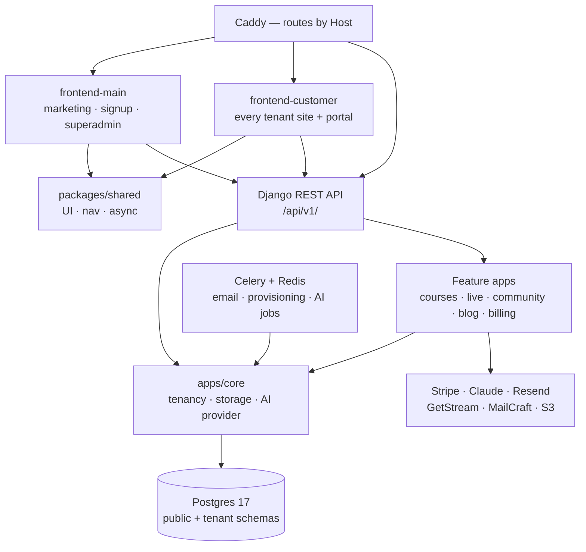

# contentor — Wiki

# Contentor

Contentor is a multi-tenant SaaS platform for content creators. A **coach** signs up on the marketing site, answers a few questions in an AI-driven wizard, and minutes later has a live, branded website on their own subdomain (or their own domain) where they sell courses, downloadable products, live classes and streams, run a blog, email their audience, and host a student community. A **student** is an end user inside one coach's site. **Superadmin** is us — we watch all of it from a platform console.

Isolation is **PostgreSQL schema-per-tenant** via `django-tenants`. One Django deployment and two Next.js deployments serve every coach; which schema a request touches is decided by the hostname (or an `X-Tenant-Domain` header for server-side calls). Nothing tenant-specific is baked in at build time.

## The 10-second picture



## The three layers

**Routing.** [Caddy](other-infra-config.md) sends the apex and `tr.` locale hosts to the [Marketing Site App (`frontend-main`)](marketing-site-app-frontend-main.md), and *everything else* — every tenant subdomain and custom domain — to the [Student Portal App (`frontend-customer`)](student-portal-app-frontend-customer.md) as a catch-all. `/api/*`, `/static/*` and `/django-admin/*` go straight to Django, never through Next.

**Backend.** [Core Platform & Multi-Tenancy](core-platform-multi-tenancy-apps.md) is the floor every request lands on: region/locale resolution, schema switching, storage, email, access control, throttling, and the Claude provider layer. Feature apps sit on top and are almost all TENANT_APPS — [Courses, Downloads & Media Library](courses-downloads-media-library.md), [Live Events & Calendar](live-events-calendar.md), [Community](community.md), [Blog & AI Content](blog-ai-content.md), [Email Campaigns](email-campaigns.md), [Mailbox & Notifications](mailbox-notifications.md), [Tenant Config & Site Builder](tenant-config-site-builder.md), [Logo Studio & Brand Identity](logo-studio-brand-identity.md), and the tenant half of [Observability & Usage Analytics](observability-usage-analytics.md). A smaller set lives in the public schema because it describes the platform rather than a tenant: [Billing & Payments](billing-payments.md) platform subscriptions, [Custom Domains](custom-domains.md), the logbook, and the [Superadmin Platform Console](superadmin-platform-console.md).

**Frontend.** Both Next.js 14 apps draw their primitives, navigation-progress layer, and async-action hooks from the [Shared UI Library](shared-ui-library.md) — by call volume it is the single most-depended-on module in the repo. Admin screens on both sides are not hand-written: the [Admin Kit Framework](admin-kit-framework.md) turns one Python model declaration into a REST CRUD surface *and* the JSON metadata a generic React renderer uses to build tables, filters, forms and bulk actions.

Two cross-cutting concerns deserve their own mention. [Authentication & Accounts](authentication-accounts.md) owns identity for everything — magic links, emailed codes, Google OAuth, impersonation — and is unusual in that its `User` table exists in *every* schema: coaches and superadmins in public, students and staff per tenant. There are no server-side sessions, only signed JWTs. And [AI Infrastructure & Assistants](ai-infrastructure-assistants.md) funnels every Claude call in the product through one provider layer, one SSE framing convention, and one conversation kernel with cost metering — the site wizard, the blog writer, the coach copilot and the support bot are all tenants of that kernel.

## Key end-to-end flows

**Coach signup → live site.** This is the flow that defines the product, and it's worth reading [Onboarding Wizard & Site AI](onboarding-wizard-site-ai.md) first. A coach enters a brand name on `frontend-main`, the wizard interviews them, and the backend provisions a tenant: creates the schema, seeds a `TenantConfig` (theme, fonts, navbar, page block tree), composes a site, generates a logo recipe and starter blog copy, registers the subdomain as a `django-tenants` domain, and starts a Stripe subscription. The coach lands on their own tenant site, already populated, with a Setup Assistant checklist and a publish gate telling them what's left.

**Student buys something.** A visitor browses a tenant's public pages, gets a magic link (which auto-registers them in that tenant's schema), and checks out. Payment runs as a Stripe **direct charge on the coach's connected account** with a platform application fee — a separate money flow from the coach's own subscription, though both land on one webhook endpoint. On success, access gating in the content apps flips and the course, download, or live event opens up.

**Coach publishes and reaches out.** Content is authored in the coach's admin panel inside `frontend-customer`. Blog drafts come from a single metered Claude call with imagery pulled from the shared curated-photo library. Campaigns are designed in MailCraft (a sibling product Contentor embeds), rendered server-side per recipient, and fanned out through Celery via Resend. Live classes and streams run in-app over GetStream; Zoom and onsite events are the same model with a different delivery secret.

**Logo Studio.** Worth knowing as an invariant even if you never touch it: a logo is a versioned `LogoRecipe` JSON document, never an image. Preview, editor canvas, dark variant, brand-kit zip and exported PNGs are all pure functions of that recipe, rasterized once in the browser at export time.

## Getting started

The dev stack is Docker Compose behind Caddy on `:80`, with hot reload for Django and both Next apps.

```bash
make dev            # bring the stack up
make migrate seed   # schema + demo tenants
make health-check   # is it already running? check this before make dev
```

Then visit `localhost` (marketing) and the seeded tenant subdomains (`<slug>.localhost`) for the portal. Dev bundles local fakes so you can work offline: MinIO as the object store, a GetStream stub for live classes (`LIVE_FAKE_ENABLED`), and an email sink you can read back over HTTP (`EMAIL_SINK_ENABLED`).

Testing is tiered — reach for the cheapest level that covers your change:

```bash
make test-changed                 # default: only tests the diff touches
make test-app APP=billing         # one Django app
make test-frontend                # vitest, both apps
make e2e-changed                  # Playwright specs mapped from the diff
make lint typecheck               # includes repo guardrail scripts
```

Full `make test` and full `make e2e` are for changes to shared core — `apps/core`, `packages/shared`, auth, or billing providers.

## Before you edit

Two conventions catch most newcomers. First, **multi-tenancy**: a server-side `fetch()` from Next.js to Django must send `X-Tenant-Domain`, because Node's undici silently drops a custom `Host` and you'll quietly read the public schema instead of the tenant's. Second, **auth defaults**: `TenantJWTAuthentication` is the default DRF auth class, so genuinely public endpoints need `@authentication_classes([])` — `AllowAny` on its own is not enough.

Beyond that: read the wiki page for the area you're touching before you start, and keep an eye on the [Developer Tooling](developer-tooling-flowmap.md) scripts wired into `make lint` — they encode these rules so a violation fails fast rather than at runtime. The [Other](other.md) pages cover the build, deploy, and agent-orientation layers around the app.
