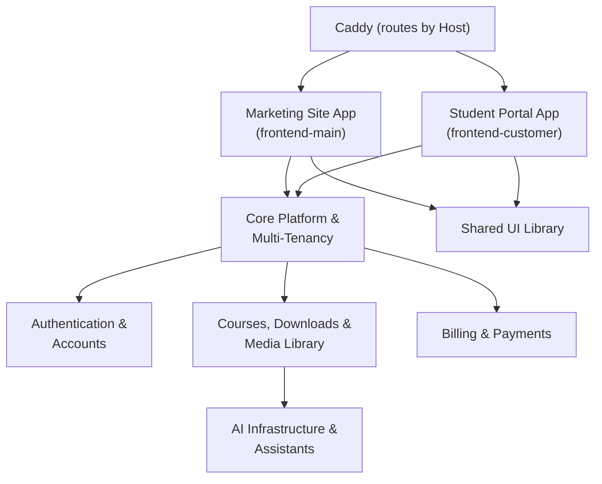

# contentor — Wiki

# Contentor

Contentor is a multi-tenant SaaS platform for content creators ("coaches") who want to sell courses, downloads, live sessions, and email campaigns from their own branded site. Each coach gets a tenant subdomain — or, via [Custom Domains](custom-domains.md), their own real domain — backed by a fully isolated PostgreSQL schema. Students sign up inside a tenant to buy and consume that coach's content; superadmins (us) run the whole platform from a separate console.

The system is a monorepo: a Django 5.1 + DRF backend and two independent Next.js 14 apps, all sitting behind Caddy, which routes every request by hostname before a single line of application code runs.

## How a request finds its home

Caddy looks at the `Host` header first. The apex domain and its locale variant go to the marketing app; literally everything else — every coach's subdomain, every custom domain — goes to the tenant-facing app. Django only ever sees `/api/*` traffic, routed directly, never proxied through Next.js.

[Marketing Site App (frontend-main)](marketing-site-app-frontend-main.md) is where a visitor becomes a coach: the public marketing pages, signup, and the onboarding wizard that turns a brand name into a live, AI-composed tenant site — that provisioning flow is documented in [Onboarding Wizard & Site AI](onboarding-wizard-site-ai-apps.md). It also hosts the coach's "my platforms" dashboard and the [Superadmin Platform Console](superadmin-platform-console-apps.md).

[Student Portal App (frontend-customer)](student-portal-app-frontend-customer.md) is the one deploy that serves every tenant — the coach's public site, the logged-in student experience, and the coach's own admin panel, all resolved per-request from the hostname. This is the app most feature work touches: [Courses, Downloads & Media Library](courses-downloads-media-library-backend-apps.md), [Live Events & Calendar](live-events-calendar-apps.md), [Community](community.md), and [Blog & AI Content](blog-ai-content-backend-apps.md) all render here.

Both frontends share one component and interaction layer, [Shared UI Library](shared-ui-library.md) (`packages/shared`), so loading states, toasts, and navigation feedback behave identically everywhere.

## The backend

Every request that reaches Django passes through [Core Platform & Multi-Tenancy](core-platform-multi-tenancy-apps.md) first — it resolves region and locale, then resolves which PostgreSQL schema the request belongs to, before any feature app runs. That schema-per-tenant split (`django-tenants`) is the load-bearing architectural decision in this codebase: apps are either `SHARED_APPS` living in the public schema (coaches, platform billing, domains) or `TENANT_APPS` scoped to one coach's data (students, courses, community posts).

Identity flows through [Authentication & Accounts](authentication-accounts.md) — magic links, emailed codes, Google OAuth — issuing a stateless JWT rather than server sessions; note that its `User` table itself exists in every schema, public and tenant alike. Money flows through [Billing & Payments](billing-payments-backend-apps.md), which runs two independent Stripe-backed flows (coach→Contentor subscriptions, and student→coach marketplace sales) through one webhook. A coach's brand, navigation, and page content live in [Tenant Config & Site Builder](tenant-config-site-builder-apps.md), with the visual identity itself composed in [Logo Studio & Brand Identity](logo-studio-brand-identity-packages-shared.md). Communication runs through [Mailbox & Notifications](mailbox-notifications-backend-apps.md) and [Email Campaigns](email-campaigns-backend-apps.md), the latter rendering through the sibling MailCraft product. Every model that needs a CRUD admin surface — on either the coach side or the superadmin side — is declared once in the [Admin Kit Framework](admin-kit-framework.md) and rendered generically by both frontends.

[AI Infrastructure & Assistants](ai-infrastructure-assistants-backend-apps.md) is the one place all of Contentor's Claude usage converges — a single provider layer, SSE framing convention, and cost-governed conversation kernel — feeding the onboarding wizard, in-app chat bots, and AI drafting in blog and course content. [Observability & Usage Analytics](observability-usage-analytics.md) watches all of it: a superadmin-facing platform logbook and per-tenant usage stats, both deliberately best-effort so telemetry never breaks the feature it's observing.

## Getting oriented

Start with `docs/wiki/` — every module above has its own page, and the area you're about to touch is worth reading before you write code. `docs/REFERENCE.md` covers cross-cutting concerns (domain model, auth/tenancy, billing, integrations, deploy) and `docs/GLOSSARY.md` fixes terminology. For day-to-day work, `make dev` brings up the full stack (Postgres, Redis, Django, both Next.js apps, Celery, Caddy) with hot reload; `make health-check` tells you if it's already running. `make test-changed` and `make e2e-changed` scope verification to your diff — see [Developer Tooling & Flowmap](developer-tooling-flowmap.md) for how that selection works, and the repo's own build/CI/deploy machinery is covered in [Other](other.md).
