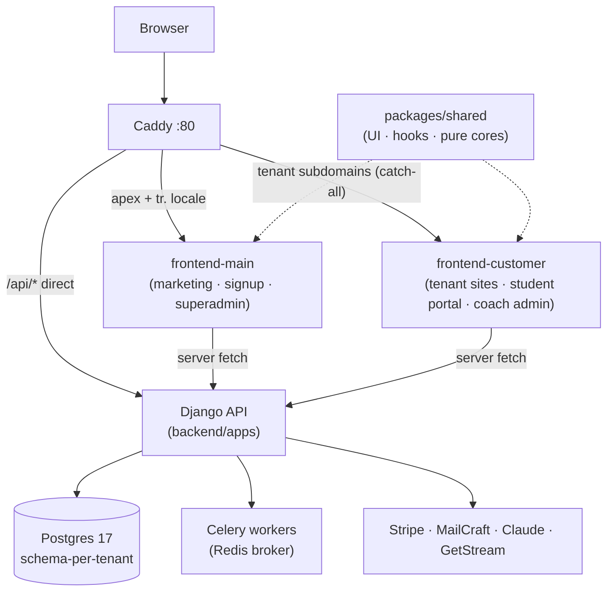

# contentor — Wiki

# Contentor

Contentor is a multi-tenant SaaS platform for content creators ("coaches"). A coach signs up, walks through an AI-powered onboarding wizard, and gets a fully provisioned site on their own subdomain (`yourname.contentor.app`, or a [custom domain](custom-domains.md) they buy in-product) where they sell courses, downloads, live sessions, and email campaigns to their students. The platform operator ("superadmin" — us) oversees everything from a dedicated console.

Three roles anchor the whole codebase: the **coach** owns a tenant and pays Contentor, the **student** is an end user inside a tenant, and the **superadmin** runs the platform. Almost every design decision traces back to keeping those three worlds isolated but served by one deployment.

## The big picture

The stack is a Django 5.1 + DRF backend, two independent Next.js 14 apps, PostgreSQL 17, Redis + Celery, all fronted by Caddy. Tenant isolation is **schema-per-tenant** via `django-tenants`: the public schema holds coaches, plans, and platform data; each tenant schema holds that tenant's students, content, and community.



Caddy makes the first routing decision by host: the apex and `tr.` locale go to the [Marketing Site App](marketing-site-app-frontend-main.md), every other host — i.e. every tenant subdomain — goes to the [Student Portal App](student-portal-app-frontend-customer.md), and `/api/*` goes straight to Django, never through Next.js. One `frontend-customer` deploy serves *every* coach's site; nothing tenant-specific is baked in at build time.

On the backend, every request first passes through the [Core Platform & Multi-Tenancy](core-platform-multi-tenancy.md) layer, which resolves region/locale, picks the PostgreSQL schema from the hostname (or the `X-Tenant-Domain` header — server-side Next.js fetches must send it, because Node's undici silently drops a custom `Host`), and applies shared primitives like storage, email, and throttling. Identity and every login flow (magic link, emailed code, Google OAuth, JWT issuance) live in [Authentication & Accounts](authentication-accounts.md); there are no server-side sessions, only signed JWTs.

Both frontends draw their primitives, navigation feedback, and async-action conventions from the [Shared UI Library](shared-ui-library.md), and both render admin screens through the [Admin Kit Framework](admin-kit-framework.md) — a schema-driven system where one Python declaration per model produces both the CRUD API and the metadata a generic React renderer turns into tables, filters, and forms.

## What a tenant is made of

A coach's site is configured, not coded. [Tenant Config & Site Builder](tenant-config-site-builder.md) owns the theme, navigation, page block tree, and the publish gate; the coach's brand mark comes from [Logo Studio & Brand Identity](logo-studio-brand-identity.md), where a logo is always a versioned JSON recipe rendered to SVG/PNG on demand, never an uploaded bitmap.

The things a coach sells and shares live in dedicated tenant apps: [Courses, Downloads & Media Library](courses-downloads-media-library.md) for gated content, [Live Events & Calendar](live-events-calendar.md) for live classes, streams, Zoom classes, and onsite events, [Community](community.md) for the in-tenant social feed, and [Blog & AI Content](blog-ai-content.md) for the coach blog (the platform blog runs on the same engine). Coaches reach students through [Email Campaigns](email-campaigns.md) — rendered by the external MailCraft service and fanned out via Celery — plus the threaded [Mailbox & Notifications](mailbox-notifications.md) subsystems.

AI is a first-class layer, not a bolt-on: [AI Infrastructure & Assistants](ai-infrastructure-assistants.md) centralizes the Claude provider layer, SSE streaming conventions, and cost governance that the wizard, blog drafting, and the three chat assistants all share.

## Key end-to-end flows

**Coach signup → live site.** A visitor on the marketing site types a brand name; the [Onboarding Wizard & Site AI](onboarding-wizard-site-ai.md) flow provisions a tenant schema, creates the user in both the public schema (as coach) and the tenant schema (as owner), composes the site structure, writes the copy with Claude, and offers a curated or generated logo. This is the one place where a paying customer's entire site is authored by the system.

**Money.** [Billing & Payments](billing-payments.md) runs two independent flows through one Stripe webhook endpoint: the platform subscription (coach pays Contentor via Checkout) and the marketplace (student pays coach via direct charges on the coach's connected Stripe account, with a platform application fee).

**Student access.** A student hits a tenant subdomain, authenticates via magic link (which auto-registers them in the tenant schema), and content gating in the courses/downloads apps decides what they can see based on what they've purchased.

**Operations.** Superadmins work from the [Superadmin Platform Console](superadmin-platform-console.md), and the [Observability & Usage Analytics](observability-usage-analytics.md) logbook — fed by a Vector container shipping every service's logs — *is* the observability stack.

## Getting started

```bash
make dev            # bring the stack up (hot-reload; Caddy on :80)
make health-check   # confirm it's healthy — the stack is often already running
make migrate && make seed
make test-changed   # default verification: only tests affected by your diff
make help           # everything else
```

Dev compose bundles local fakes so you can work fully offline: MinIO as the object store, a GetStream stub for live classes (`LIVE_FAKE_ENABLED`), and an email sink you can read back over the API. Playwright e2e specs live in `e2e/`; `make e2e-changed` selects specs from your diff.

Before working in any area, read its wiki page here first — pages are named `<area>[-<location>].md` (e.g. `billing-payments-backend-apps.md`) and describe design intent, so you rarely need to re-explore from scratch. `docs/REFERENCE.md` covers cross-cutting concerns and `docs/GLOSSARY.md` pins the terminology. Repo-level tooling — the selective test runner, lint guards, and the rest — is documented under [Developer Tooling & Flowmap](developer-tooling-flowmap.md), with build/deploy/agent-facing infrastructure gathered in [Other](other.md).