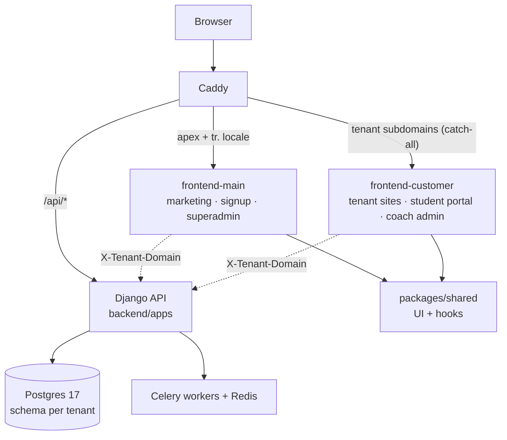

# contentor — Wiki

# Contentor

Contentor is a multi-tenant SaaS platform for content creators ("coaches"). A coach signs up, gets their own subdomain (`yourname.contentor.app` — or a [custom domain](custom-domains.md) they buy through us), and sells courses, downloads, live sessions, and email campaigns to their students. What makes the product unusual is how much of a coach's site is *authored by the system*: the [onboarding wizard](onboarding-wizard-site-ai.md) provisions a tenant and composes an entire AI-written site from little more than a brand name, and the [Logo Studio](logo-studio-brand-identity.md) generates the brand mark itself — a versioned JSON recipe, never an uploaded bitmap.

Three audiences use the platform: **coaches** (our paying customers, who run their tenant), **students** (end users inside a tenant), and **superadmins** (us, via the [platform console](superadmin-platform-console.md)).

## Architecture in one look

The stack is Django 5.1 + DRF + Postgres 17 + Redis/Celery behind two independent Next.js 14 apps, all fronted by Caddy:



The two ideas to internalize before touching anything:

**1. Tenancy is schema-per-tenant, resolved per request.** Every request passes through the [core platform](core-platform-multi-tenancy.md) middleware chain, which answers three questions in order: which region/locale, which PostgreSQL schema, and which user. Django apps are split into `SHARED_APPS` (public schema: coaches, plans, domains, curated assets) and `TENANT_APPS` (per-tenant schema: courses, community, students-as-users). One deploy of `frontend-customer` serves *every* coach's site — nothing tenant-specific is baked in at build time; identity comes from the `Host` header. The classic trap: Next.js server-side `fetch()` to Django must send an `X-Tenant-Domain` header, because Node's undici silently drops a custom `Host`.

**2. Both frontends stand on one shared layer.** The [Shared UI Library](shared-ui-library.md) (`packages/shared`) is the single source of truth for primitives, navigation feedback, and async-action handling — it's the most-depended-on module in the frontend graph, consumed by nearly every feature surface in both apps. When you build UI, you build on it; the loading/feedback conventions it encodes are lint-enforced.

## Backend

Feature apps live in `backend/apps/`, each with its own wiki page. [Authentication & Accounts](authentication-accounts.md) owns identity — JWT-only (no server sessions), with magic links, emailed codes, and Google OAuth; its `User` table exists in *every* schema, holding coaches publicly and students per-tenant. [Billing & Payments](billing-payments.md) runs two independent money flows through one Stripe webhook: coaches paying Contentor for their subscription, and students paying coaches via connected accounts with a platform fee.

Tenant content is spread across [Courses, Downloads & Media](courses-downloads-media-library.md), [Live Events & Calendar](live-events-calendar.md) (live classes, streams, Zoom, and onsite events sharing one calendar shape), [Community](community.md) (the in-tenant social feed), and the [Blog engine](blog-ai-content.md), which powers both coach blogs and our own platform blog with AI-drafted posts. Communication splits across [Email Campaigns](email-campaigns.md) (bulk sends, rendered by the external MailCraft service and fanned out via Celery) and [Mailbox & Notifications](mailbox-notifications.md) (threaded coach↔student email plus Web Push announcements).

Two framework-level modules keep the rest small: the [Admin Kit](admin-kit-framework.md) turns one Python declaration per model into a full CRUD API *and* the JSON metadata a generic React renderer uses to build the admin UI — no hand-written TypeScript per model. And the [AI infrastructure](ai-infrastructure-assistants.md) funnels every Claude call through one provider layer with SSE framing and cost governance, feeding three chat surfaces across the frontends. [Observability](observability-usage-analytics.md) ships every container's logs into an in-app logbook — that *is* the monitoring stack.

## Frontends

[frontend-main](marketing-site-app-frontend-main.md) serves the apex domain: marketing pages, coach signup and the onboarding wizard, the coach's "my platforms" dashboard, and the superadmin console. [frontend-customer](student-portal-app-frontend-customer.md) serves everything else — each tenant's public site, the student portal behind login, and the coach's admin panel, with the site's look and page tree driven entirely by the [Tenant Config & Site Builder](tenant-config-site-builder.md) module.

## Key end-to-end flows

- **Coach signup → live site.** A visitor on `frontend-main` types a brand name; the onboarding wizard provisions a tenant schema, creates the user in both public and tenant schemas, generates a logo recipe, and has AI compose and write the site's pages into `TenantConfig`. Minutes later the coach's subdomain is serving a real site from `frontend-customer`.
- **Student joins and buys.** A magic link auto-registers the student in the tenant schema; checkout runs as a direct charge on the coach's connected Stripe account; webhook processing grants access to the course, download, or event.
- **A campaign goes out.** The coach designs an email in the embedded MailCraft builder; the backend renders personalized HTML through MailCraft's export API and Celery fans out delivery via Resend. The superadmin→coach platform campaigns are a deliberate mirror of the same pipeline.

## Getting started

```bash
make dev            # full stack up with hot reload (Caddy, Django, both Next.js apps, Celery, MinIO fakes)
make migrate seed   # schema + demo data
make health-check   # is everything up?
make test-changed   # the default verification gate — only tests affected by your diff
```

The dev stack is usually already running — check health before reaching for `make dev`, and never rebuild containers to verify a code-only change; everything hot-reloads. Dev bundles local fakes (MinIO for object storage, a GetStream stub, an email sink) so the whole product works offline. `make help` lists the rest.

Before working in any area, read its wiki page (named `<area>[-<location>].md`, e.g. `billing-payments-backend-apps.md`) — these pages describe design intent that the code alone won't tell you. `docs/REFERENCE.md` covers cross-cutting concerns, and [Developer Tooling](developer-tooling-flowmap.md) documents the selective test runner and lint guards you'll hit on your first commit.
