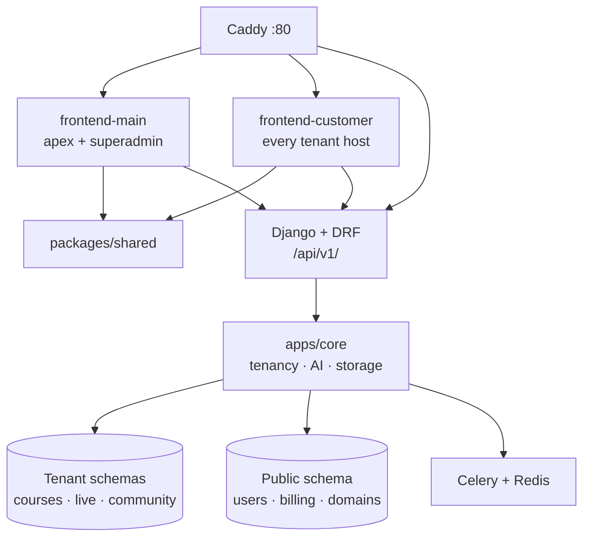

# contentor — Wiki

# Contentor

Contentor is a multi-tenant SaaS that gives content creators — we call them **coaches** — their own branded platform. A coach signs up on `contentor.app`, answers an AI interview about what they teach, and ends up with a live site at `theirname.contentor.app` where they sell courses, downloadable files, live classes, and email campaigns to their **students**. We (the platform owners) watch all of it from a superadmin console.

The hard architectural fact to internalize first: **every tenant gets its own PostgreSQL schema**. One Django deployment, one `frontend-customer` deployment, N isolated schemas. Nothing about a tenant is baked in at build time — identity is resolved per request from the `Host` header (or an explicit `X-Tenant-Domain` header for server-side calls).

## Architecture at a glance


```mermaid
graph TD
    Caddy[Caddy :80]
    Main[frontend-main<br/>apex + superadmin]
    Cust[frontend-customer<br/>every tenant host]
    Shared[packages/shared]
    API[Django + DRF<br/>/api/v1/]
    Core[apps/core<br/>tenancy · AI · storage]
    Tenant[(Tenant schemas<br/>courses · live · community)]
    Public[(Public schema<br/>users · billing · domains)]
    Celery[Celery + Redis]

    Caddy --> Main
    Caddy --> Cust
    Caddy --> API
    Main --> Shared
    Cust --> Shared
    Main --> API
    Cust --> API
    API --> Core
    Core --> Tenant
    Core --> Public
    Core --> Celery
```

Four runtime pieces, behind Caddy in both dev and prod:

- **[Marketing Site App (frontend-main)](marketing-site-app-frontend-main.md)** — the apex host: marketing pages, signup, the coach's "my platforms" dashboard, and the [Superadmin Platform Console](superadmin-platform-console.md).
- **[Student Portal App (frontend-customer)](student-portal-app-frontend-customer.md)** — every other host. One deploy serving all tenant sites: public pages, the student portal, and the coach's admin panel.
- **Django + DRF** — all of `/api/v1/`, plus the per-tenant schema routing.
- **Celery + Redis** — email fan-out, provisioning, AI jobs, domain polling.

Both frontends draw their primitives from the [Shared UI Library](shared-ui-library.md) (`packages/shared`) — buttons, the navigation progress bar, `useAsyncAction`. It is by far the most-depended-on module in the repo, and the loading/feedback conventions it encodes are lint-enforced.

## The foundation: core and tenancy

Start with [Core Platform & Multi-Tenancy](core-platform-multi-tenancy.md). Every request passes through its middleware, in order: resolve region/locale, resolve the PostgreSQL schema, then authenticate. It also owns storage (S3/MinIO), outbound email, throttling, and the Claude provider layer that [AI Infrastructure & Assistants](ai-infrastructure-assistants.md) builds on.

[Authentication & Accounts](authentication-accounts.md) is the other universal dependency — more backend code calls into it than into anything else. There are no server-side sessions: a signed JWT carries identity, and the same `User` model exists in *every* schema (coaches and superadmins in public, students and staff per tenant). `TenantJWTAuthentication` is the default DRF auth class, which means a genuinely public endpoint must declare `@authentication_classes([])` — `AllowAny` alone will still reject anonymous callers.

## What a coach gets

A tenant site is assembled from a handful of feature modules, each with its own wiki page:

**Content to sell.** [Courses, Downloads & Media Library](courses-downloads-media-library.md) holds the five tenant apps behind lessons, files, and the media library, with access gating in front of them. [Live Events & Calendar](live-events-calendar.md) covers the four time-based products — live classes, streams, Zoom links, onsite events — which share one model shape and one calendar feed, differing only in delivery. Video itself is embedded from LiveCraft, a sibling product.

**Reach.** [Email Campaigns](email-campaigns.md) runs two mirrored products (coach→student, superadmin→coach) over the same MailCraft rendering client. [Mailbox & Notifications](mailbox-notifications.md) splits into a real threaded email client and a Web Push broadcast system. [Blog & AI Content](blog-ai-content.md) runs both the per-tenant coach blog and the platform blog on one engine. [Community](community.md) is the in-tenant social feed.

**Identity.** [Tenant Config & Site Builder](tenant-config-site-builder.md) owns theme, navbar, the page block tree, and the "is this ready to go live?" gate. [Logo Studio & Brand Identity](logo-studio-brand-identity.md) rests on one invariant worth knowing before you touch it: a logo is a versioned JSON recipe, never an image — every preview, variant, and export is a pure function of that recipe, rasterized once in the browser. [Custom Domains](custom-domains.md) takes a coach from "search for a domain" to "site served on it", DNS and SSL included.

**Money and oversight.** [Billing & Payments](billing-payments.md) carries two independent flows through one Stripe webhook: the coach's platform subscription, and marketplace charges on the coach's connected account with a platform application fee. [Observability & Usage Analytics](observability-usage-analytics.md) is the whole telemetry story — an in-app logbook for superadmins plus per-tenant usage; there is no separate metrics stack. [Admin Kit Framework](admin-kit-framework.md) is how most admin UI exists at all: one Python declaration per model yields both a CRUD REST surface and the JSON metadata a generic React renderer turns into tables, filters, and forms.

## Key end-to-end flows

**Coach signup → live site.** Marketing form → email verification → tenant provisioning (schema create, migrate, seed) → the AI interview at `/setup`, which composes a styled site and writes its copy → publish gate → live on `<slug>.contentor.app`. This is [Onboarding Wizard & Site AI](onboarding-wizard-site-ai.md), and it's the only place where a paying customer's entire site is authored by the system. It reaches across both frontends, `apps/core/onboarding/`, and the tenant config app.

**Student buys something.** Request hits Caddy → routed to `frontend-customer` → tenant resolved from `Host` → server-side fetch to Django with `X-Tenant-Domain` → student authenticated via magic link (auto-registered in the tenant schema on first use) → Stripe direct charge on the coach's connected account → webhook grants access → gating in the content app lets the lesson or file through.

**Any client request to the API.** Both frontends funnel through `src/lib/api-client.ts` (`clientFetch` → `extractDetail`), which is why that file shows up at the end of nearly every traced flow. When you're debugging a frontend data problem, that's the chokepoint to instrument.

## The multi-tenancy traps

These cause more bugs than anything else in the repo:

1. **Server-side `fetch()` to Django must send `X-Tenant-Domain`.** Node's undici silently drops a custom `Host` header, so your request quietly lands on the public schema and returns the wrong (or empty) data.
2. **Build the tenant domain from the slug** (`${slug}.${BASE_DOMAIN}`). `getTenantDomain()` returns empty inside `generateMetadata` and `manifest.ts`.
3. **Signup writes the coach twice** — into public (`role=coach`) and into the new tenant schema (`role=owner`, `is_staff`).

## Getting started

The dev stack is usually already up — check before starting anything:

```bash
make health-check
make dev-d          # detached, returns when Django is healthy (use this, not `make dev`)
make migrate seed
```

Then `localhost` is the marketing site and `<slug>.localhost` is a tenant. Containers hot-reload: never rebuild the stack to verify a code-only change.

Verify at the cheapest sufficient level:

```bash
make test-changed              # default; PLAN=1 to preview what it will run
make test-app APP=billing      # one backend app
make e2e-changed               # user-facing changes
make lint typecheck
```

The Docker VM is RAM-constrained, so run **one heavy job at a time** — a full suite, an e2e run, or a production build, never two. [Developer Tooling & Flowmap](developer-tooling-flowmap.md) explains how the selective test runner decides what's affected, and [Other](other.md) covers the build, deploy, Caddy, and agent-orientation files that aren't application code.

## Finding your way around

Each module's page is named `<area>[-<location>].md` — e.g. `billing-payments-backend-apps.md` for the Django side of billing. Read the page for an area **before** working in it. These pages describe design intent; for the exact current callers of a symbol, trust the GitNexus MCP tools (`impact`, `context`, `query`) over any prose, including this page.

Beyond the wiki: `docs/REFERENCE.md` for cross-cutting detail (domain model, auth flows, billing, deploy), `docs/GLOSSARY.md` for terminology, `docs/PRODUCT.md` for what's planned next.

> `docs/wiki/` is generated and mirrored from `.gitnexus/wiki/` — never edit it by hand. `make wiki` forces a refresh.
