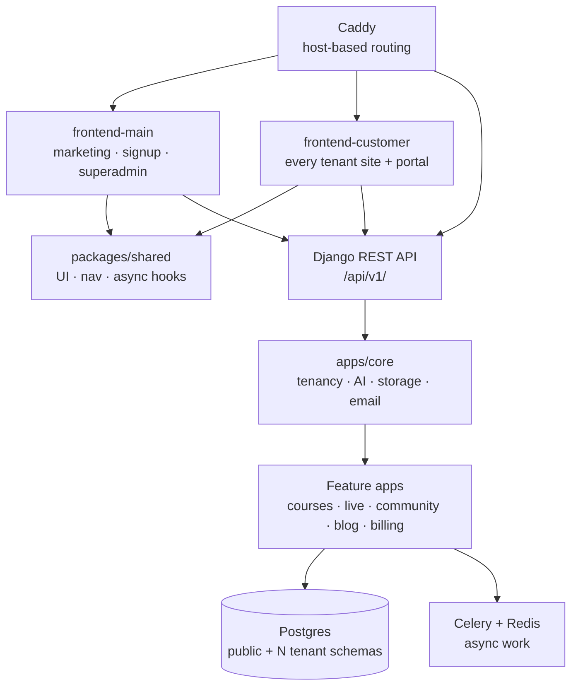

# contentor — Wiki

# Contentor

Contentor is a multi-tenant SaaS where content creators — we call them **coaches** — get their own branded site to sell courses, downloads, live sessions, and email campaigns to their **students**. A coach signs up on the marketing site, answers a few questions, and within a minute has a provisioned tenant at `theirbrand.contentor.app` with an AI-composed site, an AI-designed logo, seeded demo content, and Stripe checkout wired up. Later they can point a real domain at it.

Tenant isolation is **PostgreSQL schema-per-tenant** via `django-tenants`. There is one Django deployment, one database, and N schemas — plus a `public` schema that holds coaches, plans, subscriptions, and everything the platform owner sees.

## The 10-second picture


```mermaid
graph TB
    Caddy[Caddy<br/>host-based routing]
    Main[frontend-main<br/>marketing · signup · superadmin]
    Customer[frontend-customer<br/>every tenant site + portal]
    Shared[packages/shared<br/>UI · nav · async hooks]
    API[Django REST API<br/>/api/v1/]
    Core[apps/core<br/>tenancy · AI · storage · email]
    Features[Feature apps<br/>courses · live · community · blog · billing]
    DB[(Postgres<br/>public + N tenant schemas)]
    Celery[Celery + Redis<br/>async work]

    Caddy --> Main
    Caddy --> Customer
    Caddy --> API
    Main --> Shared
    Customer --> Shared
    Main --> API
    Customer --> API
    API --> Core
    Core --> Features
    Features --> DB
    Features --> Celery
```

Two Next.js 14 apps, one Django API, one database. Caddy decides which frontend a request reaches purely from the `Host` header: the apex (`contentor.app`) and locale apex (`tr.contentor.app`) go to [frontend-main](marketing-site-app-frontend-main.md); **every other host** — all tenant subdomains and custom domains — goes to [frontend-customer](student-portal-app-frontend-customer.md). `/api/*` and `/static/*` bypass Next entirely and hit Django.

## How a request finds its tenant

This is the one mechanic worth internalizing before touching anything. [Core Platform & Multi-Tenancy](core-platform-multi-tenancy-apps.md) answers three questions in middleware before feature code runs: which region/locale, which PostgreSQL schema, and who is the user. Schema resolution comes from the hostname — or, for server-side calls from Next.js, from an `X-Tenant-Domain` header, because Node's undici silently drops a custom `Host` and you'd land in the public schema without noticing.

Identity is JWT-only, no server sessions. [Authentication & Accounts](authentication-accounts.md) is unusual: it's a shared app whose `User` table exists in *every* schema — coaches and superadmins live in `public`, students and staff live in their tenant's schema. Magic links, emailed codes, and Google OAuth all converge on the same token issuance. Public endpoints must set `@authentication_classes([])`; `AllowAny` alone won't do it, since `TenantJWTAuthentication` is the default.

## What a coach gets

The [Onboarding Wizard & Site AI](onboarding-wizard-site-ai.md) is the widest end-to-end path in the codebase: brand name → niche questions → tenant provisioning → AI-composed page tree → AI-written copy → a generated logo. It reaches across both frontends, a dedicated Django package, and a shared pure resolver. The site it produces is owned afterwards by [Tenant Config & Site Builder](tenant-config-site-builder.md), which holds the theme, navigation, page block tree, and the "are you ready to publish?" checklist.

The logo is never a bitmap. [Logo Studio & Brand Identity](logo-studio-brand-identity.md) stores a versioned `LogoRecipe` JSON; the SVG preview, dark variant, brand-kit zip, and exported PNGs are all pure functions of it, rasterized once in the browser at export time.

From there the coach fills the site: [Courses, Downloads & Media Library](courses-downloads-media-library.md) for on-demand content and access gating, [Live Events & Calendar](live-events-calendar.md) for live classes, streams, Zoom sessions, and onsite events (four types, one shape, differing only in delivery and what secret a student receives), [Community](community.md) for the in-tenant social feed, and [Blog & AI Content](blog-ai-content.md) for AI-drafted posts drawing imagery from the shared curated-photo library.

## Money and reach

[Billing & Payments](billing-payments.md) runs two independent flows through shared models and a single webhook: the coach's platform subscription (Checkout on our Stripe account) and the marketplace (direct charges on the coach's connected account, with an application fee). [Custom Domains](custom-domains.md) covers the full buy-a-domain lifecycle — search, checkout, registration, DNS, email auth, SSL, and registration as a `django-tenants` domain.

Outbound communication splits three ways: [Email Campaigns](email-campaigns.md) for bulk sends (design and rendering delegated to the sibling **MailCraft** project, fan-out via Celery), [Mailbox & Notifications](mailbox-notifications.md) for threaded coach↔student conversations and Web Push broadcasts.

## AI, everywhere

[AI Infrastructure & Assistants](ai-infrastructure-assistants.md) is one provider layer, one SSE framing convention, and one conversation kernel with cost governance — with three chat surfaces built on top. Every Claude call in the product (site composition, blog drafting, logo critique, the help bot, the coach copilot) goes through it and is metered against a budget.

## The plumbing you'll meet early

[Admin Kit Framework](admin-kit-framework.md) is `django.contrib.admin`'s idea re-expressed as JSON: one Python declaration per model yields both a CRUD REST surface and the metadata a generic React renderer uses to draw tables, filters, forms, and bulk actions. Nothing about a model's admin UI is hand-written in TypeScript. It powers both the coach's admin panel and the [Superadmin Platform Console](superadmin-platform-console.md), which reads the public schema exclusively and is therefore served from the apex by `frontend-main`.

[Shared UI Library](shared-ui-library.md) is the single most-called module in the repo — both frontends route their buttons, page states, navigation, and async-action hooks through it. Its conventions (`<Button loading>`, `useAsyncAction`, `<PageState>`, `<NavLink>`/`useNavigate`, sonner toasts) are enforced by a lint guard, so following them up front saves a round trip.

[Observability & Usage Analytics](observability-usage-analytics.md) covers two unrelated telemetry systems that share one rule — telemetry must never break the thing it observes: the public-schema **Logbook** (superadmin-facing, fed by a Vector sidecar shipping every container's logs) and per-tenant **Usage**. There is no separate metrics stack; the logbook is the observability story.

Everything that supports development but never ships — the selective test runner behind `make test-changed`, the demo-asset mirror, custom lint guards, Docker and Caddy config, agent-orientation docs — is covered by [Developer Tooling & Flowmap](developer-tooling-flowmap.md) and [Other](other.md).

## Getting set up

```bash
make dev            # full stack with hot reload (Caddy :80, Postgres 17, Redis, Celery, MinIO)
make migrate        # run migrations
make seed           # seed dev tenants and demo content
make health-check   # is the stack already up? check this before `make dev`
```

The stack hot-reloads, so a code-only change never needs a rebuild. Dev bundles local fakes for the external services: MinIO stands in for S3, `LIVE_FAKE_ENABLED` stubs GetStream so live-class specs run offline, and `EMAIL_SINK_ENABLED` captures outbound mail for read-back at `GET /api/v1/dev/emails/latest/`.

Verify at the cheapest level that covers your change:

```bash
make test-changed             # tests affected by the current diff — the default
make test-app APP=billing     # one backend app
make test-frontend            # vitest, both apps
make e2e-changed              # Playwright specs mapped from the diff
make lint typecheck format
```

Full `make test` and full `make e2e` are for changes to shared ground — `apps/core`, `packages/shared`, auth, or billing providers.

## Two things that will bite you

**Serializer changes move the frontend contract.** After editing any serializer, run `npm run gen:api` in `frontend-customer` and read the `src/types/api-generated.ts` diff. A surprising diff means you changed more than you meant to.

**Server-side `fetch()` from Next.js to Django must send `X-Tenant-Domain`.** Build the domain from the tenant slug (`${slug}.${BASE_DOMAIN}`) rather than relying on `getTenantDomain()`, which returns empty inside `generateMetadata` and `manifest.ts`.

---

Each module page above goes deeper on its area, and `docs/REFERENCE.md` carries the cross-cutting domain model, auth flows, and deploy details. Read the relevant module page before working in an area — it will usually answer the question faster than reading the code.
