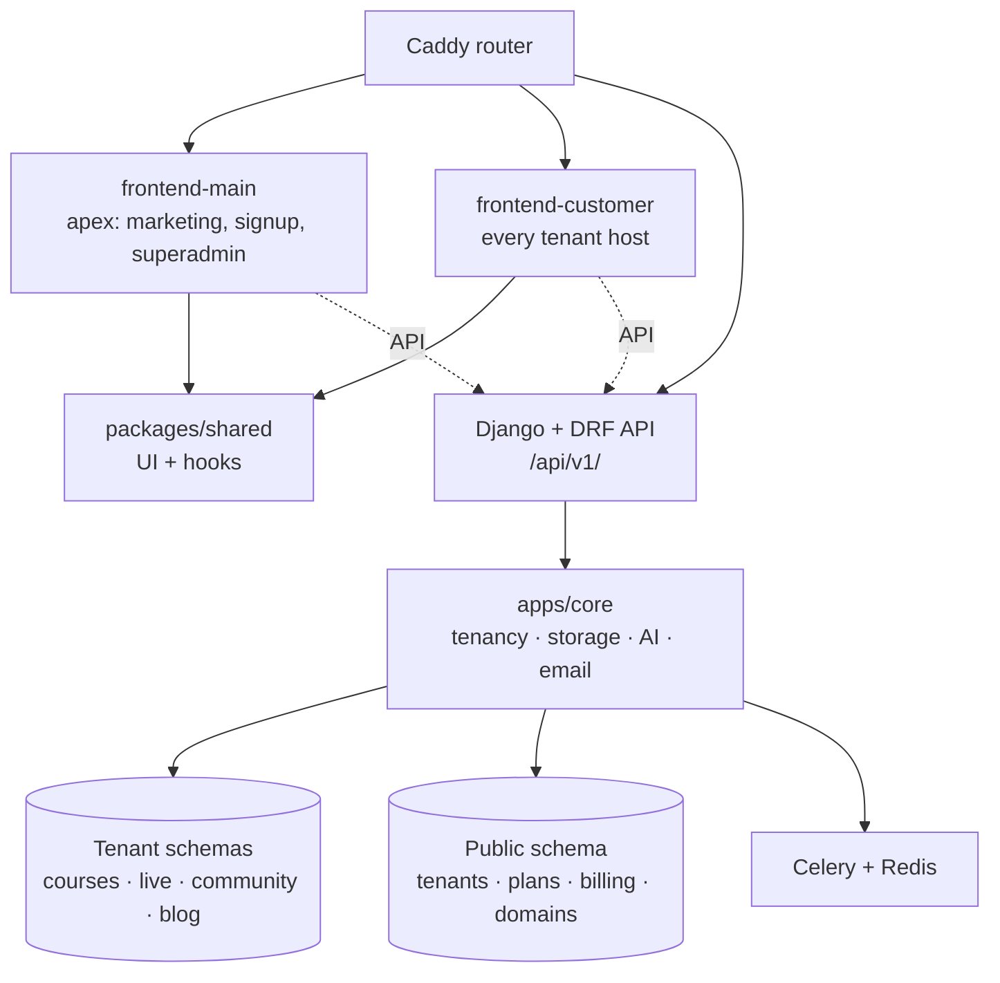

# contentor — Wiki

# Contentor

Contentor is a multi-tenant SaaS where content creators — we call them **coaches** — get their own branded website and sell to their students: courses, downloadable files, live classes and streams, a community feed, a blog, and email campaigns. A coach signs up on `contentor.app`, answers an AI-guided interview, and ends up minutes later with a provisioned tenant on `theirbrand.contentor.app` (or a custom domain they bought through us) with a composed, written, branded site already live.

Three audiences, three surfaces:

| Who | Where | What they do |
|---|---|---|
| **Coach** | `*.contentor.app/admin`, apex dashboard | Build the site, publish content, run classes, email students, get paid |
| **Student** | `*.contentor.app` | Browse, buy, learn, attend, post in the community |
| **Superadmin** (us) | `contentor.app/superadmin` | Run the platform: tenants, plans, AI spend, logs, help desk |

The hard architectural commitment underneath all of it: **tenant isolation is PostgreSQL schema-per-tenant** via `django-tenants`. Every request resolves to a schema before any feature code runs, and getting that wrong is the single most expensive class of bug in this repo — which is why [Core Platform & Multi-Tenancy](core-platform-multi-tenancy.md) is the first page to read after this one.

## The shape of the system


```mermaid
graph TD
    Caddy[Caddy router]
    Main[frontend-main<br/>apex: marketing, signup, superadmin]
    Cust[frontend-customer<br/>every tenant host]
    Shared[packages/shared<br/>UI + hooks]
    Django[Django + DRF API<br/>/api/v1/]
    Core[apps/core<br/>tenancy · storage · AI · email]
    Tenant[(Tenant schemas<br/>courses · live · community · blog)]
    Public[(Public schema<br/>tenants · plans · billing · domains)]
    Celery[Celery + Redis]

    Caddy --> Main
    Caddy --> Cust
    Caddy --> Django
    Main --> Shared
    Cust --> Shared
    Main -.API.-> Django
    Cust -.API.-> Django
    Django --> Core
    Core --> Tenant
    Core --> Public
    Core --> Celery
```

Caddy is the fork in the road: the apex and locale hosts go to [frontend-main](marketing-site-app-frontend-main.md), **every other host** goes to [frontend-customer](student-portal-app-frontend-customer.md) — one deployment serving all tenants, with identity resolved per request from the `Host` header. `/api/*`, `/static/*` and the Django admin bypass Next.js entirely and hit Django directly.

Both frontends are Next.js 14 App Router apps that share [packages/shared](shared-ui-library.md) for UI primitives, the navigation progress layer, and the `useAsyncAction` loading conventions — by call volume it is the most depended-on module in the repo, so changes there are felt everywhere.

## Backend: shared schema vs. tenant schema

Django apps are split in two, and which side an app lives on determines what it can see.

**Public schema** holds things that exist above any one tenant: the `Tenant` and plan records in [apps/core](superadmin-platform-console-apps.md), coach accounts in [Authentication & Accounts](authentication-accounts.md), platform subscriptions and Stripe Connect state in [Billing & Payments](billing-payments.md), and purchased domains in [Custom Domains](custom-domains.md). The superadmin console reads this side exclusively, which is why it is served from the apex rather than the tenant portal.

**Tenant schemas** hold everything a coach owns: [courses, downloads and the media library](courses-downloads-media-library.md), [live classes, streams and the calendar](live-events-calendar.md), the [community feed](community.md), the [blog](blog-ai-content.md), [email campaigns](email-campaigns.md), and the brand, pages and publish gate in [Tenant Config & Site Builder](tenant-config-site-builder.md). `apps.mailbox` is dual-listed on purpose — the same code serves our platform inbox in public and each coach's inbox in their schema (see [Mailbox & Notifications](mailbox-notifications.md)).

Cross-cutting services all live in `apps/core` and are consumed by everyone: object storage, outbound email, throttling, access control, the Celery task surface, and the Claude provider layer behind [AI Infrastructure & Assistants](ai-infrastructure-assistants.md). The two schema-driven admin surfaces — platform and tenant — are both generated from Python declarations by the [Admin Kit Framework](admin-kit-framework.md), so no model's admin table is hand-written in TypeScript.

## Two flows worth tracing first

**Coach signup → a live site.** A brand name typed on the marketing site starts an AI interview in [Onboarding Wizard & Site AI](onboarding-wizard-site-ai.md). The answers become a brief; the site composer picks a style from the manifest, writes the copy, pulls photography from the Pix4Less image service, and offers logo candidates from [Logo Studio & Brand Identity](logo-studio-brand-identity.md) — where a logo is always a versioned JSON recipe, never an uploaded bitmap. Provisioning creates the PostgreSQL schema, registers the domain with `django-tenants`, and writes the user into **both** the public schema (role=coach) and the new tenant schema (role=owner). The result lands in `TenantConfig` and renders immediately on the tenant host.

**Student buys something.** The student authenticates by magic link, which auto-registers them in that tenant's schema. Checkout runs as a Stripe direct charge on the coach's connected account with a platform application fee; the webhook lands on a single shared endpoint that routes by flow. Access gating then unlocks the course, download, or live-session join link. Platform subscriptions (coach → us) run through the same app but a different Stripe mechanism — the split is documented in [Billing & Payments](billing-payments.md).

Two rules that bite newcomers in both flows: every server-side `fetch()` from Next.js to Django **must** send an `X-Tenant-Domain` header (Node's undici silently drops a custom `Host`, so you land in the public schema), and public API endpoints must set `@authentication_classes([])` — `AllowAny` alone is not enough, because `TenantJWTAuthentication` is the default.

## Running it

```bash
cp .env.example .env     # defaults are dev-ready: MinIO, email sink, fake image service
make dev-d               # start the stack detached, returns when Django is healthy
make migrate && make seed # schemas + one demo tenant (demo-yoga) with a coach and a student
make health-check
```

The stack is `caddy`, `postgres:17`, `redis:7`, `django` (Gunicorn), both Next.js dev servers, `celery-worker`, `celery-beat`, `vector` (log shipping), and MinIO as the local object store. Containers hot-reload — never rebuild to verify a code change. Visit `localhost` for the marketing site and `demo-yoga.localhost` for a tenant.

Verification is tiered on purpose: `make test-changed` runs only what your diff affects and already knows when a change touches shared runtime code and needs the full suite (`PLAN=1` previews its plan). `make test-app APP=billing` for one app, `make e2e-changed` for user-facing work, `make lint` before claiming done. The Docker VM has a fixed, modest RAM budget — run one heavy job at a time.

## Finding your way around

Every area has its own generated wiki page; read the one for the area you are about to touch before you touch it. Beyond the module pages linked above, [Observability & Usage Analytics](observability-usage-analytics.md) covers the in-app logbook that *is* the observability stack (there is no metrics stack), and [Developer Tooling & Flowmap](developer-tooling-flowmap.md) covers the selective test runner and the custom lint guards. Everything that builds, runs, deploys or tests the app rather than shipping inside it — Docker, the Caddyfile, Playwright specs, agent instructions — is catalogued under [Other](other.md).

`docs/REFERENCE.md` holds the cross-cutting domain model and deploy details, `docs/GLOSSARY.md` fixes the terminology, and `docs/PRODUCT.md` is the living product plan. These wiki pages are regenerated from the code graph by `make wiki` — they describe design intent; for exact current callers and blast radius, query the GitNexus tools rather than trusting prose.
