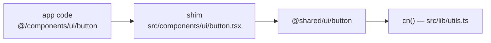
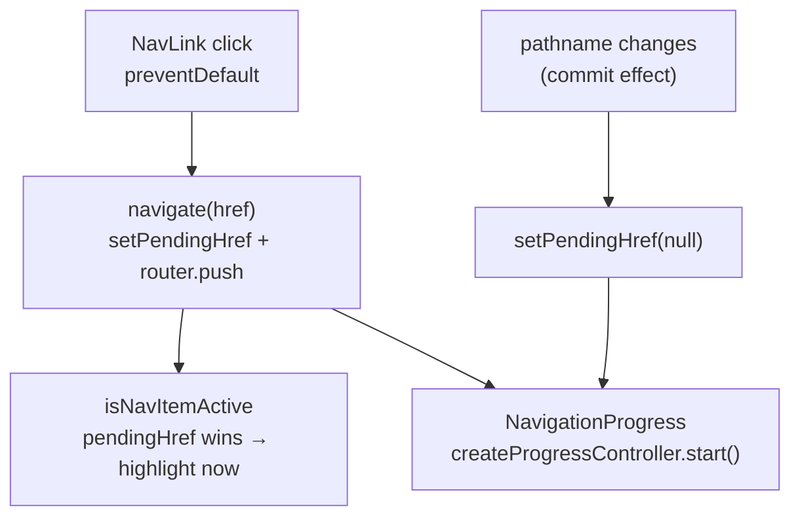

# Shared UI Library

# Shared UI Library (`packages/shared`)

The single source of truth for UI primitives and interaction behavior across both Next.js apps (`frontend-main`, `frontend-customer`). It holds three things: styled presentational primitives (`src/ui/`), the navigation-feedback layer (`src/navigation/` + a few components in `src/ui/`), and the async-action layer (`src/hooks/`).

Everything here is framework-coupled to Next 14's App Router and Tailwind, but the *logic* inside it deliberately is not — see [Pure cores](#pure-cores).

## Consumption model: re-export shims

Nothing in an app imports `@shared/ui/*` directly by convention. Each app keeps a one-line shim at `src/components/ui/<name>.tsx`:

```tsx
// frontend-customer/src/components/ui/button.tsx
export * from "@shared/ui/button";
```

App code then imports `@/components/ui/button`. Two consequences worth knowing before you add anything:

1. **Named exports only.** `export *` does not forward a default export. Every shared component exports by name (`export { Button, buttonVariants }`) precisely so the shim works.
2. **A component can be un-shared per app without touching call sites.** If `frontend-main` ever needs a divergent `Switch`, its shim becomes a real implementation and no import in that app changes.



Some primitives exist **only** in `frontend-customer` and are not shared: `avatar`, `checkbox`, `dropdown-menu`, `select`, `textarea`. These are real Radix wrappers living in `frontend-customer/src/components/ui/`. If `frontend-main` needs one, promote it to `packages/shared/src/ui/` and leave shims behind in both apps — don't copy it.

## `cn()` and the variant convention

`src/lib/utils.ts` exports the only styling helper:

```ts
export function cn(...inputs: ClassValue[]) {
  return twMerge(clsx(inputs));
}
```

`twMerge` is what makes `className` a genuine override rather than an append — a caller passing `className="h-12"` beats the component's own `h-9`. Every primitive ends its class computation with `cn(..., className)` for this reason; keep that ordering when you add one.

Components with visual variants use `class-variance-authority` and export the variant function alongside the component (`buttonVariants`, `badgeVariants`, `spinnerVariants` is internal). Exporting the variants lets non-component call sites borrow the styling — e.g. giving an anchor button-like classes without `asChild`.

## Pure cores

Two files are intentionally React-free so vitest can cover them (repo convention: vitest covers pure logic, not rendering):

| Pure module | React wrapper |
|---|---|
| `src/hooks/async-runner.ts` — `createAsyncRunner`, `errorMessage` | `src/hooks/use-async-action.ts` |
| `src/navigation/navigation-state.ts` — `defaultActiveMatch`, `isNavItemActive`, `createProgressController` | `src/ui/nav-link.tsx`, `src/ui/navigation-progress.tsx` |

When you change behavior in this module, the change usually belongs in the pure core, with the wrapper left as a thin binding. That's where the tests are.

## Async actions

### `createAsyncRunner` (pure)

```ts
createAsyncRunner<Args>(fn, { setLoading, onSuccess?, onError? }): (...args: Args) => Promise<void>
```

A closure-scoped `inFlight` flag gates re-entry: a second call while the first is running returns immediately, before `setLoading` or `fn`. The guard is per-runner-instance, not per-render — which only works because the wrapper memoizes the runner exactly once.

`errorMessage(err, fallback?)` unwraps an `Error` with a non-empty `message`, else returns the fallback (default `"Something went wrong"`).

### `useAsyncAction` (the app-facing hook)

```tsx
const { run, loading } = useAsyncAction(async () => {
  await api.saveCourse(draft);
  router.refresh();
}, { successToast: "Saved" });

<Button loading={loading} onClick={run}>Save</Button>
```

Per the repo's loading conventions, every async handler in either app goes through this hook — it supplies the loading flag, the double-submit guard, and a default error toast in one place.

Options:

- `successToast: string` — fires `toast.success` before `onSuccess`.
- `errorToast` — `true` (default) uses `errorMessage(err)`; a string pins a fixed message; `false` silences it.
- `onError` — **replaces** the default toast entirely. It returns early, so pairing it with `errorToast: false` is redundant.
- `onSuccess` — runs after the success toast.

Implementation detail that matters for callers: `fn` and `options` are held in refs and `run` is memoized with `[]`. So `run` is referentially stable forever and safe in a `useEffect`/`useCallback` dependency array, while still always calling the latest closure. Don't "fix" this by adding deps — a fresh `run` each render would reset the in-flight guard.

Toasts come from `sonner` and are the house pattern for action outcomes in both apps; field-level validation stays inline.

## Navigation feedback

The reason this layer exists at all is a measured App Router behavior, documented in the source: `router.push()` inside `startTransition` does **not** keep `isPending` true for the navigation's duration (`isPending` went false ~91ms into a ~1000ms navigation). So `useTransition` cannot drive "navigation in flight" — the progress bar would never reach its show threshold and clicked nav items would un-highlight instantly.

`NavigationProvider` instead derives `isNavigating` from a `pendingHref` that is cleared on **route commit**.



### `NavigationProvider` / `useNavigation` / `useNavigate`

Mount `<NavigationProvider>` above the app tree; `useNavigation()` throws outside it. Context value: `{ pathname, pendingHref, isPending, isNavigating, navigate, prefetch }`.

`useNavigate()` is the sanctioned replacement for `useRouter().push` in app code.

Three clearing paths, all necessary:

1. **Commit effect** (`[pathname]`) — the primary signal for cross-segment navigation.
2. **Query-only effect** (`[isPending, pendingHref, pathname]`) — a same-path/different-search navigation never changes `pathname`, so effect 1 never re-fires. Here there's no new segment to stream, so the transition's own completion *is* a usable signal; the effect only clears when `pendingHref.split("?")[0] === pathname`.
3. **15s watchdog** — a navigation that never commits (aborted, blocked by a route guard, network failure) must not strand `pendingHref` forever.

`navigate()` compares `href` against `window.location.pathname + window.location.search`, not `pathname`. `usePathname()` drops the query string, so comparing against it alone would swallow a `"/x?tab=a"` → `"/x"` navigation — and since `NavLink` already called `preventDefault()`, that link would be entirely dead.

`prefetch()` dedupes through a `Set` ref so repeated hovers over a sidebar item fire one `router.prefetch`.

### `isNavItemActive` / `defaultActiveMatch` (pure)

```ts
isNavItemActive({ pathname, pendingHref }, href, match?): boolean
```

`pendingHref ?? pathname` — the pending destination wins, which is what makes a clicked item highlight *before* the route commits rather than after.

`defaultActiveMatch` is exact-match plus segment-boundary descendants. Two deliberate rules: root-ish hrefs (`"/"`, `"/admin"`) match only exactly, or they'd claim every page beneath them; and the `href + "/"` check is what stops `/admin/live` from highlighting while you're on `/admin/live-streams`. Pass a custom `ActiveMatch` via `NavLink`'s `activeMatch` prop for anything unusual.

### `NavLink`

The only sanctioned way to render an internal link — raw `next/link` in app code is a review failure, because it bypasses both the progress bar and the pre-commit highlight.

```tsx
<NavLink href="/admin/courses" className={({ active }) => cn("px-3", active && "bg-accent")}>
  {({ pending }) => <>Courses {pending && <Spinner size="sm" />}</>}
</NavLink>
```

`className` and `children` each accept a render function receiving `{ active, pending }`. The rendered anchor also carries `aria-current="page"`, `data-active`, and `data-pending` for CSS-only styling.

Click handling defers to the browser where it should: it bails out for external hrefs (`isExternal` regex, or `target="_blank"`), for modified clicks (meta/ctrl/shift/alt), for non-primary buttons, and if a caller's `onClick` already called `preventDefault()`. Everything else is `preventDefault()` + `navigate(href)`.

Next's own prefetch is set to `false` — it would fire for every sidebar item on viewport entry. Prefetch is warmed on `mouseenter`/`focus` instead, and `noPrefetch` opts out entirely for expensive or rarely-visited destinations.

### `createProgressController` (pure) + `NavigationProgress`

A delay-then-show state machine: `start()` arms a `delayMs` timer, `finish()` cancels it and only calls `onHide` if the bar actually became visible. Navigations that resolve inside the delay show nothing, so cached/instant transitions don't flash a bar. `dispose()` clears on unmount.

`<NavigationProgress delayMs={150} />` binds it to `isNavigating` and renders a `ProgressLine` fixed to the viewport top at `z-[100]`. The controller is created lazily into a ref on first render (no side effects, so this is render-safe) and disposed in an unmount effect.

## Loading, empty, and stale states

These four components encode the repo's loading conventions; `scripts/check-loading-patterns.mjs` (part of `make lint`) enforces their use — no raw `<Loader2>`/`animate-spin` in app code, and every route segment needs a `loading.tsx` at or above it.

| Component | Use for |
|---|---|
| `PageState` | Client-page **initial** load: takes `loading`, `error`, `skeleton`, optional `onRetry`. |
| `StaleContainer` | **Refinement** loads — search, sort, filter, paginate. |
| `Skeleton` + `skeletons.tsx` presets | The skeleton bodies both of the above consume, and `loading.tsx` files. |
| `Spinner` | Standalone indeterminate waits; `center` for a `min-h-[50vh]` block. |

`PageState` renders the skeleton, then a `role="alert"` error block (`errorMessage(error, "Failed to load this page. Please try again.")` — reusing the async-runner helper), then children wrapped in `motion-safe:animate-fade-in-up`. `error` is typed `unknown`: any truthy value renders the error state, an `Error` yields its message.

`StaleContainer` is the counterpart, and the distinction is a design rule, not a preference: children are **never unmounted**, so scroll position and layout stay anchored while rows dim to `opacity-60` and go `pointer-events-none`, with a `ProgressLine` on the container's top edge (`showLine={false}` to suppress). A full skeleton is reserved for first load and for switching to a genuinely different resource.

`ProgressLine` is shared by `NavigationProgress` and `StaleContainer` so "work in progress" has one visual in the app. Under `motion-reduce` the travel animation drops but the bar goes full-width and stays visible — the state matters, the movement is decoration. The same motion-safe discipline runs through `Skeleton` (static `bg-muted` fallback, gradient sweep only under `motion-safe`) and `Button` (`motion-safe:active:scale-[0.98]`).

`skeletons.tsx` presets: `SkeletonPageHeader`, `SkeletonCardGrid({ count, withImage })`, `SkeletonList({ count })`, `SkeletonTable({ rows, cols })`, `SkeletonForm({ fields })`. Route `loading.tsx` files compose these directly — e.g. `frontend-customer`'s public and checkout loading files each pair `SkeletonPageHeader` with the preset matching the page body.

`EmptyState` covers the no-data case: optional icon component, title, description, and one `action` that is either an `href` (rendered as `<Button asChild><a>`) or an `onClick`.

## Primitives

**`Button`** carries the most behavior of any primitive. Beyond `variant` (9, including a legacy `brand` that now aliases primary, and `glass`) and `size` (5), it owns the loading contract:

- `loading` sets `aria-busy` and `disabled`.
- With `loadingText`, it shows a spinner plus that text.
- Without it, the children are rendered `invisible` and a spinner is absolutely positioned over them — **the button keeps its width**, so a row of buttons doesn't reflow mid-save.
- Under `asChild`, `Slot` can't inject a spinner into an arbitrary child, so `loading` only applies `pointer-events-none opacity-50` and `aria-busy`. Don't rely on a visible spinner in that path.

**`Badge`** — a plain `div` with 9 variants. The house token system has no semantic success/warning colors, hence the substitutions: `success` uses the marketing accent, `warning` uses muted. `pro` is the amber premium/paid-feature treatment (explicit light and dark values so it reads as premium, not as an alarm) used by the admin feature badges and live upsell.

**`Card`** — `Card`, `CardHeader`, `CardTitle`, `CardDescription`, `CardContent`. Note there is **no `CardFooter`**; footers are currently a `CardContent` or a plain div at call sites.

**`Table`** — the full set (`Table`, `TableHeader`, `TableBody`, `TableFooter`, `TableHead`, `TableRow`, `TableCell`, `TableCaption`). `Table` wraps itself in an `overflow-auto` div, so don't add another scroll container around it.

**`Input`**, **`Label`**, **`Separator`** — `Input` and `Label` follow the house focus ring (`focus-visible:ring-[3px]`) and `aria-invalid` styling; `Label` is the Radix primitive. `Separator` is a plain `div` with `role="separator"` and an `orientation` prop, not Radix.

**`Switch`** and **`Tabs`** are hand-rolled, not Radix — worth knowing before you extend them. `Switch` is a `role="switch"` button with `checked`/`onCheckedChange`, controlled only. `Tabs` uses its own React context and supports both controlled (`value` + `onValueChange`) and uncontrolled (`defaultValue`) use; `TabsContent` returns `null` when inactive, so inactive panel state is destroyed rather than hidden, and there is no roving-tabindex or arrow-key handling. Migrate to the Radix primitives if you need either.

**`ModalPortal`** portals children into `document.body` and locks `body` scroll for its lifetime, restoring the previous `overflow` on unmount. The portal matters because a `position: fixed` overlay is trapped by any transformed or `overflow`-clipped ancestor — escaping to `body` is what makes it cover the real viewport and scroll its own body rather than the page behind it. It returns `null` until mounted, so it is SSR-safe but contributes nothing to the server HTML.

**`ThemeToggle`** wraps `next-themes`. With the default `modes={["light", "dark"]}` it's the classic CSS-crossfaded sun/moon toggle; with three or more modes it becomes a cycle button stepping `light → dim → dark → light`, labeled from `MODE_META`. It gates `setTheme` on `mounted` to avoid hydration mismatch on `resolvedTheme`. Note this file imports `@/components/ui/button` and `@/lib/utils` rather than the relative `./button` / `../lib/utils` used everywhere else in the package — it resolves through the *consuming app's* aliases, so it only compiles inside an app that defines them.

## Adding or changing a component

1. Implement in `packages/shared/src/ui/`, importing `cn` from `../lib/utils` and siblings relatively.
2. Use **named** exports only.
3. Add the `export * from "@shared/ui/<name>"` shim to both apps' `src/components/ui/`, even if only one app uses it today.
4. Any non-trivial logic goes in a React-free module next to it (see [Pure cores](#pure-cores)) with vitest coverage — `make test-frontend`.
5. Motion is CSS-only and `motion-safe:`-gated; color comes from tokens, never literal hex.
6. Run `make lint` (`check-loading-patterns.mjs` runs there) and `make typecheck` — a change to a shared primitive's props surfaces as type errors across both apps, which is the point of the shim layer.

Because every component here is used by both apps, treat prop changes as breaking by default: check both `frontend-main` and `frontend-customer` call sites before narrowing a type or renaming a prop.
