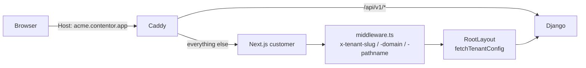

# Student Portal App (frontend-customer)

I have what I need.

# Student Portal App (`frontend-customer`)

The tenant-facing Next.js 14 application. Every host that isn't the marketing apex (`contentor.app`) or the locale apex (`tr.contentor.app`) is routed here by Caddy — so this one app serves **every** coach's site: the public marketing pages a visitor sees, the student portal behind login, and the coach's own admin panel.

One deploy, N tenants. Nothing about a tenant is baked in at build time; the identity of the site is resolved per request from the `Host` header and materialized as a `TenantConfig` object that drives branding, theme, navigation, page content, and feature gating.

## Request lifecycle

Everything downstream depends on three headers that `src/middleware.ts` stamps on every request:

| Header | Value | Consumed by |
|---|---|---|
| `x-tenant-slug` | first label of the host (`acme` from `acme.localhost`), or the whole host for custom domains | `getTenantSlug()`, BFF routes |
| `x-tenant-domain` | full host including port | `serverFetch()`, `fetchTenantConfig()` |
| `x-pathname` | `request.nextUrl.pathname` | root layout's publish gate |

In development, an `x-dev-tenant` request header overrides the slug — this is how the e2e suite and manual tooling drive a specific tenant without DNS.

The matcher deliberately excludes **all** of `_next`, not just `_next/static` and `_next/image`. An earlier narrower list let middleware run on the dev HMR websocket (`_next/webpack-hmr`), which made Caddy log a steady stream of `502 malformed HTTP response "Unauthorized"`. RSC navigations hit real route paths with `?_rsc=`, not `/_next/*`, so they still receive the tenant headers.



Note the split: the browser talks to Django **directly** through Caddy for `/api/v1/*`. Next.js is not a proxy for client-side data. Server components reach Django over the internal Docker network.

### Two fetch paths, deliberately different

`src/lib/api-server.ts` — `serverFetch<T>()` runs in server components and route handlers. It reads the JWT from the `COOKIE_NAME` cookie and forwards `X-Tenant-Domain` from the middleware header. **The header is mandatory**: Node's undici silently drops a custom `Host`, so without it `http://django:8000` resolves to the public schema and the tenant's data disappears.

`src/lib/api-client.ts` — `clientFetch<T>()` runs in the browser and hits *relative* paths (`/api/v1/courses/enrolled/`). The browser's own `Host` carries the tenant; cookies go along via `credentials: "same-origin"`. It attaches the tracking session id header and normalizes failures into `ApiError` (status + parsed body + `Retry-After` when the server hinted one).

Both guard against `res.json()` throwing on an empty body — a 204, or a success Cloudflare stripped `Content-Length` from, returns `undefined as T` rather than a parse error.

Around `clientFetch` sit three helpers worth knowing before writing your own retry logic:

- `isTransientApiError(err)` — 429, 5xx, and network `TypeError` only. Everything else is a deliberate API outcome the caller must interpret.
- `retryTransient(fn, {retries, baseDelayMs, maxDelayMs})` — honors `Retry-After` but caps the wait at 3s. The tenant rate limiter hints 60s; a page gate must fail over to its error state rather than hang that long.
- `batchedAsync(tasks, batchSize, delayMs)` — batches concurrent requests so bulk operations don't trip the rate limiter. `admin/students/page.tsx` uses it for per-row enrichment.

## Tenant resolution and config

`src/lib/tenant.ts` is the single door to tenant identity.

```ts
getTenantSlug()   // x-tenant-slug header, or "unknown"
getTenantDomain() // x-tenant-domain header, or ""
fetchTenantConfig(slug) // → TenantConfig | null
```

`fetchTenantConfig` prefers the *live* request host over a slug-built guess, so TR tenants (`<slug>.tr.contentor.app`) and custom domains resolve to the correct `Domain` row. It falls back to `${slug}.${BASE_DOMAIN}` only where headers aren't available — `generateMetadata` and `manifest.ts`.

Two behaviors here are load-bearing and easy to break:

**Null means "no such tenant", not "the fetch failed."** A 404 from Django returns `null` immediately. Anything else — 5xx, network error, timeout — retries once after 150ms before giving up. A transient blip reported as `null` would paint "Site not found" over a perfectly valid tenant on a cold load.

**The 60s config cache is disabled in development** (`CACHE_TTL = 0` when `NODE_ENV === "development"`). E2E specs PATCH config through Django and immediately assert the public page reflects it; a warm cache turns that into a stale window whose outcome depends on leftover tenant state. Production keeps the TTL — a coach's edit taking up to a minute to reach the public site is the accepted tradeoff. The site editor's PATCH proxy (`src/app/api/admin/config/route.ts`) calls `configCache.clear()` after every save so `router.refresh()` re-renders the preview with the just-saved blocks.

The resolved config flows to the client through `TenantProvider` → `TenantContext`; client components read it with `useTenant()` from `@/hooks/use-tenant`. There is no client-side refetch of config — it's server-resolved once per navigation.

## The root layout

`src/app/layout.tsx` does more real work than a typical root layout. In order:

1. Resolve slug and config. **If `config` is null and the slug isn't `"unknown"`, render a self-contained "Site not found" page** and return. It renders the 404 markup inline rather than calling `notFound()` — that throws `NotAllowedRootNotFoundError` in a root layout. Since `fetchTenantConfig` already retried, reaching this branch means the tenant genuinely doesn't exist.
2. Evaluate the publish gate via `isSiteGated()`.
3. Inject `<TenantThemeStyle>` (a `<style>` tag of generated CSS variables) plus the tenant's Google Font link into `<head>`.
4. Wrap children in `NextIntlClientProvider` → `ThemeProvider` → `TenantProvider` → `NavigationProvider`.

**Font variable naming matters.** Instrument Sans is exposed as `--font-instrument`, *not* `--font-sans`, so it never shadows the tenant's own `--font-sans` override injected at `:root` by `TenantThemeStyle` or the builder's live preview. `globals.css` points `--font-sans` at it as the fallback default.

### The publish gate

An unpublished site shows `<PreviewGate>` instead of its content. `isSiteGated()` returns false — i.e. lets you through — for any of:

- `config.is_published` is true (or absent)
- the path starts with `/login`, `/callback`, or `/impersonate` (`GATE_BYPASS_PREFIXES`, read from the `x-pathname` header) — the owner must be able to log in to preview
- the `contentor_preview` cookie equals the tenant slug
- the authenticated user's role is `owner` or `coach`

`PreviewGate` posts the preview password to `src/app/api/preview/unlock/route.ts`, which validates it against Django's `/api/v1/preview/unlock/` and, on success, sets the `contentor_preview` httpOnly cookie for 7 days.

## Route groups

```
src/app/
  (public)/     no auth — home, about, contact, faq, courses, events,
                calendar, store, plans, blog, install
  (student)/    requireAuth() — dashboard, learn, checkout, orders,
                subscriptions, live-classes, community
  (auth)/       login, callback
  admin/        requireAuth + requireRole(["owner","coach"])
  api/          BFF route handlers (auth, preview unlock, config proxy)
  impersonate/  one-time-token session hand-off
  live/, live-stream/  GetStream session pages
  pwa-icon/     dynamic branded icon generation
```

`(public)/layout.tsx` fetches the user, subscription state, and published-post count, then renders `PublicHeader`. When the viewer is the coach, it additionally loads config and wraps the whole page in `<EditSidebar>` — that's how `/?edit=1` becomes a live site editor over the real rendered site. Students (not coaches) get the `SiteAssistantBubble`.

`(student)/layout.tsx` calls `requireAuth()` (which redirects to `/login?toast=...` when there's no session) and additionally probes `/api/v1/community/settings/` for the Community nav entry and its unread dot. Every one of these probes is wrapped in a bare `try {} catch {}` — a failing optional endpoint degrades a nav item, it doesn't fail the page.

`admin/layout.tsx` is three lines: `requireAuth()`, `requireRole(user, ["owner", "coach"])`, then `<AdminShell>`.

### Public pages are block-rendered

`(public)/page.tsx`, `/about`, `/contact`, `/faq` share one shape:

```ts
const config = await fetchTenantConfig(await getTenantSlug());
const blocks = config?.pages?.about?.blocks ?? [];
const dynamicData = await fetchDynamicData(blocks);
return <PageView pageKey="about" blocks={blocks} dynamicData={dynamicData} />;
```

The page content isn't code — it's a `blocks` array on the tenant config, rendered by the block registry in `lib/blocks/registry.tsx` (hero, course-grid, pricing-plans, faq, testimonials, …). `fetchDynamicData(blocks)` asks the registry which datasets the enabled blocks need (`dynamicKeysForBlocks`) and server-fetches only those. A page with no dynamic blocks makes zero extra requests; each fetch is independent, so a failing endpoint leaves its slice `undefined` and the block renders its own empty state instead of blanking the page.

## Data-fetching conventions per route type

This is the rule that keeps the codebase navigable:

- **Public routes** → server components, `serverFetch`, block-rendered.
- **Student and admin routes** → `"use client"` + `useState`/`useEffect` + `clientFetch`, wrapped in `<PageState>`.

`app/(student)/dashboard/page.tsx` is the canonical client-page template. Copy its structure exactly:

```tsx
const [data, setData] = useState<T[]>([]);
const [loading, setLoading] = useState(true);
const [error, setError] = useState<unknown>(null);
const [reloadKey, setReloadKey] = useState(0);

useEffect(() => {
  let cancelled = false;
  // ...clientFetch, guard every setState with !cancelled
  return () => { cancelled = true; };
}, [reloadKey]);

return <PageState loading={loading} error={error}
                  onRetry={() => setReloadKey(k => k + 1)}
                  skeleton={<SkeletonCardGrid count={3} />}>
```

`reloadKey` is the retry mechanism; the `cancelled` flag prevents setState after unmount. Every route segment also needs a sibling or ancestor `loading.tsx` built from `@/components/ui/skeletons` — `scripts/check-loading-patterns.mjs` (part of `make lint`) fails the build otherwise.

## Authentication

Auth is JWT-in-httpOnly-cookie. `src/lib/auth.ts` provides the server-side surface:

- `getAuthUser()` → `User | null` — reads the cookie, calls `/api/v1/auth/users/me/` with `Authorization: Bearer` plus `X-Tenant-Domain`.
- `requireAuth()` → redirects to `/login?toast=Please+log+in+to+continue&toast_type=info` when unauthenticated.
- `requireRole(user, roles)` → redirects to `/` on mismatch.

**Every server-rendered navigation blocks on `getAuthUser()` before streaming**, so it's wrapped in a 60s `createTtlPromiseCache` keyed by `${tenantDomain}:${token}`. The cache (`src/lib/ttl-promise-cache.ts`) stores the *promise*, so concurrent callers share one in-flight request, and it drops entries whose fetcher returns `null` or rejects — transient failures never stick. The tradeoff: a role change takes up to 60s to propagate. Logout is unaffected, since the cookie disappears and the key is never hit again.

The BFF routes under `app/api/auth/` handle the cookie-setting flows Django can't do cross-origin:

- `verify/route.ts` — redeems a magic-link token, forwards Django's `set-cookie` verbatim, and returns a clean 502 when Django answers with non-JSON.
- `google/route.ts` — OAuth start/callback.
- `logout/route.ts` — a one-line re-export of `@shared/auth/logout-route` (shared with `frontend-main`).
- `impersonate/verify` + `impersonate/stop` — superadmin hand-off. `app/impersonate/page.tsx` redeems the one-time token from the query string, then does a **full `window.location.replace`**, not a router push, so server components pick up the new cookie.

## Coach admin shell

`components/admin/admin-shell.tsx` composes the desktop `AppSidebar`, the mobile `MobileHeader`, a ⌘K `CommandPalette`, `SetupAssistantBubble`, and `ImpersonationBanner`. Both nav surfaces consume the same data structure, so the IA never drifts between them.

The information architecture lives in two pure, unit-tested modules:

`lib/admin-nav.ts` — `buildAdminNav(t)` returns seven `NavSection`s (home, content, mySite, audience, marketing, money, settings) as plain data. It takes a next-intl translator and returns data, so it tests without React.

`lib/admin-nav-gate.ts` — `gateAdminNav(sections, state)` annotates and filters that IA from real tenant state:

- **Marketing locks** until `published`, pointing at `/admin#publish-card`.
- **Content** hides items whose module isn't in `enabled_modules` (`/admin/live` and `/admin/calendar` need `live`; `/admin/downloads` needs `downloads`) plus disclosure-only items (`/admin/photos`), surfacing them behind a "+ N more" row.
- **My Site** demotes the raw editor links (`/?edit=1`, `/?edit=1&section=brand`) behind "Advanced editing" **only when `hasSiteAi` is true**. For a coach without AI editing, that editor is their only way to change the site, so it stays primary.

Three fail-safe rules in `AdminShellContent` are worth preserving:

- `hasSiteAi` reads `entitlements?.site_ai === true` explicitly rather than using `useIsLocked()`, which fails *open*. Failing open here would briefly hide the manual editor from a free coach.
- `published` is derived from the setup checklist item whose `source === "auto"` — a coach can manually tick `publish` in the Setup Assistant, and a manual tick must never unlock Marketing.
- `stateReady` (both `status` and `config` non-null) gates the whole gating pass, so an established coach never sees a flash of locks they already cleared.

`AdminShell` splits into `AdminShell` + `AdminShellContent` for a specific React reason documented in the file: a component returning a Provider in its own JSX is an *ancestor* of that provider, so `useEntitlements()` called in `AdminShell` would only ever see the context default. The consumer has to live one level below.

Entitlements themselves are pure logic in `lib/entitlements.ts` (`EntitlementKey`, `isFeatureLocked`) with the network wrapper isolated in `lib/api/entitlements.ts`. `isFeatureLocked` returns false while entitlements are null, so a "Paid" badge never flashes on for a coach whose paid plan hasn't resolved yet.

## Theming

`lib/themes.ts` defines curated `ThemePalette` objects — full OKLCH variable sets for light and dark, a `cinematic` full-page gradient, `primaryHex` for the PWA manifest, and preview swatches. Two entry points:

- `getThemePalette(config?.theme)` — palette lookup, used by `manifest.ts`, `generateViewport`, and `/pwa-icon`.
- `generateThemeCSS(theme, fontFamily, customCss)` — the `<style>` block `TenantThemeStyle` injects server-side, so there's no flash of default theme.

Three modes are registered (`light`, `dim`, `dark`) with `enableSystem={false}`. When `config.dark_mode_enabled === false` the layout passes `forcedTheme="light"`, and `TenantThemeEnforcer` additionally watches `resolvedTheme` on the client and snaps back to light — belt and braces for a stored preference from before the coach disabled dark mode.

## PWA

The portal is installable per tenant, with tenant branding all the way down.

**`manifest.ts`** is `force-dynamic` and built from live config: `name`/`short_name` from `brand_name`, `theme_color` from the palette, icons pointing at `/pwa-icon`.

**`pwa-icon/route.tsx`** renders icons on the fly with `next/og` `ImageResponse` at 32/180/192/512. It prefers the Logo Studio's square mark (`icon_url`), falls back to the wide logo (`logo_url`), then to a brand-initial tile on the theme color. Padding differs per source — the square mark already carries its own badge background so it renders edge-to-edge, while the wide logo sits inset. The `?v=` param (`icon_id ?? logo_id ?? "default"`) makes versioned URLs `immutable`; unversioned ones `must-revalidate`. Any render failure falls back to the brand initial rather than a broken icon. The root layout's `generateMetadata` links these explicitly — without an explicit icon link the browser falls back to `/favicon.ico`, which 404s.

**`sw.ts`** is a Serwist service worker (`next.config.mjs` wires `swSrc` → `public/sw.js`; disabled in dev unless `SERWIST_DEV=1`). Its most important feature is `guardedCache`, prepended to `defaultCache` so it matches first:

```ts
NEVER_CACHE       = [/^\/admin/, /^\/checkout/, /^\/api\/v1\/(auth|billing)/]
NEVER_CACHE_HOSTS = ["stripe.com", "stream-io-api.com", "getstream.io"]
```

Those go through `NetworkOnly`. Never cache auth, billing, or third-party payment/chat traffic. Document requests fall back to `/offline.html`. The worker also handles `push` (rendering notifications with the branded icon) and `notificationclick` (focus an existing window and navigate it, else open a new one).

Client-side PWA components in the root layout: `InstallPrompt` (captures `beforeinstallprompt`, shows an iOS hint where that event doesn't exist, dismissal persisted in `localStorage`, never shown under `/admin` or in standalone), `SwUpdateToast` (listens for `updatefound` → `installed` with an existing controller, offers a refresh toast), `PushOptIn`, and `UsageReporter`. `/install` renders `InstallGuide` with theme-aware SVG illustrations (`install-illustrations.tsx`) — the SVGs reference OKLCH tokens directly as `var(--token)`, never wrapped in `hsl()`, and are `aria-hidden` since the adjacent step text carries the meaning.

`lib/push.ts` (`pushSupported`, `isStandalone`, `subscribeToPush`) and `lib/usage.ts` (`detectPlatform`, `reportUsageOncePerSession`) back these. `reportUsageOncePerSession` sets its `sessionStorage` flag *before* the request so a failure never re-fires, and swallows all errors — telemetry must never affect the page.

## Internationalization

`src/i18n/config.ts` declares `locales = ["en", "tr"]` and the resolution order: **user-locale cookie → region default → `en`**. Region comes from the host via `TR_HOST_REGEX`, which matches both the locale apex (`tr.contentor.app`, `tr.localhost`) and any tenant beneath it (`<slug>.tr.contentor.app`).

`src/i18n/request.ts` implements that resolution and loads four message namespaces in parallel: `admin`, `student`, `common`, `pwa` from `messages/<locale>/`.

`LanguageSwitcher` POSTs to `/api/v1/auth/users/me/locale/` *and* sets the `user-locale` cookie client-side — the cookie is what makes the toggle work for anonymous visitors, then `router.refresh()` re-renders. TR strings still need native review.

## Navigation and feedback

Enforced by `scripts/check-loading-patterns.mjs` in `make lint`, so these aren't stylistic preferences:

- Internal links use `<NavLink>` (`@/components/ui/nav-link`), never raw `next/link`. It drives the top progress bar and highlights the target on click rather than on commit. `AppSidebar` and `MobileHeader` use its render-prop form (`{({ pending }) => ...}`) to swap the item icon for a `<Spinner>` while that route is in flight.
- Programmatic navigation uses `useNavigate()` from `@shared/navigation/navigation-provider`, never `router.push`. `useTransition`'s `isPending` is not a usable navigation signal in the App Router — `router.push` inside `startTransition` resolves long before the route commits, so `NavigationProvider` derives `isNavigating` from a pending href cleared on commit.
- Async buttons take `loading` / `loadingText`; handlers wrap in `useAsyncAction` (`@shared/hooks/use-async-action`) for the loading state, double-submit guard, and default error toast.
- `RedirectToast` (mounted once in the root layout) reads `?toast=` / `?toast_type=`, fires the sonner toast, and strips both params with `router.replace(..., {scroll:false})`. This is why every sign-out and auth redirect in the app appends `?toast=You've+been+logged+out&toast_type=info`.

## Shared code with `frontend-main`

Cross-app code lives in `packages/shared`, imported as `@shared/*` (enabled by `experimental.externalDir` in `next.config.mjs`). Files like `components/shared/theme-toggle.tsx`, `components/shared/empty-state.tsx`, `lib/utils.ts`, and `api/auth/logout/route.ts` are one-line re-export shims. **Edit the shared source, not the shim.**

## Working in this module

Adding an admin resource is a four-corner slice: `app/admin/<feature>/page.tsx` + widgets in `components/admin/` + `lib/<feature>-api.ts` + `types/<feature>.ts`. Copy `app/admin/downloads/page.tsx`. Generic admin CRUD is already built — `components/admin/media-browser.tsx` (list), `inline-edit-panel.tsx` (`FieldConfig`-driven editing), `tag-filter-bar.tsx`. Those and `lib/api-client.ts` / `lib/blocks/registry.tsx` are load-bearing spines; every admin page depends on them.

When you change a Django serializer, run `npm run gen:api` and read the diff in `src/types/api-generated.ts`. A surprising diff means the contract moved.

Verify with `make test-frontend` (vitest), `make typecheck`, and `make e2e-spec SPEC=<nn>`. Note that `make typecheck` is advisory — it is not yet gated in `make lint`.

Two dev-environment behaviors that explain otherwise-confusing symptoms: `onDemandEntries.maxInactiveAge` is raised to an hour because admin panel-to-panel navigation was re-triggering 1.5–2s webpack compiles on every revisit once entries expired; and `staleTimes.dynamic = 30` keeps the RSC payload in the router cache for 30s, which is safe because the cache holds the payload, not component state — client pages still remount and re-`clientFetch` on arrival.