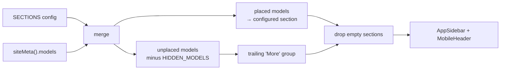
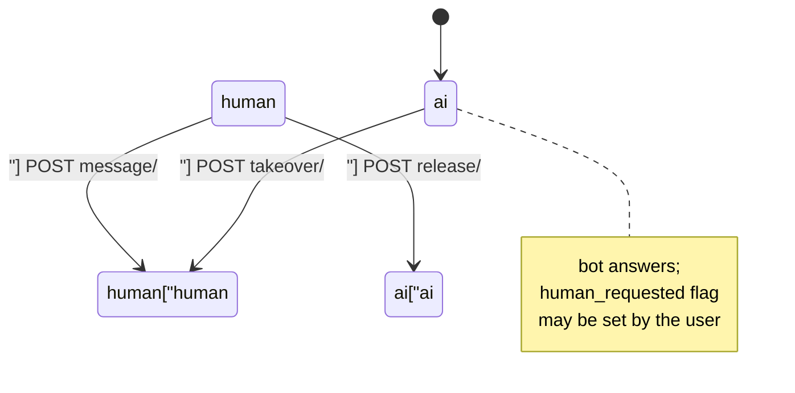

# Superadmin Platform Console — src

# Superadmin Platform Console (`frontend-main/src/app/admin`)

The platform console is the superadmin ("us") surface of Contentor: the screens where the platform owner inspects tenants, revenue, AI spend, and live help-bot conversations across *all* tenants. It lives inside the **marketing** app (`frontend-main`), not the tenant portal, because it is served from the apex host (`contentor.app` / `localhost`) and must work before any tenant context exists.

Everything here is a thin, read-mostly UI over two distinct Django API surfaces. There is almost no client-side business logic — the interesting code is nav composition (`admin-shell.tsx`) and the conversation takeover loop (`ai/page.tsx`).

## File map

| Path | Kind | Role |
|---|---|---|
| `app/admin/layout.tsx` | Server | Superuser gate + shell mount |
| `app/admin/admin-shell.tsx` | Client | Sidebar/mobile-header chrome, nav composition from site meta |
| `app/admin/page.tsx` | Client | Platform dashboard (stat grid, adoption, recent tenants) |
| `app/admin/ai/page.tsx` | Client | AI spend rollup + platform-wide conversations console |
| `app/admin/settings/page.tsx` | Server (static) | Read-only environment/config display |
| `app/admin/tenants/[slug]/page.tsx` | Client | Per-tenant drill-down + active toggle |
| `app/admin/*/loading.tsx` | Server | Route-segment skeletons |
| `components/admin/platform-usage-card.tsx` | Client | PWA adoption card (used by the dashboard) |
| `types/tenant.ts` | Types | Shared platform response shapes + `formatCurrencyMap` |

## Auth and rendering model

`AdminLayout` is the only gate. It awaits `requireSuperuser()` from `@/lib/auth` and passes the resolved identity down as `user={{ name, email }}` for the sidebar footer. `export const dynamic = "force-dynamic"` is required — the check reads request cookies, so the segment must never be statically rendered or cached.

Every page under the layout is a client component that fetches with `credentials: "same-origin"` against `/api/v1/*`. Requests go **browser → Caddy → Django directly**; nothing is proxied through Next.js, so no `X-Tenant-Domain` header is involved. These endpoints resolve the public schema and re-check superuser server-side — the layout gate is UX, not the security boundary.

## Two backend surfaces

The console deliberately mixes a generic admin kit with bespoke pages, and the distinction matters when adding features:

- **`/api/v1/platform-admin`** — the adminkit model API. `createAdminClient()` (`@shared/admin-kit/client`) talks to it; `siteMeta()` returns the registered models (`key`, `label_plural`, `icon`). Generic CRUD lists render at `/admin/m/{key}` and `/admin/m` (the model index), which are *not* part of this module — they're the shared admin-kit routes. Adding a model here means registering an `admin_panels.py` panel in the backend, not writing a page.
- **`/api/v1/platform/*`** — hand-rolled aggregate read models for the bespoke pages: `dashboard/`, `usage/`, `ai-usage/`, `ai-conversations/…`, `tenants/{slug}/`.

Rule of thumb: if the screen is "browse/edit rows of one model," register an admin panel and let it land at `/admin/m/{key}`. If it's a cross-model rollup or an interactive workflow, it becomes a bespoke page here.

## Nav composition (`admin-shell.tsx`)

The sidebar is neither hardcoded nor fully derived — it's a declarative merge of static pages and server-registered models.

`SECTIONS` is an ordered list of `SectionConfig`, each holding `NavRef`s of two kinds:

- `StaticRef` — a bespoke page: explicit `label`, `href`, lucide `icon`, optional `external` (used only by "Go to site").
- `ModelRef` — a `key` into the site meta. The icon comes from `kitIcon(model.icon)` and the label from `model.label_plural`, unless `label` overrides it (e.g. `ai-transcripts` → `"AI Transcripts"`, fixing an awkward auto-derived label).

Three behaviours to preserve when editing:

1. **Unregistered models are skipped, not errored.** `modelByKey.get(ref.key)` missing → `continue`. A model that isn't visible for this user simply doesn't appear.
2. **Unplaced models fall through to "More."** Any registered model not named in `SECTIONS` and not in `HIDDEN_MODELS` gets appended to a trailing group, so a newly registered admin panel can never silently disappear from the nav.
3. **Empty sections are filtered out** — which is also why the sidebar renders progressively: before `siteMeta()` resolves, `site` is `null`, so model-only sections collapse and only static entries show.

`HIDDEN_MODELS` is the explicit opt-out list: the five per-feature AI usage meters (already rolled up on `/admin/ai`) and `platform-blog-posts` (superseded by the bespoke `/admin/blog`). Hidden models stay reachable at `/admin/m/{key}` and via the `/admin/m` index — hiding is a nav decision, not an access decision.

The site-meta fetch uses a `cancelled` flag in the effect cleanup and swallows errors (`.catch(() => undefined)`) — a meta failure degrades the nav to static entries rather than breaking the whole console. The client is memoized (`useMemo`) so the effect runs once.

## Dashboard (`app/admin/page.tsx`)

One `GET /api/v1/platform/dashboard/` drives everything. The response is `PlatformDashboard` (`types/tenant.ts`) widened locally to `DashboardData` with an optional `recent_tenants` array.

The stat grid is built as a plain array of eight descriptors (`label`, `value`, `description`, `icon`, optional `href`); cards with an `href` get wrapped in a `Link` to the relevant model list. Money values are rendered through `formatCurrencyMap`, which turns a `{currency: amount}` map into `"69.80 USD · 245.70 TRY"` — the platform is multi-currency, so there is no single MRR scalar. Byte counts go through the local `formatBytes`. One layout quirk worth knowing: the value font shrinks from `text-3xl` to `text-xl` when the string exceeds 12 characters, which is what keeps multi-currency strings from wrapping.

Below the grid: `PlatformUsageCard` (two-thirds width) plus a link card to `/admin/ai`, then the recent-tenants table. Tenant names deep-link to `/admin/tenants/{slug}`; `statusBadgeVariant` maps `ready → success`, `pending`/`provisioning → warning`, everything else → `destructive`.

`PlatformUsageCard` fetches `GET /api/v1/platform/usage/` independently and **renders `null` on failure** — PWA adoption is supplementary, so its outage must not blank the dashboard. It derives `webPct` as `100 - pwa_pct`, guarded to `0` when there are no sessions at all.

## AI page (`app/admin/ai/page.tsx`)

Two independent concerns share this route.

### Spend rollup

`AdminAiUsagePage` fetches `GET /api/v1/platform/ai-usage/?month=YYYY-MM`, defaulting to `currentMonth()`. Changing the `<input type="month">` clears `data` (re-showing skeletons) and refetches. The response gives per-feature cards (`count`, `usd_spent` / `usd_cap`, a `kill_switch_tripped` badge), thumbs up/down ratings, a 7-day question sparkline drawn as CSS-height divs normalized against `maxDaily` (floored at 1 to avoid divide-by-zero, and each bar floored at 4% so zero days stay visible), and a top-tenants-by-spend table keyed on `tenant_schema`. `FEATURE_ICONS` maps the known feature keys (`help_bot`, `student_bot`, `blog_ai`, `brand_pack`) to icons and falls back to `Bot`, so a new backend feature key renders fine without a frontend change.

### Conversations console (`ConversationsSection`)

The superadmin's live view over **every** help-bot conversation platform-wide — both the coach console and the marketing visitor bubble, across all tenants. It reimplements the coach's own `ConversationsCard` (in `frontend-customer`) with plain `fetch`, because the two frontends are separate apps with no shared data layer.

API calls, all under `/api/v1/platform/ai-conversations/`:

| Function | Request |
|---|---|
| `fetchConversations(audience)` | `GET /?audience=` (`""`, `coach`, or `visitor`) |
| `fetchConversationThread(id, after)` | `GET /{id}/thread/?after={highWaterMark}` |
| `takeoverConversation(id)` | `POST /{id}/takeover/` |
| `releaseConversation(id)` | `POST /{id}/release/` |
| `sendConversationMessage(id, content, after)` | `POST /{id}/message/` with `{content, after}` |

Every mutation returns a full `ThreadPayload`, so the UI never has to reconstruct state from an action result — it just applies what came back.

The tricky parts, all deliberate — read the inline comments before changing them:

- **`activeRef` mirrors `activeId` synchronously.** `setState` is async, so an in-flight response for conversation A can land after the superadmin has clicked B. Every async continuation compares `activeRef.current !== forId` and skips applying itself to the drawer. Row patches (`patchRow`) still apply unconditionally, since those target a row by id and are always correct.
- **`openThread` is a plain async function, not `useAsyncAction`.** The hook's single in-flight guard would swallow a click on B while A is still loading, making the staleness checks above unreachable. Threads must stay independently switchable. The mutation handlers (`handleTakeover`, `handleRelease`, `handleSend`) *do* use `useAsyncAction` — there the double-submit guard is what you want.
- **Two polling loops with different intervals.** The list refreshes every `CONVO_LIST_POLL_MS` (10s) **only while no thread is open** (`if (activeId !== null) return`), so the list never rewrites under someone mid-reply. The open thread polls every `CONVO_THREAD_POLL_MS` (3s), passing `lastIdRef.current` as `after` for incremental fetches. Background poll failures are silently swallowed — the next tick retries.
- **`mergeThread` is append-only and id-deduped**, and advances `lastIdRef` via `Math.max`. Polling and an optimistic action response can deliver the same message; dedup by `id` makes that harmless.
- **`conversationSystemLine`** decodes `system`-role tokens emitted by the backend takeover kernel (`agent_joined:<name>`, `assistant_resumed`, `human_requested`) into plain-English centered lines. Unrecognized tokens render `null` — forward-compatible by design, so a new backend token is invisible rather than raw.
- The drawer is a `fixed inset-y-0 right-0` panel, not a Radix `Sheet`. Clicking the active row again toggles it closed.

## Tenant detail (`app/admin/tenants/[slug]/page.tsx`)

Reads `slug` from `useParams()` and fetches `GET /api/v1/platform/tenants/{slug}/` into the local `TenantDetail` shape (richer than the list-level `Tenant` in `types/tenant.ts`: adds `platform_subscription`, `usage`, `marketplace`, and both Stripe and Iyzico identifiers).

The one mutation in the module is the active toggle: `PATCH` with `{is_active: !tenant.is_active}`, and the response replaces local state wholesale. It uses a local `toggling` boolean to disable the `Switch` rather than `useAsyncAction`, and surfaces failures into the same full-page `error` banner used for load failures — meaning a failed toggle replaces the page content. That's a rough edge if you're touching this file.

Cards cover monetization (platform subscription badge with renewal date, `stripe_charges_enabled` / `stripe_payouts_enabled`, marketplace gross/fees/count) and current-month usage. Note the local `currencyMap` helper here duplicates `formatCurrencyMap` from `types/tenant.ts` with escaped em-dash/middot literals — prefer the shared export for new code. The "Open site" button hardcodes `http://` against `tenant.subdomain`, which is correct in dev but not for production hosts.

The breadcrumb links to `/admin/tenants`, while the sidebar entry for tenants points at `/admin/m/tenants` (the admin-kit list). Both resolve to a tenants list; the drill-down is reached from a row's "Details" action or from the dashboard's recent-tenants table.

## Settings (`app/admin/settings/page.tsx`)

Fully static server component. Displays `BASE_DOMAIN` (from `@/lib/constants`, i.e. `CONTENTOR_DOMAIN`) and a note that superusers come from the `SUPERUSER_EMAILS` env var, plus an `EmptyState` placeholder. No API calls, nothing writable — configuration is env-driven and changes ship with a deploy.

## Loading states

Each route segment has a `loading.tsx` built from the presets in `@/components/ui/skeletons` (`SkeletonPageHeader`, `SkeletonCardGrid`, `SkeletonTable`, `SkeletonForm`), which satisfies the repo-wide rule that every segment has a `loading.tsx` at or above it (enforced by `scripts/check-loading-patterns.mjs` in `make lint`).

Because the pages are client components fetching in `useEffect`, those files only cover the server-render gap. The *data* loading states are inline: local `StatSkeleton` / `TableSkeleton` / `DetailSkeleton` components defined per file, gated on `data === null`. This is older than the `PageState` + `@/components/ui/skeletons` convention described in `CLAUDE.md`; new pages here should use `PageState` with shared presets instead of hand-rolling another `StatSkeleton`.

## Conventions and gotchas for contributors

- **These pages predate several current frontend conventions.** They use raw `next/link` (the house rule is `<NavLink>`), plain `fetch` rather than a shared api client, and per-file skeleton components. Match the *current* conventions in new code rather than the surrounding style; don't mass-migrate as a drive-by.
- **`useAsyncAction` vs. plain async is a real decision here**, not incidental. Use the hook when a double-submit guard helps (mutations); avoid it when concurrent invocations must be allowed and disambiguated (thread switching).
- **Error handling is intentionally uneven by importance.** The dashboard and tenant detail fail loudly (full-page banner); `PlatformUsageCard`, site meta, and background polls fail silently. Keep supplementary widgets non-fatal.
- **Response shapes belong in `types/tenant.ts`** when shared across pages (`PlatformDashboard`, `PlatformPlan`, `PlatformSubscriptionRow`, `WebhookEventRow`, `Tenant`); page-local shapes like `TenantDetail`, `AiUsageRollup`, and `ConversationRow` stay in their page files. If you change the corresponding Django serializers, regenerate types in `frontend-customer` (`npm run gen:api`) — but note these platform types are hand-written, so they will *not* update themselves and must be edited by hand.
- **To add a nav entry:** register the admin panel in the backend and, if it deserves a specific section, add a `ModelRef` to the right `SECTIONS` entry. Do nothing and it appears under "More." To suppress it, add its key to `HIDDEN_MODELS`.
- **To add a bespoke page:** create `app/admin/<name>/page.tsx` plus a `loading.tsx`, add a `StaticRef` to `SECTIONS`, and expose the aggregate under `/api/v1/platform/` in `apps/core/platform/`.
