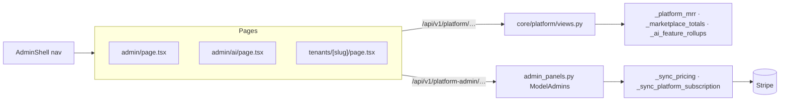

# Superadmin Platform Console

# Superadmin Platform Console

The platform owner's ("us") control surface for the whole SaaS: every coach workspace, plan, subscription, AI dollar, and help-bot conversation across all tenants. Everything here reads and writes the **public schema** — no tenant context exists (or is needed) on these screens, which is why the UI is served from the apex host by `frontend-main` rather than the tenant portal.

Two sub-modules, one per side of the wire:

- **[Backend](superadmin-platform-console-apps.md)** — `apps/core`: declarative `ModelAdmin` panels on `platform_site` (`admin_panels.py`) plus a hand-written aggregate API (`core/platform/`).
- **[Frontend](superadmin-platform-console-src.md)** — `frontend-main/src/app/admin`: the console screens, thin and read-mostly over those two APIs.

## The two-API split

The defining structural fact of this module: the console talks to **two unrelated Django surfaces**, and which one a screen uses tells you what kind of screen it is.

| Surface | Backend origin | What the frontend does with it |
|---|---|---|
| `/api/v1/platform-admin/<key>/` | admin-kit CRUD generated from the ~20 `ModelAdmin` declarations | Generic list/detail/edit — plans, subscriptions, tenant rows |
| `/api/v1/platform/…` | bespoke `@api_view` handlers in `core/platform/views.py` | Dashboards and rollups: `AdminDashboardPage`, `AdminAiUsagePage`, `TenantDetailPage`, `PlatformUsageCard` |

Aggregation lives entirely on the backend. `platform_dashboard` composes `_platform_mrr` and `_marketplace_totals`; `platform_ai_usage` composes `_ai_feature_rollups`. The frontend receives finished numbers and formats them (`formatBytes`, `currencyMap`, `statusBadgeVariant`) — there is no client-side math to get wrong, and no second place where MRR is defined.

## Workflows that span both halves

**Plan & pricing edits → Stripe.** A superadmin edits a plan through an admin-kit panel; `perform_create` / `perform_update` in `admin_panels.py` fan out to `_sync_pricing` and `_sync_platform_subscription` so the Stripe side never drifts from the row that was just saved. Multi-currency input is guarded by `validate_amounts` → `_validate_currency_map` in `core/platform/serializers.py` before any of that runs; archiving goes through `platform_plan_detail` → `_archive_plan` rather than a raw delete. The console UI is just the form — the invariants are enforced server-side.

**Help-bot takeover.** The one genuinely stateful loop in the module. `ConversationsSection` in `admin/ai/page.tsx` polls `fetchConversations`, opens a thread via `openThread` → `fetchConversationThread`, then drives `takeoverConversation` / `sendConversationMessage` / `releaseConversation`. Each of those hits a `platform_ai_conversation_*` view that resolves the target through the shared `_help_conversation` helper, so takeover, message, and release all agree on which conversation (and which tenant's schema it belongs to) they're acting on. Client state is merged incrementally — `mergeThread`, `patchRow` — so a human replying mid-conversation doesn't get their draft blown away by the next poll.

**Asset uploads.** `platform_upload` → `_store_object` in `core/platform/uploads.py` backs plan/brand imagery; in dev this lands in MinIO like every other object in the stack.

## Conventions worth knowing before editing

- Adding a managed model is a one-line `ModelAdmin` registration on `platform_site` — reach for `core/platform/views.py` only when the screen needs a **cross-model aggregate** the admin-kit can't express.
- All three dashboard pages share the same loading idiom: a local `StatSkeleton` / `DetailSkeleton` over the shared `Skeleton` + `cn` primitives. Keep new screens on that path rather than inventing a spinner.
- These screens run before tenant resolution. Nothing in `app/admin` may depend on `X-Tenant-Domain` or `getTenantDomain()`.