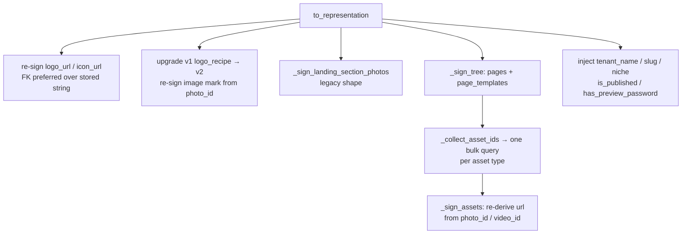

# Tenant Config & Site Builder — apps

# Tenant Config & Site Builder

`backend/apps/tenant_config/` is the per-tenant "everything about this coach's site" app. It lives in `TENANT_APPS`, so every row it owns exists inside a tenant's Postgres schema. It answers four separate questions for one tenant:

1. **What does this site look like?** — theme, fonts, logo/icon, navbar, custom CSS (`TenantConfig`)
2. **What's on the site?** — the website builder's page/block tree (`TenantConfig.pages`, catalogued in `defaults.py`)
3. **What's still demo content, and can this site go live?** — the seed registry (`SeededObject`), Setup Assistant checklist and publish gate (`setup_items.py`, `demo_content.py`)
4. **What do the two chatbots know?** — the coach's student-facing assistant (`AssistantConfig`/`AssistantKnowledgeEntry`/`AssistantLink`, `assistant_views.py`) and "Ask Contentor", the coach's own help bot (`help_bot.py`, views in `views.py`)

The app deliberately has **no service layer**: the serializer *is* the trust boundary, and the pure-data modules (`defaults.py`, `seeding.py`) are importable from migrations and management commands without dragging in Django models or DRF.

---

## The config singleton

`TenantConfig` is a de-facto singleton per tenant — every read is `TenantConfig.objects.first()`. It is created by `_create_default_config` in `apps/core/tasks.py` during tenant provisioning (which calls `default_pages()` for starter content) and never deleted.

Notable fields and why they're shaped the way they are:

| Field | Notes |
|---|---|
| `logo` / `logo_url`, `icon` / `icon_url` | FK-preferred, raw-URL fallback. The FK is durable; the URL is a presigned string that expires. `to_representation` always re-derives the URL from the FK when one exists. |
| `logo_recipe` | Versioned Logo Studio composer state. Validation + v1→v2 upgrade live in `logo_recipe.py`; the serializer just delegates. |
| `landing_sections` | **Legacy.** The old single-page landing config, superseded by `pages`. Still populated as a backfill source and read-time fallback. Slated for removal once `pages` is proven in prod. |
| `pages` | The builder tree (see below). |
| `page_templates` | Coach-saved "my templates" — same block shape as `pages`, validated by the same code path. Built-in starter templates live in the frontend, not here. |
| `setup_progress` | Setup Assistant state: `{"pages_edited": [...], "look_edited": bool, "manual": {key: True}}`. Auto-detection is **append-only** — nothing ever un-marks a page as edited. |

Reads are cached: `TenantConfigView.get_object` caches the instance under `tenant:{schema_name}:config` for 300s and `perform_update` deletes that key. Because the cached instance can be stale-ish, `perform_update` JSON-normalizes before comparing (see *Autosave idempotence* below).

`GET /api/v1/config/` is `AllowAny` — the public tenant site renders from it. `PATCH` requires authentication.

---

## The website builder: pages and blocks

`defaults.py` is the **single source of truth** for the builder's vocabulary. It is pure Python with no model imports, so migrations (`0013_backfill_pages_from_landing_sections`), seed helpers (`apps/demo_seed/seeding_helpers.seed_config`), and the serializer all share one definition.

```
pages = {
  "home": {"blocks": [
      {"id": "blk_hero", "type": "hero", "enabled": True, "heading": ..., "bgImage": {"url", "photo_id"}},
      ...
  ]},
  "about": {...}, "courses": {...}, "pricing": {...}, "faq": {...}, "contact": {...}
}
```

- **`KNOWN_PAGE_KEYS`** — the six buildable pages. `pricing` renders at the frontend's `/plans` route; that mismatch is resolved on the frontend, not here.
- **`CONTENT_BLOCK_TYPES`** — coach-authored static content (`hero`, `richText`, `imageText`, `gallery`, `testimonials`, `faq`, `cta`, `stats`, `logos`, `video`, `banner`, `contact`).
- **`DYNAMIC_BLOCK_TYPES`** — pull live data at render time and store only presentation choices (`courseGrid`, `pricingPlans`, `upcomingEvents`, `storeProducts`).

Block ids from `default_pages()` are deterministic (`blk_hero`, `blk_about_intro`, …); the frontend assigns `crypto.randomUUID()` ids to blocks the coach adds later, and `_clean_block` fills in a `blk_<hex>` id if one is missing.

### Hybrid theme-lock

Blocks are **theme-locked by default**: they carry content, the theme supplies styling. A block may additionally carry a tightly-clamped `style` override, and the rules are server-authoritative:

- Backgrounds and text colors are **theme tokens**, never raw colors (`STYLE_BACKGROUND_TOKENS`, `STYLE_TEXT_COLOR_TOKENS`) — so dark mode and theme switching keep working and pages can't go off-brand.
- `BLOCK_STYLE_ALLOWLIST` decides which keys each block type may carry. `hero` gets only `textColor` (a token background would sit behind its image, and its height is min-height-driven so spacing is a no-op). Dynamic blocks get spacing + heading textColor only, never a background that would push their themed inner cards out of contrast.
- `sanitize_block_style` **drops** unknown keys and values rather than rejecting them — forward-compat with a frontend that may ship new controls first. It also omits no-op values (`background: "default"`, `spacing: "normal"`), so an unstyled block serializes byte-for-byte as it did before overrides existed.

The frontend may surface a *subset* of these controls; it must never widen the set.

### Rich text

`RICH_TEXT_FIELDS` (currently just `body`) holds coach-authored HTML. `sanitize_rich_text` runs it through `nh3` against a fixed tag/attribute allowlist on **write**, so stored HTML can never carry scripts, event handlers, or unsafe URL schemes and is safe to render directly. This function is reused outside the app — `apps/notifications` (serializer validation + email render) and `core/onboarding/ai_compose` all call it.

### Legacy conversion

`pages_from_landing_sections()` performs the one-way legacy→builder conversion: the six fixed sections map onto the home page (`about` → `imageText`, `courses` → `courseGrid`, …), preserving enabled flags, content, and photo ids. The converted About and FAQ content is *also* copied onto their dedicated pages so they aren't empty. It's called from three places — the backfill migration, the seed commands, and `to_representation` as a read-time fallback for tenants with no `pages` yet — which is what keeps real and demo tenants converting identically.

---

## The serializer as trust boundary

`TenantConfigSerializer` is where all defensive work happens. Nothing else validates builder input.

**Write path.** Each `validate_*` clamps its field:

- `validate_pages` / `validate_page_templates` → both funnel every block through `_clean_block`, so live pages and saved templates are sanitised identically. `_clean_block` drops unknown block types, guarantees a string `id` and an `enabled` flag, clamps `style`, sanitises rich text, then recursively `_scrub_unsafe_urls` (any key ending in `href`/`url`/`Href` starting with `javascript:`/`vbscript:` becomes `""`).
- `validate_navbar_config` → layout enum (`classic|centered|split|minimal|pill`), ≤20 links with capped label/href, coerced booleans, `logo_size` enum.
- `validate_custom_css` → `clean_css` from `apps.core.sanitize`. This CSS is injected into a `<style>` tag on every tenant page, so the `</style>` breakout vector and active-content constructs are stripped before storage.
- `validate_logo_recipe` → `logo_recipe.upgrade_recipe()` then `validate_recipe()`; `{}` clears the design.

`_clean_photo_id` deserves its own note. `Photo.id` is a `UUIDField`, and a malformed value reaching `Photo.objects.filter(pk=...)` raises Django's `ValidationError` *during query construction* — which DRF's exception handler does **not** turn into a 400. So photo ids are validated and clamped (not merely length-capped) on both the write path and the read path.

**Read path.** `to_representation` does considerably more than serialize:



`_sign_tree` recurses over dicts *and* lists, which is why the same function handles the `pages` dict and the `page_templates` list. It collects every `photo_id`/`video_id` in the tree first, issues **one** bulk query per asset type, then walks again to write fresh presigned URLs — no N+1 regardless of block count.

Injecting tenant metadata (`tenant_name`, `tenant_slug`, `niche`, `is_published`, `has_preview_password`) into the config response saves the frontend a second round-trip. `niche` is read-only — the builder uses it to seed new blocks with niche-appropriate example content.

### Autosave idempotence

Because every GET re-signs URLs, a naive "did the coach edit this page?" diff would fire on every autosave round-trip. `views.py` solves this in two places:

- `_strip_volatile_urls` nulls the `url` of any dict carrying a `photo_id`/`video_id` before the before/after comparison. It never touches what's persisted.
- `_logo_signal` returns `logo_id or logo_url` — once the FK is set, `logo_url` churns on every read, so the stable FK wins; when no FK governs it, the raw `logo_url` CharField (the current live write path for a coach's uploaded logo) is compared instead.

`perform_update` then adds any genuinely-changed page key to `setup_progress["pages_edited"]` and sets `look_edited` when theme/font/logo moved, saving with `update_fields=["setup_progress"]` and busting the config cache.

---

## Demo content: the seed registry

Provisioning seeds a new tenant with niche-appropriate starter content across five apps. `SeededObject` is the registry that makes that content identifiable and removable later, without adding `updated_at` columns to five apps.

Each row is `(content_type, object_id, fingerprint, niche)`. The **fingerprint** (`seeding.fingerprint_for`) is a SHA-256 over every concrete field except pks and bookkeeping fields (`created_at`, `updated_at`, `download_count`). For `courses.Course` it additionally folds in modules and lessons — so editing a lesson protects the whole course. That single hash answers "has the coach touched this since seeding?" forever.

Three helpers, one implementation shared by the seeder and the erase endpoint:

- **`register_seeded(objs, niche)`** — bulk-creates rows. Critically, it calls `obj.refresh_from_db()` first: a freshly-created object can hold Python-native values (`Course.price` as `int 0`) that stringify differently from what the DB round-trips (`Decimal('0.00')`) — same value, different hash. The erase endpoint always fingerprints a freshly-fetched row, so registration must match that baseline.
- **`refresh_seeded_fingerprints(objs)`** — re-baselines after a *system*-driven mutation (onboarding AI renames, thumbnail picks). Without it, AI edits made right after seeding would read as coach edits and break the erase flow. Called from `apps/core/tasks._apply_compose_extras` and `core/onboarding/ai_photos.apply_photo_picks`.

Callers of `register_seeded` span `core/demo/seed_template.py`, `core/onboarding/seeding_content.py`, `core/onboarding/starter_post.py`, `core/onboarding/ai_photos.py`, and the `backfill_seed_registry` management command.

### Erase

`demo_content.py` exposes `GET /demo-content/` (what's still demo, with per-type ids and counts) and `POST /demo-content/erase/`.

Erase is transactional and walks `_ERASE_ORDER` — content first, then the media it references — so the reference guard sees the final set of surviving rows. For each registered row it keeps the object when any of these hold:

1. `fingerprint_for(obj) != row.fingerprint` — the coach edited it
2. it's a `media.Photo` and `_photo_referenced()` — the config's logo, a `photo_id` appearing anywhere in the JSON-dumped `pages`/`landing_sections`, or a thumbnail on any course/video/live model
3. it's a `courses.Video` still attached to a `Lesson`

A kept object has its `SeededObject` row deleted too — the badge is dropped forever, so a coach-edited item never reappears as demo content. Response is `{"deleted": {...}, "kept": {...}}`, with the four live types collapsed into one `live_events` count for dialog copy.

**Bucket objects are never touched.** Seeded rows point at shared platform `demo/*` keys used by every tenant.

---

## Setup Assistant and the publish gate

`setup_items.py` computes the coach's onboarding checklist from **live tenant state** — nothing is stored except the manual overrides and edit-detection in `setup_progress`. The API returns state only (`key`/`group`/`done`/`source`/`optional`); titles, descriptions, icons, and deep links live in the frontend catalog where next-intl owns the copy.

The core predicate is `_has_own(model, rows, queryset=None)` — "a non-demo object exists": anything outside the registry, **or** a registered object whose fingerprint no longer matches. `queryset` narrows what counts (the publish gate passes a published-only queryset so a draft never unlocks going live).

`compute_setup_state` builds items in groups (`site`, `content`, `business`, `live`, `extras`), conditioning the optional ones on real signals:

- module-gated: `first_download` / `first_live` only if the module is in `enabled_modules`
- goal-gated: `first_blog_post` / `first_community_post` only if the coach declared `write_blog` / `build_community` in the signup wizard. `_wizard_goals` reads `tenant.wizard_state`, which survives provisioning untouched and so is readable for the tenant's whole life.
- plan-gated: `studio_email` only when `is_paid_active(tenant)`

Progress counts **core** items only; optional ones never inflate the denominator.

### `publish_blockers`

`publish_blockers(config, tenant)` returns the unmet requirement keys for going live (empty = ready). Unlike the checklist, it reads real state only — a manual "mark done" never satisfies a hard publish requirement.

| Blocker | Condition |
|---|---|
| `look` | no logo and `look_edited` not set |
| `first_course` | no own **published** course and no own download |
| `first_event` | only if wizard goals include `run_live_classes`/`in_person_events` **and** the plan has `is_live_enabled` |
| `first_blog_post` | only if goals include `write_blog`; own **published** post required |
| `payouts` | only if own paid content exists (`_has_paid_content`) and `can_monetize(tenant)` is false |

Content blockers are goal- *and* entitlement-conditional on purpose: a coach is never gated on a content type they didn't choose, nor on one their plan can't create — the free plan has `is_live_enabled` false, which would otherwise leave the gate permanently unsatisfiable. `_live_entitled` uses `getattr(..., None)` because Django's reverse-one-to-one raises a `DoesNotExist` that also subclasses `AttributeError`, covering "no subscription".

`demo_cleanup` is **deliberately not a blocker** (decision recorded in the AI-seeding plan): seeded content is niche-appropriate starter content a coach may reasonably ship as-is. It stays a non-blocking nudge in the checklist.

`compute_setup_state` embeds `publish_blockers` in its response, so one `GET /setup-status/` gives the frontend both the checklist and the gate. `PATCH` handles `dismissed` and per-item manual overrides (validated against `ALL_ITEM_KEYS`, 400 on unknown keys).

---

## Logo Studio

Idea generation is **client-side** for every coach — the deterministic composer at `frontend-customer/src/lib/logo/composer.ts`. Paid-tier coaches additionally get "Design with AI": a staged live conversation where each design pass is critiqued by the model's own vision before the coach sees it.

The engine lives in `logo_api.py` and is **tenant-explicit** (takes `tenant` as an argument) so it can be shared by this JWT-authed coach studio and the wizard's token-auth context. `views.py` holds thin wrappers:

- `logo_ai_status` → `logo_api.ai_status(tenant)`
- `logo_converse` → builds the brief (brand name from config, `THEME_PRIMARY_HEX[config.theme]`, plus coach-supplied niche/style chips/vibe, all length-capped) then either `stream_response(logo_api.converse_stream(...))` when `wants_stream(request)` or the blocking `logo_api.converse(...)`. The SSE and JSON paths return the same shape, so the wizard and other clients are unaffected by streaming.
- `logo_converse_finish`, `logo_refine` → direct delegation

Design spec: `docs/superpowers/specs/2026-07-11-logo-vision-critique-conversation-design.md`.

---

## The two chatbots

Both are `AiConversation`-backed (`apps.core.models`) and share the takeover machinery in `apps.core.assistant` — `get_or_create_conversation`, `append_message`, `maybe_auto_release`, `thread_payload`.

**Student-facing site assistant** (`assistant_views.py`, models here):

- `AssistantConfig` — singleton via `load()` (`get_or_create(pk=1)`), **OFF by default** because the bot speaks in the coach's brand voice, so enabling it must be a conscious coach action. `load()` is the standard access point and is called from the assistant views, `demo_seed.seeding_helpers.seed_assistant`, and the tests.
- `AssistantKnowledgeEntry` — coach-authored knowledge (≤50 entries, ≤1500 chars) injected into the `site_knowledge` **data block**, never interpreted as instructions.
- `AssistantLink` — ≤20 coach-approved links the assistant may offer. External `https` URLs are allowed (the coach already controls every link on their own site); widgets still hard-validate against the status endpoint's whitelist.

**"Ask Contentor" coach help bot** (`views.py` + `help_bot.py`) — `help_bot_chat` streams SSE (`delta|done|error`) from a client-held transcript; the tenant snapshot is built **server-side** by `help_bot.build_tenant_context(config, tenant)` and the client never assembles it. Throttled via `HelpBotRateThrottle` (scope `help_bot`) and availability-gated per month by `help_bot.availability()`. If the conversation is already in `STATUS_HUMAN`, the question is appended and `{"mode": "human"}` returns without touching the model. `help_bot_thread` / `help_bot_human_message` / `help_bot_human_request` mirror their student-assistant counterparts; the human-request path emails `HELP_BOT_ALERT_EMAIL` (falling back to `RESEND_FROM_EMAIL`) exactly once per conversation, and email failure is logged rather than propagated.

---

## Also here: `admin_stats`

`GET /stats/` powers the coach dashboard tiles: student count, course count, net revenue (`completed`+`partially_refunded` payments minus `refunded` refunds, floored at 0), and human-formatted storage across `Photo`/`Video`/`DownloadFile` `file_size` sums.

---

## URL surface

All routes are mounted under `/api/v1/` (see `urls.py`):

| Route | Handler | Auth |
|---|---|---|
| `config/` | `TenantConfigView` (Retrieve/Update) | GET `AllowAny`, PATCH `IsAuthenticated` |
| `stats/` | `admin_stats` | `IsCoachOrOwner` |
| `setup-status/` | `setup_status` (GET/PATCH) | `IsCoachOrOwner` |
| `demo-content/`, `demo-content/erase/` | `demo_content`, `erase_demo_content` | `IsCoachOrOwner` |
| `config/logo-ai/status/`, `config/logo-converse/`, `.../finish/`, `config/logo-refine/` | `logo_api` wrappers | `IsCoachOrOwner` |
| `help-bot/{chat,status,thread,human-message,human-request}/` | Ask Contentor | `IsCoachOrOwner` (+ throttle on chat) |
| `assistant/config,knowledge,links,transcripts,preview-chat,conversations/*` | `assistant_views` | `IsCoachOrOwner` |

---

## Contributing notes

- **Adding a block type** — add it to `CONTENT_BLOCK_TYPES` or `DYNAMIC_BLOCK_TYPES` *and* give it an entry in `BLOCK_STYLE_ALLOWLIST` (a missing entry means `frozenset()` — every override silently dropped). No serializer change is needed; `_clean_block` reads the catalog.
- **Adding a style override key** — extend the enum tuple, the allowlist entries, *and* `sanitize_block_style` (it checks keys explicitly, not generically). Keep the no-op-omission behaviour so unstyled blocks don't gain a `style` key.
- **Adding a checklist item** — add the key to `ALL_ITEM_KEYS` (otherwise `PATCH /setup-status/` 400s on it), `add(...)` it in `compute_setup_state`, and add the frontend copy. Decide deliberately whether it belongs in `publish_blockers` — most nudges don't.
- **Keep `defaults.py` and `seeding.py` model-free.** Migrations import them. Views/serializers use function-local imports for cross-app models (`Course`, `Photo`, `BlogPost`, …) to avoid app-loading cycles — follow that pattern.
- **Anything read back from `pages`/`page_templates` must survive re-signing.** If you add a new asset-reference field, teach `_collect_asset_ids`/`_sign_assets` about it *and* `_strip_volatile_urls` in `views.py`, or autosave will start false-positive-marking pages as edited.
- **After changing the serializer**, run `npm run gen:api` in `frontend-customer` and review the `src/types/api-generated.ts` diff.
- Tests live in `backend/apps/tenant_config/tests/` (`test_pages_serializer.py`, `test_student_bot.py`, `test_assistant_*.py`); `_has_own` is also exercised from `core/tests/test_wizard_content.py`.
