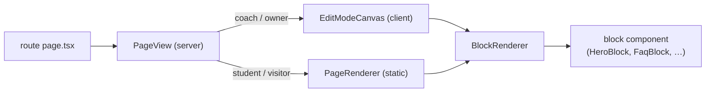
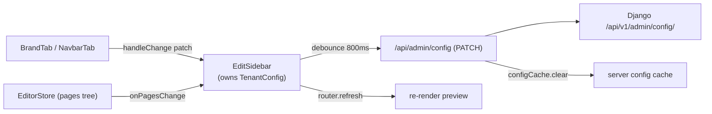

# Tenant Config & Site Builder — src

# Tenant Config & Site Builder (`frontend-customer/src`)

The site builder is how a coach edits their own tenant site — brand, navbar, and the block content of six public pages — **in place, on the live page**, rather than in a separate admin screen. There is no `/admin/design` route: the editor is a sidebar that mounts over the public site when the logged-in user is a coach/owner.

Everything the builder reads and writes is one Django resource: `GET/PATCH /api/v1/admin/config/` → `TenantConfig` (backend `apps.tenant_config`). The frontend never stores builder state anywhere else.

---

## File map

| Area | Files |
|---|---|
| Editor shell | `components/owner/edit-sidebar.tsx`, `edit-mode.tsx` |
| Editor state | `components/owner/canvas/editor-store.tsx` |
| Live canvas | `canvas/edit-mode-canvas.tsx`, `canvas/sortable-block-shell.tsx`, `canvas/block-toolbar.tsx` |
| Drag & drop | `canvas/canvas-dnd-provider.tsx`, `canvas/dnd-collision.ts`, `canvas/drop-zone.tsx`, `canvas/palette-drag-source.tsx`, `canvas/types.ts` |
| Sidebar tabs | `blocks-tab.tsx`, `brand-tab.tsx`, `navbar-tab.tsx`, `block-form.tsx`, `field-renderer.tsx`, `style-controls.tsx`, `step-slider.tsx` |
| Pickers / modals | `link-picker.tsx`, `rich-editor.tsx`, `template-gallery.tsx`, `logo-uploader.tsx` |
| Block system | `lib/blocks/registry.tsx`, `types.ts`, `field-schema.ts`, `style.ts`, `pages.ts`, `examples.ts`, `example-images.ts`, `page-templates.ts`, `fetch-dynamic-data.ts` |
| Renderers | `components/blocks/block-renderer.tsx`, `page-renderer.tsx`, `page-view.tsx`, `inline-text.tsx`, `editable-body.tsx`, plus one component per block type |
| Server plumbing | `lib/tenant.ts` (`fetchTenantConfig`, `configCache`), `app/api/admin/config/route.ts` |
| Non-builder config | `app/admin/settings/page.tsx` (timezone, demo cleanup, mailbox) |

---

## Data model

A tenant's site content is a tree hanging off `TenantConfig` (`types/tenant.ts`):

```
TenantConfig
├── brand_name, logo_url/logo_id, icon_url, logo_recipe, theme,
│   dark_mode_enabled, font_family, custom_css, navbar_config
├── pages: PagesConfig          // Partial<Record<PageKey, { blocks: Block[] }>>
├── page_templates: PageTemplate[]   // coach-saved templates
└── niche, onboarding_completed, is_published, timezone
```

A `Block` is deliberately loose: an `id`, a `type` from the registry, an optional `enabled` / `style`, and an otherwise **flat bag of content fields** (`[field: string]: any`). Nothing validates block field shapes on the client — the registry's `fields` schema is what defines them in practice, and the backend re-shapes the payload defensively on write (`validate_pages` / `validate_page_templates`).

`PageKey` is a fixed six-key set (`home`, `about`, `courses`, `pricing`, `faq`, `contact`), mirrored server-side as `KNOWN_PAGE_KEYS`. `lib/blocks/pages.ts` owns the key↔route mapping and the one mismatch worth knowing: **`pricing` renders at `/plans`**. `pageKeyForPath()` is the only place that inverts it.

Image and video fields are structured, not URLs: `{ url, photo_id }` / `{ url, video_id }`. `url` is a *signed* URL that the serializer re-derives from the id on every read — so it is safe to treat as ephemeral and must never be relied on as stored state.

---

## Read path: rendering a builder page

Every public route follows the same three lines (see `app/(public)/page.tsx`, `about`, `courses`, `faq`, `contact`):

```ts
const config = await fetchTenantConfig(await getTenantSlug());
const blocks = config?.pages?.home?.blocks ?? [];
const dynamicData = await fetchDynamicData(blocks);
return <PageView pageKey="home" blocks={blocks} dynamicData={dynamicData} />;
```



`PageView` branches on `getAuthUser()`: a coach gets the editable `EditModeCanvas`, everyone else gets the static `PageRenderer`. **Both funnel into the same `BlockRenderer`**, which is the load-bearing invariant of the whole feature — edit-mode markup and published markup cannot diverge, because there is only one render path. `BlockRenderer` also drops disabled blocks, silently skips unknown `type`s (forward compat with newer block types in stored config), and wraps the block in `blockStyleClasses(block)` only when a style override exists, so unstyled public DOM is byte-identical to a build with no style feature at all.

`fetchDynamicData` fetches only the datasets that the page's *enabled* blocks reference — `dynamicKeysForBlocks` walks blocks and collects each definition's `dynamicDataKey` (`courses` | `plans` | `events` | `storeProducts`). A page with no dynamic blocks makes zero extra requests, and a failing endpoint leaves that slice `undefined` so the block renders its own empty state instead of failing the page.

### Config fetching and the cache

`fetchTenantConfig(slug)` in `lib/tenant.ts` is the single server-side reader. Three behaviours matter:

- It prefers the **live request host** (`x-tenant-domain`) over `${slug}.${BASE_DOMAIN}`, so TR-locale tenants and custom domains hit the right `Domain` row. The slug-built fallback exists only for `generateMetadata` / `manifest.ts`, where request headers aren't available.
- It distinguishes a Django **404 (no such tenant → `null`)** from a transient 5xx/timeout, and retries once for the latter. Without this, a cold-load blip renders "Site not found" on a perfectly valid tenant.
- `configCache` has a 60s TTL in prod and **0 in development** — e2e specs PATCH config and immediately assert the public page changed, which a warm cache would turn into a flaky 60s stale window.

---

## Write path: autosave



`EditSidebar` owns the full `TenantConfig` and the only save path. `handleChange(patch)` merges the patch, marks `onboarding_completed` true on first save, and (re)arms a 800 ms debounce to `persistConfig`. Page content arrives through the same door: the editor store's `onPagesChange` callback is wired to `handleChange({ pages })`.

Three subtleties in `persistConfig` / `flushPending` that are easy to break:

1. **It deliberately does not use `useAsyncAction`.** Its single-flight guard would drop a `flushPending()` call that lands while an earlier debounced save is in flight, silently losing the coach's newest edits.
2. **`flushPending()` runs before navigation** (`goToPage`) and before leaving edit mode, cancelling the timer and firing the pending config immediately.
3. **`logo_recipe.mark.url` is stripped for image marks** before sending. The backend discards it on write and re-derives it from `photo_id` on read (`validate_logo_recipe`); leaving the session's base64 data URL in place would bloat every autosave PATCH by an entire image. `LogoStudio.handleSave` applies the same wire rule.

### The proxy route

`app/api/admin/config/route.ts` is a thin Next route handler that forwards `GET`/`PATCH` to Django with the JWT cookie as a bearer token and — critically — an explicit `X-Tenant-Domain` header built from `x-tenant-slug` + `BASE_DOMAIN`. (Node's undici drops custom `Host` headers, so without this the request resolves to the public schema.)

Its second job is cache invalidation: after a successful PATCH it calls `configCache.clear()`. `fetchTenantConfig` keys the cache by live tenant *domain*, not slug, so clearing the whole map is the reliable way to keep `router.refresh()` from re-rendering the preview from a stale config.

---

## The editor store

`canvas/editor-store.tsx` is the single client source of truth for **page content** while editing. It exists because two surfaces mutate the same tree: the sidebar's block list and the on-page canvas. It's a `useReducer` over:

```ts
{ pages, past[], future[], selectedBlockId, hoveredBlockId, revealBlockId, revealSeq }
```

Actions: `insert`, `remove`, `duplicate`, `reorder`, `update`, `setEnabled`, `applyTemplate`, `select`, `hover`, `undo`, `redo`. Content-changing actions go through `commit()`, which pushes the previous `pages` onto `past` (capped at `HISTORY_LIMIT = 50`) and clears `future`. **Selection and hover do not commit and do not trigger a save** — the `useEffect` that calls `onPagesChange` watches `state.pages` only, and skips the initial mount so opening the editor never writes.

Two mechanisms worth understanding before touching the reducer:

- **Edit coalescing.** `update` carries `at: Date.now()`. If the patch touches a single field, the key `"<blockId>:<field>"` matches `lastEditKey`, and less than `COALESCE_MS` (700 ms) has elapsed, the edit folds into the current history entry instead of pushing a new one — so typing isn't undone character-by-character.
- **Reveal.** `selectBlock(id, { reveal: true })` sets `revealBlockId` *and* bumps `revealSeq`. `SortableBlockShell` watches both and calls `scrollIntoView({ block: "center" })` (honouring `prefers-reduced-motion`). The counter makes a repeat request for the same block re-centre it, and pairing id+seq stops a later canvas click from re-firing the previous scroll. Sidebar selections reveal; canvas clicks don't (the block is already on screen).

Consumers use `useEditorStore()` (throws outside the provider) or `useOptionalEditorStore()` (returns `null` on the public/student path — that's how `EditModeCanvas` degrades to a static render if the layout couldn't load the config).

The provider also fetches `/api/v1/photos/` once into a ref and pipes every `insertBlock` through `applyExampleImages`, filling *empty* image slots on hero / imageText / gallery / testimonials with random library photos so a freshly added block lands visually complete. Logos (brand marks), videos, and dynamic blocks are intentionally skipped.

### Edit mode is a separate, coarser flag

`edit-mode.tsx` is a boolean context, provided by `EditSidebar` and read by the canvas. Default **off**: a coach browsing their own site sees exactly what a visitor sees, with one floating "Edit site" button. The initial value is `!initialConfig.onboarding_completed` (a coach still onboarding lands in the editor); a returning coach's last choice is restored from `localStorage["contentor:edit-mode"]` *after mount*, deliberately kept out of initial state to avoid an SSR hydration gap.

Deep links win over the restore because their effect is declared later: `/?edit=1`, `&section=brand|navbar`, `&studio=1`. These are read from `window.location.search`, **not `useSearchParams`**, to avoid the Next 14 client-side Suspense bailout. Every legacy entry point (admin nav, command palette, publish card, setup assistant) routes through them.

---

## Block registry and schema-driven forms

`lib/blocks/registry.tsx` is the spine of the builder (and flagged as edit-with-care in `src/CLAUDE.md`). `BLOCK_REGISTRY` maps a type string to a `BlockDefinition`:

```ts
{ type, label, icon, group: "content" | "dynamic",
  component,            // the React renderer
  defaultData,          // seed content
  fields: FieldSchema[],// drives the editor form
  dynamicDataKey?       // dynamic blocks only
}
```

16 types ship today: 12 content (`hero`, `richText`, `imageText`, `gallery`, `testimonials`, `faq`, `cta`, `stats`, `logos`, `video`, `banner`, `contact`) and 4 dynamic (`courseGrid`, `pricingPlans`, `upcomingEvents`, `storeProducts`). Every block has a `layout` select built by the `layoutField()` helper, so a coach can change structural arrangement without losing content.

Helpers exported alongside it: `getBlockDef`, `BLOCKS_BY_GROUP` (the palette's grouping), `dynamicKeysForBlocks`, `mintBlockId()` (`blk_xxxxxxxx`), and `newBlock(type, niche)` — which composes `defaultData` with `exampleFor(type, niche)` from `examples.ts` so a new block arrives pre-filled with on-topic copy for the tenant's niche (yoga, pilates, makeup, …) and falls back to `GENERIC_EXAMPLES` when the niche is unknown.

### From schema to UI

`BlockForm` looks up the definition, filters fields by `field.showWhen(block)`, renders each through `FieldRenderer`, then appends `StyleControls`.

`FieldRenderer` (`field-renderer.tsx`) is a switch over `FieldType`. Notable choices:

- `select` renders as **one-click buttons by default — never a dropdown**. `display: "icons"` gives the icon-tile grid used for Layout (glyph resolved from `LAYOUT_ICONS` by value, falling back to a generic icon); `display: "slider"` gives `StepSlider` for ordered "how much" settings (heading size, spacing, columns).
- `image` / `video` delegate to the shared `PhotoPicker` / `VideoPicker` and write the structured `{url, photo_id}` / `{url, video_id}` values.
- `link` pairs a free-text input with a "Browse" button opening `LinkPickerModal`.
- `richtext` shows a `RichHtml` preview plus an "Edit text" button opening the shared modal; it falls back to a plain textarea when `useRichEditor()` returns null.
- `repeater` recurses into `FieldRenderer` per `itemFields` entry, with reorder/delete/`maxItems`. New rows come from `emptyItem()`, which seeds structured defaults per sub-field type.
- `filterGroups` fetches `/api/v1/filters/groups/?applies_to=<filterScope>` and stores an array of group ids — which of the coach's filters a dynamic block exposes as public facets.

### Per-block style overrides ("hybrid theme-lock")

`lib/blocks/style.ts` implements a deliberately narrow escape hatch: `background`, `spacing`, `align`, `textColor`. Values are **theme tokens, never raw colours**, so dark mode and theme switching keep working. Classes are applied by `BlockRenderer` as a wrapper using `[&>*]:!…` so they beat the block's own `<section>` classes, and are spelled out as full literals so Tailwind's JIT scanner emits them. Background presets force a contrasting foreground onto headings/body/buttons; `textColor` is composed *last* so it wins the same-variant conflict via tailwind-merge. Dynamic blocks appear in `HEADING_ONLY_TEXT_COLOR_TYPES` — their text colour touches the section heading only, so themed inner cards keep guaranteed contrast.

`STYLE_CONTROLS` decides which controls the editor surfaces per type; it is a **subset of** the server's `BLOCK_STYLE_ALLOWLIST` (backend `defaults.py`), which is authoritative. Selecting a `STYLE_DEFAULTS` value deletes that key, and an empty style object becomes `undefined` — matching the server, which also drops `background:"default"` / `spacing:"normal"`.

---

## The canvas: selection, drag, inline text

`EditModeCanvas` renders `store.blocksFor(pageKey)` — falling back to the SSR `blocks` prop only when no store is mounted. Outside edit mode it renders read-only through `BlockRenderer` so the coach previews their site as-is; inside edit mode each block is wrapped in a `SortableBlockShell` with `DropZone`s interleaved.

`SortableBlockShell` handles the fiddly parts:

- **Select on click**, via `onClickCapture` that `stopPropagation()`s so in-block links and buttons never navigate the coach away mid-edit. Three markers are exempted so the click passes through: `[data-inline-editable]`, `[data-rich-body]`, `[data-block-toolbar]` (the toolbar must be exempted explicitly — swallowing in a capture handler would kill its own `onClick`).
- **Hidden blocks are still rendered**, forced with `{...block, enabled: true}` under a 60 % scrim and a "Hidden" pill, so the coach can see and re-enable them.
- **Inline editing** is wired here: `editable.onTextChange` maps a field to `store.updateBlock`, and `onEditRichText` opens the shared rich-text modal with an `onSave` that writes back.

`InlineText` and `EditableBody` are the two edit-aware primitives inside block components. Both are **read-only and identical to plain markup when `editable` is absent** — that's what keeps the public site untouched. `InlineText` is an uncontrolled plain-text `contentEditable`: React never rewrites text per keystroke (which would reset the caret) and only syncs the DOM when `value` changes from outside (undo, redo, template apply). Paste is forced to plain text in both.

### One DndContext, two operations

`CanvasDndProvider` hosts a single `DndContext` spanning the sidebar palette and the page canvas, which means two different drag operations share one collision space. `canvas/types.ts` namespaces the ids to keep them apart:

| id form | meaning |
|---|---|
| `palette:<type>` | dragging a new block from the palette |
| `dropzone:<pageKey>:<index>` | an insertion slot |
| raw block id | reordering an existing block |

`dnd-collision.ts` switches strategy on that prefix: a palette drag collides **only** with drop zones (`pointerWithin`, falling back to `closestCenter`); a block reorder collides **only** with the other block sortables. `handleDragEnd` correspondingly either `insertBlock(page, newBlock(type, niche), index)` or `reorderBlocks(page, from, to)`.

`DropZone` is zero-height (no layout impact) until a palette drag is active, then expands to 20 px and shows a highlight bar when hovered. `PaletteDragSource` is both a button and a draggable — the pointer sensor's 6 px activation distance means a plain click still fires `onClick` (append to end) while a real drag inserts at a position.

---

## Sidebar tabs

`BlocksTab` (Pages mode) is the block list: reorder arrows, an enable/disable `Switch`, inline delete confirmation, and an expanded `BlockForm` for the selected block. It scrolls the selected row into view when selection came from the canvas, and `SelectionSync` (a render-nothing bridge inside `EditSidebar`) flips the sidebar to Pages mode and opens the panel whenever a block becomes selected — so clicking a block on the page surfaces its editor even from the Site tab.

`BrandTab` covers brand name, logo (upload + Logo Studio, gated by `PaidFeatureBadge feature="logo_studio"`), theme via `ThemeCardGrid`, visitor dark-mode toggle, and font family (8 presets plus any Google Fonts name, with a live specimen). `EditSidebar` injects a `<link>` to Google Fonts client-side so font changes apply instantly, and re-renders `generateThemeCSS(theme, font_family, custom_css)` inline so colour/font edits are immediate rather than waiting on the round-trip.

`NavbarTab` edits `navbar_config`: five layout presets (each with a tiny CSS wireframe thumb from `LayoutThumb`), logo size, transparent-over-hero, link list with reorder/destination-picker, CTA, and the login / install toggles. It also offers **capability suggestions** — it probes `/api/v1/calendar/` and `/api/v1/billing/store/` once on mount and suggests adding an `/events` or `/store` link only when the tenant actually has that content and no link already points there.

`LogoUploader` does presign → `XMLHttpRequest` PUT (for real upload progress) → complete, against `/api/v1/upload/presign/` and `/api/v1/upload/complete/`, then patches `{logo_url, logo_id}` — which autosaves like any other change.

`TemplateGallery` offers built-ins from `page-templates.ts` (filtered by `templatesForPage(pageKey)`) and the coach's own `config.page_templates`. Applying **replaces** the page's blocks behind a confirm step; `applyTemplate` deep-clones and re-mints every id so template blocks can never collide with existing ones. Saving the current page as a template rides the same debounced autosave (`handleSaveTemplate` → `handleChange({ page_templates })`).

---

## `/admin/settings` — the non-builder config surface

`app/admin/settings/page.tsx` is the small remainder of tenant config that isn't design: timezone (from `COMMON_TIMEZONES`), a demo-content cleanup card driven by `useDemoContent()` + `EraseDemoDialog`, and `MailboxSettingsSection`. It follows the standard client-page conventions — `clientFetch` in an effect, `PageState` with a skeleton and `onRetry`, `useAsyncAction` for the save — and PATCHes `timezone` alone rather than the whole config.

---

## Contributing notes

**Adding a block type** is a single-file change plus a component: add an entry to `BLOCK_REGISTRY` (type, label, icon, group, `component`, `defaultData`, `fields`), write the component against `BlockComponentProps`, and — if it needs live data — set `dynamicDataKey` and add the fetch case in `fetch-dynamic-data.ts`. Then decide its `STYLE_CONTROLS` entry (never wider than the backend allowlist) and, if you want a pre-filled block, its `examples.ts` copy. Use `InlineText` / `EditableBody` for text so it participates in inline editing. Existing tenants with stored blocks of unknown types are safe — `BlockRenderer` skips them.

**Adding a page** requires coordinated changes: `PageKey` in `types/tenant.ts`, all three maps in `lib/blocks/pages.ts`, a route that calls `PageView`, and `KNOWN_PAGE_KEYS` in the backend's `defaults.py` (the server drops unknown page keys on write).

**Things not to break:**

- One render path. If you add edit-mode-only markup, add it in the shell, not in a block component's non-editable branch.
- `configCache.clear()` in the PATCH proxy. Removing it makes `router.refresh()` show stale previews in prod.
- `persistConfig`'s lack of a single-flight guard, and `flushPending()` on navigate/exit — both are load-bearing against lost edits.
- The `logo_recipe.mark.url` strip. Dropping it re-inflates every autosave with a base64 image.
- The id prefixes in `canvas/types.ts`. `dnd-collision.ts` and `handleDragEnd` both switch on them.
- Style classes as full literals in `style.ts` — string interpolation will silently produce classes Tailwind never emits.

**Verify with:** `make test-frontend` (vitest), `make typecheck`, and the builder e2e specs via `make e2e-spec SPEC=<nn>`. After changing the config serializer, run `npm run gen:api` in `frontend-customer` and read the `src/types/api-generated.ts` diff.