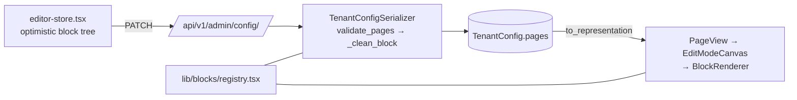

# Tenant Config & Site Builder

# Tenant Config & Site Builder

Everything that makes a coach's tenant site *theirs* — brand, navigation, page content, and the "is this ready to go live?" question — is owned by this module group. It spans exactly two halves that talk over one endpoint:

- **[Backend — `apps/tenant_config`](tenant-config-site-builder-apps.md)** — the tenant-schema app holding `TenantConfig` (theme, fonts, logo, navbar, custom CSS, and the `pages` block tree), the seed registry (`SeededObject`), the Setup Assistant checklist and publish gate (`setup_items.py`, `demo_content.py`), and `AssistantConfig` for the chatbots.
- **[Frontend — `frontend-customer/src`](tenant-config-site-builder-src.md)** — the in-place editor: a sidebar (`edit-sidebar.tsx`) that mounts over the *live* public site for coach/owner users, backed by `owner/canvas/editor-store.tsx` and the block registry in `lib/blocks/registry.tsx`.

## The single seam

There is no admin design route and no second store. The editor reads and writes `GET/PATCH /api/v1/admin/config/`, and `TenantConfigSerializer` is the contract:

- **Read** — `to_representation` runs `pages_from_landing_sections` (legacy landing-section rows become a normal page/block tree) and `_sign_landing_section_photos` (presigned media URLs the browser can actually load).
- **Write** — `validate_pages` → `_clean_block` → `sanitize_block_style` (`defaults.py`) rejects unknown block types and strips anything not in the allowed style vocabulary. The frontend's block registry and the backend's block catalogue must agree; when they drift, saves fail validation rather than corrupting the tree.

## Workflows that cross the seam

**Editing a page.** A public route (`(public)/faq/page.tsx`) renders `PageView`, which delegates to `EditModeCanvas` when edit mode is on. `BlockRenderer` + `getBlockDef` turn stored blocks into real components (`FaqBlock`, `GalleryBlock`, `RichTextBlock` …) — so the coach edits the same tree visitors see. `BlocksTab` drives `insertBlock`/`updateBlock`/`selectBlock`; `CanvasDndProvider` maps drags (including palette drops via `paletteTypeFromId`) onto `reorderBlocks`. Field editing is generic: `FieldRenderer` dispatches to `LinkField`, `RepeaterField`, etc., from the block definition's schema — new block types need a registry entry, not new UI.

**Adding a block from the palette.** `newBlock` seeds content from `exampleFor` (`lib/blocks/examples.ts`), so a fresh block is never an empty box — the same instinct as `BlockPlaceholder` rendering a hint when a block has no data yet.

**Demo content → publish.** Seeded rows are fingerprinted (`seeding.fingerprint_for`) and recorded as `SeededObject`. The frontend surfaces them through `useDemoContent` / `DemoBadge`, which is why admin screens like `AdminCoursesPage` can mark a course as demo without knowing anything about seeding. `compute_setup_state` (`_has_own`, `_has_paid_content`) produces the checklist consumed by `useSetupStatus` and rendered in `SetupAssistantBubble` → `SetupAssistantPanel`; `erase_demo_content` clears the demo set, using `_photo_referenced` to avoid deleting media the coach has since reused. Publishing is gated on that same computed state, so the checklist and the gate can't disagree.

**Navbar.** `NavbarTab` edits `TenantConfig.navbar` directly; `DestinationButton` constrains links to real site destinations rather than free-text URLs, keeping stored nav entries valid against the page set.

## Working here

Backend block-shape changes (`defaults.py`, `_clean_block`) and frontend registry changes are effectively one change — ship them together or the editor saves start failing validation. Setup/publish logic lives only in `setup_items.py`; the frontend never recomputes readiness.